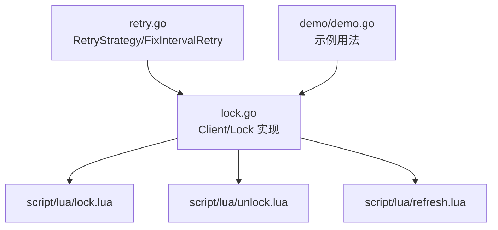
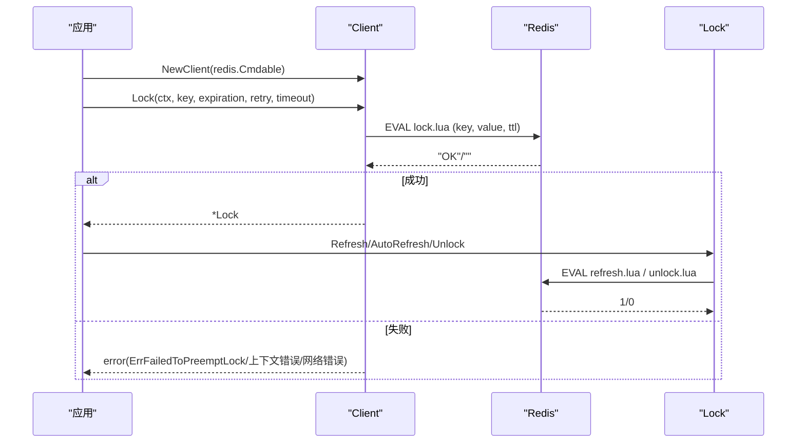
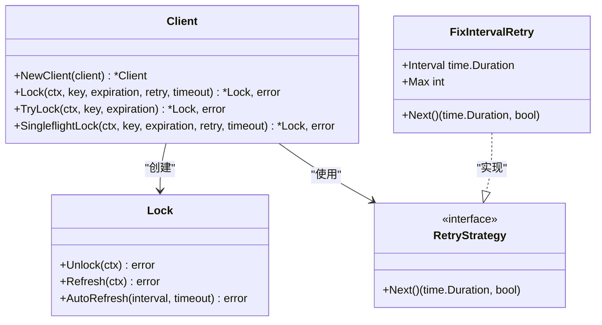
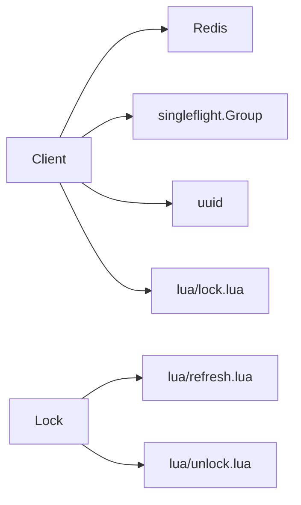

# API 参考文档

<cite>
**本文引用的文件**   
- [lock.go](file://lock.go)
- [retry.go](file://retry.go)
- [script/lua/lock.lua](file://script/lua/lock.lua)
- [script/lua/unlock.lua](file://script/lua/unlock.lua)
- [script/lua/refresh.lua](file://script/lua/refresh.lua)
- [demo/demo.go](file://demo/demo.go)
- [README.md](file://README.md)
- [go.mod](file://go.mod)
</cite>

## 目录
1. [简介](#简介)
2. [项目结构](#项目结构)
3. [核心组件](#核心组件)
4. [架构总览](#架构总览)
5. [详细组件分析](#详细组件分析)
6. [依赖关系分析](#依赖关系分析)
7. [性能与行为特性](#性能与行为特性)
8. [故障排查指南](#故障排查指南)
9. [结论](#结论)
10. [附录：API 速查表](#附录api-速查表)

## 简介
本库提供基于 Redis 的分布式锁实现，包含客户端构造、加锁、尝试加锁、单飞（Singleflight）加锁、锁续期与自动续期、解锁等能力。通过 Lua 脚本保证原子性，结合 Go 的 context 控制超时与取消，并提供可插拔的重试策略接口。

- 运行环境要求见 README。
- 模块名与依赖版本见 go.mod。

**章节来源**
- [README.md:1-13](file://README.md#L1-L13)
- [go.mod:1-21](file://go.mod#L1-L21)

## 项目结构
仓库主要代码位于根目录，Lua 脚本位于 script/lua，演示代码位于 demo。

**图示来源**
- [lock.go:46-251](file://lock.go#L46-L251)
- [retry.go:19-35](file://retry.go#L19-L35)
- [script/lua/lock.lua:1-13](file://script/lua/lock.lua#L1-L13)
- [script/lua/unlock.lua:1-6](file://script/lua/unlock.lua#L1-L6)
- [script/lua/refresh.lua:1-6](file://script/lua/refresh.lua#L1-L6)
- [demo/demo.go:42-124](file://demo/demo.go#L42-L124)

**章节来源**
- [lock.go:1-252](file://lock.go#L1-L252)
- [retry.go:1-36](file://retry.go#L1-L36)
- [script/lua/lock.lua:1-13](file://script/lua/lock.lua#L1-L13)
- [script/lua/unlock.lua:1-6](file://script/lua/unlock.lua#L1-L6)
- [script/lua/refresh.lua:1-6](file://script/lua/refresh.lua#L1-L6)
- [demo/demo.go:1-214](file://demo/demo.go#L1-L214)

## 核心组件
- Client：分布式锁客户端，负责加锁、尝试加锁、单飞加锁。
- Lock：锁对象，负责解锁、刷新、自动刷新。
- RetryStrategy：重试策略接口。
- FixIntervalRetry：固定间隔重试默认实现。

**章节来源**
- [lock.go:46-251](file://lock.go#L46-L251)
- [retry.go:19-35](file://retry.go#L19-L35)

## 架构总览
下图展示了客户端与 Redis 之间的交互流程，以及 Lua 脚本在关键路径中的作用。

**图示来源**
- [lock.go:53-149](file://lock.go#L53-L149)
- [script/lua/lock.lua:1-13](file://script/lua/lock.lua#L1-L13)
- [script/lua/refresh.lua:1-6](file://script/lua/refresh.lua#L1-L6)
- [script/lua/unlock.lua:1-6](file://script/lua/unlock.lua#L1-L6)

## 详细组件分析

### Client 与构造函数 NewClient
- 职责
  - 封装底层 redis.Cmdable。
  - 生成唯一锁值（UUID）。
  - 提供 SingleflightGroup 用于合并重复加锁请求。
- 构造函数
  - NewClient(client redis.Cmdable) *Client
    - 参数
      - client：Redis 命令接口，支持 Eval/SetNX 等操作。
    - 返回
      - *Client：可用于后续加锁操作。
- 使用要点
  - 建议进程内复用同一个 Client 实例，避免重复创建连接和 Group。
  - valuer 内部使用 UUID 生成器，确保不同 goroutine 持有不同锁值。

**章节来源**
- [lock.go:46-60](file://lock.go#L46-L60)

### 加锁方法

#### Lock(ctx, key, expiration, retry, timeout) *Lock, error
- 语义
  - 尽可能重试以减少加锁失败概率；当锁被占用或调用超时时进行重试。
- 参数
  - ctx：上下文，控制整体生命周期与取消。
  - key：锁键名。
  - expiration：锁过期时间。
  - retry：重试策略，决定下一次重试间隔与次数。
  - timeout：单次加锁调用的超时上限（内部为每次 EVAL 设置超时）。
- 返回值
  - *Lock：加锁成功时返回锁对象。
  - error：可能为
    - context.DeadlineExceeded：整体调用超时。
    - ErrFailedToPreemptLock：超过重试次数且未成功。
    - 其他错误：如网络异常、Redis 不可用等。
- 行为说明
  - 内部循环调用 Lua 脚本执行原子加锁/续期逻辑。
  - 非超时错误直接返回，不继续重试。
  - 若重试机会耗尽，包装错误并返回。
- 使用示例（示意）
  - 构建 RetryStrategy（例如 FixIntervalRetry），设置合理 Interval 与 Max。
  - 调用 Lock 并处理可能的超时与竞争失败。
  - 成功后使用 defer Unlock 释放锁。

**章节来源**
- [lock.go:84-134](file://lock.go#L84-L134)
- [script/lua/lock.lua:1-13](file://script/lua/lock.lua#L1-L13)

#### TryLock(ctx, key, expiration) *Lock, error
- 语义
  - 一次性尝试加锁，不加重试。
- 参数
  - ctx：上下文。
  - key：锁键名。
  - expiration：锁过期时间。
- 返回值
  - *Lock：加锁成功。
  - error：
    - ErrFailedToPreemptLock：锁已被持有或竞争失败。
    - 其他错误：网络/超时等。
- 使用示例（示意）
  - 适用于“尽力而为”的场景，失败即返回，不做重试。

**章节来源**
- [lock.go:136-149](file://lock.go#L136-L149)

#### SingleflightLock(ctx, key, expiration, retry, timeout) *Lock, error
- 语义
  - 对相同 key 的并发加锁请求进行合并，减少 Redis 压力与重复计算。
- 参数
  - ctx：上下文。
  - key：锁键名。
  - expiration：锁过期时间。
  - retry：重试策略。
  - timeout：单次加锁调用超时。
- 返回值
  - *Lock：加锁成功。
  - error：同 Lock 的错误类型。
- 行为说明
  - 使用 singleflight.Group.DoChan 合并相同 key 的请求。
  - 首次发起者执行实际加锁，其余等待结果。
  - 注意：DoChan 返回后需根据 flag 决定是否 Forget，避免内存泄漏。
- 使用示例（示意）
  - 在高并发场景下优先使用 SingleflightLock，降低热点 key 的竞争风暴。

**章节来源**
- [lock.go:62-82](file://lock.go#L62-L82)

### Lock 对象生命周期管理

#### Unlock(ctx) error
- 语义
  - 安全释放锁，仅允许锁持有者删除对应键。
- 参数
  - ctx：上下文。
- 返回值
  - error：
    - ErrLockNotHold：当前未持有锁或键不存在。
    - 其他错误：网络/超时等。
- 行为说明
  - 通过 Lua 脚本原子判断并删除键，避免误删他人锁。
  - 内部使用 sync.Once 防止重复关闭 channel 导致 panic。
- 使用示例（示意）
  - 建议在获取到 *Lock 后立即 defer Unlock，确保异常路径也能释放。

**章节来源**
- [lock.go:231-251](file://lock.go#L231-L251)
- [script/lua/unlock.lua:1-6](file://script/lua/unlock.lua#L1-L6)

#### Refresh(ctx) error
- 语义
  - 续期锁，延长过期时间。
- 参数
  - ctx：上下文。
- 返回值
  - error：
    - ErrLockNotHold：当前未持有锁。
    - 其他错误：网络/超时等。
- 行为说明
  - 通过 Lua 脚本校验锁值并更新过期时间。
- 使用示例（示意）
  - 业务耗时较长时，配合 AutoRefresh 或定时任务调用。

**章节来源**
- [lock.go:219-229](file://lock.go#L219-L229)
- [script/lua/refresh.lua:1-6](file://script/lua/refresh.lua#L1-L6)

#### AutoRefresh(interval, timeout) error
- 语义
  - 周期性续期，直到显式解锁或发生错误。
- 参数
  - interval：续期周期。
  - timeout：每次续期的超时。
- 返回值
  - error：
    - 非超时错误：立即返回。
    - 超时错误：继续尝试，直到 Unlock 被调用。
- 行为说明
  - 内部使用 ticker 与 channel 协调续期与退出信号。
  - 当收到 Unlock 信号时优雅退出。
- 使用示例（示意）
  - 启动 goroutine 调用 AutoRefresh，并在业务结束时调用 Unlock。

**章节来源**
- [lock.go:170-217](file://lock.go#L170-L217)

### 重试策略

#### RetryStrategy 接口
- 方法
  - Next() (time.Duration, bool)
    - 返回下一次重试间隔与是否继续重试。
- 设计意图
  - 将重试逻辑从 Client 中解耦，便于自定义退避策略（指数退避、抖动等）。

**章节来源**
- [retry.go:19-22](file://retry.go#L19-L22)

#### FixIntervalRetry 默认实现
- 字段
  - Interval：固定重试间隔。
  - Max：最大重试次数。
- 方法
  - Next() (time.Duration, bool)
    - 按固定间隔重试，最多 Max 次。
- 使用建议
  - 简单场景可直接使用；复杂场景可实现自定义 RetryStrategy。

**章节来源**
- [retry.go:24-35](file://retry.go#L24-L35)

### 类图（代码级）

**图示来源**
- [lock.go:46-251](file://lock.go#L46-L251)
- [retry.go:19-35](file://retry.go#L19-L35)

## 依赖关系分析
- 外部依赖
  - github.com/redis/go-redis/v9：Redis 客户端抽象 Cmdable。
  - golang.org/x/sync/singleflight：请求合并。
  - github.com/google/uuid：生成唯一锁值。
- 内部依赖
  - Lua 脚本：lock.lua、unlock.lua、refresh.lua 保证原子性与一致性。

**图示来源**
- [lock.go:17-28](file://lock.go#L17-L28)
- [script/lua/lock.lua:1-13](file://script/lua/lock.lua#L1-L13)
- [script/lua/unlock.lua:1-6](file://script/lua/unlock.lua#L1-L6)
- [script/lua/refresh.lua:1-6](file://script/lua/refresh.lua#L1-L6)

**章节来源**
- [go.mod:1-21](file://go.mod#L1-L21)
- [lock.go:17-28](file://lock.go#L17-L28)

## 性能与行为特性
- 原子性
  - 加锁、解锁、续期均通过 Lua 脚本在 Redis 侧原子执行，避免竞态条件。
- 重试机制
  - Lock 内置重试，结合 RetryStrategy 控制间隔与次数。
  - 非超时错误不会触发重试，快速失败。
- 并发优化
  - SingleflightLock 合并相同 key 的并发请求，降低 Redis 压力。
- 超时与取消
  - 所有 Redis 调用均受 context 控制，支持超时与取消。
- 资源清理
  - Timer、Ticker、channel 均在适当时机释放，避免泄漏。

[本节为通用指导，无需具体文件引用]

## 故障排查指南
- 常见错误
  - ErrFailedToPreemptLock：锁竞争失败或重试耗尽。
    - 检查重试策略配置（Interval、Max）与业务耗时。
  - ErrLockNotHold：未持有锁或键不存在。
    - 检查是否正确调用 Unlock/Refresh，是否存在绕过 rlock 的直接 Redis 操作。
  - context.DeadlineExceeded：调用超时。
    - 检查 Redis 延迟、网络状况与超时设置。
- 调试建议
  - 开启 Redis 日志，观察 EVAL 执行情况。
  - 在关键路径打印 key、value、expiration、interval、timeout 等参数。
  - 使用 SingleflightLock 降低热点 key 竞争风暴。

**章节来源**
- [lock.go:39-44](file://lock.go#L39-L44)
- [lock.go:84-134](file://lock.go#L84-L134)
- [lock.go:219-251](file://lock.go#L219-L251)

## 结论
本库通过 Lua 脚本与 Go 标准库组合，提供了稳定、可扩展的分布式锁实现。推荐在生产环境中：
- 使用 NewClient 复用客户端。
- 高并发场景优先使用 SingleflightLock。
- 长耗时业务启用 AutoRefresh 或定时 Refresh。
- 合理配置 RetryStrategy，避免过度重试造成雪崩。
- 始终遵循“谁加锁、谁解锁”的原则，避免绕过 rlock 直接操作 Redis。

[本节为总结性内容，无需具体文件引用]

## 附录：API 速查表

- NewClient(client redis.Cmdable) *Client
  - 作用：创建客户端实例。
  - 参数：client（Redis 命令接口）。
  - 返回：*Client。

- Client.Lock(ctx, key, expiration, retry, timeout) (*Lock, error)
  - 作用：带重试的加锁。
  - 参数：ctx、key、expiration、retry、timeout。
  - 返回：*Lock 或 error（可能为 context.DeadlineExceeded、ErrFailedToPreemptLock 或其他）。

- Client.TryLock(ctx, key, expiration) (*Lock, error)
  - 作用：一次性尝试加锁。
  - 参数：ctx、key、expiration。
  - 返回：*Lock 或 error（可能为 ErrFailedToPreemptLock 或其他）。

- Client.SingleflightLock(ctx, key, expiration, retry, timeout) (*Lock, error)
  - 作用：合并相同 key 的并发加锁请求。
  - 参数：ctx、key、expiration、retry、timeout。
  - 返回：*Lock 或 error（同 Lock）。

- Lock.Unlock(ctx) error
  - 作用：释放锁。
  - 参数：ctx。
  - 返回：error（可能为 ErrLockNotHold 或其他）。

- Lock.Refresh(ctx) error
  - 作用：续期锁。
  - 参数：ctx。
  - 返回：error（可能为 ErrLockNotHold 或其他）。

- Lock.AutoRefresh(interval, timeout) error
  - 作用：周期性续期直至解锁或错误。
  - 参数：interval、timeout。
  - 返回：error（非超时错误立即返回，超时则继续）。

- RetryStrategy.Next() (time.Duration, bool)
  - 作用：返回下次重试间隔与是否继续重试。

- FixIntervalRetry.Interval/Max
  - 作用：固定间隔与最大重试次数。

**章节来源**
- [lock.go:53-251](file://lock.go#L53-L251)
- [retry.go:19-35](file://retry.go#L19-L35)