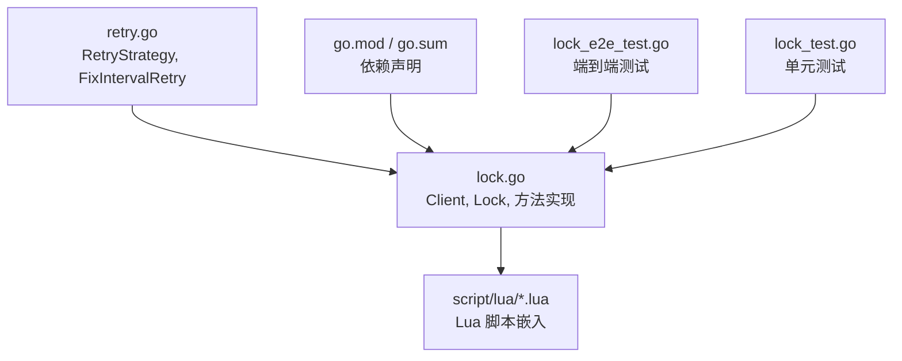
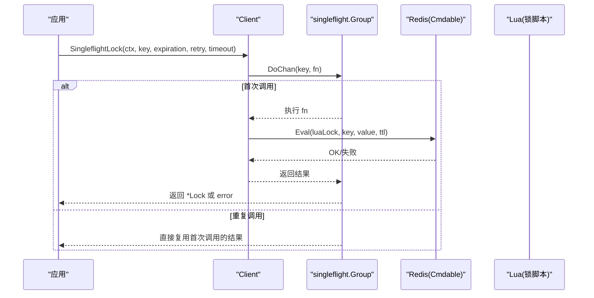
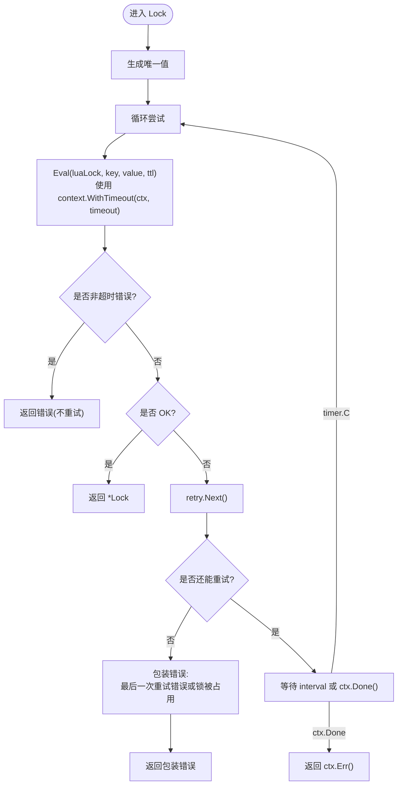
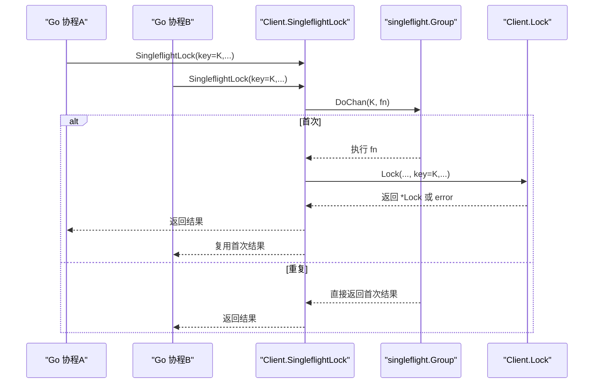
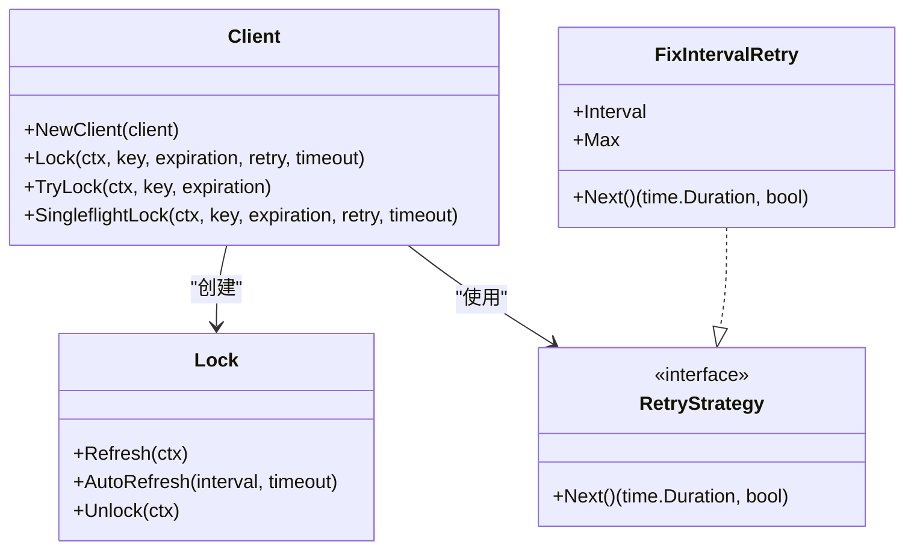

# Client 客户端接口

<cite>
**本文引用的文件**   
- [lock.go](file://lock.go)
- [retry.go](file://retry.go)
- [README.md](file://README.md)
- [lock_e2e_test.go](file://lock_e2e_test.go)
- [lock_test.go](file://lock_test.go)
</cite>

## 目录
1. [简介](#简介)
2. [项目结构](#项目结构)
3. [核心组件](#核心组件)
4. [架构总览](#架构总览)
5. [详细组件分析](#详细组件分析)
6. [依赖关系分析](#依赖关系分析)
7. [性能与并发特性](#性能与并发特性)
8. [故障排查指南](#故障排查指南)
9. [结论](#结论)
10. [附录：API 速查表](#附录api-速查表)

## 简介
本文件为 redis-lock 库中 Client 结构体的 API 文档，聚焦以下方法：
- NewClient：构造客户端实例，并说明 redis.Cmdable 参数的配置要求
- Lock：带重试、超时控制的加锁方法
- TryLock：非阻塞加锁方法
- SingleflightLock：基于 singleflight 的并发安全加锁方法

同时提供参数说明、返回值类型、错误处理策略、使用示例路径、最佳实践与常见陷阱。

## 项目结构
仓库中与 Client 相关的核心实现位于 lock.go，重试策略定义在 retry.go；测试用例覆盖端到端行为与单测场景。

图表来源
- [lock.go:17-28](file://lock.go#L17-L28)
- [lock.go:30-44](file://lock.go#L30-L44)
- [retry.go:19-35](file://retry.go#L19-L35)

章节来源
- [lock.go:1-252](file://lock.go#L1-L252)
- [retry.go:1-36](file://retry.go#L1-L36)

## 核心组件
- Client：封装 Redis 客户端能力，提供分布式锁的多种获取方式
- Lock：表示一次成功加锁后的锁对象，支持刷新与解锁
- RetryStrategy：重试策略接口，控制重试间隔与次数
- FixIntervalRetry：固定间隔重试策略的实现

章节来源
- [lock.go:46-60](file://lock.go#L46-L60)
- [lock.go:151-168](file://lock.go#L151-L168)
- [retry.go:19-35](file://retry.go#L19-L35)

## 架构总览
Client 通过 redis.Cmdable 抽象与 Redis 交互，内部使用 Lua 脚本保证原子性；SingleflightLock 借助 singleflight.Group 对相同 key 的并发请求进行去重，避免重复竞争。

图表来源
- [lock.go:62-82](file://lock.go#L62-L82)
- [lock.go:94-134](file://lock.go#L94-L134)

## 详细组件分析

### NewClient(client redis.Cmdable) *Client
- 作用：创建 Client 实例，注入 Redis 客户端能力，并初始化值生成器（用于生成唯一锁值）。
- 参数
  - client：redis.Cmdable 接口实现，通常由 redis.NewClient 返回的客户端提供。需满足：
    - 支持 Eval、SetNX 等命令
    - 支持 context.Context 超时与取消
    - 连接池、重试、网络超时等按业务需求配置
- 返回值
  - *Client：可用于后续调用 Lock/TryLock/SingleflightLock
- 注意事项
  - 值生成器默认使用 UUID，确保不同进程/协程持有不同的锁值
  - 若需要自定义值生成逻辑，可考虑扩展 valuer（当前未暴露）

章节来源
- [lock.go:53-60](file://lock.go#L53-L60)

### Lock(ctx, key, expiration, retry, timeout) (*Lock, error)
- 作用：尽可能重试地获取分布式锁，直到成功、达到整体超时或耗尽重试次数。
- 参数
  - ctx：上下文，用于控制调用生命周期与超时
  - key：锁键名
  - expiration：锁过期时间（TTL），单位秒
  - retry：重试策略，决定下一次重试间隔与是否继续重试
  - timeout：单次尝试的整体超时时间（Eval 调用超时）
- 返回值
  - *Lock：加锁成功时返回锁对象
  - error：可能包含
    - context.DeadlineExceeded：整体调用超时（可能是最后一次重试也超时）
    - ErrFailedToPreemptLock：超过重试次数且最终没有成功（可能被其他客户端持有）
    - 其他错误：网络、Redis 异常等
- 重试机制与超时处理
  - 每次尝试使用 context.WithTimeout(ctx, timeout) 包裹 Eval 调用
  - 如果 Eval 返回非超时错误，立即返回该错误（不重试）
  - 如果返回“OK”，则成功加锁
  - 否则根据 retry.Next() 决定是否继续重试，并在等待 interval 后再次尝试
  - 当 ctx.Done() 先于 timer.C 触发时，返回 ctx.Err()
- 错误语义
  - 若 errors.Is(err, context.DeadlineExceeded)，无法确定最终是否加锁成功（因为可能在最后阶段超时）
  - 若 errors.Is(err, ErrFailedToPreemptLock)，明确未加锁成功且已耗尽重试机会
  - 其他错误多为通信或服务端问题

图表来源
- [lock.go:94-134](file://lock.go#L94-L134)

章节来源
- [lock.go:94-134](file://lock.go#L94-L134)
- [retry.go:19-35](file://retry.go#L19-L35)

### TryLock(ctx, key, expiration) (*Lock, error)
- 作用：非阻塞加锁，仅尝试一次 SetNX。
- 参数
  - ctx：上下文
  - key：锁键名
  - expiration：锁过期时间（TTL）
- 返回值
  - *Lock：加锁成功
  - error：
    - 网络/服务器/超时等错误直接返回
    - 若竞争失败（已被持有或竞争失败），返回 ErrFailedToPreemptLock
- 适用场景
  - 快速失败、无需重试的业务流程

章节来源
- [lock.go:136-149](file://lock.go#L136-L149)

### SingleflightLock(ctx, key, expiration, retry, timeout) (*Lock, error)
- 作用：对同一 key 的并发加锁请求进行去重，只允许一个真实请求执行，其余请求共享结果。
- 并发安全机制
  - 使用 singleflight.Group.DoChan(key, fn) 将相同 key 的请求合并
  - 首次调用执行 fn，fn 内部调用 Lock 完成实际加锁
  - 后续同 key 调用直接复用首次结果
  - 当 flag 为 true 时表示自己是首个执行者，完成后调用 Forget(key) 释放资源
- 返回值与错误
  - 与 Lock 一致，返回 *Lock 或 error
  - 若 ctx 取消，返回 ctx.Err()
- 注意
  - 该方法内部仍会调用 Lock，因此具备相同的重试与超时语义
  - 适合高并发下对同一 key 的加锁热点场景，减少重复竞争压力

图表来源
- [lock.go:62-82](file://lock.go#L62-L82)
- [lock.go:94-134](file://lock.go#L94-L134)

章节来源
- [lock.go:62-82](file://lock.go#L62-L82)
- [lock.go:94-134](file://lock.go#L94-L134)

## 依赖关系分析
- Client 依赖 redis.Cmdable 与 singleflight.Group
- Lock 依赖 redis.Cmdable 与 Lua 脚本（unlock.lua、refresh.lua、lock.lua）
- RetryStrategy 为可扩展接口，FixIntervalRetry 提供简单固定间隔重试

图表来源
- [lock.go:46-60](file://lock.go#L46-L60)
- [lock.go:151-168](file://lock.go#L151-L168)
- [retry.go:19-35](file://retry.go#L19-L35)

章节来源
- [lock.go:1-252](file://lock.go#L1-L252)
- [retry.go:1-36](file://retry.go#L1-L36)

## 性能与并发特性
- SingleflightLock 显著降低同一 key 的高并发竞争开销，避免重复 Lua 执行与网络往返
- Lock 的重试策略可通过 RetryStrategy 定制，建议结合指数退避或抖动策略以缓解惊群效应
- 合理设置 timeout 与 expiration：
  - timeout 应小于业务超时，避免长时间阻塞
  - expiration 应大于业务执行时间，必要时配合 AutoRefresh 续期

[本节为通用指导，不直接分析具体文件]

## 故障排查指南
- 常见问题与定位
  - 频繁出现 ErrFailedToPreemptLock：检查是否存在长事务或慢查询导致锁长期被占用；调整重试策略与超时
  - 频繁出现 context.DeadlineExceeded：评估 Redis 延迟与网络状况；适当增大 timeout 或优化 Lua 脚本执行路径
  - Unlock 返回 ErrLockNotHold：确认是否由同一 Client/Lock 实例释放；避免绕过 rlock 直接操作 Redis
- 参考测试用例
  - Lock 成功/失败/已持有等场景验证
  - TryLock 成功/失败场景验证
  - AutoRefresh 与 Unlock 的行为验证

章节来源
- [lock_e2e_test.go:51-152](file://lock_e2e_test.go#L51-L152)
- [lock_e2e_test.go:154-220](file://lock_e2e_test.go#L154-L220)
- [lock_e2e_test.go:302-365](file://lock_e2e_test.go#L302-L365)

## 结论
Client 提供了灵活的分布式锁获取方式：
- TryLock 适用于快速失败的非阻塞场景
- Lock 提供可控的重试与超时，适合需要尽力而为的加锁流程
- SingleflightLock 在高并发热点 key 上显著降低竞争成本
使用时请严格区分错误类型，并结合业务选择合适的重试策略与超时配置。

[本节为总结性内容，不直接分析具体文件]

## 附录：API 速查表

- NewClient(client redis.Cmdable) *Client
  - 参数：client（redis.Cmdable）
  - 返回：*Client
  - 要点：注入 Redis 能力，初始化值生成器

- Lock(ctx, key, expiration, retry, timeout) (*Lock, error)
  - 参数：ctx、key、expiration、retry、timeout
  - 返回：*Lock 或 error
  - 错误：context.DeadlineExceeded、ErrFailedToPreemptLock、其他通信/服务端错误

- TryLock(ctx, key, expiration) (*Lock, error)
  - 参数：ctx、key、expiration
  - 返回：*Lock 或 error
  - 错误：ErrFailedToPreemptLock 或网络/服务端错误

- SingleflightLock(ctx, key, expiration, retry, timeout) (*Lock, error)
  - 参数：ctx、key、expiration、retry、timeout
  - 返回：*Lock 或 error
  - 并发：对相同 key 的请求去重，复用首次结果

章节来源
- [lock.go:53-60](file://lock.go#L53-L60)
- [lock.go:94-134](file://lock.go#L94-L134)
- [lock.go:136-149](file://lock.go#L136-L149)
- [lock.go:62-82](file://lock.go#L62-L82)