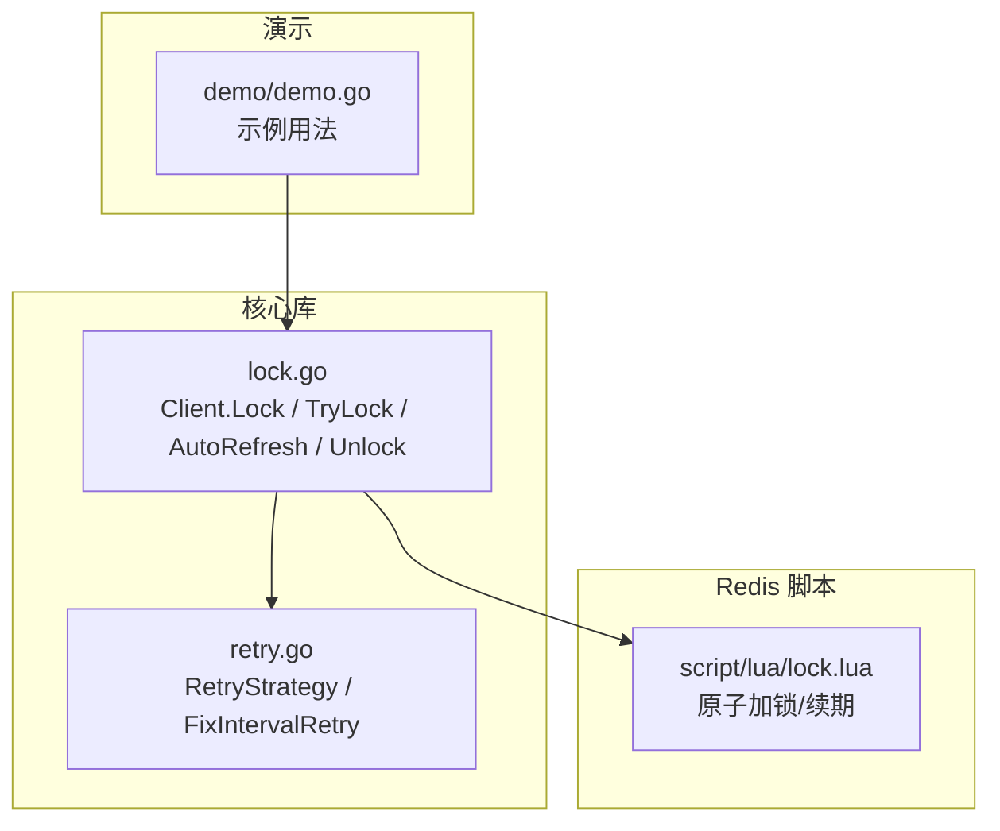
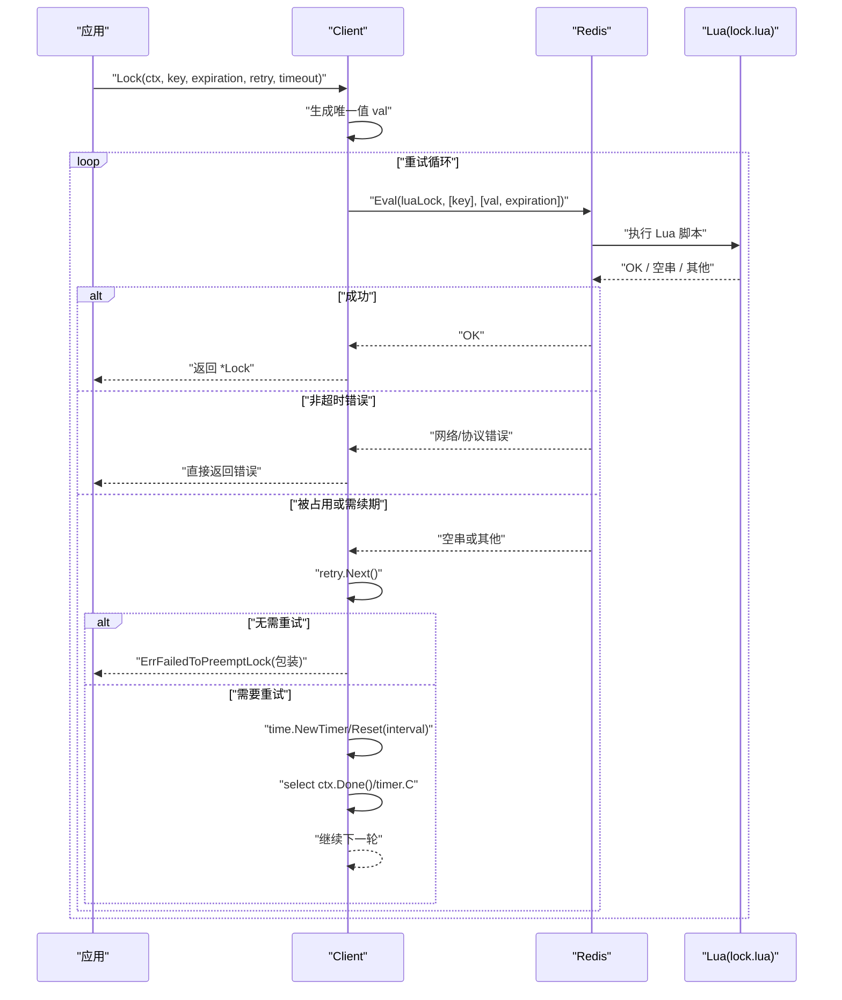
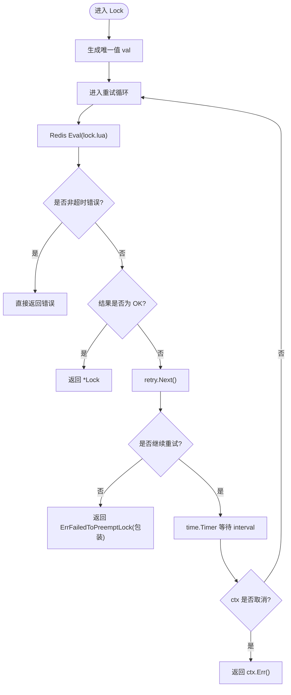
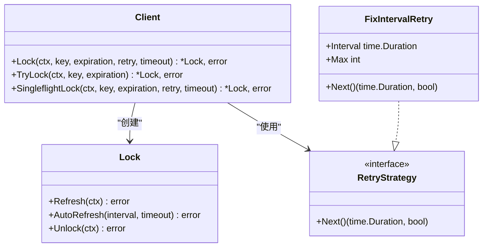

# Lock 方法

<cite>
**本文引用的文件**   
- [lock.go](file://lock.go)
- [retry.go](file://retry.go)
- [demo.go](file://demo/demo.go)
- [lock.lua](file://script/lua/lock.lua)
- [README.md](file://README.md)
</cite>

## 目录
1. [简介](#简介)
2. [项目结构](#项目结构)
3. [核心组件](#核心组件)
4. [架构总览](#架构总览)
5. [详细组件分析](#详细组件分析)
6. [依赖关系分析](#依赖关系分析)
7. [性能考虑](#性能考虑)
8. [故障排查指南](#故障排查指南)
9. [结论](#结论)
10. [附录：API 参考与示例](#附录api-参考与示例)

## 简介
本章节面向使用方，系统化说明分布式锁客户端的 Lock 方法。Lock 方法通过 Redis Lua 脚本实现原子加锁，并内置重试机制与整体超时控制，适用于高并发场景下的分布式互斥访问。文档将覆盖参数语义、重试机制原理（Lua 调用、失败重试逻辑、定时器控制）、错误类型与含义、完整使用示例、性能优化建议以及并发安全注意事项。

## 项目结构
仓库采用“核心库 + 演示 + 脚本”的分层组织方式：
- 核心库：提供分布式锁客户端、重试策略接口与实现、锁对象生命周期管理
- 演示：展示基本用法与端到端测试
- 脚本：Redis Lua 脚本用于原子化加锁、续期与解锁

图表来源
- [lock.go:62-134](file://lock.go#L62-L134)
- [retry.go:19-35](file://retry.go#L19-L35)
- [demo.go:75-110](file://demo/demo.go#L75-L110)
- [lock.lua:1-13](file://script/lua/lock.lua#L1-L13)

章节来源
- [README.md:1-13](file://README.md#L1-L13)

## 核心组件
- Client：封装 Redis 连接与加锁逻辑，支持单次尝试 TryLock 与带重试的 Lock；并提供 SingleflightLock 以合并重复请求，避免惊群效应。
- RetryStrategy：重试策略接口，定义 Next() 返回下一次重试间隔与是否继续重试。
- FixIntervalRetry：固定间隔重试策略，支持最大重试次数。
- Lock：表示已获取的分布式锁，支持续期 Refresh、自动续期 AutoRefresh、释放 Unlock。

章节来源
- [lock.go:46-60](file://lock.go#L46-L60)
- [lock.go:151-168](file://lock.go#L151-L168)
- [retry.go:19-35](file://retry.go#L19-L35)

## 架构总览
Lock 方法的执行流程如下：
- 生成唯一值作为锁标识
- 使用 Lua 脚本在 Redis 中尝试设置键值对，若成功则返回锁对象
- 若失败或超时，根据重试策略计算下一次重试间隔，并通过定时器等待后重试
- 整体受 context.Context 与 timeout 双重控制

图表来源
- [lock.go:94-134](file://lock.go#L94-L134)
- [lock.lua:1-13](file://script/lua/lock.lua#L1-L13)

## 详细组件分析

### Lock 方法 API 说明
- 方法签名
  - func (c *Client) Lock(ctx context.Context, key string, expiration time.Duration, retry RetryStrategy, timeout time.Duration) (*Lock, error)
- 参数说明
  - ctx context.Context：用于取消与超时控制。当 ctx 取消时，Lock 会立即停止重试并返回 ctx.Err()。
  - key string：锁标识符，同一 key 在同一时刻只能被一个客户端持有。
  - expiration time.Duration：锁过期时间。Lua 脚本会将该值转换为秒数设置到 Redis。
  - retry RetryStrategy：重试策略。Next() 返回下一次重试间隔与是否继续重试。
  - timeout time.Duration：整体超时时间。每次尝试都会基于 ctx 派生一个带超时的上下文 lctx，确保单次 Redis 调用不会阻塞过久。
- 返回值
  - *Lock：成功获取锁的对象，可用于续期与释放。
  - error：可能返回的错误类型见下节。

章节来源
- [lock.go:94-134](file://lock.go#L94-L134)

### 重试机制工作原理
- Lua 脚本行为
  - 如果 key 不存在：设置 key=val，EX=expiration，返回 OK
  - 如果 key 存在且值为当前 val：视为续期，expire 重置过期时间，返回 OK
  - 否则：有其他持有者，返回空串
- 失败重试逻辑
  - 若 Eval 返回非超时错误（如网络断开、EOF），直接返回错误，不再重试
  - 若返回 OK：成功获取锁，构造并返回 *Lock
  - 若返回空串或其他：调用 retry.Next() 决定是否需要继续重试
    - 不需要重试：返回 ErrFailedToPreemptLock（包装为“重试机会耗尽”）
    - 需要重试：使用 time.Timer 等待 interval 后继续下一轮
- 定时器控制
  - 首次重试创建 Timer，后续复用 Reset
  - select 监听 timer.C 与 ctx.Done()，任一先触发即退出本轮等待
  - defer 保证 Timer 最终 Stop，避免资源泄漏

图表来源
- [lock.go:94-134](file://lock.go#L94-L134)
- [lock.lua:1-13](file://script/lua/lock.lua#L1-L13)

章节来源
- [lock.go:94-134](file://lock.go#L94-L134)
- [lock.lua:1-13](file://script/lua/lock.lua#L1-L13)

### 错误类型与含义
- context.DeadlineExceeded
  - 含义：整体调用超时或 ctx 被取消。注意：当出现此错误时，无法确定最后一次尝试是否已成功加锁，调用方需谨慎处理。
- ErrFailedToPreemptLock
  - 含义：超过重试次数但整个重试过程没有发生错误，表明锁一直未被获取。
- 其他 Redis 通信错误
  - 含义：例如网络中断、连接池异常、协议错误等。这类错误通常不可恢复，Lock 会直接返回，不进行重试。

章节来源
- [lock.go:84-93](file://lock.go#L84-L93)
- [lock.go:106-121](file://lock.go#L106-L121)

### 并发安全与 Singleflight
- SingleflightLock
  - 作用：对相同 key 的请求进行去重，避免大量并发请求同时竞争 Redis，降低惊群效应。
  - 行为：第一个请求实际执行 Lock，其余请求等待其结果；若 ctx 取消，等待中的请求也会及时返回。
- 内部并发原语
  - sync.Once：用于 Unlock 信号通知，防止重复解锁导致 panic。
  - channel：用于 AutoRefresh 与 Unlock 之间的协调。

章节来源
- [lock.go:62-82](file://lock.go#L62-L82)
- [lock.go:151-168](file://lock.go#L151-L168)
- [lock.go:231-251](file://lock.go#L231-L251)

## 依赖关系分析
- Client 依赖 redis.Cmdable 进行 Redis 操作
- Lock 依赖 Redis Lua 脚本进行原子性操作
- RetryStrategy 抽象了重试策略，FixIntervalRetry 提供默认实现
- demo 包展示了如何在业务中使用 Client 与 Lock

图表来源
- [lock.go:46-60](file://lock.go#L46-L60)
- [lock.go:94-134](file://lock.go#L94-L134)
- [lock.go:151-168](file://lock.go#L151-L168)
- [retry.go:19-35](file://retry.go#L19-L35)

章节来源
- [lock.go:46-60](file://lock.go#L46-L60)
- [retry.go:19-35](file://retry.go#L19-L35)

## 性能考虑
- 合理设置 expiration
  - 应大于业务临界区耗时，避免锁提前过期导致并发问题
  - 过大可能导致锁长期占用，影响公平性与吞吐
- 合理设置 timeout 与 retry
  - timeout 应略大于预期最坏情况下的多次重试总耗时
  - retry.Interval 不宜过小，避免对 Redis 造成压力；也不宜过大，避免响应延迟
- 使用 SingleflightLock
  - 在高并发场景下显著减少 Redis 竞争与网络开销
- 使用 AutoRefresh
  - 对于长任务，开启自动续期以避免锁提前过期
  - 注意 AutoRefresh 的 interval 与 timeout 配置，避免频繁续期造成额外负载

[本节为通用性能建议，不直接分析具体文件]

## 故障排查指南
- 现象：频繁返回 context.DeadlineExceeded
  - 排查点：timeout 是否过小；Redis 是否慢查询或网络抖动；业务临界区是否过长
  - 建议：增大 timeout，检查 Redis 性能，缩短临界区
- 现象：频繁返回 ErrFailedToPreemptLock
  - 排查点：是否存在热点 key 竞争；retry.Max 是否过小；是否有其他客户端长时间持有锁
  - 建议：调整 retry.Max 与 Interval，优化业务逻辑，拆分热点 key
- 现象：出现 Redis 通信错误
  - 排查点：网络连接、认证、权限、Redis 服务状态
  - 建议：检查网络连通性、Redis 日志、连接池配置

章节来源
- [lock.go:106-121](file://lock.go#L106-L121)

## 结论
Lock 方法通过 Redis Lua 脚本实现了原子加锁与续期能力，并结合重试策略与整体超时控制，提供了稳定可靠的分布式锁。在高并发场景中，建议结合 SingleflightLock 与 AutoRefresh，合理配置 expiration、timeout、retry 参数，以获得更好的性能与稳定性。

[本节为总结性内容，不直接分析具体文件]

## 附录：API 参考与示例

### API 参考
- Client.Lock
  - 功能：尽可能重试以减少加锁失败的可能，支持整体超时控制
  - 参数：ctx、key、expiration、retry、timeout
  - 返回：*Lock 或 error
- Client.TryLock
  - 功能：一次性尝试加锁，不带重试
  - 参数：ctx、key、expiration
  - 返回：*Lock 或 error
- Client.SingleflightLock
  - 功能：对相同 key 的请求去重，避免惊群
  - 参数：ctx、key、expiration、retry、timeout
  - 返回：*Lock 或 error
- Lock.Refresh
  - 功能：续期锁
  - 参数：ctx
  - 返回：error
- Lock.AutoRefresh
  - 功能：定时自动续期，直到 Unlock 或错误
  - 参数：interval、timeout
  - 返回：error
- Lock.Unlock
  - 功能：释放锁
  - 参数：ctx
  - 返回：error

章节来源
- [lock.go:62-82](file://lock.go#L62-L82)
- [lock.go:94-134](file://lock.go#L94-L134)
- [lock.go:136-149](file://lock.go#L136-L149)
- [lock.go:170-229](file://lock.go#L170-L229)
- [lock.go:231-251](file://lock.go#L231-L251)

### 使用示例（场景化描述）
- 基本加锁与释放
  - 步骤：创建 Client -> 调用 Lock -> 执行业务逻辑 -> 调用 Unlock
  - 关键点：确保 Unlock 被调用，即使发生错误也应 defer 释放
- 带重试与整体超时
  - 步骤：创建 FixIntervalRetry -> 设置 Interval 与 Max -> 调用 Lock -> 处理可能的 context.DeadlineExceeded 或 ErrFailedToPreemptLock
  - 关键点：根据错误类型区分“不确定是否加锁成功”和“明确未加锁成功”
- 高并发去重
  - 步骤：使用 SingleflightLock 替代 Lock，传入相同 key
  - 关键点：减少 Redis 竞争，提升吞吐
- 长任务自动续期
  - 步骤：获取 Lock -> 启动 AutoRefresh(interval, timeout) -> 执行业务逻辑 -> 调用 Unlock
  - 关键点：interval 应小于 expiration，timeout 应合理设置

章节来源
- [demo.go:75-110](file://demo/demo.go#L75-L110)
- [demo.go:112-124](file://demo/demo.go#L112-L124)
- [demo.go:144-176](file://demo/demo.go#L144-L176)
- [demo.go:178-213](file://demo/demo.go#L178-L213)