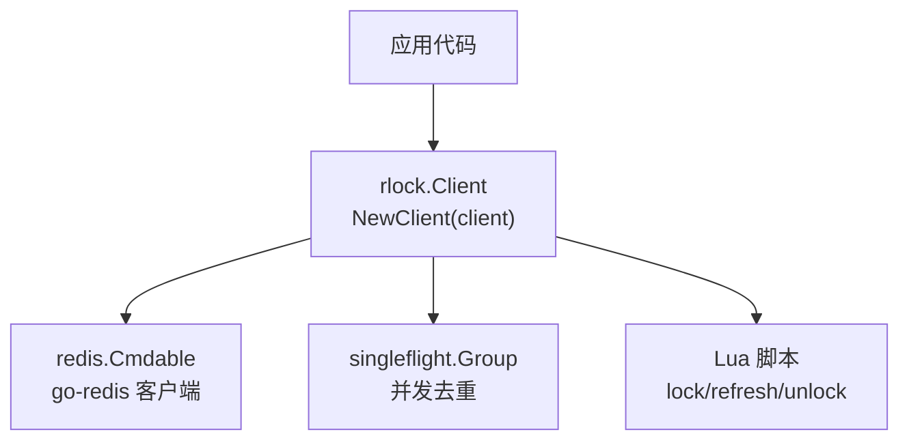
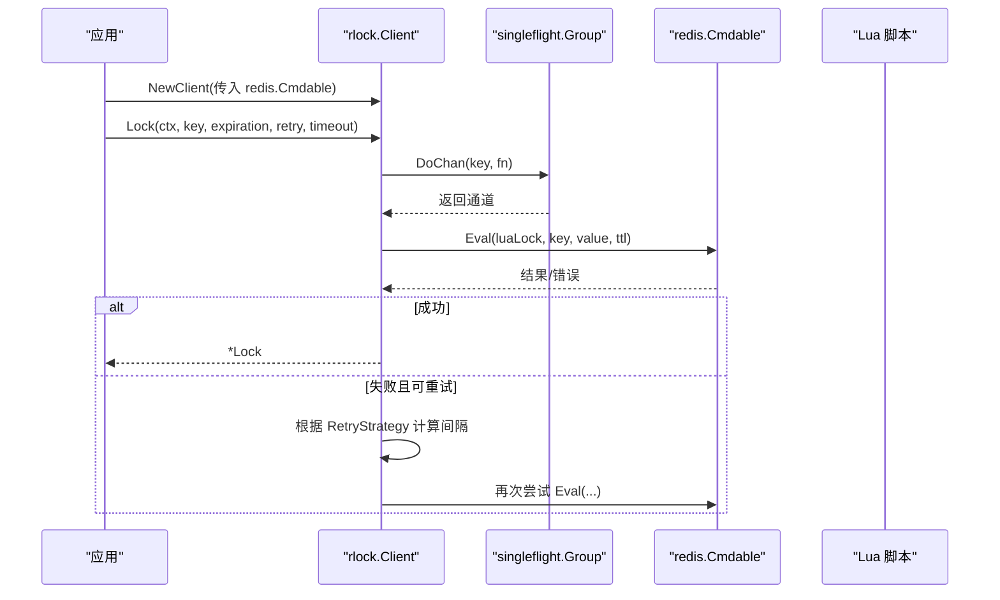
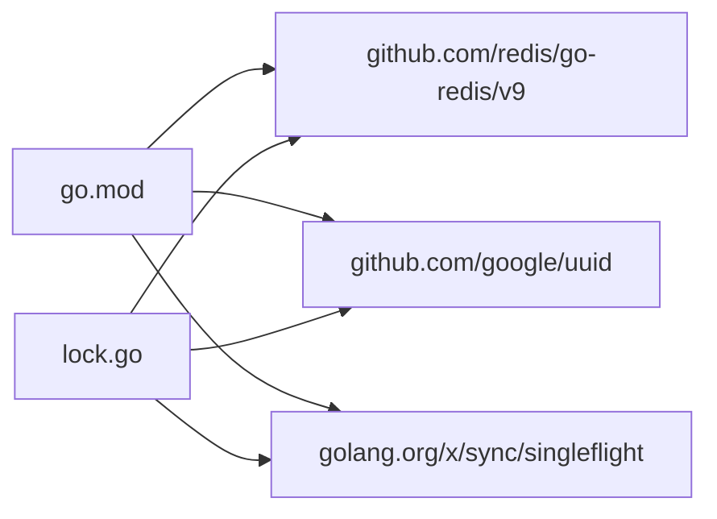
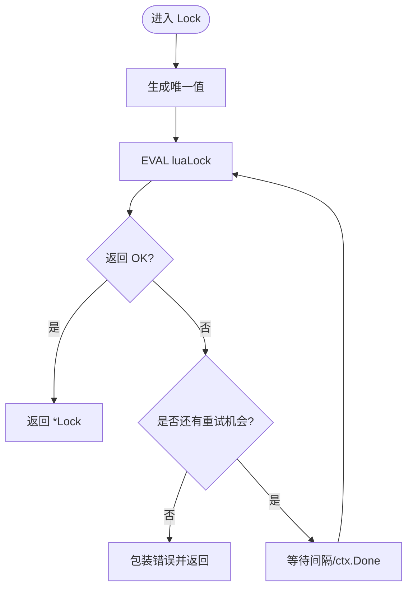

# NewClient 构造函数

<cite>
**本文引用的文件**   
- [lock.go](file://lock.go)
- [go.mod](file://go.mod)
- [README.md](file://README.md)
- [demo/demo.go](file://demo/demo.go)
</cite>

## 目录
1. [简介](#简介)
2. [项目结构](#项目结构)
3. [核心组件](#核心组件)
4. [架构总览](#架构总览)
5. [详细组件分析](#详细组件分析)
6. [依赖关系分析](#依赖关系分析)
7. [性能与行为特性](#性能与行为特性)
8. [错误处理与异常说明](#错误处理与异常说明)
9. [最佳实践与常见陷阱](#最佳实践与常见陷阱)
10. [结论](#结论)

## 简介
本章节面向使用方，聚焦于 NewClient 构造函数的 API 语义、参数要求、内部初始化过程以及与 go-redis 的集成方式。该库基于 Redis 实现分布式锁，对外暴露 Client 类型，并通过 redis.Cmdable 接口解耦底层 Redis 客户端实现，便于替换或注入测试替身。

## 项目结构
仓库包含核心实现、示例代码、脚本与测试等：
- 核心实现位于根目录 lock.go，提供 Client、Lock 以及 NewClient 构造函数
- demo 目录包含教学示例（非生产可用）
- script 目录包含 Lua 脚本与集成测试脚本
- README 给出运行环境与版本要求



图表来源
- [lock.go:46-60](file://lock.go#L46-L60)
- [lock.go:94-134](file://lock.go#L94-L134)

章节来源
- [README.md:1-13](file://README.md#L1-L13)
- [go.mod:1-21](file://go.mod#L1-L21)

## 核心组件
- Client：封装对 Redis 的调用、值生成器、单飞组等
- Lock：表示一次加锁结果，支持刷新与解锁
- NewClient：构造函数，负责初始化 Client 的内部字段

关键要点
- Client 持有 redis.Cmdable 接口，不直接依赖具体客户端类型
- valuer 默认实现为 UUID 字符串生成
- singleflight.Group 用于对相同 key 的加锁请求进行合并，避免惊群

章节来源
- [lock.go:46-60](file://lock.go#L46-L60)

## 架构总览
下图展示 NewClient 创建 Client 后，典型加锁流程中各组件的交互关系。



图表来源
- [lock.go:53-60](file://lock.go#L53-L60)
- [lock.go:62-82](file://lock.go#L62-L82)
- [lock.go:94-134](file://lock.go#L94-L134)

## 详细组件分析

### NewClient 构造函数
- 签名
  - func NewClient(client redis.Cmdable) *Client
- 参数
  - client：实现 redis.Cmdable 接口的对象，通常为 go-redis 的 *Client 或 *ClusterClient
- 返回值
  - 指向已初始化的 Client 指针
- 内部初始化
  - client：透传保存，后续所有 Redis 操作均通过该接口执行
  - valuer：默认闭包，每次调用返回 uuid.New().String() 生成的唯一值
  - g：singleflight.Group 在首次访问时由 Go 运行时惰性初始化（未显式 new），用于对同 key 的加锁请求做合并

```mermaid
classDiagram
class Client {
-client : redis.Cmdable
-g : singleflight.Group
-valuer : func() string
+SingleflightLock(ctx, key, expiration, retry, timeout) (*Lock, error)
+Lock(ctx, key, expiration, retry, timeout) (*Lock, error)
+TryLock(ctx, key, expiration) (*Lock, error)
}
class Lock {
-client : redis.Cmdable
-key : string
-value : string
-expiration : time.Duration
-unlock : chan struct{}
+AutoRefresh(interval, timeout) error
+Refresh(ctx) error
+Unlock(ctx) error
}
Client --> Lock : "创建并返回"
```

图表来源
- [lock.go:46-60](file://lock.go#L46-L60)
- [lock.go:151-168](file://lock.go#L151-L168)

章节来源
- [lock.go:46-60](file://lock.go#L46-L60)

### redis.Cmdable 参数要求与兼容性
- 要求
  - 必须实现 redis.Cmdable 接口，至少支持以下命令：
    - EVAL：执行 Lua 脚本（加锁、续期、解锁）
    - SET NX：TryLock 路径使用
  - 推荐来自 github.com/redis/go-redis/v9 的 *Client 或 *ClusterClient
- 兼容性
  - 任何满足 Cmdable 接口的实现均可注入，包括测试替身或代理层
  - 若自定义实现，需保证 EVAL/SET NX 的行为语义与 Redis 一致（原子性、返回值）

章节来源
- [lock.go:94-134](file://lock.go#L94-L134)
- [lock.go:136-149](file://lock.go#L136-L149)

### 内部字段初始化过程
- client：直接赋值传入的 redis.Cmdable
- valuer：默认返回 UUID 字符串；未来可扩展为可配置策略
- g：singleflight.Group 未显式初始化，Go 会在首次使用时自动完成零值初始化

章节来源
- [lock.go:46-60](file://lock.go#L46-L60)

### 与 go-redis 集成的完整示例（步骤）
以下步骤演示如何与 go-redis 集成，不包含具体代码内容：
1. 引入依赖
   - 在 go.mod 中声明 github.com/redis/go-redis/v9
   - 确保模块版本与仓库一致
2. 创建 Redis 客户端
   - 使用 go-redis 提供的 NewClient/NewClusterClient 创建实例
3. 调用 NewClient
   - 将 go-redis 客户端作为 redis.Cmdable 传入 rlock.NewClient
4. 使用 Client
   - 调用 Lock/TryLock/SingleflightLock 等方法进行加锁
   - 使用返回的 Lock 对象进行 Refresh/Unlock

章节来源
- [go.mod:5-12](file://go.mod#L5-L12)
- [lock.go:53-60](file://lock.go#L53-L60)

## 依赖关系分析
- 外部依赖
  - github.com/redis/go-redis/v9：Redis 客户端与 Cmdable 接口
  - github.com/google/uuid：默认值生成器
  - golang.org/x/sync/singleflight：并发请求合并
- 内部耦合
  - Client 仅依赖 redis.Cmdable 接口，降低与具体实现的耦合
  - Lock 同样通过 redis.Cmdable 执行续期与解锁



图表来源
- [go.mod:5-12](file://go.mod#L5-L12)
- [lock.go:17-28](file://lock.go#L17-L28)

章节来源
- [go.mod:1-21](file://go.mod#L1-L21)
- [lock.go:17-28](file://lock.go#L17-L28)

## 性能与行为特性
- 并发合并
  - SingleflightLock 通过 singleflight.Group 对相同 key 的加锁请求进行合并，减少重复竞争与网络开销
- 重试机制
  - Lock 方法支持基于 RetryStrategy 的重试，结合 context 超时控制整体耗时
- 值生成
  - 默认 UUID 生成开销极低，适合高并发场景

章节来源
- [lock.go:62-82](file://lock.go#L62-L82)
- [lock.go:94-134](file://lock.go#L94-L134)

## 错误处理与异常说明
- 上下文超时
  - 当 ctx 被取消或达到 deadline，会返回 context.DeadlineExceeded 或 ctx.Err()
- 抢锁失败
  - 超过重试次数且无其他错误时，返回 ErrFailedToPreemptLock
- 未持有锁
  - TryLock 竞争失败返回 ErrFailedToPreemptLock
  - Unlock/Refresh 检测到非自身持有的锁时返回 ErrLockNotHold
- Redis 通信错误
  - 非超时的网络/服务端错误直接上抛，不进行重试



图表来源
- [lock.go:94-134](file://lock.go#L94-L134)

章节来源
- [lock.go:94-134](file://lock.go#L94-L134)
- [lock.go:136-149](file://lock.go#L136-L149)
- [lock.go:219-251](file://lock.go#L219-L251)

## 最佳实践与常见陷阱
- 正确初始化
  - 始终通过 NewClient 传入有效的 redis.Cmdable 实例
  - 不要直接构造 Client 结构体，以免遗漏 valuer 与 g 的初始化
- 超时与重试
  - 合理设置 timeout 与 RetryStrategy，避免无限重试或过早放弃
  - 注意区分 context.DeadlineExceeded 与业务错误
- 值生成
  - 默认 UUID 足够安全；如需自定义，可在上层封装 Client 以注入不同 valuer
- 并发模型
  - 在高并发场景优先使用 SingleflightLock 以减少重复竞争
- 常见陷阱
  - 误用 TryLock：它不会重试，竞争失败即返回 ErrFailedToPreemptLock
  - 忽略 Unlock：务必在适当时机释放锁，避免死锁
  - 绕过 rlock 直接修改 Redis：会导致“未持有锁”错误

章节来源
- [lock.go:53-60](file://lock.go#L53-L60)
- [lock.go:94-134](file://lock.go#L94-L134)
- [lock.go:136-149](file://lock.go#L136-L149)

## 结论
NewClient 提供了简洁而健壮的入口，将 redis.Cmdable 抽象化，内置默认值生成器与并发合并能力，使分布式锁的使用更简单可靠。遵循本文的参数要求、初始化步骤与错误处理建议，可以在生产环境中稳定集成 go-redis 并正确使用分布式锁。