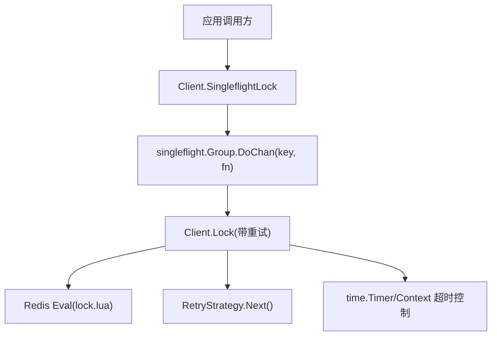
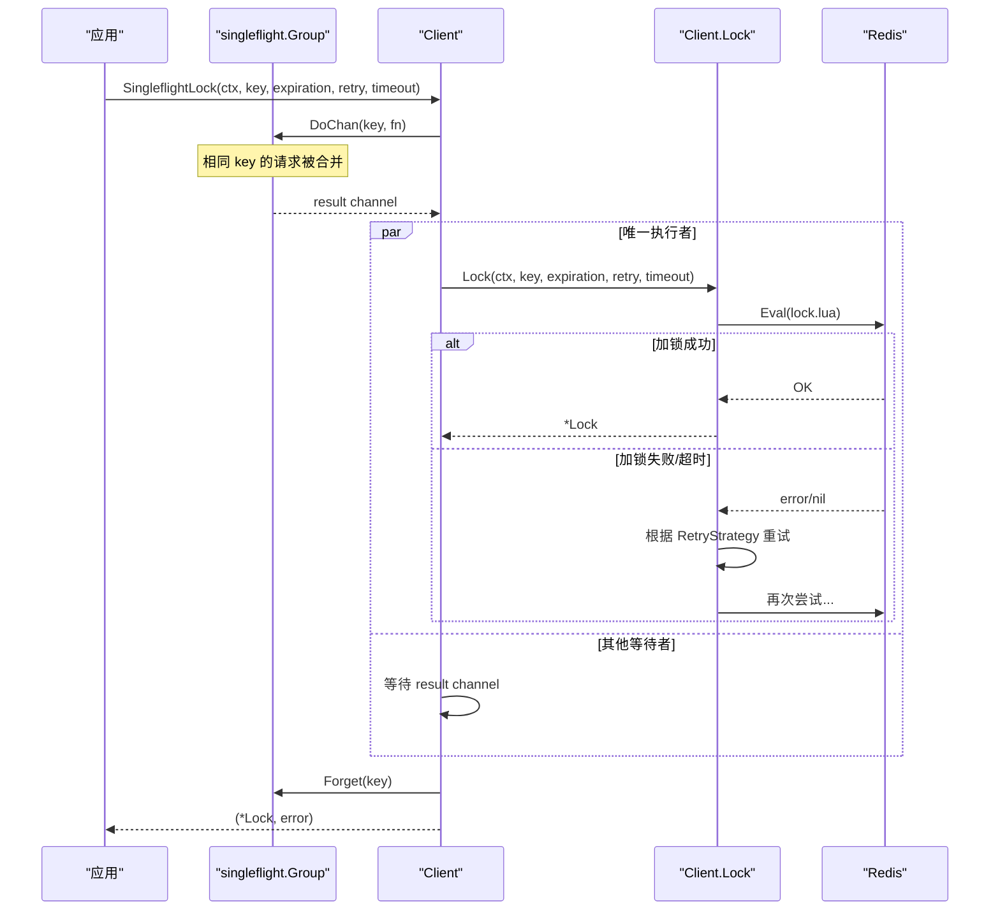
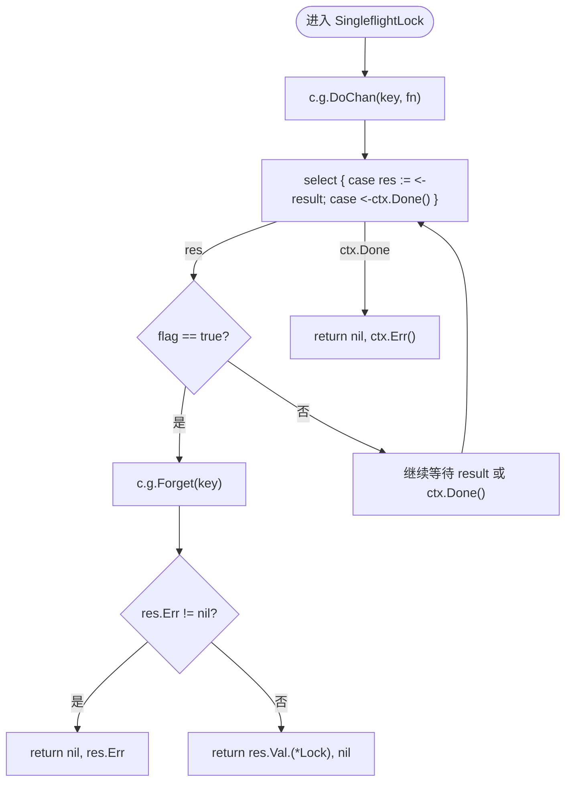
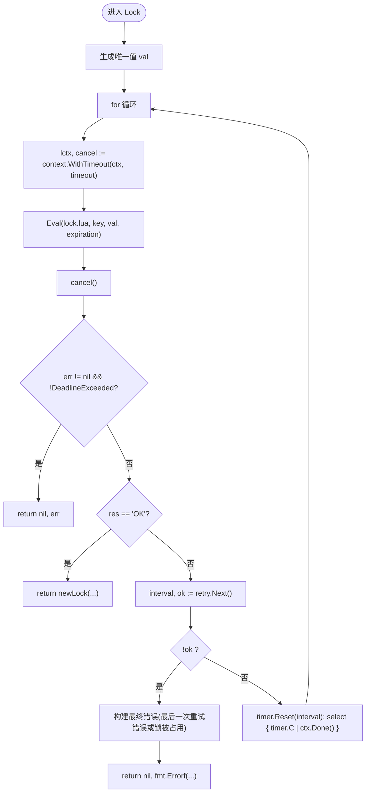
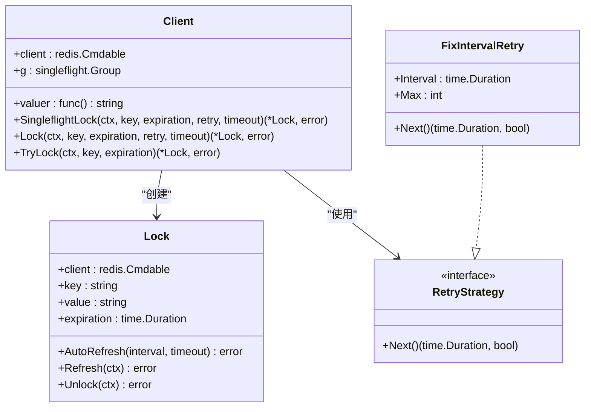

# SingleflightLock 方法

<cite>
**本文引用的文件**   
- [lock.go](file://lock.go)
- [retry.go](file://retry.go)
- [demo.go](file://demo/demo.go)
- [README.md](file://README.md)
</cite>

## 目录
1. [简介](#简介)
2. [项目结构](#项目结构)
3. [核心组件](#核心组件)
4. [架构总览](#架构总览)
5. [详细组件分析](#详细组件分析)
6. [依赖关系分析](#依赖关系分析)
7. [性能与并发特性](#性能与并发特性)
8. [监控与调试建议](#监控与调试建议)
9. [故障排查指南](#故障排查指南)
10. [结论](#结论)

## 简介
SingleflightLock 是基于 Redis 的分布式锁客户端提供的一种“去重 + 重试”的加锁入口。它通过 singleflight 机制对相同 key 的并发请求进行合并，避免在高并发场景下重复向 Redis 发起加锁请求，从而显著降低 Redis 压力并减少竞态条件风险。该方法在内部委托给 Lock 实现带重试的加锁逻辑，并通过 context 控制整体超时、取消以及子操作的超时边界。

## 项目结构
本项目是一个基于 Redis 的分布式锁库，核心代码集中在 lock.go 中，重试策略定义在 retry.go，demo 示例位于 demo 目录，README 给出基本环境要求与说明。

图表来源
- [lock.go:62-82](file://lock.go#L62-L82)
- [lock.go:94-134](file://lock.go#L94-L134)
- [retry.go:19-35](file://retry.go#L19-L35)

章节来源
- [README.md:1-13](file://README.md#L1-L13)

## 核心组件
- Client：封装 Redis 客户端与 singleflight.Group，并提供 SingleflightLock、Lock、TryLock 等方法。
- Lock：表示一次成功获取的分布式锁，支持自动续期 AutoRefresh、手动续期 Refresh、解锁 Unlock。
- RetryStrategy：重试策略接口，用于决定下一次重试间隔与是否继续重试；内置 FixIntervalRetry 固定间隔重试实现。

章节来源
- [lock.go:46-60](file://lock.go#L46-L60)
- [lock.go:151-168](file://lock.go#L151-L168)
- [retry.go:19-35](file://retry.go#L19-L35)

## 架构总览
SingleflightLock 的整体流程如下：
- 使用 singleflight.Group.DoChan 对相同 key 的请求进行合并，仅允许一个 goroutine 真正执行加锁逻辑。
- 若当前 goroutine 是“唯一执行者”，则调用 Lock 进行带重试的加锁；否则等待结果通道返回。
- 当唯一执行者完成（成功或失败），通过 Forget 清理 singleflight 状态，并将结果回传给所有等待者。
- 整个过程中，context 负责超时与取消传播，确保资源及时释放。

图表来源
- [lock.go:62-82](file://lock.go#L62-L82)
- [lock.go:94-134](file://lock.go#L94-L134)

## 详细组件分析

### SingleflightLock 方法
- 作用：以 key 为维度合并并发请求，避免重复加锁导致的 Redis 压力与竞态条件。
- 参数说明：
  - ctx context.Context：控制整体调用生命周期，包括超时与取消。
  - key string：分布式锁的键名，相同 key 的请求会被合并。
  - expiration time.Duration：锁的过期时间，用于防止死锁。
  - retry RetryStrategy：重试策略，决定重试间隔与次数。
  - timeout time.Duration：单次加锁尝试的超时时间（非整体超时）。
- 返回值：
  - (*Lock, error)：成功时返回锁对象；失败时返回错误。
- 内部循环逻辑：
  - 每次循环调用 DoChan 获取结果通道。
  - 使用 flag 判断当前 goroutine 是否为唯一执行者。
  - 若是唯一执行者，执行完成后调用 Forget 清理 singleflight 状态，并返回结果。
  - 若 ctx.Done() 先触发，直接返回 ctx.Err()。
- 与 DoChan 的关系：
  - DoChan 返回 channel，避免阻塞等待，便于结合 select 处理 ctx 取消。
  - 通过 flag 区分“唯一执行者”和“合并后的等待者”。

图表来源
- [lock.go:62-82](file://lock.go#L62-L82)

章节来源
- [lock.go:62-82](file://lock.go#L62-L82)

### Lock 方法与重试机制
- 作用：执行实际的加锁逻辑，包含基于 Lua 脚本的原子操作与重试。
- 关键行为：
  - 生成唯一 value（由 valuer 函数生成，默认使用 UUID）。
  - 使用 context.WithTimeout 包裹单次 Redis 调用，避免长时间阻塞。
  - 调用 Redis Eval 执行 lock.lua 脚本进行加锁。
  - 若失败且未耗尽重试次数，按 RetryStrategy.Next() 返回的间隔重试。
  - 若耗尽重试次数，返回相应错误（可能包含最后一次重试错误或“锁被人持有”语义）。
- 错误类型：
  - context.DeadlineExceeded：整体调用超时。
  - ErrFailedToPreemptLock：超过重试次数但未出现错误。
  - 其他网络/Redis 错误。

图表来源
- [lock.go:94-134](file://lock.go#L94-L134)
- [retry.go:19-35](file://retry.go#L19-L35)

章节来源
- [lock.go:94-134](file://lock.go#L94-L134)
- [retry.go:19-35](file://retry.go#L19-L35)

### TryLock 与单发加锁
- TryLock 不进行重试，直接尝试 SetNX 或 Lua 加锁，适合一次性快速失败的场景。
- 与 SingleflightLock 的区别：
  - TryLock 无合并与重试，适合幂等且可快速失败的请求。
  - SingleflightLock 具备合并与重试，适合高并发且需要提升成功率与降低 Redis 压力的场景。

章节来源
- [lock.go:136-149](file://lock.go#L136-L149)

### Lock 对象的生命周期管理
- AutoRefresh：定时刷新锁的过期时间，防止业务执行时间过长导致锁提前过期。
- Refresh：手动刷新锁的过期时间，需检查是否仍持有锁。
- Unlock：安全解锁，避免重复解锁 panic，并在解锁后通知 AutoRefresh 退出。

章节来源
- [lock.go:170-251](file://lock.go#L170-L251)

## 依赖关系分析
- Client 依赖：
  - redis.Cmdable：与 Redis 交互。
  - singleflight.Group：实现请求合并。
  - uuid：生成唯一值。
- Lock 依赖：
  - redis.Cmdable：执行 refresh/unlock Lua 脚本。
- RetryStrategy：
  - 抽象重试策略，FixIntervalRetry 提供固定间隔重试实现。

图表来源
- [lock.go:46-60](file://lock.go#L46-L60)
- [lock.go:151-168](file://lock.go#L151-L168)
- [retry.go:19-35](file://retry.go#L19-L35)

章节来源
- [lock.go:46-60](file://lock.go#L46-L60)
- [lock.go:151-168](file://lock.go#L151-L168)
- [retry.go:19-35](file://retry.go#L19-L35)

## 性能与并发特性
- 去重机制：
  - 通过 singleflight.Group.DoChan 对相同 key 的请求进行合并，同一时刻只有一个 goroutine 真正执行加锁逻辑，其余 goroutine 等待结果。
  - 有效减少 Redis 的 Eval 调用次数，降低锁竞争带来的抖动与压力。
- 重试机制：
  - 在 Lock 内部根据 RetryStrategy 进行重试，提高在短暂拥塞或锁被占用时的成功率。
  - 结合 context 的超时控制，避免无限重试导致资源泄漏。
- 与其他加锁方法的区别：
  - TryLock：无合并、无重试，适合快速失败场景。
  - SingleflightLock：有合并、有重试，适合高并发、需要降低 Redis 压力与提升成功率。
- 复杂度与开销：
  - 内存与 CPU 开销主要来自 singleflight 的状态管理与 goroutine 调度，通常远低于多次 Redis 往返。
  - 合理设置 timeout 与重试间隔，避免过度重试造成延迟放大。

[本节为通用性能讨论，不直接分析具体文件]

## 监控与调试建议
- 指标采集：
  - 统计 SingleflightLock 的调用次数、合并率（DoChan 被合并的次数）、重试次数、超时比例、Redis 错误比例。
  - 记录 Lock 的成功率与平均耗时，观察在高并发下的稳定性。
- 日志与追踪：
  - 在 DoChan 前后、Forget 前后、重试前后添加结构化日志，便于定位合并与重试路径。
  - 使用 tracing 工具（如 OpenTelemetry）对 Redis 调用进行链路追踪，识别慢查询与热点 key。
- 调试技巧：
  - 针对特定 key 打印其合并与重试情况，确认是否存在异常热点。
  - 调整 RetryStrategy 的参数（间隔与最大次数），观察对成功率与延迟的影响。

[本节为通用实践建议，不直接分析具体文件]

## 故障排查指南
- 常见错误与含义：
  - context.DeadlineExceeded：整体调用超时，无法确定最终是否加锁成功，需要业务侧做幂等与补偿。
  - ErrFailedToPreemptLock：超过重试次数但无错误，说明一直未能抢占到锁。
  - 其他错误：网络或 Redis 通信问题，需关注连接池、超时配置与 Redis 健康状态。
- 排查步骤：
  - 检查 ctx 的超时设置是否过短，导致频繁超时。
  - 检查 Redis 连接与网络状况，确认 Eval 调用是否稳定。
  - 观察 RetryStrategy 的配置，避免重试过于激进或保守。
  - 针对热点 key，评估是否需要拆分或降级策略。

章节来源
- [lock.go:84-93](file://lock.go#L84-L93)
- [lock.go:106-121](file://lock.go#L106-L121)

## 结论
SingleflightLock 通过 singleflight 的去重机制与 Lock 的重试策略，在高并发场景下显著降低了 Redis 的压力与竞态条件的风险。配合合理的 context 超时与重试策略，能够在保证一致性的同时提升系统的吞吐与稳定性。对于需要强一致与高可用的分布式锁场景，SingleflightLock 是优于简单 TryLock 的选择。

[本节为总结性内容，不直接分析具体文件]