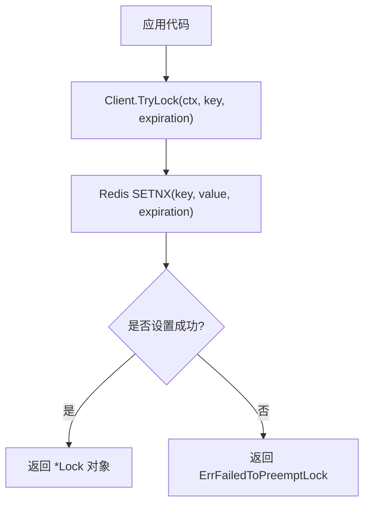
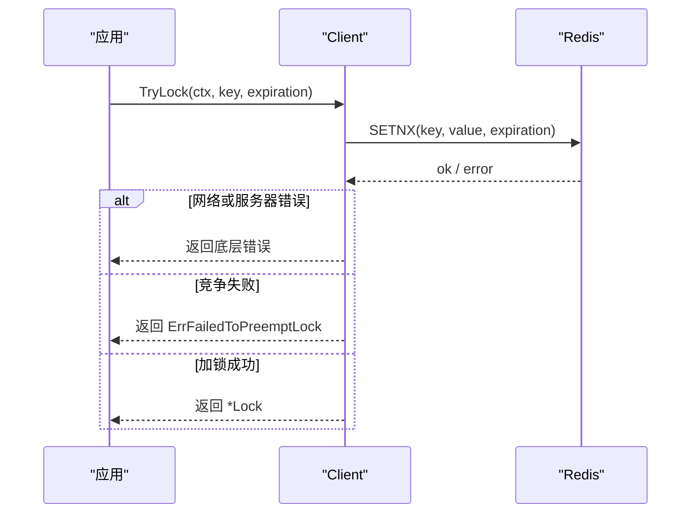
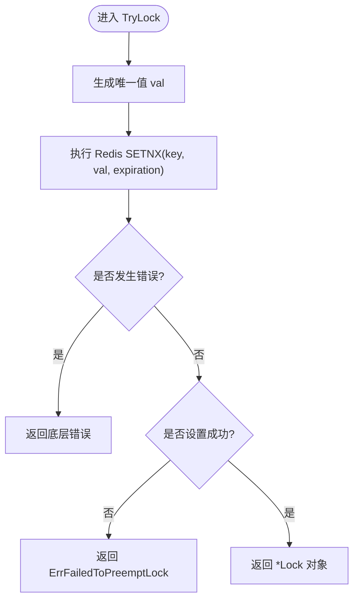
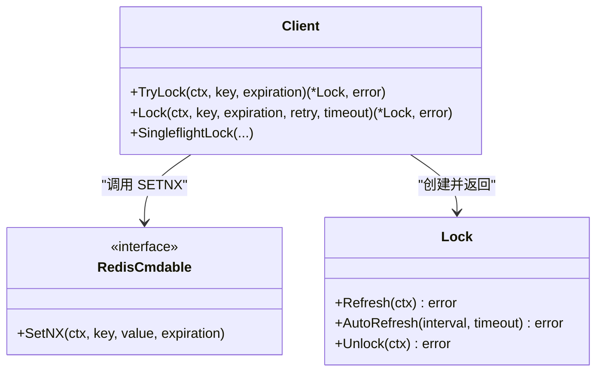

# TryLock 方法

<cite>
**本文引用的文件**   
- [lock.go](file://lock.go)
- [README.md](file://README.md)
- [demo.go](file://demo/demo.go)
- [lock_test.go](file://lock_test.go)
- [lock_e2e_test.go](file://lock_e2e_test.go)
</cite>

## 目录
1. [简介](#简介)
2. [项目结构](#项目结构)
3. [核心组件](#核心组件)
4. [架构总览](#架构总览)
5. [详细组件分析](#详细组件分析)
6. [依赖关系分析](#依赖关系分析)
7. [性能与行为特征](#性能与行为特征)
8. [故障排查指南](#故障排查指南)
9. [结论](#结论)
10. [附录：API 参考](#附录api-参考)

## 简介
TryLock 是一个非阻塞的分布式加锁方法，适用于“快速失败”的场景。它不会重试，也不会等待锁被释放；如果当前无法立即获得锁，会立刻返回错误。该方法基于 Redis SETNX（SET if Not eXists）命令实现原子性判断与设置，确保在并发环境下只有一个客户端能成功加锁。

## 项目结构
本仓库是一个基于 Redis 的分布式锁库，核心实现在 lock.go 中，配套单元测试与端到端测试分别位于 lock_test.go 与 lock_e2e_test.go，示例代码位于 demo/demo.go。README.md 提供了运行环境与版本要求说明。

图示来源
- [lock.go:136-149](file://lock.go#L136-L149)

章节来源
- [README.md:1-13](file://README.md#L1-L13)

## 核心组件
- Client：封装 Redis 客户端能力，提供 Lock、TryLock、SingleflightLock 等方法。
- Lock：表示一次成功的加锁结果，支持 Refresh、AutoRefresh、Unlock 等操作。
- 常量与错误：
  - ErrFailedToPreemptLock：抢锁失败（竞争失败或已被持有）。
  - ErrLockNotHold：未持有锁（解锁/续期时校验失败）。

章节来源
- [lock.go:30-51](file://lock.go#L30-L51)
- [lock.go:151-168](file://lock.go#L151-L168)

## 架构总览
TryLock 的整体调用流程如下：

图示来源
- [lock.go:136-149](file://lock.go#L136-L149)

## 详细组件分析

### TryLock 方法
- 语义
  - 非阻塞加锁：不重试、不等待，立即返回结果。
  - 适用场景：需要快速失败的竞争逻辑，例如限流、幂等键去重、热点资源抢占等。
- 参数
  - ctx context.Context：用于超时控制与取消传播。若上下文提前取消或超时，底层 SETNX 调用将返回相应错误。
  - key string：锁标识符，建议以业务维度命名，避免冲突。
  - expiration time.Duration：锁过期时间，防止死锁。
- 返回值
  - 成功：返回 *Lock 对象，可用于后续刷新与解锁。
  - 失败：
    - 若 Redis 通信异常或超时：返回底层错误（如 context.DeadlineExceeded 或其他网络错误）。
    - 若锁已被持有或竞争失败：返回 ErrFailedToPreemptLock。
- 实现要点
  - 生成唯一值作为锁的值，通过 Redis SETNX 原子地尝试设置 key=value 并附带过期时间。
  - 根据 SETNX 的结果区分“成功”“竞争失败”“底层错误”。

图示来源
- [lock.go:136-149](file://lock.go#L136-L149)

章节来源
- [lock.go:136-149](file://lock.go#L136-L149)

### 与 Lock 方法的区别
- Lock
  - 带重试机制：在锁被占用或通信超时时，按策略重试，直到成功或达到整体超时。
  - 适合“尽力而为”的加锁场景，强调最终尽可能拿到锁。
- TryLock
  - 无重试：立即返回，要么成功，要么快速失败。
  - 适合“快速失败”的业务分支，避免长时间阻塞。

章节来源
- [lock.go:84-134](file://lock.go#L84-L134)
- [lock.go:136-149](file://lock.go#L136-L149)

### 使用示例（路径引用）
- 单元测试用例展示 TryLock 的成功、网络错误与竞争失败三种分支：
  - [TestClient_TryLock:179-252](file://lock_test.go#L179-L252)
- 端到端测试用例验证真实 Redis 环境下的行为：
  - [TestTryLock:154-220](file://lock_e2e_test.go#L154-L220)
- Demo 中的 TryLock 实现（教学用途，与主实现一致）：
  - [demo TryLock:112-124](file://demo/demo.go#L112-L124)

注意：以上为示例路径引用，不包含具体代码内容。

### 最佳实践：错误处理与资源管理
- 错误处理
  - 对 TryLock 返回的错误进行区分：
    - 若为 ErrFailedToPreemptLock：视为“锁不可用”，走快速失败分支。
    - 若为 context.DeadlineExceeded 或其他网络错误：根据业务决定是否降级或重试上层逻辑。
- 资源管理
  - 一旦获得 *Lock，务必在业务退出路径中调用 Unlock，避免锁泄漏。
  - 对于长任务，可结合 Refresh/AutoRefresh 延长锁有效期，但需保证业务正常退出时及时解锁。
- 上下文使用
  - 传入合理的 ctx 超时，避免无限等待底层 Redis 操作。
  - 在并发场景中，优先使用短超时 + 快速失败策略，降低系统抖动。

章节来源
- [lock.go:231-251](file://lock.go#L231-L251)
- [lock_test.go:179-252](file://lock_test.go#L179-L252)
- [lock_e2e_test.go:154-220](file://lock_e2e_test.go#L154-L220)

## 依赖关系分析
TryLock 直接依赖 Redis 的 SETNX 命令，并通过 go-redis 提供的 Cmdable 接口进行调用。其返回值由 SETNX 的布尔结果决定。

图示来源
- [lock.go:46-60](file://lock.go#L46-L60)
- [lock.go:136-149](file://lock.go#L136-L149)
- [lock.go:151-168](file://lock.go#L151-L168)

章节来源
- [lock.go:46-60](file://lock.go#L46-L60)
- [lock.go:136-149](file://lock.go#L136-L149)
- [lock.go:151-168](file://lock.go#L151-L168)

## 性能与行为特征
- 非阻塞：TryLock 只进行一次 SETNX 调用，无重试循环，延迟低且稳定。
- 原子性：SETNX 保证在同一时刻最多一个客户端能设置成功。
- 可扩展性：配合业务层的快速失败策略，可在高并发下减少争用与排队。
- 对比 Lock：
  - Lock 有重试与超时控制，适合“尽量拿到锁”的场景，但可能引入额外延迟。
  - TryLock 适合“拿不到就放弃”的场景，有利于系统弹性与快速响应。

[本节为通用指导，不直接分析具体文件]

## 故障排查指南
- 常见问题
  - 频繁出现 ErrFailedToPreemptLock：检查 key 命名是否合理、是否存在热点竞争；考虑业务层退避或分片。
  - 频繁出现 context.DeadlineExceeded：检查 Redis 连接与网络状况，适当调整 ctx 超时。
  - 解锁时报 ErrLockNotHold：确认是否真的持有该锁，或是否被其他进程误删。
- 定位手段
  - 查看单元测试与端到端测试覆盖的分支，对照实际日志与指标。
  - 在关键路径打印 key、expiration、ctx 超时等信息，便于复现问题。

章节来源
- [lock_test.go:179-252](file://lock_test.go#L179-L252)
- [lock_e2e_test.go:154-220](file://lock_e2e_test.go#L154-L220)

## 结论
TryLock 提供了一种简单、高效、非阻塞的分布式加锁方式，特别适合需要快速失败的业务场景。通过理解其与 Lock 的差异、正确使用 ctx 与 expiration、妥善处理错误与资源释放，可以在高并发环境中构建稳定可靠的竞争控制逻辑。

[本节为总结性内容，不直接分析具体文件]

## 附录：API 参考
- 方法签名
  - TryLock(ctx context.Context, key string, expiration time.Duration) (*Lock, error)
- 参数
  - ctx：上下文，用于超时与取消。
  - key：锁标识符。
  - expiration：锁过期时间。
- 返回值
  - 成功：*Lock
  - 失败：
    - 底层错误（网络/超时等）
    - ErrFailedToPreemptLock（竞争失败）
- 相关类型与方法
  - Lock.Refresh(ctx)：续期锁。
  - Lock.AutoRefresh(interval, timeout)：自动续期。
  - Lock.Unlock(ctx)：释放锁。

章节来源
- [lock.go:136-149](file://lock.go#L136-L149)
- [lock.go:170-251](file://lock.go#L170-L251)