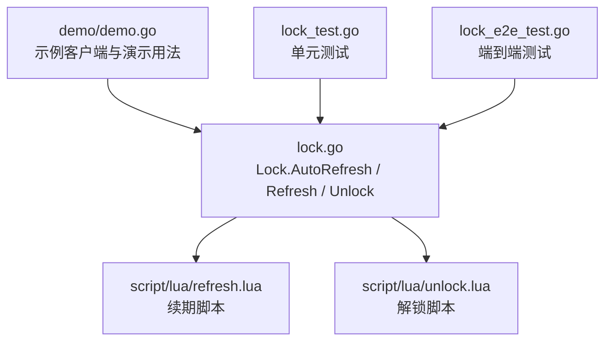
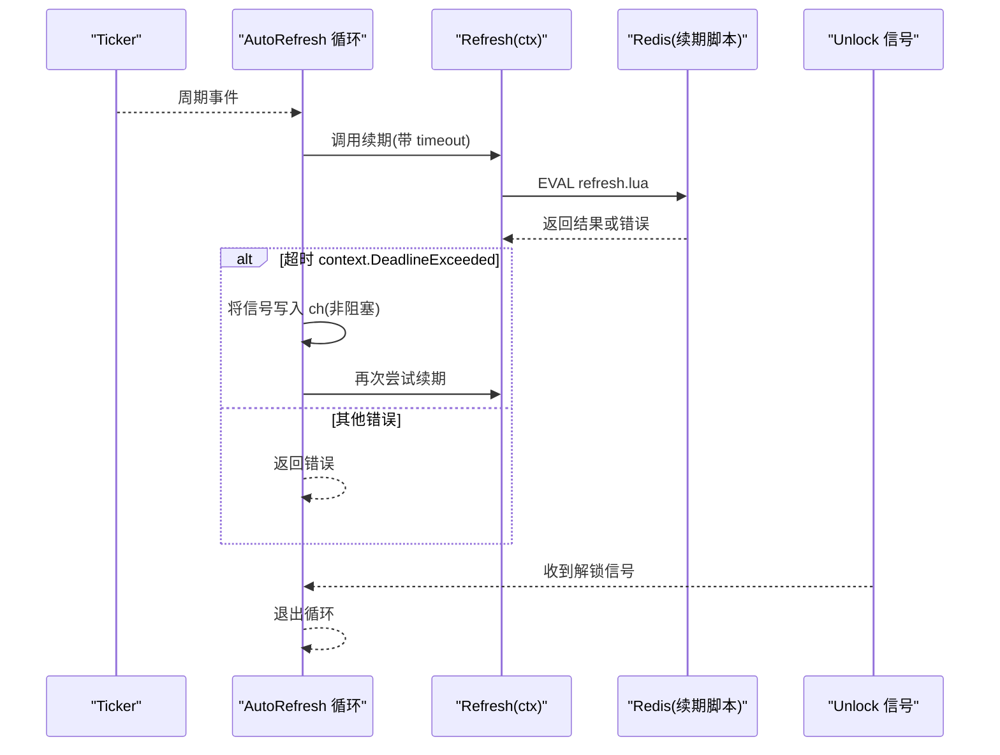
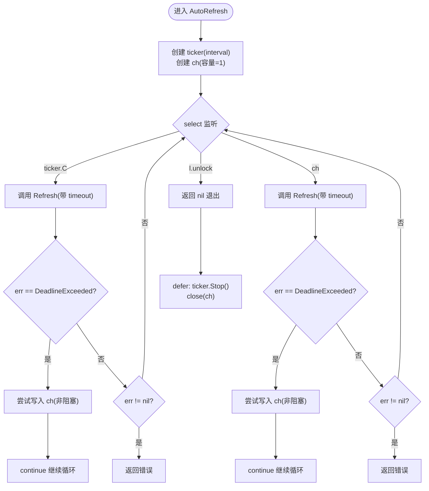
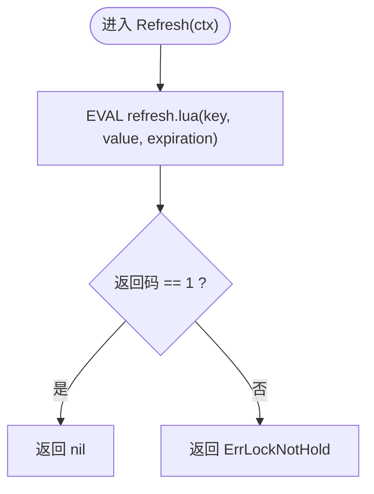
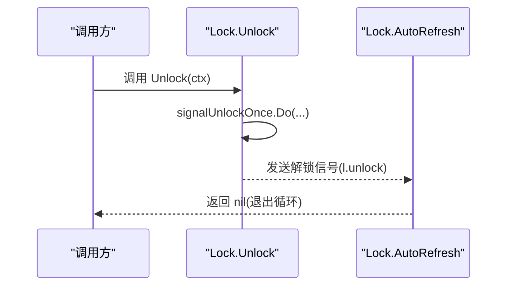
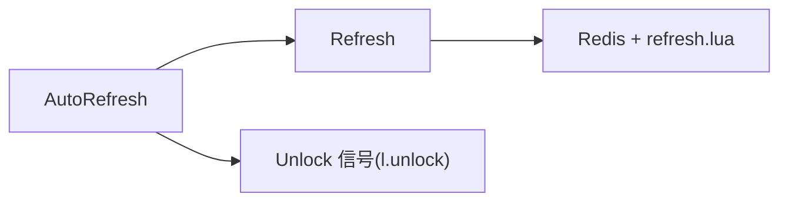

# AutoRefresh 自动续期方法

<cite>
**本文引用的文件**   
- [lock.go](file://lock.go)
- [retry.go](file://retry.go)
- [demo.go](file://demo/demo.go)
- [refresh.lua](file://script/lua/refresh.lua)
- [unlock.lua](file://script/lua/unlock.lua)
- [lock_test.go](file://lock_test.go)
- [lock_e2e_test.go](file://lock_e2e_test.go)
</cite>

## 目录
1. [简介](#简介)
2. [项目结构](#项目结构)
3. [核心组件](#核心组件)
4. [架构总览](#架构总览)
5. [详细组件分析](#详细组件分析)
6. [依赖关系分析](#依赖关系分析)
7. [性能与资源管理](#性能与资源管理)
8. [故障排查指南](#故障排查指南)
9. [结论](#结论)
10. [附录：API 参考](#附录api-参考)

## 简介
本文件为 Lock 结构体的 AutoRefresh 方法的权威 API 文档。AutoRefresh 提供“自动续期”能力，用于在长时间运行的任务中周期性刷新分布式锁的过期时间，避免锁提前失效导致业务中断。该方法通过定时器驱动、通道信号和超时重试机制，确保续期操作的可靠性与并发安全。

## 项目结构
仓库围绕 Redis 分布式锁实现组织代码，核心逻辑集中在 lock.go；Lua 脚本封装原子性操作；测试用例覆盖端到端行为与边界条件。AutoRefresh 的实现位于 Lock 类型的方法中，并依赖 Refresh 与 Unlock 的内部协作。

图表来源
- [lock.go:170-251](file://lock.go#L170-L251)
- [refresh.lua:1-6](file://script/lua/refresh.lua#L1-L6)
- [unlock.lua:1-6](file://script/lua/unlock.lua#L1-L6)
- [demo.go:144-176](file://demo/demo.go#L144-L176)
- [lock_test.go:367-411](file://lock_test.go#L367-L411)
- [lock_e2e_test.go:302-321](file://lock_e2e_test.go#L302-L321)

章节来源
- [lock.go:170-251](file://lock.go#L170-L251)
- [demo.go:144-176](file://demo/demo.go#L144-L176)

## 核心组件
- Lock：持有锁状态（key/value/expiration）并提供续期与解锁能力。
- Client：负责加锁、重试策略与单飞合并等上层控制。
- Lua 脚本：保证续期与解锁的原子性与一致性。
- RetryStrategy：定义重试间隔与次数策略（主要用于加锁阶段）。

章节来源
- [lock.go:151-168](file://lock.go#L151-L168)
- [lock.go:46-60](file://lock.go#L46-L60)
- [retry.go:19-35](file://retry.go#L19-L35)

## 架构总览
AutoRefresh 的工作流由三个关键部分组成：
- 定时触发：time.Ticker 按 interval 周期触发续期请求。
- 通道协调：ch 作为“超时重试信号”通道，缓冲大小为 1，避免重复堆积。
- 退出信号：l.unlock 通道用于通知 AutoRefresh 停止循环。

图表来源
- [lock.go:170-217](file://lock.go#L170-L217)
- [lock.go:219-229](file://lock.go#L219-L229)
- [refresh.lua:1-6](file://script/lua/refresh.lua#L1-L6)

## 详细组件分析

### AutoRefresh 方法
- 功能：周期性续期锁，直到收到解锁信号或发生不可恢复错误。
- 参数：
  - interval time.Duration：续期周期，即每隔多久发起一次续期请求。
  - timeout time.Duration：单次续期请求的超时时间。
- 返回值：error。当续期失败且非超时时返回错误；正常退出时返回 nil。
- 内部机制：
  - ticker：使用 time.NewTicker(interval) 产生周期事件。
  - ch：缓冲大小为 1 的 channel，用于承载“超时重试信号”。当续期超时，AutoRefresh 会尝试向 ch 写入一个空结构体；若写不进去（说明已有待处理的重试信号），则丢弃本次信号，避免堆积。
  - unlock：来自 Unlock 的信号通道，一旦收到即退出 AutoRefresh 循环。
  - 超时重试：当 Refresh 返回 context.DeadlineExceeded 时，AutoRefresh 不会立即返回错误，而是继续尝试续期，直至成功、出现其他错误或收到解锁信号。
  - 资源清理：defer 中停止 ticker 并关闭 ch，防止 goroutine 泄漏与资源泄露。

图表来源
- [lock.go:170-217](file://lock.go#L170-L217)

章节来源
- [lock.go:170-217](file://lock.go#L170-L217)

### Refresh 方法
- 功能：对当前锁执行续期操作，校验是否仍持有锁。
- 输入：context.Context（包含超时与取消语义）。
- 输出：error。若 Redis 返回非 1 或网络/序列化错误，则返回相应错误；若未持有锁，返回 ErrLockNotHold。
- 底层实现：调用 Lua 脚本 refresh.lua，原子地检查 key 值并设置新的过期时间。

图表来源
- [lock.go:219-229](file://lock.go#L219-L229)
- [refresh.lua:1-6](file://script/lua/refresh.lua#L1-L6)

章节来源
- [lock.go:219-229](file://lock.go#L219-L229)
- [refresh.lua:1-6](file://script/lua/refresh.lua#L1-L6)

### Unlock 方法与 AutoRefresh 的协作
- Unlock 负责释放锁，并通过 signalUnlockOnce 确保只发送一次解锁信号，避免重复 close 通道引发 panic。
- 当 AutoRefresh 收到 l.unlock 信号后，立即退出循环并返回 nil，从而优雅结束续期协程。

图表来源
- [lock.go:231-251](file://lock.go#L231-L251)
- [lock.go:170-217](file://lock.go#L170-L217)

章节来源
- [lock.go:231-251](file://lock.go#L231-L251)
- [lock.go:170-217](file://lock.go#L170-L217)

### 与 demo 版本的差异
demo 中的 AutoRefresh 同样实现了基于 ticker 与 ch 的自动续期，但存在以下差异：
- 资源清理：demo 版本未在 defer 中显式停止 ticker，可能导致 goroutine 与资源泄露风险。
- 通道关闭：demo 版本直接 close(ch)，而主库版本在 defer 中关闭 ch，并在 Unlock 中使用 sync.Once 保护 unlock 通道的发送与关闭，避免重复 close。
- 超时重试：两者都支持超时重试，但主库版本在非阻塞写入 ch 时使用 select/default 模式，更稳健。

章节来源
- [demo.go:144-176](file://demo/demo.go#L144-L176)
- [lock.go:170-217](file://lock.go#L170-L217)

## 依赖关系分析
AutoRefresh 的依赖链如下：
- AutoRefresh 依赖 Refresh 进行续期。
- Refresh 依赖 Redis 客户端与 Lua 脚本 refresh.lua。
- AutoRefresh 依赖 Unlock 提供的 l.unlock 信号以退出循环。
- 整体流程受 context 的超时与取消语义约束。

图表来源
- [lock.go:170-217](file://lock.go#L170-L217)
- [lock.go:219-229](file://lock.go#L219-L229)
- [refresh.lua:1-6](file://script/lua/refresh.lua#L1-L6)

章节来源
- [lock.go:170-217](file://lock.go#L170-L217)
- [lock.go:219-229](file://lock.go#L219-L229)

## 性能与资源管理
- 定时器资源：AutoRefresh 在 defer 中调用 ticker.Stop()，确保不再产生新事件，避免 goroutine 泄漏。
- 通道缓冲：ch 容量为 1，采用非阻塞写入以避免堆积；当已有待处理的重试信号时，丢弃多余信号，降低内存压力。
- goroutine 管理：AutoRefresh 通常在独立 goroutine 中运行，配合 Unlock 的解锁信号优雅退出，避免僵尸协程。
- 超时重试：对 context.DeadlineExceeded 进行特殊处理，允许快速重试，提高在高延迟或瞬时拥塞场景下的成功率。
- 最佳实践：
  - 合理设置 interval 与 timeout：interval 应小于锁的过期时间，timeout 应远小于网络抖动导致的延迟峰值。
  - 监控与告警：对 AutoRefresh 的错误返回进行记录与告警，便于定位网络异常或锁丢失问题。
  - 资源清理：确保调用 Unlock 或在业务退出路径中主动停止 AutoRefresh，避免资源泄露。

[本节为通用指导，不涉及具体文件分析]

## 故障排查指南
- 现象：AutoRefresh 一直重试且不退出。
  - 可能原因：未调用 Unlock 或未正确传递 l.unlock 信号。
  - 排查要点：确认业务退出路径是否调用了 Unlock；检查 Unlock 的 signalUnlockOnce 是否正确执行。
- 现象：频繁出现 context.DeadlineExceeded。
  - 可能原因：Redis 响应慢或网络拥塞；timeout 设置过小。
  - 排查要点：调整 timeout；观察 Redis 延迟与吞吐；必要时增加重试频率（减小 interval）。
- 现象：返回 ErrLockNotHold。
  - 可能原因：锁已过期或被其他实例释放；Lua 脚本校验失败。
  - 排查要点：检查锁的生命周期与竞争情况；确认 value 一致性与 key 命名空间隔离。
- 现象：goroutine 泄漏或资源未释放。
  - 可能原因：未停止 ticker 或未关闭 ch；多次调用 Unlock 导致通道重复关闭。
  - 排查要点：确认 AutoRefresh 的 defer 清理逻辑；确保 Unlock 仅调用一次或使用信号保护。

章节来源
- [lock.go:170-217](file://lock.go#L170-L217)
- [lock.go:219-251](file://lock.go#L219-L251)

## 结论
AutoRefresh 通过定时器、通道与上下文超时机制，提供了可靠的分布式锁自动续期能力。其设计重点在于：
- 使用 ticker 驱动周期性续期；
- 使用 ch 承载超时重试信号，避免堆积；
- 使用 l.unlock 信号优雅退出；
- 对 context.DeadlineExceeded 进行重试处理，提升鲁棒性；
- 在 defer 中清理资源，防止 goroutine 与通道泄露。

在实际使用中，建议结合业务生命周期管理 AutoRefresh 的启动与停止，并合理配置 interval 与 timeout，以获得稳定高效的锁续期体验。

[本节为总结性内容，不涉及具体文件分析]

## 附录：API 参考

### AutoRefresh(interval time.Duration, timeout time.Duration) error
- 作用：启动自动续期循环，直到收到解锁信号或发生不可恢复错误。
- 参数：
  - interval：续期周期，决定每次续期的时间间隔。
  - timeout：单次续期请求的超时时间。
- 返回值：
  - nil：正常退出（收到解锁信号）。
  - error：非超时错误（如网络异常、锁丢失等）。
- 行为要点：
  - 使用 time.NewTicker(interval) 生成周期事件。
  - 使用缓冲大小为 1 的 ch 通道承载超时重试信号。
  - 当 Refresh 返回 context.DeadlineExceeded 时，继续重试。
  - 收到 l.unlock 信号后立即退出。
  - defer 中停止 ticker 并关闭 ch。

章节来源
- [lock.go:170-217](file://lock.go#L170-L217)

### Refresh(ctx context.Context) error
- 作用：对当前锁执行续期，校验是否仍持有锁。
- 参数：ctx 携带超时与取消语义。
- 返回值：
  - nil：续期成功。
  - ErrLockNotHold：未持有锁。
  - 其他错误：网络或 Redis 通信异常。

章节来源
- [lock.go:219-229](file://lock.go#L219-L229)

### Unlock(ctx context.Context) error
- 作用：释放锁，并向 AutoRefresh 发送退出信号。
- 返回值：
  - nil：解锁成功。
  - ErrLockNotHold：未持有锁或 key 不存在。
  - 其他错误：网络或 Redis 通信异常。

章节来源
- [lock.go:231-251](file://lock.go#L231-L251)

### 使用示例（概念性描述）
- 场景：长时间运行的任务需要保持分布式锁不失效。
- 步骤：
  1. 获取锁（例如通过 Client.TryLock 或 Client.Lock）。
  2. 启动 AutoRefresh(interval, timeout) 在独立 goroutine 中运行。
  3. 执行业务逻辑。
  4. 业务结束时调用 Unlock(ctx)，使 AutoRefresh 优雅退出。
- 注意事项：
  - 确保 interval 小于锁的过期时间。
  - 合理设置 timeout，避免频繁超时重试。
  - 监控 AutoRefresh 的错误返回并进行告警。

章节来源
- [lock_e2e_test.go:302-321](file://lock_e2e_test.go#L302-L321)
- [lock_test.go:367-411](file://lock_test.go#L367-L411)