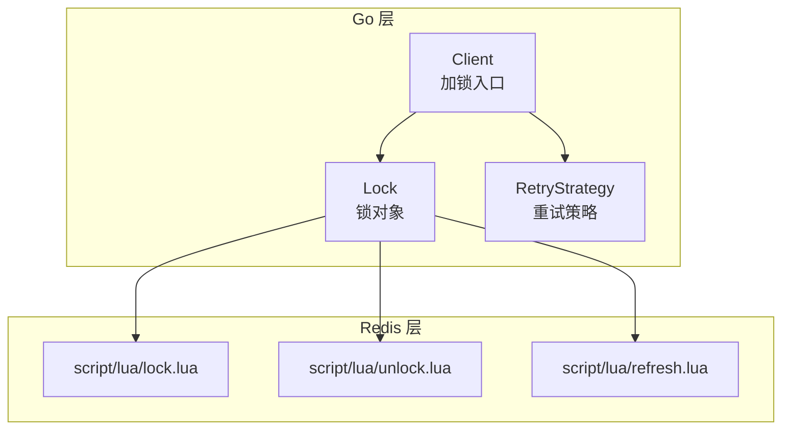
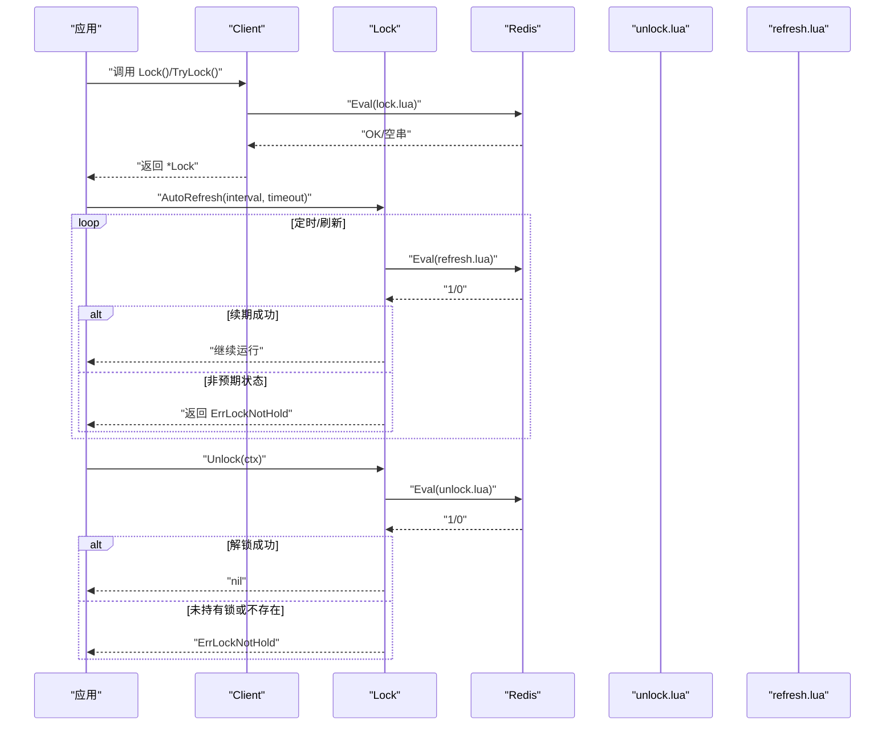
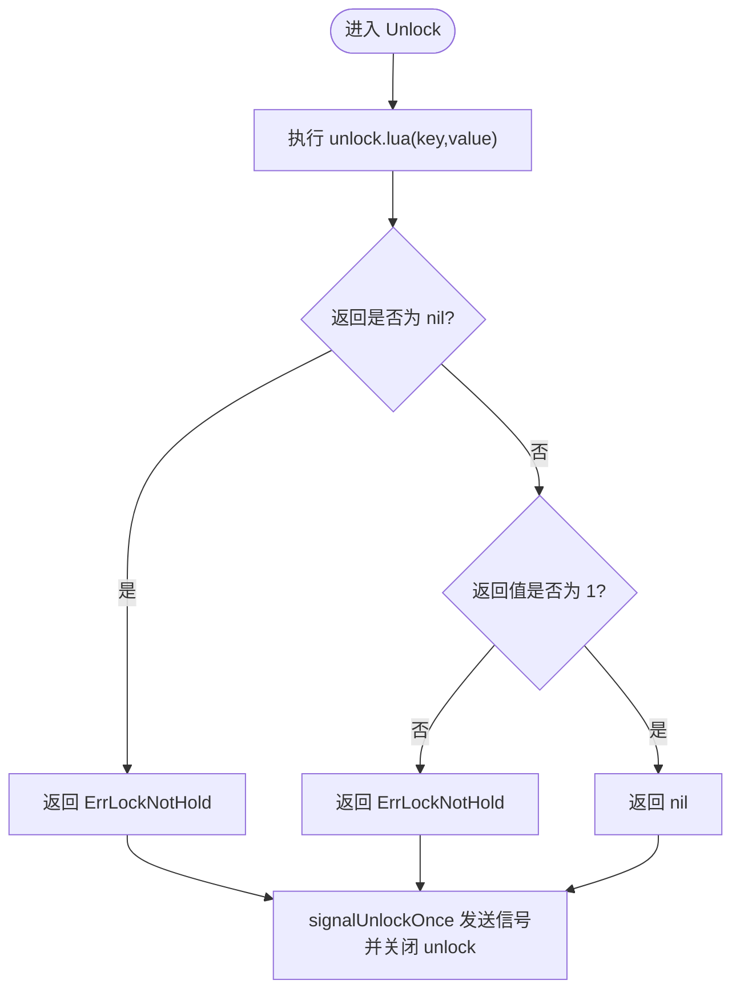
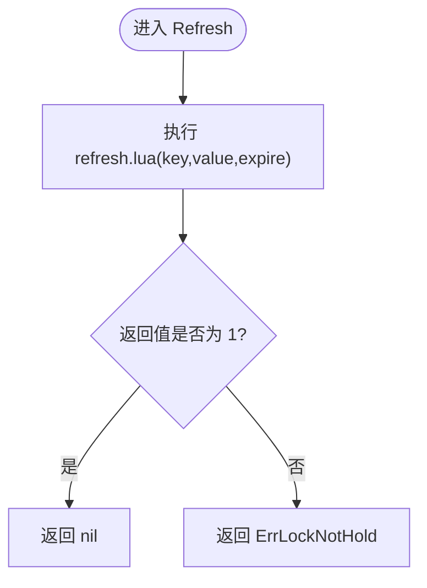
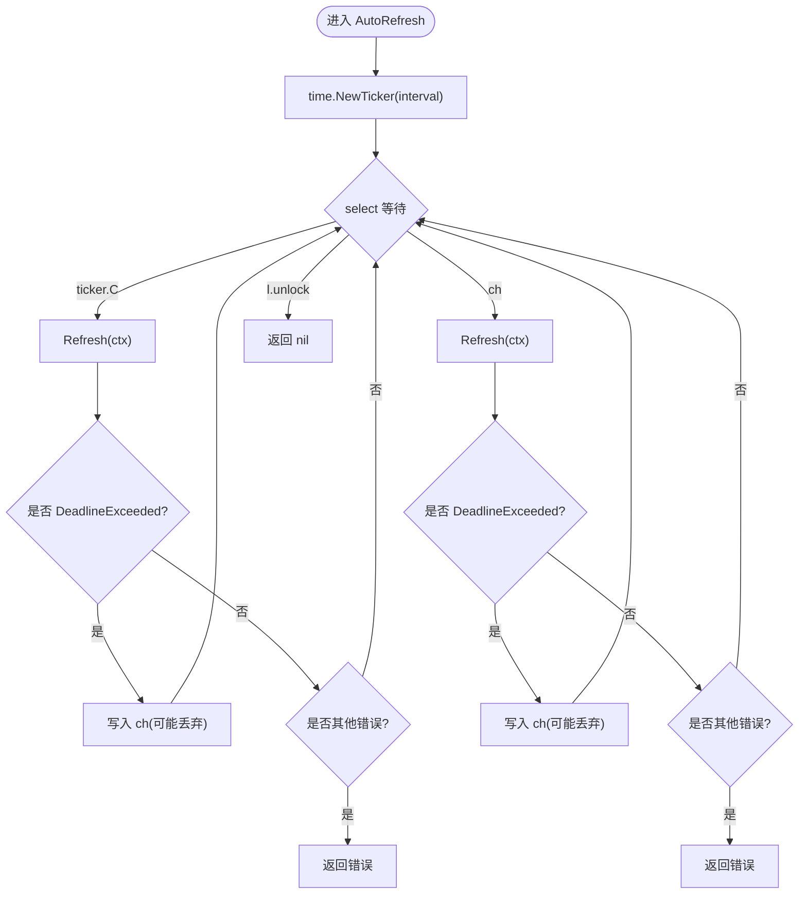
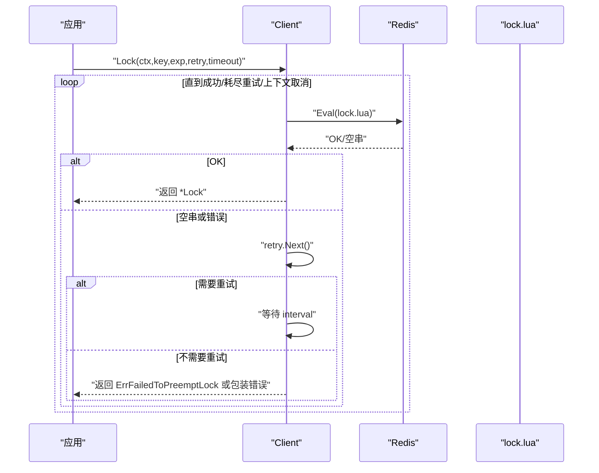
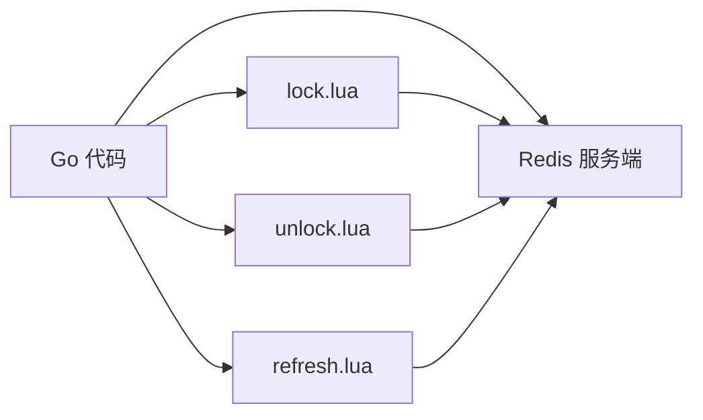

# Lock 锁对象接口

<cite>
**本文引用的文件**   
- [lock.go](file://lock.go)
- [retry.go](file://retry.go)
- [script/lua/lock.lua](file://script/lua/lock.lua)
- [script/lua/unlock.lua](file://script/lua/unlock.lua)
- [script/lua/refresh.lua](file://script/lua/refresh.lua)
</cite>

## 目录
1. [简介](#简介)
2. [项目结构](#项目结构)
3. [核心组件](#核心组件)
4. [架构总览](#架构总览)
5. [详细组件分析](#详细组件分析)
6. [依赖关系分析](#依赖关系分析)
7. [性能与并发特性](#性能与并发特性)
8. [故障排查指南](#故障排查指南)
9. [结论](#结论)
10. [附录：API 参考](#附录api-参考)

## 简介
本文件为 redis-lock 库中 Lock 对象的 API 文档，聚焦以下目标：
- 完整说明 Unlock 方法的解锁机制与 ErrLockNotHold 错误的触发条件。
- 详细说明 Refresh 续期逻辑及其原子性保证。
- 记录 AutoRefresh 自动续期的定时器控制、超时处理与并发安全。
- 梳理 Lock 对象的内部状态管理与生命周期。
- 为每个方法提供参数说明、返回值类型、错误处理策略与使用示例路径。
- 给出锁泄露预防、资源清理与性能优化建议。

## 项目结构
围绕 Lock 对象的关键代码分布如下：
- lock.go：定义 Client、Lock 结构与主要方法（Lock/TryLock/AutoRefresh/Refresh/Unlock），以及错误变量。
- retry.go：重试策略接口与固定间隔重试实现。
- script/lua/*.lua：加锁、解锁、续期的 Lua 脚本，确保 Redis 端操作的原子性与一致性。



图表来源
- [lock.go:46-168](file://lock.go#L46-L168)
- [script/lua/lock.lua:1-13](file://script/lua/lock.lua#L1-L13)
- [script/lua/unlock.lua:1-6](file://script/lua/unlock.lua#L1-L6)
- [script/lua/refresh.lua:1-6](file://script/lua/refresh.lua#L1-L6)

章节来源
- [lock.go:15-252](file://lock.go#L15-L252)
- [retry.go:15-36](file://retry.go#L15-L36)
- [script/lua/lock.lua:1-13](file://script/lua/lock.lua#L1-L13)
- [script/lua/unlock.lua:1-6](file://script/lua/unlock.lua#L1-L6)
- [script/lua/refresh.lua:1-6](file://script/lua/refresh.lua#L1-L6)

## 核心组件
- Client：封装 Redis 客户端与值生成器，提供加锁、尝试加锁、单飞加锁等能力。
- Lock：表示一次成功获取的分布式锁，持有 key/value/expiration 等信息，并提供续期、自动续期与解锁能力。
- RetryStrategy：重试策略接口，用于在加锁失败时决定下一次重试间隔与是否继续重试。

章节来源
- [lock.go:46-168](file://lock.go#L46-L168)
- [retry.go:19-35](file://retry.go#L19-L35)

## 架构总览
Lock 的生命周期由 Client 创建，并通过 Lua 脚本与 Redis 交互，保证关键操作的原子性。AutoRefresh 通过定时器与 channel 协同，实现后台续期；Unlock 通过 Lua 脚本校验并删除键，同时通知 AutoRefresh 退出。



图表来源
- [lock.go:94-149](file://lock.go#L94-L149)
- [lock.go:170-251](file://lock.go#L170-L251)
- [script/lua/lock.lua:1-13](file://script/lua/lock.lua#L1-L13)
- [script/lua/unlock.lua:1-6](file://script/lua/unlock.lua#L1-L6)
- [script/lua/refresh.lua:1-6](file://script/lua/refresh.lua#L1-L6)

## 详细组件分析

### Lock 结构体与内部状态
- 字段
  - client：Redis 命令接口，用于执行 Lua 脚本。
  - key：锁键名。
  - value：客户端唯一标识，用于所有权校验。
  - expiration：过期时间，单位秒。
  - unlock：带缓冲通道，用于向 AutoRefresh 发送“已解锁”信号。
  - signalUnlockOnce：确保仅在一次 Unlock 中关闭 unlock 通道，避免重复关闭 panic。
- 生命周期
  - 创建：newLock 初始化上述字段，并创建容量为 1 的 unlock 通道。
  - 使用：通过 Refresh/AutoRefresh 维持锁存活。
  - 释放：Unlock 调用 Lua 脚本删除键，并通过 signalUnlockOnce 通知 AutoRefresh 退出。

```mermaid
classDiagram
class Lock {
-client : redis.Cmdable
-key : string
-value : string
-expiration : time.Duration
-unlock : chan struct{}
-signalUnlockOnce : sync.Once
+AutoRefresh(interval, timeout) error
+Refresh(ctx) error
+Unlock(ctx) error
}
```

图表来源
- [lock.go:151-168](file://lock.go#L151-L168)

章节来源
- [lock.go:151-168](file://lock.go#L151-L168)

### Unlock 方法与 ErrLockNotHold 触发条件
- 行为
  - 调用 Lua 脚本 unlock.lua，传入 key 与 value。
  - 若 Redis 返回 nil（键不存在）或脚本返回 0（非当前持有者），则返回 ErrLockNotHold。
  - 其他网络/Redis 错误直接返回。
  - 无论成功与否，都会通过 defer 中的 signalUnlockOnce 向 AutoRefresh 发送解锁信号并关闭 unlock 通道，防止 goroutine 泄漏。
- ErrLockNotHold 触发条件
  - Redis 中对应 key 不存在（redis.Nil）。
  - key 存在但 value 不匹配（非当前持有者）。
  - 注意：即使 Unlock 返回错误，也会完成资源清理（关闭通道）。



图表来源
- [lock.go:231-251](file://lock.go#L231-L251)
- [script/lua/unlock.lua:1-6](file://script/lua/unlock.lua#L1-L6)

章节来源
- [lock.go:231-251](file://lock.go#L231-L251)
- [script/lua/unlock.lua:1-6](file://script/lua/unlock.lua#L1-L6)

### Refresh 续期逻辑与原子性保证
- 行为
  - 调用 Lua 脚本 refresh.lua，传入 key、value 与新的过期时间（秒）。
  - 若 Redis 返回 nil（键不存在），Go 层会将其视为普通错误返回（具体取决于底层驱动的错误语义）。
  - 若脚本返回 0（非当前持有者），Go 层返回 ErrLockNotHold。
  - 若脚本返回 1，表示成功续期，返回 nil。
- 原子性保证
  - 续期操作在 Redis 端通过 Lua 脚本原子执行：先判断 value 是否匹配，再设置过期时间，避免竞态条件导致的误续期。



图表来源
- [lock.go:219-229](file://lock.go#L219-L229)
- [script/lua/refresh.lua:1-6](file://script/lua/refresh.lua#L1-L6)

章节来源
- [lock.go:219-229](file://lock.go#L219-L229)
- [script/lua/refresh.lua:1-6](file://script/lua/refresh.lua#L1-L6)

### AutoRefresh 自动续期机制
- 功能
  - 启动一个定时器 ticker，按 interval 周期调用 Refresh。
  - 支持通过 ch 通道快速重试：当 Refresh 因 context.DeadlineExceeded 超时时，将任务回写 ch，尽快再次尝试续期。
  - 监听 l.unlock 通道，一旦收到解锁信号，立即停止循环并返回 nil。
- 超时处理
  - 每次 Refresh 调用都使用独立的 context.WithTimeout(timeout)，避免阻塞后续调度。
  - 遇到 context.DeadlineExceeded 时，不会立即返回错误，而是尝试通过 ch 进行“追赶式”续期，提升鲁棒性。
- 并发安全
  - 使用 select 多路复用 ticker.C、ch 与 l.unlock，避免竞争。
  - 使用容量为 1 的 ch 作为节流，避免堆积过多续期请求。
  - 通过 defer 确保 ticker.Stop() 与 close(ch) 被调用，防止 goroutine 与资源泄漏。



图表来源
- [lock.go:170-217](file://lock.go#L170-L217)

章节来源
- [lock.go:170-217](file://lock.go#L170-L217)

### 加锁流程与重试策略
- Client.Lock
  - 使用 Lua 脚本 lock.lua 进行加锁或刷新过期时间。
  - 支持基于 RetryStrategy 的重试机制，结合 context 超时控制整体重试窗口。
  - 非超时错误直接返回；超时或锁被占用时根据重试策略决定是否继续。
- Client.TryLock
  - 使用 SETNX 原子加锁，失败返回 ErrFailedToPreemptLock。
- SingleflightLock
  - 使用 singleflight 对同一 key 的去重，避免并发重复加锁。



图表来源
- [lock.go:62-134](file://lock.go#L62-L134)
- [script/lua/lock.lua:1-13](file://script/lua/lock.lua#L1-L13)
- [retry.go:19-35](file://retry.go#L19-L35)

章节来源
- [lock.go:62-149](file://lock.go#L62-L149)
- [retry.go:19-35](file://retry.go#L19-L35)
- [script/lua/lock.lua:1-13](file://script/lua/lock.lua#L1-L13)

## 依赖关系分析
- Go 层依赖
  - github.com/redis/go-redis/v9：Redis 客户端与 Cmdable 接口。
  - golang.org/x/sync/singleflight：单飞去重。
  - github.com/google/uuid：生成唯一 value。
- Lua 脚本依赖
  - lock.lua：读取 key 值，若为空则 set EX，若等于当前 value 则 expire，否则返回空串。
  - unlock.lua：若 key 值等于当前 value，则 del，否则返回 0。
  - refresh.lua：若 key 值等于当前 value，则 expire，否则返回 0。



图表来源
- [lock.go:17-28](file://lock.go#L17-L28)
- [script/lua/lock.lua:1-13](file://script/lua/lock.lua#L1-L13)
- [script/lua/unlock.lua:1-6](file://script/lua/unlock.lua#L1-L6)
- [script/lua/refresh.lua:1-6](file://script/lua/refresh.lua#L1-L6)

章节来源
- [lock.go:17-28](file://lock.go#L17-L28)
- [script/lua/lock.lua:1-13](file://script/lua/lock.lua#L1-L13)
- [script/lua/unlock.lua:1-6](file://script/lua/unlock.lua#L1-L6)
- [script/lua/refresh.lua:1-6](file://script/lua/refresh.lua#L1-L6)

## 性能与并发特性
- 原子性
  - 所有关键操作（加锁、续期、解锁）均在 Redis 端通过 Lua 脚本原子执行，避免竞态。
- 重试与退避
  - 通过 RetryStrategy 控制重试间隔与次数，避免雪崩与过度重试。
- 单飞去重
  - SingleflightLock 对相同 key 的请求合并，减少重复加锁开销。
- 自动续期
  - AutoRefresh 使用 ticker 与 ch 双通道，既保证周期性续期，又能在超时情况下快速追赶，提高可用性。
- 资源清理
  - Unlock 通过 signalUnlockOnce 确保只关闭一次 unlock 通道，避免 panic。
  - AutoRefresh 在 defer 中停止 ticker 并关闭 ch，防止 goroutine 泄漏。

[本节为通用指导，无需引用具体文件]

## 故障排查指南
- 常见问题
  - 解锁失败且返回 ErrLockNotHold：检查是否由其他进程直接修改或删除了 Redis 键，或 value 不一致。
  - 续期失败且返回 ErrLockNotHold：确认当前实例仍持有锁，且 value 未被覆盖。
  - AutoRefresh 提前退出：检查 Unlock 是否被调用，或是否存在异常导致通道关闭。
- 定位步骤
  - 查看 Redis 中对应 key 的值与 TTL，确认是否与当前 value 一致。
  - 检查调用链中是否有绕过 rlock 的直接 Redis 操作。
  - 观察 AutoRefresh 的日志与超时情况，评估 network/Redis 延迟。

章节来源
- [lock.go:39-44](file://lock.go#L39-L44)
- [lock.go:219-251](file://lock.go#L219-L251)

## 结论
Lock 对象通过 Lua 脚本与 Go 层的协作，提供了可靠的分布式锁能力。Unlock 与 Refresh 均具备明确的错误语义与原子性保证；AutoRefresh 通过定时器与通道机制实现了高可用的后台续期。合理配置重试策略、超时时间与续期间隔，可显著提升系统的稳定性与性能。

[本节为总结性内容，无需引用具体文件]

## 附录：API 参考

### Lock.AutoRefresh
- 作用：后台自动续期，直至解锁或发生不可恢复错误。
- 参数
  - interval：续期周期（>=0）。
  - timeout：单次续期调用的超时时间。
- 返回值
  - nil：正常退出（通常为收到解锁信号）。
  - error：除 context.DeadlineExceeded 之外的错误（如网络/Redis 错误）。
- 行为要点
  - 使用 ticker 定时触发续期。
  - 当 Refresh 返回 context.DeadlineExceeded 时，尝试通过 ch 快速重试。
  - 监听 l.unlock 通道，收到后退出。
  - defer 中停止 ticker 并关闭 ch。
- 使用示例路径
  - [lock.go:170-217](file://lock.go#L170-L217)

章节来源
- [lock.go:170-217](file://lock.go#L170-L217)

### Lock.Refresh
- 作用：手动续期，延长锁的过期时间。
- 参数
  - ctx：上下文，用于控制超时与取消。
- 返回值
  - nil：续期成功。
  - ErrLockNotHold：当前未持有锁（value 不匹配或 key 不存在）。
  - 其他错误：网络/Redis 错误。
- 行为要点
  - 调用 refresh.lua 原子判断并设置过期时间。
  - 脚本返回 0 时返回 ErrLockNotHold。
- 使用示例路径
  - [lock.go:219-229](file://lock.go#L219-L229)
  - [script/lua/refresh.lua:1-6](file://script/lua/refresh.lua#L1-L6)

章节来源
- [lock.go:219-229](file://lock.go#L219-L229)
- [script/lua/refresh.lua:1-6](file://script/lua/refresh.lua#L1-L6)

### Lock.Unlock
- 作用：释放锁，删除 Redis 键并通知 AutoRefresh 退出。
- 参数
  - ctx：上下文，用于控制超时与取消。
- 返回值
  - nil：解锁成功。
  - ErrLockNotHold：键不存在或非当前持有者。
  - 其他错误：网络/Redis 错误。
- 行为要点
  - 调用 unlock.lua 原子校验并删除键。
  - 通过 signalUnlockOnce 确保只关闭一次 unlock 通道，避免重复解锁 panic。
- 使用示例路径
  - [lock.go:231-251](file://lock.go#L231-L251)
  - [script/lua/unlock.lua:1-6](file://script/lua/unlock.lua#L1-L6)

章节来源
- [lock.go:231-251](file://lock.go#L231-L251)
- [script/lua/unlock.lua:1-6](file://script/lua/unlock.lua#L1-L6)

### Client.Lock / TryLock / SingleflightLock
- Client.Lock
  - 作用：带重试与超时的加锁。
  - 参数：ctx、key、expiration、retry、timeout。
  - 返回：*Lock 或 error（包含 ErrFailedToPreemptLock 或上下文错误）。
  - 示例路径：[lock.go:94-134](file://lock.go#L94-L134)
- Client.TryLock
  - 作用：一次性尝试加锁，失败返回 ErrFailedToPreemptLock。
  - 参数：ctx、key、expiration。
  - 返回：*Lock 或 error。
  - 示例路径：[lock.go:136-149](file://lock.go#L136-L149)
- Client.SingleflightLock
  - 作用：对相同 key 的去重加锁，避免并发重复加锁。
  - 参数：ctx、key、expiration、retry、timeout。
  - 返回：*Lock 或 error。
  - 示例路径：[lock.go:62-82](file://lock.go#L62-L82)

章节来源
- [lock.go:62-149](file://lock.go#L62-L149)

### 最佳实践与建议
- 锁泄露预防
  - 始终在业务完成后调用 Unlock，或在 defer 中调用。
  - 使用 AutoRefresh 时，确保 Unlock 能正确触发通道关闭。
- 资源清理
  - AutoRefresh 会在退出时停止 ticker 并关闭 ch，无需额外清理。
  - Unlock 通过 signalUnlockOnce 保证通道只关闭一次。
- 性能优化
  - 合理设置 interval 与 timeout，避免频繁续期造成 Redis 压力。
  - 使用 RetryStrategy 控制重试间隔与次数，避免雪崩。
  - 在高并发场景下优先使用 SingleflightLock 减少重复加锁。

[本节为通用指导，无需引用具体文件]