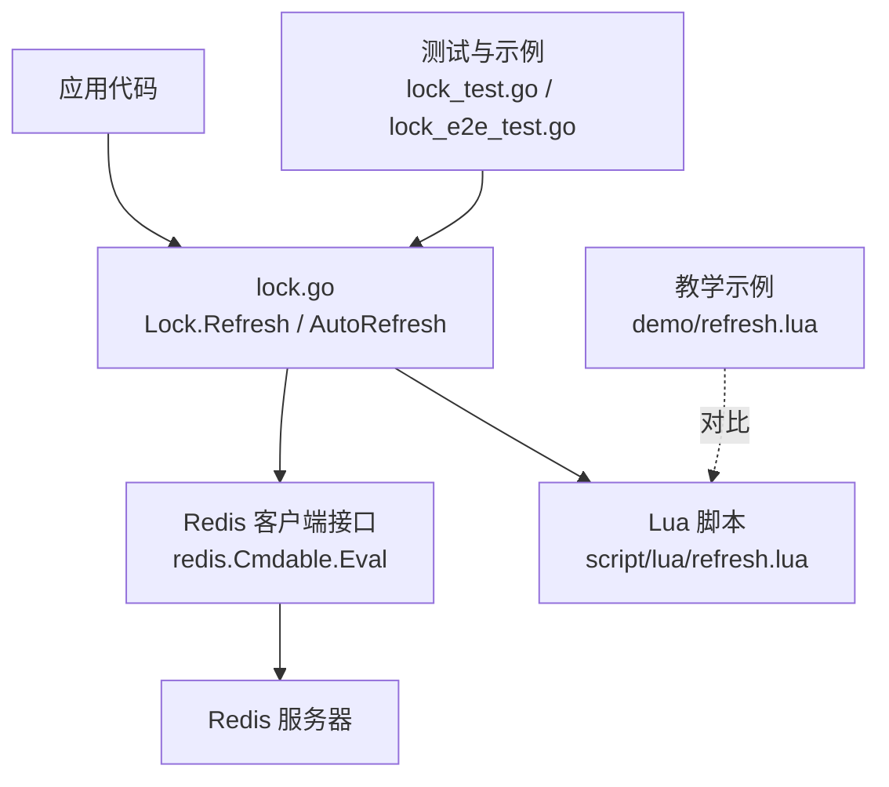
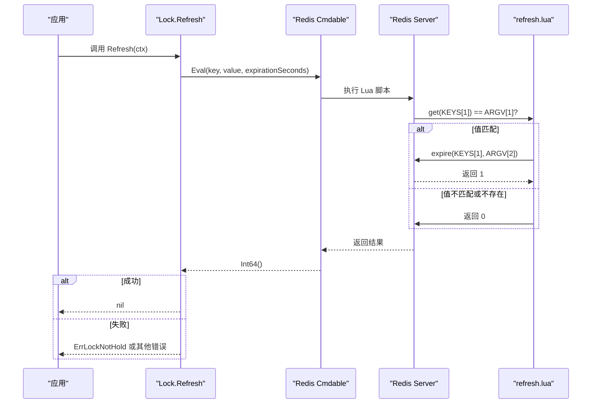
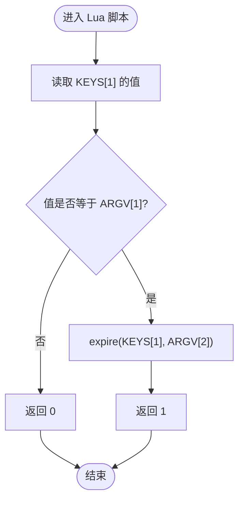
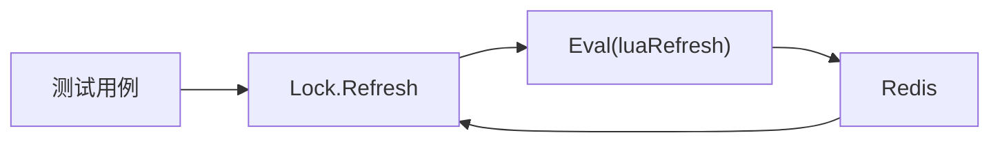

# Refresh 续期方法

<cite>
**本文引用的文件**   
- [lock.go](file://lock.go)
- [script/lua/refresh.lua](file://script/lua/refresh.lua)
- [demo/refresh.lua](file://demo/refresh.lua)
- [README.md](file://README.md)
- [lock_test.go](file://lock_test.go)
- [lock_e2e_test.go](file://lock_e2e_test.go)
</cite>

## 目录
1. [简介](#简介)
2. [项目结构](#项目结构)
3. [核心组件](#核心组件)
4. [架构总览](#架构总览)
5. [详细组件分析](#详细组件分析)
6. [依赖关系分析](#依赖关系分析)
7. [性能与并发特性](#性能与并发特性)
8. [故障排查指南](#故障排查指南)
9. [结论](#结论)
10. [附录：API 参考](#附录api-参考)

## 简介
本文围绕 Lock 结构体的 Refresh 方法，提供面向生产环境的 API 文档。重点说明：
- 续期机制的实现原理（Lua 脚本如何校验锁的所有权并延长过期时间）
- 参数与返回值语义
- 原子性与安全性保证
- ErrLockNotHold 错误的触发条件与处理策略
- 手动续期的使用模式、续期间隔设置、超时处理与并发安全最佳实践
- 与自动续期 AutoRefresh 的关系及场景选择

## 项目结构
本仓库实现了一个基于 Redis 的分布式锁库，核心逻辑位于 lock.go，续期相关的 Lua 脚本位于 script/lua/refresh.lua；demo 目录包含教学示例代码及其对应的 Lua 脚本。

图表来源
- [lock.go:219-229](file://lock.go#L219-L229)
- [script/lua/refresh.lua:1-6](file://script/lua/refresh.lua#L1-L6)
- [lock_test.go:475-541](file://lock_test.go#L475-L541)
- [lock_e2e_test.go:231-300](file://lock_e2e_test.go#L231-L300)

章节来源
- [README.md:1-13](file://README.md#L1-L13)

## 核心组件
- Lock 结构体：封装了 key、value、expiration 等锁状态，并提供 Refresh、AutoRefresh、Unlock 等方法。
- Client：负责加锁、重试、Singleflight 去重等上层能力。
- Lua 脚本：在 Redis 侧执行“检查所有权 + 更新过期时间”的原子操作。

章节来源
- [lock.go:151-168](file://lock.go#L151-L168)
- [lock.go:219-229](file://lock.go#L219-L229)
- [script/lua/refresh.lua:1-6](file://script/lua/refresh.lua#L1-L6)

## 架构总览
Refresh 方法的调用链如下：

图表来源
- [lock.go:219-229](file://lock.go#L219-L229)
- [script/lua/refresh.lua:1-6](file://script/lua/refresh.lua#L1-L6)

## 详细组件分析

### Refresh 方法语义
- 方法签名
  - func (l *Lock) Refresh(ctx context.Context) error
- 参数
  - ctx：用于控制请求生命周期和超时的上下文。若传入带超时的 context，可限制单次续期调用的最大耗时。
- 返回值
  - error：
    - nil：续期成功。
    - ErrLockNotHold：Lua 脚本判定当前锁不属于调用方（key 不存在或 value 不匹配）。
    - 其他错误：如网络异常、Redis 不可用、Eval 执行异常等。

章节来源
- [lock.go:219-229](file://lock.go#L219-L229)
- [lock.go:39-44](file://lock.go#L39-L44)

### Lua 脚本与原子性保证
- 脚本位置
  - 生产实现：script/lua/refresh.lua
  - 教学示例：demo/refresh.lua（行为一致，仅单位差异）
- 执行流程
  - 读取 KEYS[1] 的值并与 ARGV[1]（即 value）比较。
  - 若相等，则对 KEYS[1] 设置新的过期时间为 ARGV[2]（单位为秒）。
  - 返回 1 表示续期成功，否则返回 0。
- 原子性
  - 由于整个判断与更新在同一段 Lua 脚本中执行，Redis 单线程执行模型保证了该操作的原子性，避免竞态条件导致误续期或漏续期。

图表来源
- [script/lua/refresh.lua:1-6](file://script/lua/refresh.lua#L1-L6)
- [demo/refresh.lua:1-8](file://demo/refresh.lua#L1-L8)

章节来源
- [script/lua/refresh.lua:1-6](file://script/lua/refresh.lua#L1-L6)
- [demo/refresh.lua:1-8](file://demo/refresh.lua#L1-L8)

### 安全性检查机制
- 所有权校验：通过比较 Redis 中的 value 与持有者持有的 value，确保只有真正的锁持有者才能续期。
- 返回值校验：当 Lua 返回非 1 时，Go 层将统一映射为 ErrLockNotHold，便于上层统一处理。
- 超时保护：建议为每次续期调用传入带超时的 context，避免阻塞业务 goroutine。

章节来源
- [lock.go:219-229](file://lock.go#L219-L229)

### 错误处理与 ErrLockNotHold
- 触发条件
  - Redis 中 key 不存在。
  - Redis 中 key 存在但 value 与当前持有者的 value 不一致（被覆盖或释放后重新加锁）。
- 处理策略
  - 立即停止后续业务逻辑，记录告警日志。
  - 不要继续尝试解锁或再次续期，因为已不再持有锁。
  - 根据业务需要决定是否重试获取新锁或进行降级处理。

章节来源
- [lock.go:39-44](file://lock.go#L39-L44)
- [lock.go:219-229](file://lock.go#L219-L229)

### 手动续期使用模式
- 典型场景
  - 长时间运行的任务（批处理、消息消费、长轮询等），需要在锁过期前周期性续期。
- 推荐模式
  - 使用 time.Ticker 定时触发续期。
  - 每次续期使用带超时的 context，避免单次续期阻塞过久。
  - 区分 context.DeadlineExceeded 与其他错误：
    - 超时：可能续期成功也可能失败，应尽快重试一次以确认状态。
    - 非超时错误：按错误类型决定重试或终止。
  - 业务退出时及时停止 ticker 并正常解锁。

章节来源
- [lock_test.go:313-345](file://lock_test.go#L313-L345)

### 续期间隔与超时设置
- 续期间隔
  - 建议小于锁过期时间的 1/2，留出足够余量应对网络抖动与 GC 停顿。
- 续期超时
  - 建议设置为远小于续期间隔，例如续期间隔的 1/5~1/10，以便快速失败并触发重试。
- 自动续期
  - AutoRefresh 内部使用 Ticker 与 channel 协调多次续期调用，并对超时做特殊处理（重复超时会合并重试）。

章节来源
- [lock.go:170-217](file://lock.go#L170-L217)

### 与自动续期 AutoRefresh 的关系
- AutoRefresh(interval, timeout)
  - 启动后台协程，按 interval 周期调用 Refresh。
  - 支持在刷新过程中响应 Unlock 信号提前退出。
  - 对 context.DeadlineExceeded 做合并重试，避免堆积。
- 何时选择
  - 简单场景：手动 Refresh + Ticker，灵活可控。
  - 复杂场景：使用 AutoRefresh，减少样板代码，内置超时合并与优雅退出。

章节来源
- [lock.go:170-217](file://lock.go#L170-L217)

## 依赖关系分析
- Go 层依赖
  - redis.Cmdable：通过 Eval 执行 Lua 脚本。
  - context：控制超时与取消。
- Lua 层依赖
  - Redis 命令：get、expire（或 pexpire，取决于脚本版本）。
- 测试依赖
  - 单元测试与端到端测试覆盖了续期成功、未持有锁、网络错误、自动续期等路径。

图表来源
- [lock.go:219-229](file://lock.go#L219-L229)
- [lock_test.go:475-541](file://lock_test.go#L475-L541)
- [lock_e2e_test.go:231-300](file://lock_e2e_test.go#L231-L300)

章节来源
- [lock.go:219-229](file://lock.go#L219-L229)
- [lock_test.go:475-541](file://lock_test.go#L475-L541)
- [lock_e2e_test.go:231-300](file://lock_e2e_test.go#L231-L300)

## 性能与并发特性
- 原子性
  - Lua 脚本在 Redis 单线程执行，保证“检查 + 续期”的原子性，避免并发竞争。
- 并发安全
  - Refresh 本身无共享可变状态，多个 goroutine 可同时调用，但同一把锁只能由一个持有者续期。
- 资源管理
  - 手动续期需自行管理 ticker 与 context 的生命周期。
  - AutoRefresh 内部已处理 ticker 清理与 unlock 信号。

章节来源
- [script/lua/refresh.lua:1-6](file://script/lua/refresh.lua#L1-L6)
- [lock.go:170-217](file://lock.go#L170-L217)

## 故障排查指南
- 现象：Refresh 返回 ErrLockNotHold
  - 可能原因：
    - 锁已过期并被其他进程抢占。
    - 直接操作 Redis 修改了 key/value。
    - 业务逻辑错误地使用了错误的 value。
  - 处理建议：
    - 记录 key、value、TTL 等信息。
    - 停止后续业务逻辑，必要时告警。
    - 如需恢复，重新申请锁并评估是否需要幂等补偿。
- 现象：Refresh 频繁超时
  - 可能原因：
    - Redis 延迟升高或网络抖动。
    - 续期间隔过小，导致并发压力增大。
    - 业务 goroutine 过多，GC 停顿加剧。
  - 处理建议：
    - 调整续期间隔与超时比例。
    - 监控 Redis 延迟与慢查询。
    - 限流与退避重试。

章节来源
- [lock.go:39-44](file://lock.go#L39-L44)
- [lock.go:219-229](file://lock.go#L219-L229)

## 结论
Refresh 方法通过 Lua 脚本实现了“所有权校验 + 原子续期”，配合合理的间隔与超时设置，可在长时间运行任务中稳定维持锁的有效性。ErrLockNotHold 提供了明确的安全边界，帮助上层快速识别并处理锁丢失场景。对于简单场景可使用手动续期，复杂场景推荐使用 AutoRefresh 以获得更好的容错与可维护性。

## 附录：API 参考

### Refresh(ctx context.Context) error
- 功能
  - 对当前持有的分布式锁进行续期，延长其过期时间。
- 参数
  - ctx：控制本次续期调用的超时与取消。
- 返回值
  - nil：续期成功。
  - ErrLockNotHold：当前未持有锁（key 不存在或 value 不匹配）。
  - 其他错误：网络、Redis 服务异常等。
- 注意事项
  - 建议使用带超时的 context。
  - 收到 ErrLockNotHold 时应停止后续业务逻辑并记录告警。
  - 若发生超时，应尽快重试一次以确认最终状态。

章节来源
- [lock.go:219-229](file://lock.go#L219-L229)
- [lock.go:39-44](file://lock.go#L39-L44)