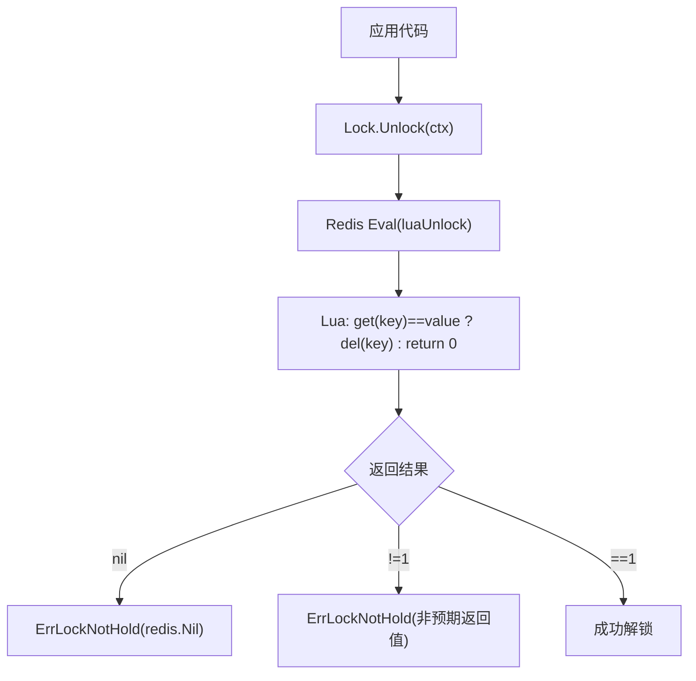
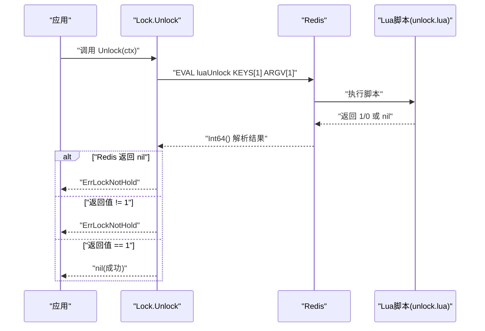
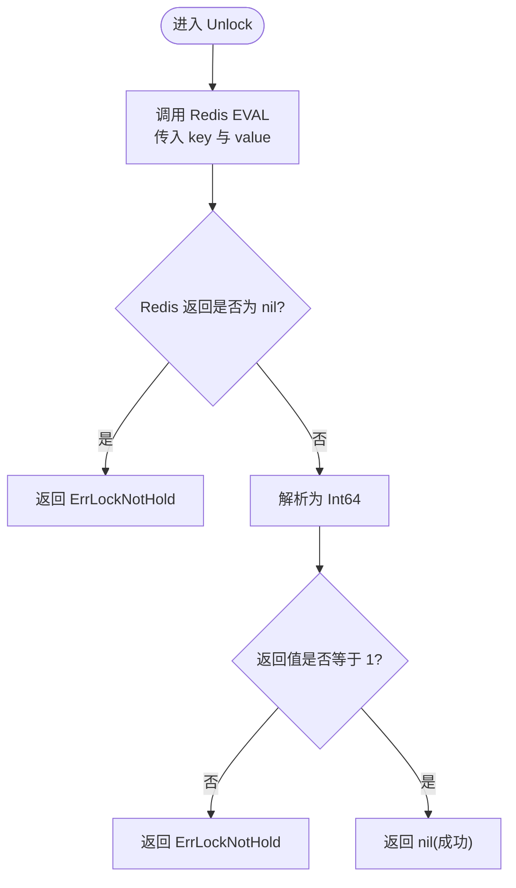
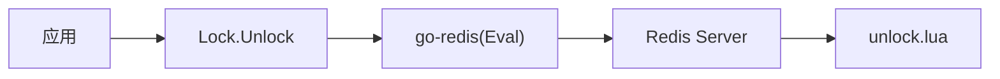

# Unlock 解锁方法

<cite>
**本文引用的文件**   
- [lock.go](file://lock.go)
- [unlock.lua](file://script/lua/unlock.lua)
- [demo_unlock.lua](file://demo/unlock.lua)
</cite>

## 目录
1. [简介](#简介)
2. [项目结构](#项目结构)
3. [核心组件](#核心组件)
4. [架构总览](#架构总览)
5. [详细组件分析](#详细组件分析)
6. [依赖关系分析](#依赖关系分析)
7. [性能与可靠性建议](#性能与可靠性建议)
8. [故障排查指南](#故障排查指南)
9. [结论](#结论)
10. [附录：API 参考](#附录api-参考)

## 简介
本章节面向 Lock 结构体的 Unlock 方法，提供完整的 API 文档与实现原理说明。重点包括：
- 基于 Lua 脚本的原子性保证与 Redis 操作安全性
- 参数 ctx context.Context 的作用域与超时语义
- 返回值 error 的含义与错误处理策略
- ErrLockNotHold 错误的触发条件（redis.Nil 与返回值不为 1）
- signalUnlockOnce 的并发安全机制，防止重复解锁 panic
- 正确的解锁用法示例、资源清理最佳实践
- 锁泄露预防、超时处理与性能优化建议

## 项目结构
本项目采用“Go 客户端 + Lua 脚本”的模式实现分布式锁。其中：
- Go 层负责调用 Redis、封装重试与生命周期管理
- Lua 脚本在 Redis 服务端执行，确保“检查值 + 删除”这一关键操作的原子性



图表来源
- [lock.go:232-251](file://lock.go#L232-L251)
- [unlock.lua:1-6](file://script/lua/unlock.lua#L1-L6)

章节来源
- [lock.go:15-44](file://lock.go#L15-L44)
- [unlock.lua:1-6](file://script/lua/unlock.lua#L1-L6)

## 核心组件
- Lock 结构体：封装了 Redis 连接、锁键 key、唯一值 value、过期时间 expiration，以及用于通知 AutoRefresh 停止的通道 unlock 和信号量 signalUnlockOnce。
- Unlock 方法：通过 Redis EVAL 执行 Lua 脚本进行原子解锁，并统一错误处理与资源释放。
- Lua 脚本 unlock.lua：在 Redis 中完成“校验持有者 + 删除键”的原子操作，避免竞态条件。

章节来源
- [lock.go:151-168](file://lock.go#L151-L168)
- [lock.go:232-251](file://lock.go#L232-L251)
- [unlock.lua:1-6](file://script/lua/unlock.lua#L1-L6)

## 架构总览
下图展示了 Unlock 从应用侧到 Redis 的完整调用链，以及错误分支的处理路径。



图表来源
- [lock.go:232-251](file://lock.go#L232-L251)
- [unlock.lua:1-6](file://script/lua/unlock.lua#L1-L6)

## 详细组件分析

### Unlock 方法行为与语义
- 功能：使用 Lua 脚本原子地校验锁持有者并删除锁键，从而安全释放分布式锁。
- 参数：ctx context.Context
  - 控制请求的生命周期与超时；当上下文取消或超时时，底层 Redis 调用会返回相应错误。
- 返回值：error
  - nil：表示解锁成功。
  - ErrLockNotHold：表示当前未持有锁（key 不存在或值不匹配）。
  - 其他错误：网络、Redis 服务异常等。

#### 原子性与安全性
- Lua 脚本在 Redis 单线程模型下执行，get 与 del 之间不会被其他命令打断，从而保证“仅由锁持有者释放”的安全性。
- 只有当 KEYS[1] 的值等于 ARGV[1]（即锁的唯一标识）时，才会执行 del；否则返回 0。



图表来源
- [lock.go:232-251](file://lock.go#L232-L251)
- [unlock.lua:1-6](file://script/lua/unlock.lua#L1-L6)

#### 错误处理策略
- redis.Nil：当 Redis 返回 nil（例如 key 不存在），直接映射为 ErrLockNotHold，避免上层误判为网络错误。
- 返回值不为 1：Lua 脚本返回 0 表示“不是你的锁”或“key 不存在”，同样映射为 ErrLockNotHold。
- 其他错误：透传底层错误（如网络中断、Redis 不可用等），由上层决定重试或告警策略。

章节来源
- [lock.go:232-251](file://lock.go#L232-L251)
- [unlock.lua:1-6](file://script/lua/unlock.lua#L1-L6)

#### signalUnlockOnce 的并发安全机制
- 目的：防止多次调用 Unlock 导致的 channel 写入与关闭 panic。
- 机制：使用 sync.Once 包裹对 unlock 通道的写入与关闭逻辑，确保只执行一次。
- 效果：即使 Unlock 被多次调用，也只会向 unlock 通道发送一次信号并关闭通道，AutoRefresh 能安全退出，且不会 panic。

```mermaid
classDiagram
class Lock {
-client
-key
-value
-expiration
-unlock chan struct{}
-signalUnlockOnce sync.Once
+Unlock(ctx) error
+AutoRefresh(interval, timeout) error
}
class Client {
-client
-g
-valuer
+Lock(...)
+TryLock(...)
}
Lock --> Client : "使用 Cmdable 接口"
```

图表来源
- [lock.go:151-168](file://lock.go#L151-L168)
- [lock.go:232-251](file://lock.go#L232-L251)

章节来源
- [lock.go:151-168](file://lock.go#L151-L168)
- [lock.go:232-251](file://lock.go#L232-L251)

### Lua 脚本 unlock.lua
- 输入：KEYS[1] 为锁键，ARGV[1] 为锁值（唯一标识）。
- 逻辑：若 KEYS[1] 的值等于 ARGV[1]，则删除该键并返回 1；否则返回 0。
- 作用：保证“判断 + 删除”的原子性，避免多进程/多线程环境下误删他人持有的锁。

```lua
if redis.call("get", KEYS[1]) == ARGV[1]
then
    return redis.call("del", KEYS[1])
else
    return 0
end
```

章节来源
- [unlock.lua:1-6](file://script/lua/unlock.lua#L1-L6)

### 与 demo 版本对比
- demo 中的 unlock.lua 与 script/lua/unlock.lua 语义一致，均实现“值匹配则删除，否则返回 0”。
- demo 的 Unlock 实现与主库略有差异（例如未使用 signalUnlockOnce），但错误处理思路相同：将 redis.Nil 与返回值不为 1 的情况统一视为“未持有锁”。

章节来源
- [demo_unlock.lua:1-8](file://demo/unlock.lua#L1-L8)

## 依赖关系分析
- Go 层依赖 go-redis 的 Eval 接口执行 Lua 脚本。
- Lua 脚本依赖 Redis 的 get/del 命令。
- Lock 内部依赖 sync.Once 保证并发安全，依赖 channel 与 AutoRefresh 协作。



图表来源
- [lock.go:232-251](file://lock.go#L232-L251)
- [unlock.lua:1-6](file://script/lua/unlock.lua#L1-L6)

章节来源
- [lock.go:232-251](file://lock.go#L232-L251)
- [unlock.lua:1-6](file://script/lua/unlock.lua#L1-L6)

## 性能与可靠性建议
- 优先使用带上下文的 Unlock(ctx)，并通过合理的超时控制避免长时间阻塞。
- 避免重复调用 Unlock；虽然 signalUnlockOnce 已防护，但仍应遵循“加锁一次、解锁一次”的原则。
- 结合 AutoRefresh 使用时，注意 AutoRefresh 会在收到 unlock 信号后退出循环，避免不必要的刷新开销。
- 在高并发场景下，尽量复用 Client 实例，减少对象创建与连接开销。
- 对于频繁解锁的场景，可考虑批量业务合并，减少 Redis 往返次数。

## 故障排查指南
- 现象：Unlock 返回 ErrLockNotHold
  - 可能原因：
    - Redis 返回 nil（key 不存在），对应 redis.Nil 分支。
    - Lua 脚本返回 0（key 存在但值不匹配，或 key 不存在）。
  - 排查步骤：
    - 确认调用 Unlock 前确实成功获取了锁。
    - 检查是否有其他进程/线程直接操作 Redis 删除了该 key。
    - 核对锁值（value）是否正确传递，避免不同实例间误删。
- 现象：Unlock 抛出 panic
  - 可能原因：多次调用 Unlock 导致 channel 重复写入或关闭。
  - 解决方案：确保每个锁只调用一次 Unlock；若必须幂等，请依赖内置的 signalUnlockOnce 保护。
- 现象：Unlock 长期阻塞
  - 可能原因：Redis 不可用或网络异常，导致 Eval 长时间等待。
  - 解决方案：为 ctx 设置合理超时；监控 Redis 健康状态；必要时引入重试与熔断。

章节来源
- [lock.go:232-251](file://lock.go#L232-L251)

## 结论
Unlock 方法通过 Lua 脚本在 Redis 端实现原子性的“校验 + 删除”，确保了分布式锁的安全释放。其错误处理将 redis.Nil 与返回值不为 1 统一归一为 ErrLockNotHold，便于上层统一处理。配合 signalUnlockOnce 的并发安全机制，避免了重复解锁带来的风险。建议在业务中使用带超时的 ctx，严格遵循“一次加锁、一次解锁”的契约，并结合 AutoRefresh 与重试策略提升整体可靠性与性能。

## 附录：API 参考

### Unlock(ctx context.Context) error
- 功能：释放分布式锁。
- 参数：
  - ctx：上下文，用于控制超时与取消。
- 返回值：
  - nil：解锁成功。
  - ErrLockNotHold：未持有锁（key 不存在或值不匹配）。
  - 其他错误：底层 Redis 通信或脚本执行错误。
- 行为要点：
  - 使用 Lua 脚本保证原子性。
  - 通过 signalUnlockOnce 防止重复解锁 panic。
  - 自动通知 AutoRefresh 退出。

章节来源
- [lock.go:232-251](file://lock.go#L232-L251)
- [unlock.lua:1-6](file://script/lua/unlock.lua#L1-L6)