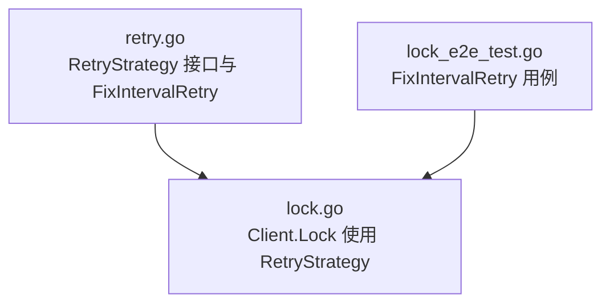
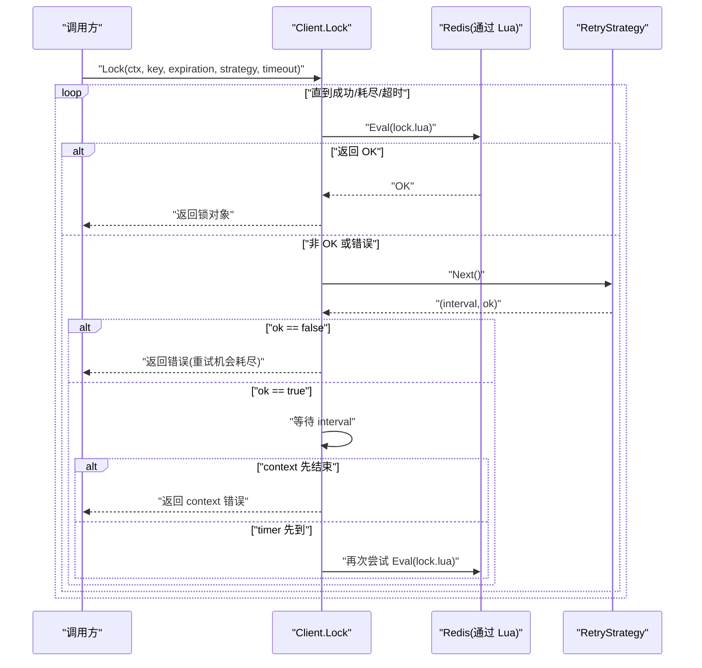
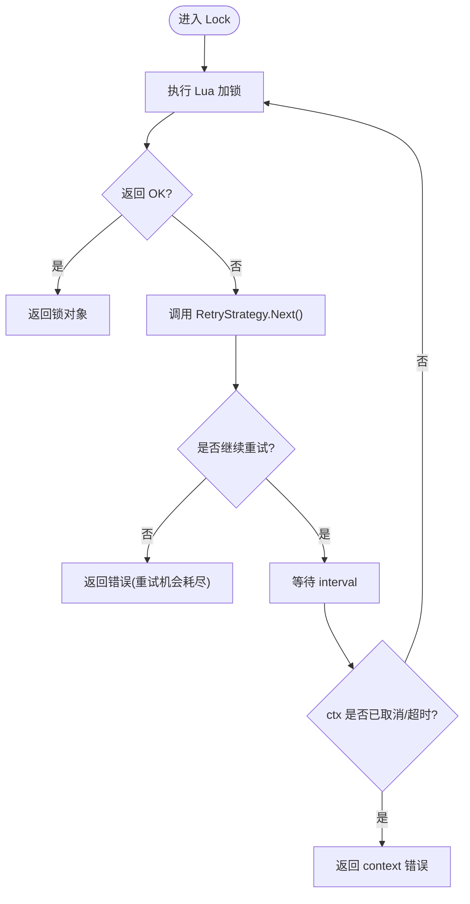
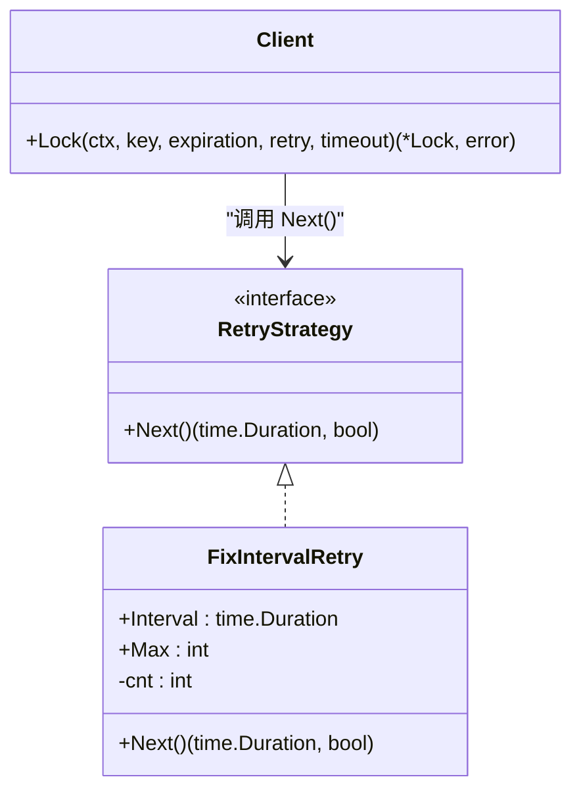

# RetryStrategy 重试策略接口

<cite>
**本文引用的文件**   
- [retry.go](file://retry.go)
- [lock.go](file://lock.go)
- [lock_e2e_test.go](file://lock_e2e_test.go)
</cite>

## 目录
1. [简介](#简介)
2. [项目结构](#项目结构)
3. [核心组件](#核心组件)
4. [架构总览](#架构总览)
5. [详细组件分析](#详细组件分析)
6. [依赖关系分析](#依赖关系分析)
7. [性能考虑](#性能考虑)
8. [故障排查指南](#故障排查指南)
9. [结论](#结论)
10. [附录](#附录)

## 简介
本文面向 redis-lock 库的 RetryStrategy 接口，系统性说明其设计模式、Next() 方法语义与返回值含义，完整记录默认实现 FixIntervalRetry 的工作原理与配置参数，并给出自定义重试策略的实现思路、最佳实践、退避算法建议、性能考量与调试技巧。读者无需深入源码即可理解如何正确使用和扩展重试机制。

## 项目结构
本仓库中与重试策略直接相关的代码集中在两个文件：
- retry.go：定义 RetryStrategy 接口与默认实现 FixIntervalRetry
- lock.go：在加锁流程中调用 RetryStrategy.Next() 控制重试间隔与次数

图表来源
- [retry.go:19-35](file://retry.go#L19-L35)
- [lock.go:94-134](file://lock.go#L94-L134)
- [lock_e2e_test.go:110-151](file://lock_e2e_test.go#L110-L151)

章节来源
- [retry.go:19-35](file://retry.go#L19-L35)
- [lock.go:94-134](file://lock.go#L94-L134)
- [lock_e2e_test.go:110-151](file://lock_e2e_test.go#L110-L151)

## 核心组件
- RetryStrategy 接口：定义 Next() 方法，用于决定下一次重试的等待时长以及是否继续重试
- FixIntervalRetry：固定间隔重试的默认实现，支持最大重试次数限制

章节来源
- [retry.go:19-35](file://retry.go#L19-L35)

## 架构总览
下图展示 Client.Lock 在加锁失败或超时时如何通过 RetryStrategy 进行重试，直至成功、达到最大次数或上下文超时。

图表来源
- [lock.go:94-134](file://lock.go#L94-L134)
- [retry.go:19-35](file://retry.go#L19-L35)

## 详细组件分析

### RetryStrategy 接口与 Next() 方法
- 设计模式
  - 策略模式：将“如何计算下一次重试间隔”抽象为策略，便于替换不同退避算法（固定间隔、指数退避、抖动等）
  - 迭代式决策：每次失败后调用 Next()，由策略决定是否继续重试及等待多久
- Next() 返回值语义
  - 第一个返回值：time.Duration，表示下一次重试前的等待间隔
  - 第二个返回值：bool，true 表示允许继续重试；false 表示不再重试，应终止循环
- 调用时机
  - 仅在加锁未成功（Lua 返回非 OK）或发生可重试的错误时调用
  - 若 Next() 返回 false，则立即停止重试并返回错误

章节来源
- [retry.go:19-22](file://retry.go#L19-L22)
- [lock.go:102-133](file://lock.go#L102-L133)

### FixIntervalRetry 默认实现
- 字段
  - Interval：固定重试间隔
  - Max：最大重试次数
  - cnt：内部计数器（私有）
- 行为
  - 每次 Next() 调用递增计数器
  - 返回 (Interval, cnt <= Max)
  - 当 cnt > Max 时，Next() 返回 false，触发“重试机会耗尽”
- 适用场景
  - 对延迟不敏感、希望以固定节奏重试的业务
  - 需要简单可控的重试上限

章节来源
- [retry.go:24-35](file://retry.go#L24-L35)
- [lock_e2e_test.go:110-151](file://lock_e2e_test.go#L110-L151)

### 重试流程与错误语义
- 重试条件
  - 加锁 Lua 执行失败或返回非 OK
  - 网络或 Redis 侧出现可重试错误（例如超时）
- 退出条件
  - 成功获取锁
  - Next() 返回 false（重试次数耗尽）
  - 上下文 ctx 超时或取消
- 错误类型
  - context.DeadlineExceeded：整体调用超时
  - ErrFailedToPreemptLock：超过重试次数且最后一次仍因锁被占用而失败
  - 其他错误：通常代表不可恢复的通信或服务端问题

图表来源
- [lock.go:94-134](file://lock.go#L94-L134)

章节来源
- [lock.go:84-134](file://lock.go#L84-L134)

### 自定义重试策略
- 何时自定义
  - 需要指数退避、随机抖动、按错误类型差异化重试
  - 需要结合业务指标（如 QPS、错误率）动态调整间隔
- 实现要点
  - 维护状态：当前重试次数、上次失败原因、累计耗时等
  - 计算间隔：根据策略公式生成 time.Duration
  - 终止条件：达到最大次数、超出总预算时间、遇到不可重试错误
- 与框架集成
  - 实现 Next() 方法，确保返回正确的 (interval, continue)
  - 注意线程安全：若策略实例可能被并发访问，需自行加锁或使用无共享状态

示例思路（伪代码描述）
- 指数退避 + 抖动
  - 第 i 次重试间隔 = base * 2^i + random_jitter
  - 设置最大间隔上限与最大重试次数
- 按错误分类
  - 对“锁被占用”采用短间隔快速重试
  - 对“网络异常”采用较长间隔与更大抖动
  - 对“服务端错误”直接放弃重试

章节来源
- [retry.go:19-22](file://retry.go#L19-L22)
- [lock.go:114-122](file://lock.go#L114-L122)

## 依赖关系分析
- 耦合关系
  - Client.Lock 依赖 RetryStrategy 接口，解耦了具体重试算法
  - FixIntervalRetry 仅依赖标准库 time，无外部依赖
- 外部依赖
  - Redis 客户端（go-redis/v9）
  - Lua 脚本（lock.lua、refresh.lua、unlock.lua）

图表来源
- [retry.go:19-35](file://retry.go#L19-L35)
- [lock.go:94-134](file://lock.go#L94-L134)

章节来源
- [retry.go:19-35](file://retry.go#L19-L35)
- [lock.go:94-134](file://lock.go#L94-L134)

## 性能考虑
- 避免频繁分配 Timer
  - 框架内部复用 timer 变量并通过 Reset 重置，减少 GC 压力
- 合理设置 Interval 与 Max
  - 过小的 Interval 会导致请求风暴，增大 Redis 负载
  - 过大的 Max 会延长失败路径的耗时，影响用户体验
- 退避与抖动
  - 指数退避可降低热点键竞争时的冲突概率
  - 抖动可避免多个客户端同时重试导致的同步拥塞
- 上下文超时
  - 始终尊重 ctx 的超时/取消，避免长时间阻塞
- 可观测性
  - 建议在自定义策略中埋点：重试次数、间隔分布、最终结果

章节来源
- [lock.go:123-132](file://lock.go#L123-L132)

## 故障排查指南
- 常见问题
  - 一直返回“重试机会耗尽”
    - 检查 FixIntervalRetry.Max 是否过小
    - 确认业务侧是否存在持续持有锁的进程
  - 总是超时
    - 检查 ctx.Timeout 是否过短
    - 评估 Redis 延迟与网络抖动
  - 间歇性失败
    - 考虑引入指数退避与抖动
    - 观察 Redis 监控与慢查询日志
- 定位手段
  - 打印 Next() 的返回值序列，验证间隔与终止逻辑是否符合预期
  - 在 Client.Lock 外层包装计时器，统计各阶段耗时
  - 使用分布式追踪链路关联一次加锁调用的多次重试

章节来源
- [lock.go:114-122](file://lock.go#L114-L122)
- [lock_e2e_test.go:110-151](file://lock_e2e_test.go#L110-L151)

## 结论
RetryStrategy 以简洁的策略接口解耦了重试算法，FixIntervalRetry 提供了开箱即用的固定间隔重试能力。对于大多数场景，可通过调整 Interval 与 Max 满足需求；在高竞争或高延迟环境中，推荐实现指数退避与抖动的自定义策略，并结合上下文超时与可观测性手段保障系统稳定性与可维护性。

## 附录

### API 参考速查
- RetryStrategy.Next()
  - 输入：无
  - 输出：(time.Duration, bool)
  - 语义：返回下一次重试间隔；若不需要继续重试，返回 false
- FixIntervalRetry
  - 字段
    - Interval：固定重试间隔
    - Max：最大重试次数
  - 行为：每次 Next() 递增内部计数，返回 (Interval, cnt <= Max)

章节来源
- [retry.go:19-35](file://retry.go#L19-L35)