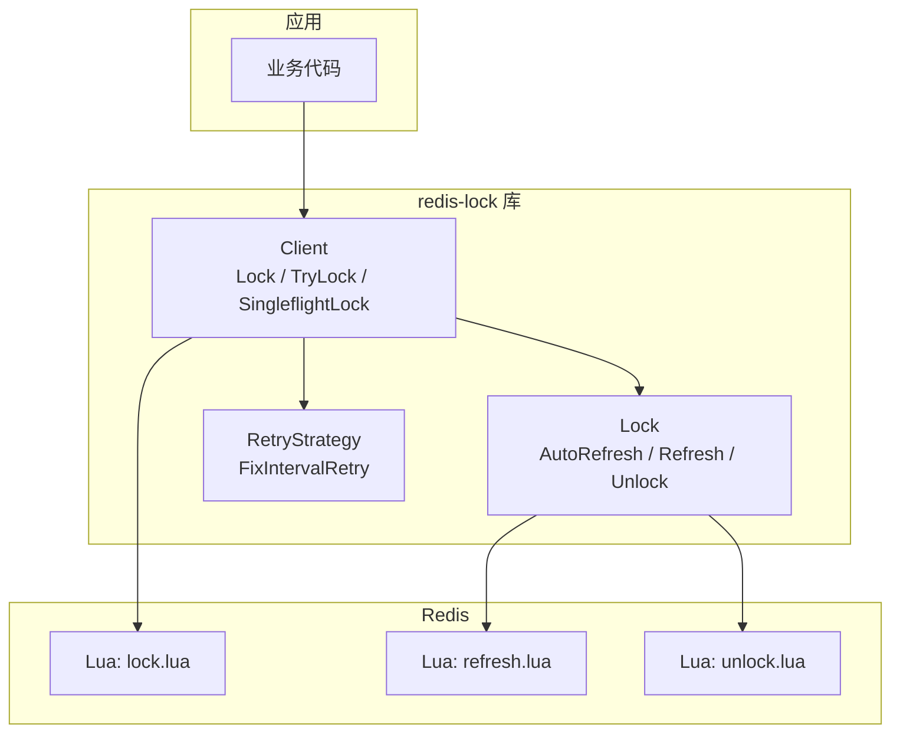
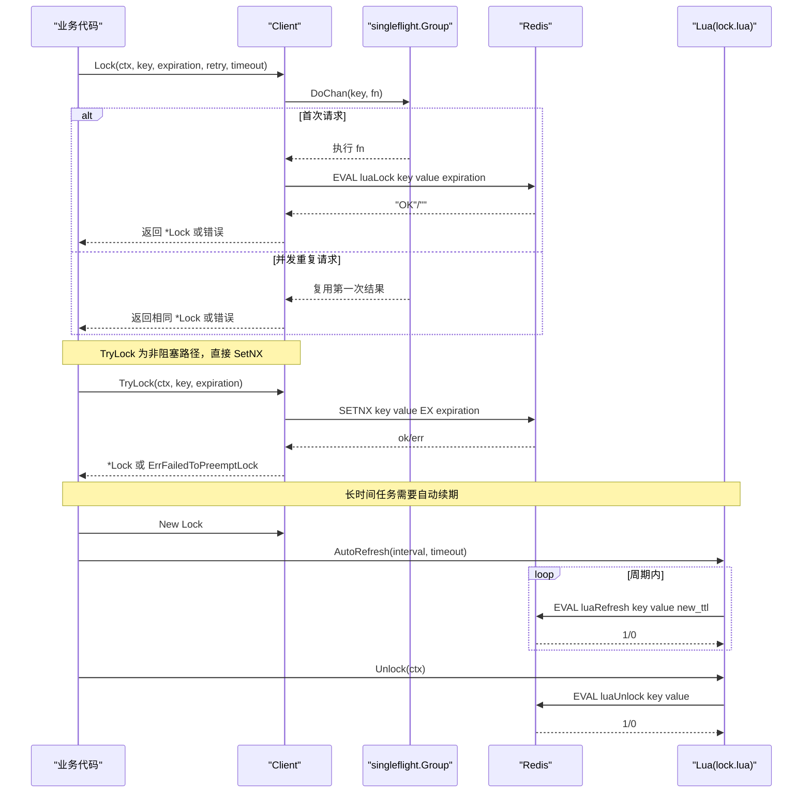
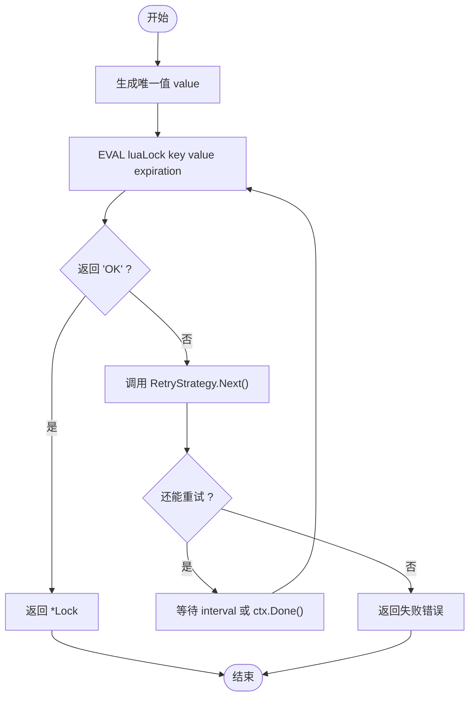
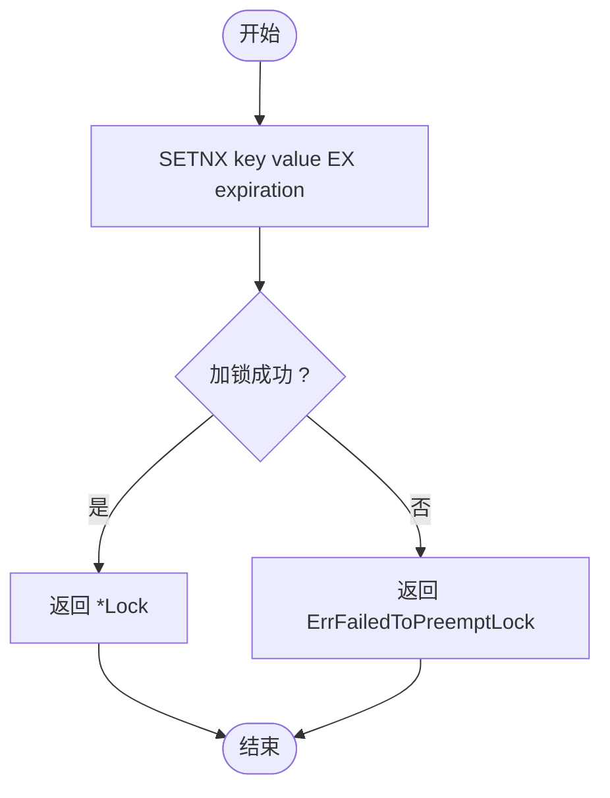
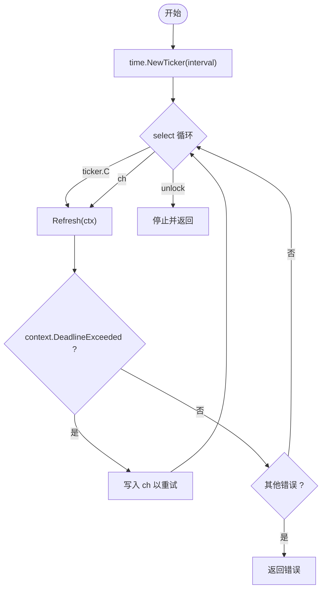
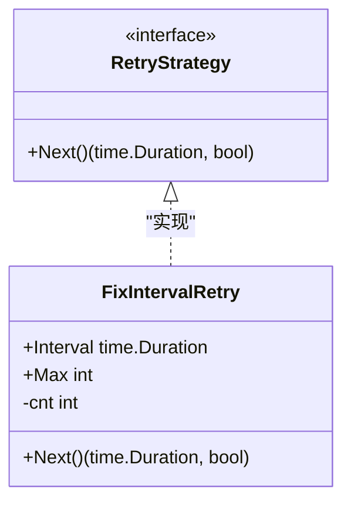
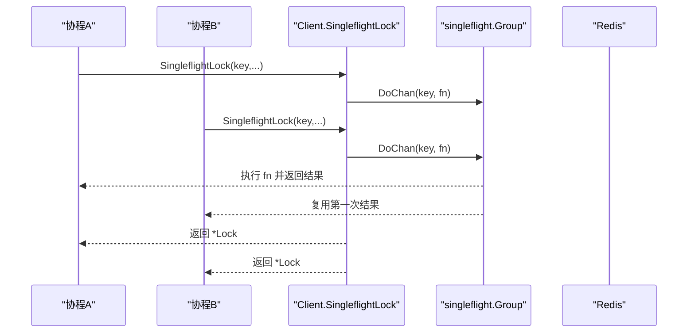
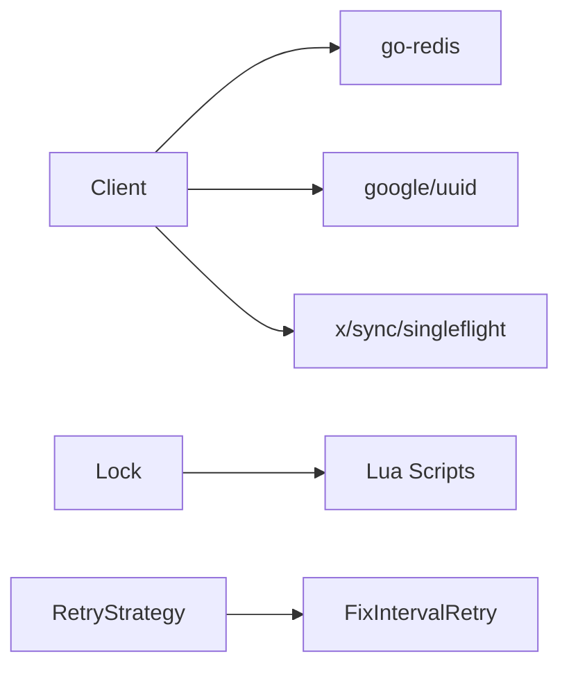

# 使用示例

<cite>
**本文引用的文件**   
- [lock.go](file://lock.go)
- [retry.go](file://retry.go)
- [demo/demo.go](file://demo/demo.go)
- [script/lua/lock.lua](file://script/lua/lock.lua)
- [script/lua/refresh.lua](file://script/lua/refresh.lua)
- [script/lua/unlock.lua](file://script/lua/unlock.lua)
- [README.md](file://README.md)
- [go.mod](file://go.mod)
</cite>

## 目录
1. [简介](#简介)
2. [项目结构](#项目结构)
3. [核心组件](#核心组件)
4. [架构总览](#架构总览)
5. [详细组件分析](#详细组件分析)
6. [依赖关系分析](#依赖关系分析)
7. [性能与高并发优化](#性能与高并发优化)
8. [故障排查指南](#故障排查指南)
9. [结论](#结论)
10. [附录：完整可运行示例清单](#附录完整可运行示例清单)

## 简介
本库基于 Redis 实现分布式锁，提供以下能力：
- 阻塞式加锁 Lock：带重试策略与超时控制
- 非阻塞加锁 TryLock：立即返回是否成功
- 自动续期 AutoRefresh：长时间任务安全持有锁
- 自定义重试策略 RetryStrategy：灵活控制重试间隔与次数
- SingleflightLock：在高并发下合并重复请求，减少竞争与抖动
- Lua 原子脚本：保证加锁、续期、解锁的原子性与一致性

环境要求（来自 README）：
- Redis >= v7（低于 v7 理论上可用，但未充分测试）
- Go >= 18

**章节来源**
- [README.md:1-13](file://README.md#L1-L13)

## 项目结构
仓库关键目录与文件说明：
- lock.go：客户端 Client、锁对象 Lock、核心方法 Lock/TryLock/AutoRefresh/Unlock、SingleflightLock
- retry.go：重试策略接口与固定间隔重试实现 FixIntervalRetry
- demo/demo.go：教学演示代码（包含类似实现，用于课程辅助学习）
- script/lua/*.lua：Redis 端原子脚本（加锁、续期、解锁）
- go.mod：模块依赖声明

**图表来源**
- [lock.go:46-82](file://lock.go#L46-L82)
- [lock.go:94-149](file://lock.go#L94-L149)
- [lock.go:170-251](file://lock.go#L170-L251)
- [retry.go:19-35](file://retry.go#L19-L35)
- [script/lua/lock.lua:1-13](file://script/lua/lock.lua#L1-L13)
- [script/lua/refresh.lua:1-6](file://script/lua/refresh.lua#L1-L6)
- [script/lua/unlock.lua:1-6](file://script/lua/unlock.lua#L1-L6)

**章节来源**
- [lock.go:1-252](file://lock.go#L1-L252)
- [retry.go:1-36](file://retry.go#L1-L36)
- [demo/demo.go:1-214](file://demo/demo.go#L1-L214)
- [script/lua/lock.lua:1-13](file://script/lua/lock.lua#L1-L13)
- [script/lua/refresh.lua:1-6](file://script/lua/refresh.lua#L1-L6)
- [script/lua/unlock.lua:1-6](file://script/lua/unlock.lua#L1-L6)

## 核心组件
- Client：封装 Redis 连接，提供 Lock、TryLock、SingleflightLock 等方法
- Lock：表示一次成功的加锁结果，支持 AutoRefresh、Refresh、Unlock
- RetryStrategy：定义 Next() 返回下一次重试间隔与是否继续重试
- FixIntervalRetry：固定间隔重试策略实现
- Lua 脚本：lock.lua、refresh.lua、unlock.lua 分别负责加锁、续期、解锁

**章节来源**
- [lock.go:46-82](file://lock.go#L46-L82)
- [lock.go:94-149](file://lock.go#L94-L149)
- [lock.go:170-251](file://lock.go#L170-L251)
- [retry.go:19-35](file://retry.go#L19-L35)

## 架构总览
下图展示了从业务调用到 Redis 的完整流程，包括加锁、续期、解锁以及 Singleflight 去重。

**图表来源**
- [lock.go:62-82](file://lock.go#L62-L82)
- [lock.go:94-149](file://lock.go#L94-L149)
- [lock.go:170-251](file://lock.go#L170-L251)
- [script/lua/lock.lua:1-13](file://script/lua/lock.lua#L1-L13)
- [script/lua/refresh.lua:1-6](file://script/lua/refresh.lua#L1-L6)
- [script/lua/unlock.lua:1-6](file://script/lua/unlock.lua#L1-L6)

## 详细组件分析

### 基础加锁与解锁（Lock / Unlock）
- 加锁流程
  - 生成唯一值 value（UUID）
  - 通过 Lua 脚本在 Redis 中设置 key=value，并设置过期时间
  - 若返回 "OK"，则构造 Lock 对象返回
  - 否则根据 RetryStrategy 决定重试间隔与次数
  - 整体受 timeout 控制，避免无限等待
- 解锁流程
  - 通过 Lua 脚本校验 value 后删除 key，确保只有持有者能解锁
  - 若 Redis 返回 Nil 或结果为 0，视为未持有锁

**图表来源**
- [lock.go:94-134](file://lock.go#L94-L134)
- [script/lua/lock.lua:1-13](file://script/lua/lock.lua#L1-L13)

**章节来源**
- [lock.go:94-149](file://lock.go#L94-L149)
- [lock.go:231-251](file://lock.go#L231-L251)
- [script/lua/lock.lua:1-13](file://script/lua/lock.lua#L1-L13)
- [script/lua/unlock.lua:1-6](file://script/lua/unlock.lua#L1-L6)

### 非阻塞加锁（TryLock）
- 使用 Redis SETNX 原子操作尝试加锁
- 成功返回 *Lock；失败返回 ErrFailedToPreemptLock
- 适用于“快速失败”的场景，如热点键保护、幂等入口

**图表来源**
- [lock.go:136-149](file://lock.go#L136-L149)

**章节来源**
- [lock.go:136-149](file://lock.go#L136-L149)

### 自动续期（AutoRefresh）
- 定时任务周期性调用 Refresh，延长锁的过期时间
- 支持两种触发源：Ticker 定时与超时重试通道 ch
- 当收到 Unlock 信号时停止续期

**图表来源**
- [lock.go:170-217](file://lock.go#L170-L217)
- [script/lua/refresh.lua:1-6](file://script/lua/refresh.lua#L1-L6)

**章节来源**
- [lock.go:170-217](file://lock.go#L170-L217)
- [script/lua/refresh.lua:1-6](file://script/lua/refresh.lua#L1-L6)

### 自定义重试策略（RetryStrategy）
- 接口 Next() 返回下一次重试间隔与是否继续重试
- 内置 FixIntervalRetry：固定间隔 + 最大次数
- 可自定义指数退避、随机抖动等策略

**图表来源**
- [retry.go:19-35](file://retry.go#L19-L35)

**章节来源**
- [retry.go:19-35](file://retry.go#L19-L35)

### 高并发去重（SingleflightLock）
- 对同一 key 的并发加锁请求进行合并，仅执行一次真实加锁
- 其余请求复用第一次的结果，降低 Redis 压力与抖动
- 注意：DoChan 返回结果后需 Forget(key) 释放资源

**图表来源**
- [lock.go:62-82](file://lock.go#L62-L82)

**章节来源**
- [lock.go:62-82](file://lock.go#L62-L82)

## 依赖关系分析
- 外部依赖
  - github.com/redis/go-redis/v9：Redis 客户端
  - github.com/google/uuid：生成唯一值
  - golang.org/x/sync/singleflight：并发请求合并
- 内部依赖
  - Client 依赖 redis.Cmdable 与 singleflight.Group
  - Lock 依赖 Redis Lua 脚本进行续期与解锁
  - FixIntervalRetry 实现 RetryStrategy 接口

**图表来源**
- [go.mod:1-20](file://go.mod#L1-L20)
- [lock.go:17-28](file://lock.go#L17-L28)
- [retry.go:19-35](file://retry.go#L19-L35)

**章节来源**
- [go.mod:1-20](file://go.mod#L1-L20)
- [lock.go:17-28](file://lock.go#L17-L28)

## 性能与高并发优化
- 使用 SingleflightLock 合并重复加锁请求，显著降低 Redis 竞争与网络开销
- 合理配置重试策略：
  - 短间隔 + 多次重试适合低延迟场景
  - 指数退避可减少雪崩效应
- 自动续期参数调优：
  - interval 应小于 expiration 的 1/3~1/2，避免频繁续期
  - timeout 要足够小，避免阻塞刷新 goroutine
- Lua 脚本原子性保障：
  - 加锁、续期、解锁均在 Redis 侧原子执行，避免竞态条件
- 监控与告警：
  - 统计加锁耗时、重试次数、续期失败率
  - 对 ErrLockNotHold 与 ErrFailedToPreemptLock 做分类告警

[本节为通用建议，不直接分析具体文件]

## 故障排查指南
常见错误与处理建议：
- context.DeadlineExceeded
  - 可能发生在 Lock 整体超时或 Refresh 超时
  - 对于 Lock：不确定最终是否加锁成功，需谨慎处理
  - 对于 Refresh：应立即重试，因为可能已续期成功
- ErrFailedToPreemptLock
  - 超过重试次数且未出现通信错误，明确加锁失败
- ErrLockNotHold
  - 解锁或续期时发现未持有锁，可能是被他人绕过 rlock 直接操作 Redis
- 网络/Redis 异常
  - 非超时错误通常不可恢复，直接返回上层

最佳实践：
- 使用 errors.Is 判断错误类型
- 对 Refresh 的超时进行快速重试，避免锁提前过期
- 对 Unlock 的 ErrLockNotHold 进行日志记录与告警

**章节来源**
- [lock.go:84-93](file://lock.go#L84-L93)
- [lock.go:114-122](file://lock.go#L114-L122)
- [lock.go:219-228](file://lock.go#L219-L228)
- [lock.go:231-251](file://lock.go#L231-L251)

## 结论
本库通过 Lua 原子脚本与 Go 层重试、超时、自动续期机制，提供了稳定可靠的分布式锁实现。在高并发场景下，SingleflightLock 能有效合并重复请求，提升吞吐并降低抖动。结合合理的重试策略与续期参数，可在长时间任务中保持锁的安全性。

[本节为总结性内容，不直接分析具体文件]

## 附录：完整可运行示例清单
以下为可直接运行的示例模板（请替换占位符为你的 Redis 地址与密钥），每个示例均附带注释说明。

- 示例一：基础加锁与解锁
  - 步骤
    - 初始化 Client
    - 调用 Lock 获取锁
    - 执行业务逻辑
    - 调用 Unlock 释放锁
  - 关键点
    - 使用 context.WithTimeout 控制整体超时
    - 使用 errors.Is 判断错误类型
  - 参考实现位置
    - [lock.go:94-149](file://lock.go#L94-L149)
    - [lock.go:231-251](file://lock.go#L231-L251)

- 示例二：非阻塞加锁 TryLock
  - 步骤
    - 调用 TryLock
    - 若失败，走快速失败或降级逻辑
  - 关键点
    - 适用于热点保护与幂等入口
  - 参考实现位置
    - [lock.go:136-149](file://lock.go#L136-L149)

- 示例三：自动续期 AutoRefresh
  - 步骤
    - 获取 Lock 后启动 AutoRefresh(interval, timeout)
    - 业务完成后调用 Unlock
  - 关键点
    - interval 应小于 expiration 的 1/2
    - 对 Refresh 的超时进行快速重试
  - 参考实现位置
    - [lock.go:170-217](file://lock.go#L170-L217)
    - [script/lua/refresh.lua:1-6](file://script/lua/refresh.lua#L1-L6)

- 示例四：自定义重试策略
  - 步骤
    - 实现 RetryStrategy 接口
    - 在 Lock 中传入自定义策略
  - 关键点
    - 可使用指数退避与随机抖动
  - 参考实现位置
    - [retry.go:19-35](file://retry.go#L19-L35)

- 示例五：SingleflightLock 高并发优化
  - 步骤
    - 使用 SingleflightLock 替代 Lock
    - 观察并发下的性能提升
  - 关键点
    - 对同一 key 的请求会被合并
  - 参考实现位置
    - [lock.go:62-82](file://lock.go#L62-L82)

- 示例六：Lua 脚本验证
  - 步骤
    - 在 Redis 中手动执行 lock.lua、refresh.lua、unlock.lua
    - 验证原子性与返回值
  - 关键点
    - 确保 value 一致才能解锁/续期
  - 参考实现位置
    - [script/lua/lock.lua:1-13](file://script/lua/lock.lua#L1-L13)
    - [script/lua/refresh.lua:1-6](file://script/lua/refresh.lua#L1-L6)
    - [script/lua/unlock.lua:1-6](file://script/lua/unlock.lua#L1-L6)

[本节为示例指引，不直接展示代码内容]