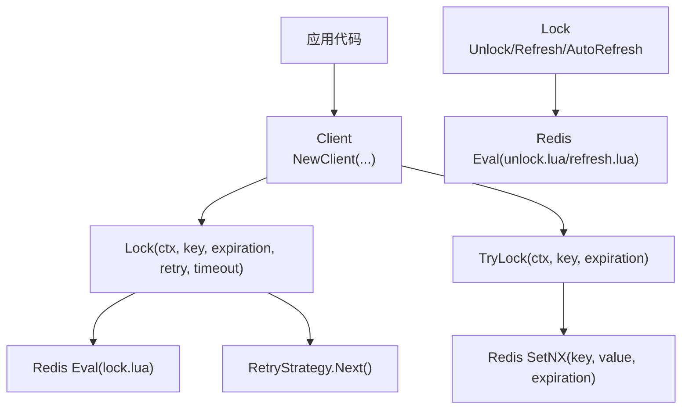
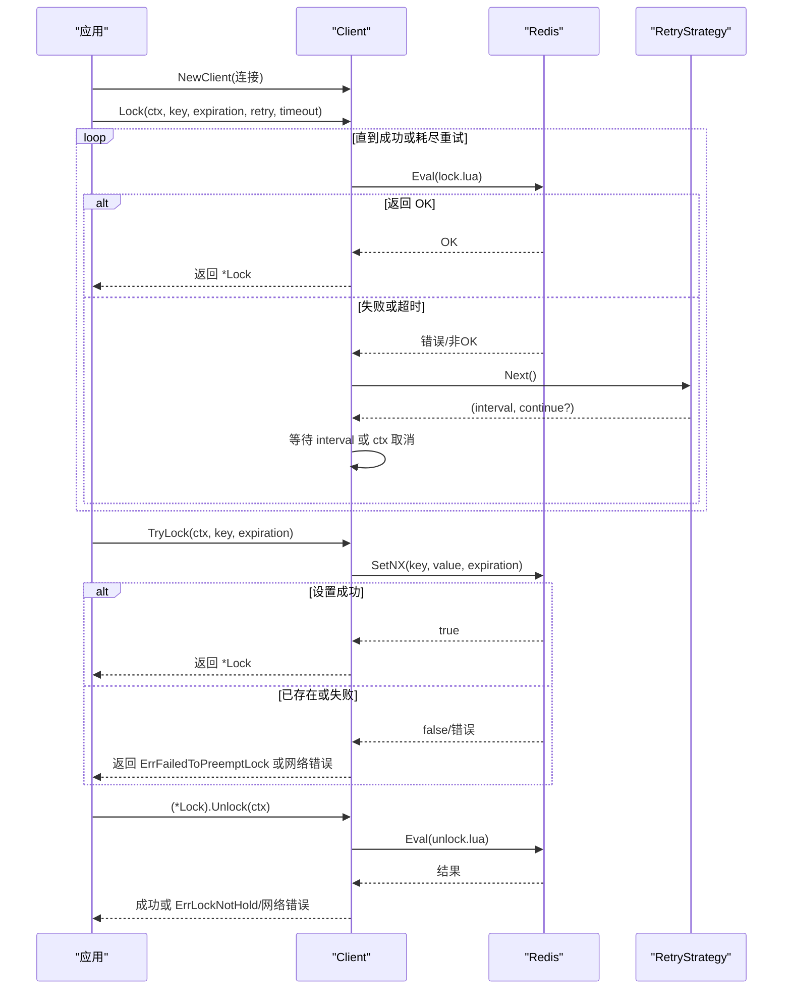
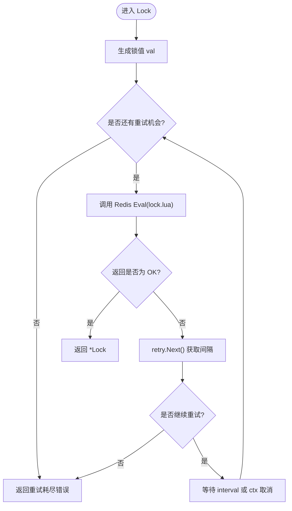
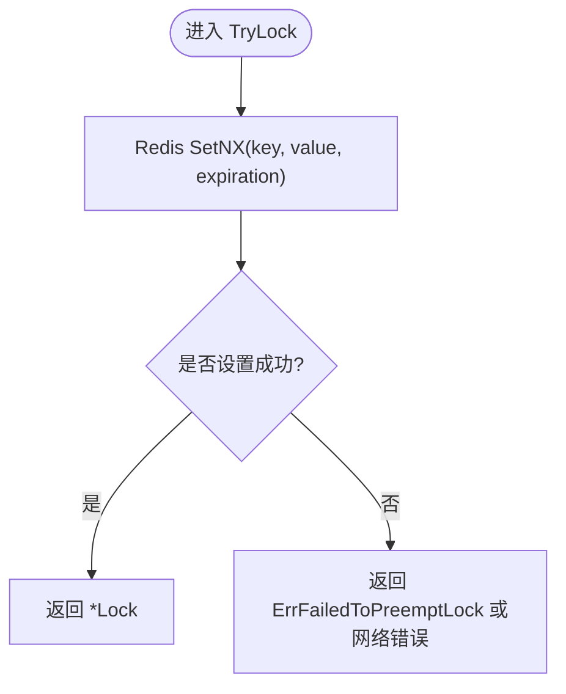
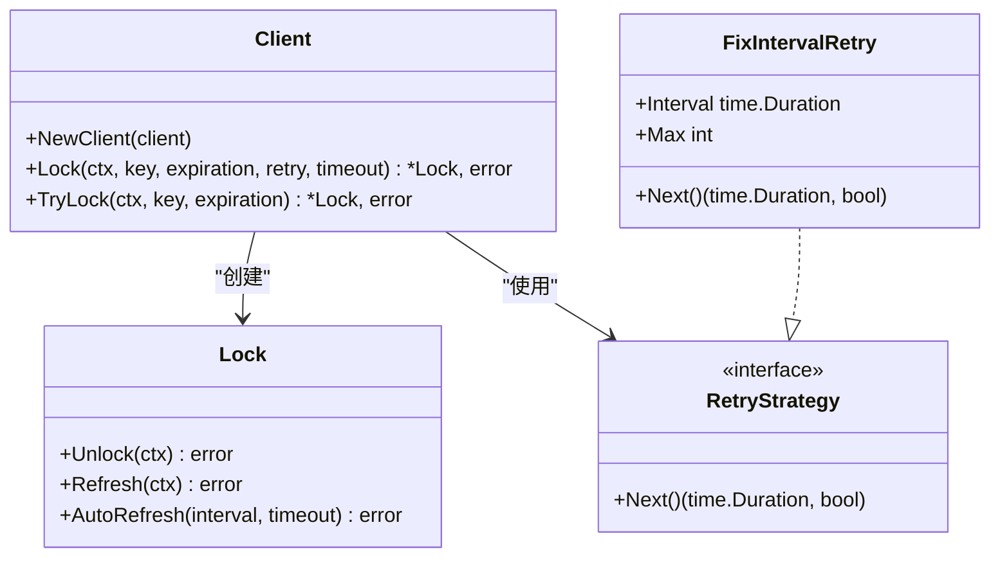
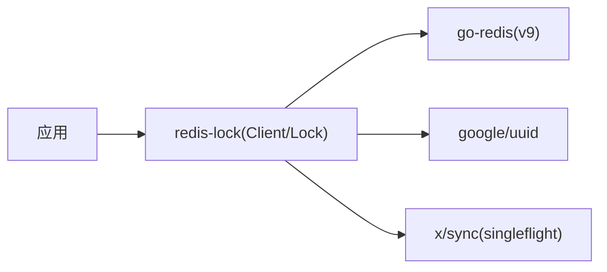

# 基础用法

<cite>
**本文引用的文件**   
- [README.md](file://README.md)
- [lock.go](file://lock.go)
- [retry.go](file://retry.go)
- [go.mod](file://go.mod)
- [demo/demo.go](file://demo/demo.go)
</cite>

## 目录
1. [简介](#简介)
2. [项目结构](#项目结构)
3. [核心组件](#核心组件)
4. [架构总览](#架构总览)
5. [详细组件分析](#详细组件分析)
6. [依赖关系分析](#依赖关系分析)
7. [性能与可用性建议](#性能与可用性建议)
8. [故障排查指南](#故障排查指南)
9. [结论](#结论)
10. [附录：可运行示例步骤](#附录可运行示例步骤)

## 简介
本章节面向初学者，讲解 redis-lock 库的基础用法，包括：
- 客户端初始化与基本参数配置
- 阻塞式加锁 Lock 与非阻塞式 TryLock 的使用流程
- 解锁 Unlock 与错误处理
- 不同加锁方法的适用场景与选择建议

该库基于 Redis 实现分布式锁，要求 Redis >= v7（其他版本理论上可用但未全面测试），Go >= 18。

**章节来源**
- [README.md:1-13](file://README.md#L1-L13)

## 项目结构
仓库根目录包含核心实现、脚本、示例与测试等。与“基础用法”最相关的文件如下：
- lock.go：客户端 Client、锁对象 Lock、加锁/解锁/续期方法
- retry.go：重试策略接口与固定间隔重试实现
- demo/demo.go：演示代码（含注释说明）
- go.mod：模块声明与依赖

**图表来源**
- [lock.go:53-149](file://lock.go#L53-L149)
- [lock.go:170-251](file://lock.go#L170-L251)
- [retry.go:19-35](file://retry.go#L19-L35)

**章节来源**
- [lock.go:1-252](file://lock.go#L1-L252)
- [retry.go:1-36](file://retry.go#L1-L36)
- [demo/demo.go:1-214](file://demo/demo.go#L1-L214)
- [go.mod:1-21](file://go.mod#L1-L21)

## 核心组件
- Client：封装 Redis 连接，提供加锁、非阻塞尝试加锁、单飞合并等方法
- Lock：表示一次成功加锁的上下文，支持解锁、续期、自动续期
- RetryStrategy：定义重试策略接口；FixIntervalRetry 提供固定间隔重试实现

关键要点：
- 客户端通过 NewClient(redis.Cmdable) 创建
- Lock 使用 Lua 脚本保证原子性
- TryLock 使用 SETNX 进行一次性尝试
- Unlock/Refresh 同样使用 Lua 脚本保证安全释放与续期

**章节来源**
- [lock.go:46-60](file://lock.go#L46-L60)
- [lock.go:151-168](file://lock.go#L151-L168)
- [retry.go:19-35](file://retry.go#L19-L35)

## 架构总览
下图展示从应用调用到 Redis 的完整交互路径，以及重试机制在其中的作用。

**图表来源**
- [lock.go:62-149](file://lock.go#L62-L149)
- [lock.go:219-251](file://lock.go#L219-L251)
- [retry.go:19-35](file://retry.go#L19-L35)

## 详细组件分析

### 客户端初始化与基本参数
- 构造方式：NewClient(client redis.Cmdable)
- 内部值生成器：默认使用 UUID 作为锁值，避免误删他人锁
- 关键参数：
  - key：锁键名，需全局唯一
  - expiration：锁过期时间，防止死锁
  - retry：重试策略，控制重试次数与间隔
  - timeout：整体加锁超时，避免长时间阻塞

**章节来源**
- [lock.go:53-60](file://lock.go#L53-L60)

### 阻塞式加锁 Lock
- 行为：循环尝试加锁，直到成功、达到重试上限或整体超时
- 重试机制：通过 RetryStrategy.Next() 获取下一次重试间隔
- 错误语义：
  - context.DeadlineExceeded：整体调用超时
  - ErrFailedToPreemptLock：超过重试次数且未出现通信错误
  - 其他错误：Redis 通信异常（如 EOF、服务端不可用）

**图表来源**
- [lock.go:94-134](file://lock.go#L94-L134)
- [retry.go:19-35](file://retry.go#L19-L35)

**章节来源**
- [lock.go:84-134](file://lock.go#L84-L134)
- [retry.go:19-35](file://retry.go#L19-L35)

### 非阻塞式加锁 TryLock
- 行为：仅尝试一次 SETNX，成功即返回锁，否则立即返回竞争失败或网络错误
- 适用场景：对延迟敏感、允许快速失败的短临界区

**图表来源**
- [lock.go:136-149](file://lock.go#L136-L149)

**章节来源**
- [lock.go:136-149](file://lock.go#L136-L149)

### 解锁与续期
- Unlock：通过 Lua 脚本原子删除锁，若未持有锁则返回 ErrLockNotHold
- Refresh：通过 Lua 脚本原子续期，若未持有锁则返回 ErrLockNotHold
- AutoRefresh：后台定时刷新，直到显式解锁或发生错误

**图表来源**
- [lock.go:46-60](file://lock.go#L46-L60)
- [lock.go:151-251](file://lock.go#L151-L251)
- [retry.go:19-35](file://retry.go#L19-L35)

**章节来源**
- [lock.go:170-251](file://lock.go#L170-L251)
- [retry.go:19-35](file://retry.go#L19-L35)

## 依赖关系分析
- 外部依赖：
  - github.com/redis/go-redis/v9：Redis 客户端
  - github.com/google/uuid：生成锁值
  - golang.org/x/sync/singleflight：单飞合并（用于 SingleflightLock）
- 模块声明与版本：见 go.mod

**图表来源**
- [go.mod:1-21](file://go.mod#L1-L21)
- [lock.go:17-28](file://lock.go#L17-L28)

**章节来源**
- [go.mod:1-21](file://go.mod#L1-L21)
- [lock.go:17-28](file://lock.go#L17-L28)

## 性能与可用性建议
- 优先使用 TryLock 的场景：
  - 对延迟敏感、允许快速失败
  - 临界区很短，竞争不激烈
- 优先使用 Lock 的场景：
  - 需要尽可能拿到锁，容忍一定等待
  - 业务逻辑不允许失败，可通过重试提高成功率
- 合理设置参数：
  - expiration：根据临界区耗时设置，留有余量
  - retry.Interval/Max：平衡响应时间与成功率
  - timeout：避免无限等待，结合业务 SLA
- 注意并发安全：
  - 确保同一时刻只有一个协程持有同一 key 的锁
  - 避免重复解锁导致 ErrLockNotHold

[本节为通用建议，不直接分析具体文件]

## 故障排查指南
常见错误与处理建议：
- ErrFailedToPreemptLock：
  - TryLock：表示锁已被占用或竞争失败
  - Lock：表示重试耗尽仍未成功
- ErrLockNotHold：
  - 解锁或续期时触发，通常意味着锁不属于当前进程或被提前释放
- context.DeadlineExceeded：
  - Lock 整体超时，无法判断最终是否加锁成功，应结合业务幂等设计
- Redis 通信错误：
  - 检查网络连通性、Redis 服务状态、超时配置

**章节来源**
- [lock.go:39-44](file://lock.go#L39-L44)
- [lock.go:104-122](file://lock.go#L104-L122)
- [lock.go:219-251](file://lock.go#L219-L251)

## 结论
- 对于简单、低延迟、可接受失败的场景，优先使用 TryLock
- 对于必须获得锁的业务，使用 Lock 并配合合理的重试策略与超时
- 始终设置合适的 expiration，避免死锁
- 正确区分并处理 ErrFailedToPreemptLock、ErrLockNotHold 与超时错误

[本节为总结性内容，不直接分析具体文件]

## 附录：可运行示例步骤
以下给出一个最小可运行的示例步骤（不含具体代码内容，便于读者自行编写）：

- 步骤一：初始化 Redis 客户端
  - 使用 go-redis 创建连接
  - 将连接传入 rlock.NewClient

- 步骤二：非阻塞加锁 TryLock
  - 调用 client.TryLock(ctx, key, expiration)
  - 成功：得到 *Lock，执行业务逻辑后调用 Unlock
  - 失败：判断错误类型，决定是否快速失败或降级

- 步骤三：阻塞加锁 Lock
  - 准备 RetryStrategy（例如 FixIntervalRetry{Interval, Max}）
  - 调用 client.Lock(ctx, key, expiration, retry, timeout)
  - 成功：执行业务逻辑后调用 Unlock
  - 失败：根据错误类型决定重试、告警或回退

- 步骤四：解锁与续期
  - 使用 (*Lock).Unlock(ctx) 释放锁
  - 如需长任务，启动 (*Lock).AutoRefresh(interval, timeout) 后台续期
  - 在业务结束时停止 AutoRefresh 并调用 Unlock

- 步骤五：错误处理
  - 区分 ErrFailedToPreemptLock、ErrLockNotHold、context.DeadlineExceeded
  - 对网络错误进行重试或告警
  - 对业务幂等性做兜底，避免重复执行

参考实现位置（仅路径，不包含代码内容）：
- 客户端与锁方法：[lock.go:53-149](file://lock.go#L53-L149)、[lock.go:170-251](file://lock.go#L170-L251)
- 重试策略：[retry.go:19-35](file://retry.go#L19-L35)
- 演示代码（带注释）：[demo/demo.go:47-124](file://demo/demo.go#L47-L124)

**章节来源**
- [lock.go:53-149](file://lock.go#L53-L149)
- [lock.go:170-251](file://lock.go#L170-L251)
- [retry.go:19-35](file://retry.go#L19-L35)
- [demo/demo.go:47-124](file://demo/demo.go#L47-L124)