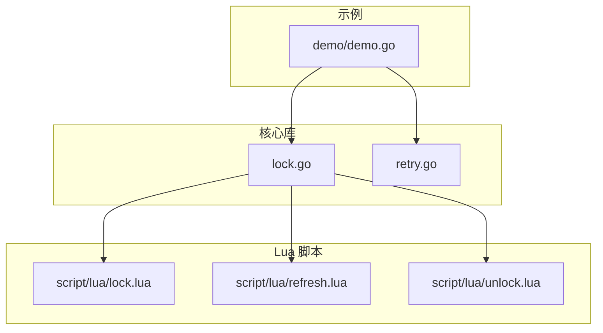
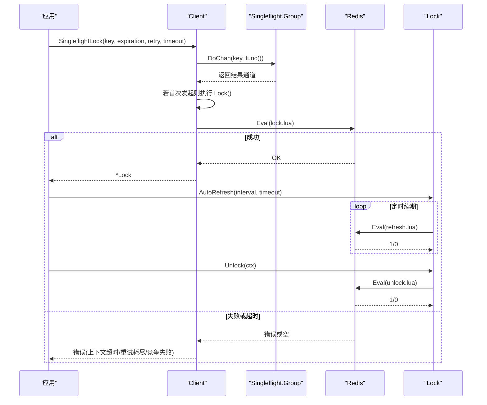
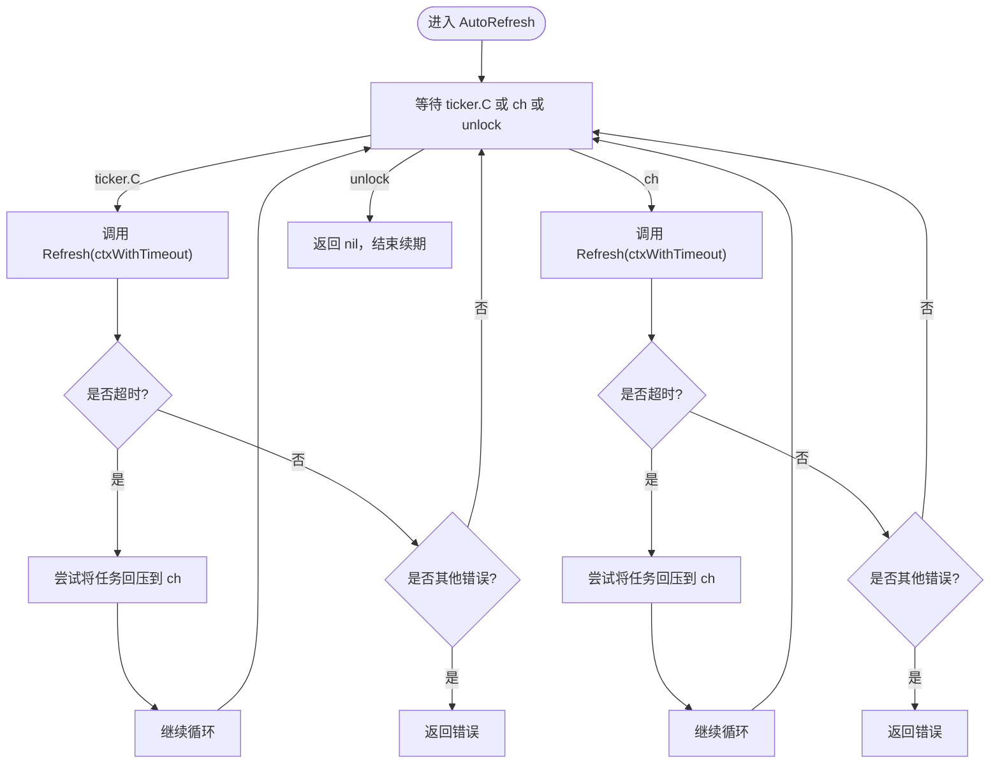
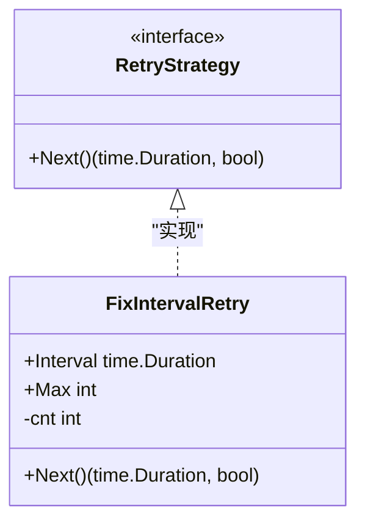
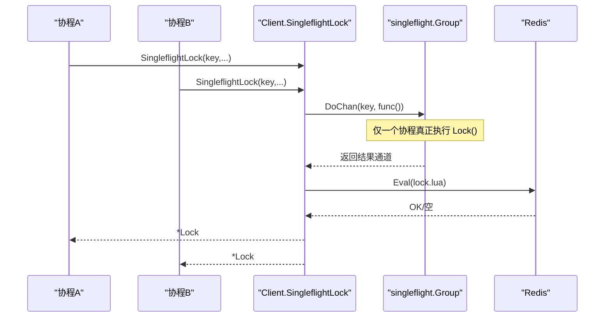
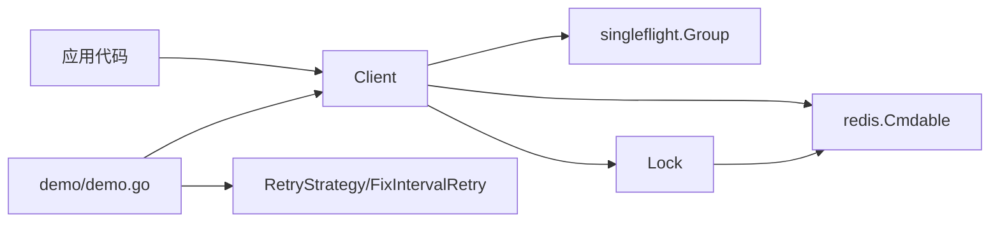

# 高级用法

<cite>
**本文引用的文件**   
- [README.md](file://README.md)
- [lock.go](file://lock.go)
- [retry.go](file://retry.go)
- [demo.go](file://demo/demo.go)
- [lock.lua](file://script/lua/lock.lua)
- [refresh.lua](file://script/lua/refresh.lua)
- [unlock.lua](file://script/lua/unlock.lua)
</cite>

## 目录
1. [简介](#简介)
2. [项目结构](#项目结构)
3. [核心组件](#核心组件)
4. [架构总览](#架构总览)
5. [详细组件分析](#详细组件分析)
6. [依赖关系分析](#依赖关系分析)
7. [性能与优化建议](#性能与优化建议)
8. [错误处理与监控日志最佳实践](#错误处理与监控日志最佳实践)
9. [故障排查指南](#故障排查指南)
10. [结论](#结论)

## 简介
本章节面向希望深入使用 redis-lock 库的高级用户，重点覆盖以下主题：
- 自动续期机制 AutoRefresh 的配置与长时间任务处理模式
- 自定义重试策略 RetryStrategy 的实现示例
- SingleflightLock 在高并发场景下的使用模式与性能优化
- 完整的错误处理最佳实践与监控日志记录示例

该库基于 Redis 实现分布式锁，要求 Redis >= v7、Go >= 18。仓库中的 demo 目录用于教学演示，实际可用代码位于根目录。

**章节来源**
- [README.md:1-13](file://README.md#L1-L13)

## 项目结构
本项目采用“核心库 + 脚本 + 示例”的组织方式：
- 核心库：lock.go（锁客户端与锁对象）、retry.go（重试策略接口与默认实现）
- Lua 脚本：lock.lua、refresh.lua、unlock.lua（原子加锁、刷新、解锁）
- 示例：demo/demo.go（教学用参考实现）

**图表来源**
- [lock.go:17-28](file://lock.go#L17-L28)
- [lock.go:30-44](file://lock.go#L30-L44)
- [retry.go:19-35](file://retry.go#L19-L35)
- [demo.go:19-40](file://demo/demo.go#L19-L40)

**章节来源**
- [lock.go:17-28](file://lock.go#L17-L28)
- [retry.go:19-35](file://retry.go#L19-L35)
- [demo.go:19-40](file://demo/demo.go#L19-L40)

## 核心组件
- Client：封装 Redis 连接、值生成器、Singleflight 分组，提供 Lock/TryLock/SingleflightLock 等方法
- Lock：表示已获取的锁，提供 Refresh/AutoRefresh/Unlock
- RetryStrategy：重试策略接口；FixIntervalRetry：固定间隔重试默认实现
- Lua 脚本：lock.lua（加锁/刷新）、refresh.lua（续期）、unlock.lua（解锁）

关键职责划分：
- Client 负责加锁流程、重试控制、并发合并（Singleflight）
- Lock 负责生命周期管理（续期、释放）
- Lua 脚本保证原子性与一致性

**章节来源**
- [lock.go:46-60](file://lock.go#L46-L60)
- [lock.go:151-168](file://lock.go#L151-L168)
- [retry.go:19-35](file://retry.go#L19-L35)
- [lock.lua:1-13](file://script/lua/lock.lua#L1-L13)
- [refresh.lua:1-6](file://script/lua/refresh.lua#L1-L6)
- [unlock.lua:1-6](file://script/lua/unlock.lua#L1-L6)

## 架构总览
下图展示了客户端调用到 Redis 的完整交互路径，包括加锁、续期、解锁以及 Singleflight 去重。

**图表来源**
- [lock.go:62-82](file://lock.go#L62-L82)
- [lock.go:94-134](file://lock.go#L94-L134)
- [lock.go:170-217](file://lock.go#L170-L217)
- [lock.go:219-251](file://lock.go#L219-L251)
- [lock.lua:1-13](file://script/lua/lock.lua#L1-L13)
- [refresh.lua:1-6](file://script/lua/refresh.lua#L1-L6)
- [unlock.lua:1-6](file://script/lua/unlock.lua#L1-L6)

## 详细组件分析

### 自动续期机制 AutoRefresh
AutoRefresh 用于在持有锁期间周期性刷新过期时间，避免长时间任务因锁过期被提前释放。其核心行为如下：
- 使用 ticker 周期触发续期
- 每次续期使用带超时的 context，防止阻塞主循环
- 对续期超时进行“回压”处理：将下一次续期请求重新入队，避免堆积
- 当收到解锁信号时立即停止续期

**图表来源**
- [lock.go:170-217](file://lock.go#L170-L217)
- [lock.go:219-229](file://lock.go#L219-L229)

配置与使用要点：
- interval：续期周期，建议小于锁过期时间的 1/3~1/2，留出网络抖动与 GC 停顿余量
- timeout：单次续期的超时，建议短于 interval，避免多次续期堆积
- 长时间任务处理模式：
  - 启动 AutoRefresh 后，在主 goroutine 中执行业务逻辑
  - 确保业务逻辑结束时调用 Unlock，以优雅停止 AutoRefresh
  - 若业务逻辑可能提前退出，务必使用 defer Unlock 保障资源释放

**章节来源**
- [lock.go:170-217](file://lock.go#L170-L217)
- [lock.go:219-229](file://lock.go#L219-L229)

### 自定义重试策略 RetryStrategy
RetryStrategy 定义了重试间隔与次数控制。默认实现 FixIntervalRetry 提供固定间隔与最大次数的重试。

**图表来源**
- [retry.go:19-35](file://retry.go#L19-L35)

自定义实现建议：
- 指数退避：Next 返回递增间隔，适合高竞争场景
- 自适应：根据最近一次加锁耗时动态调整间隔
- 熔断：连续失败达到阈值后快速失败，避免雪崩

使用位置：
- Client.Lock 内部通过 retry.Next() 决定下一次重试间隔与是否继续重试
- 当重试机会耗尽且最后一次为超时，会同时携带上下文超时语义

**章节来源**
- [retry.go:19-35](file://retry.go#L19-L35)
- [lock.go:94-134](file://lock.go#L94-L134)

### SingleflightLock 高并发使用模式
SingleflightLock 通过 singleflight.Group 对相同 key 的并发加锁请求进行合并，减少重复竞争与 Redis 压力。

**图表来源**
- [lock.go:62-82](file://lock.go#L62-L82)

性能优化建议：
- 合理设置 timeout：避免长尾请求拖垮整体吞吐
- 结合 RetryStrategy：在高竞争下使用指数退避降低风暴
- 控制并发度：上游限流，避免过多并发导致队列积压
- 监控指标：统计合并率、重试次数、超时比例、Redis 延迟

**章节来源**
- [lock.go:62-82](file://lock.go#L62-L82)

### Lua 脚本与原子性
- lock.lua：判断 key 是否存在或属于当前 value，支持加锁与刷新过期时间
- refresh.lua：校验 value 并刷新过期时间
- unlock.lua：校验 value 并删除 key

这些脚本保证了加锁、续期、解锁的原子性，避免竞态条件。

**章节来源**
- [lock.lua:1-13](file://script/lua/lock.lua#L1-L13)
- [refresh.lua:1-6](file://script/lua/refresh.lua#L1-L6)
- [unlock.lua:1-6](file://script/lua/unlock.lua#L1-L6)

## 依赖关系分析
- Client 依赖 redis.Cmdable 与 singleflight.Group
- Lock 依赖 redis.Cmdable 与 Lua 脚本
- Demo 示例复用核心库的 RetryStrategy 与 Client/Lock

**图表来源**
- [lock.go:17-28](file://lock.go#L17-L28)
- [lock.go:46-60](file://lock.go#L46-L60)
- [retry.go:19-35](file://retry.go#L19-L35)
- [demo.go:19-40](file://demo/demo.go#L19-L40)

**章节来源**
- [lock.go:17-28](file://lock.go#L17-L28)
- [retry.go:19-35](file://retry.go#L19-L35)
- [demo.go:19-40](file://demo/demo.go#L19-L40)

## 性能与优化建议
- 续期参数调优
  - interval 应明显小于锁过期时间，建议 1/3~1/2
  - timeout 应小于 interval，避免续期堆积
- 重试策略选择
  - 低竞争：固定间隔即可
  - 高竞争：指数退避 + 上限保护
- Singleflight 使用
  - 对热点 key 强烈建议使用 SingleflightLock
  - 配合上游限流，避免大量并发涌入
- Redis 侧
  - 关注 Redis 延迟与慢查询日志
  - 合理设置 Redis 内存与持久化策略，避免抖动

[本节为通用指导，不直接分析具体文件]

## 错误处理与监控日志最佳实践
错误分类与处理建议：
- 上下文超时 context.DeadlineExceeded
  - 表示整体加锁或续期超时，需区分“最终未成功”和“不确定状态”
  - 对于 Lock 调用，若最终错误包含上下文超时，不能假定锁一定未获取
- 竞争失败 ErrFailedToPreemptLock
  - 表示超过重试次数仍未获得锁，可降级或走旁路逻辑
- 未持有锁 ErrLockNotHold
  - 出现在续期或解锁时，说明锁已被他人释放或绕过 rlock 直接操作 Redis
  - 应记录告警并检查是否有外部修改
- Redis 通信错误
  - 非超时错误通常不可恢复，应立即上报并快速失败

监控指标建议：
- 加锁成功率、重试次数分布、超时比例
- 续期成功率、续期失败原因分布
- Singleflight 合并率、平均等待时间
- Redis 命令延迟、错误率

日志记录建议：
- 记录 key、value、expiration、interval、timeout、重试次数、错误类型
- 对异常路径（如 ErrLockNotHold）输出告警级别日志
- 对高频路径（如正常续期）使用采样日志，避免日志风暴

**章节来源**
- [lock.go:39-44](file://lock.go#L39-L44)
- [lock.go:84-93](file://lock.go#L84-L93)
- [lock.go:114-122](file://lock.go#L114-L122)
- [lock.go:219-229](file://lock.go#L219-L229)
- [lock.go:231-251](file://lock.go#L231-L251)

## 故障排查指南
常见问题与定位步骤：
- 现象：AutoRefresh 频繁报超时
  - 检查 Redis 延迟与网络抖动
  - 缩短 timeout 或增大 interval，观察是否缓解
  - 查看是否出现续期堆积（ch 回压）
- 现象：解锁报未持有锁
  - 检查是否有外部进程直接操作 Redis
  - 核对 value 是否一致，确认是否误用不同实例的锁
- 现象：加锁一直失败
  - 检查 RetryStrategy 的最大次数与间隔是否合理
  - 观察 Singleflight 合并是否生效，避免重复竞争
  - 查看 Redis 中对应 key 的状态与 TTL

**章节来源**
- [lock.go:170-217](file://lock.go#L170-L217)
- [lock.go:219-251](file://lock.go#L219-L251)
- [lock.go:94-134](file://lock.go#L94-L134)

## 结论
通过 AutoRefresh 的合理配置、自定义 RetryStrategy 的灵活实现、SingleflightLock 的高并发合并能力，以及完善的错误处理与监控日志体系，可以在生产环境中稳定地使用该分布式锁库完成长时间任务与高竞争场景下的资源协调。建议在上线前充分压测续期与加锁路径，并结合业务特征调优参数与监控告警。

[本节为总结性内容，不直接分析具体文件]