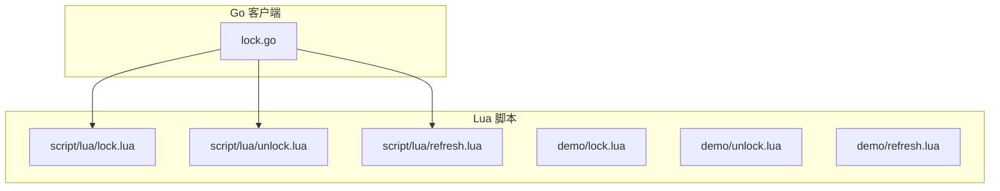
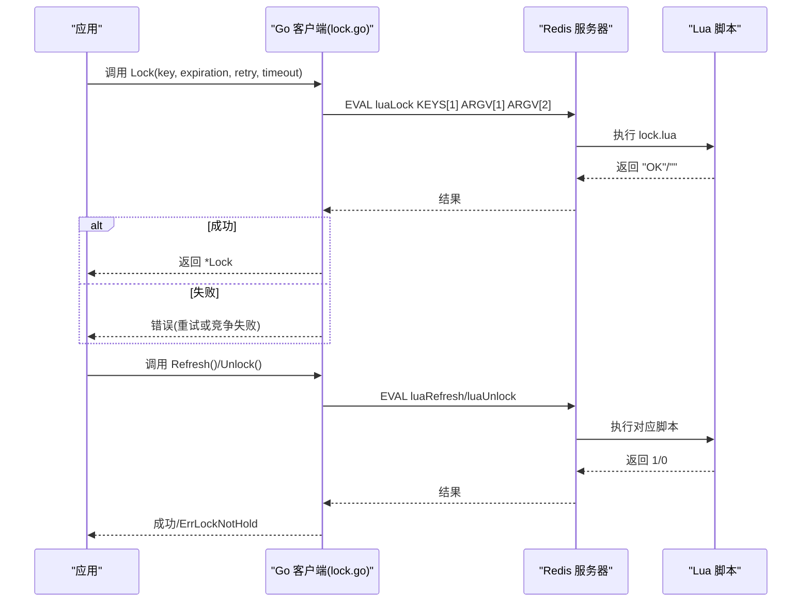
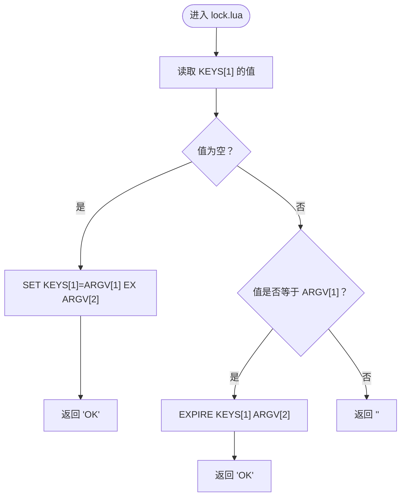
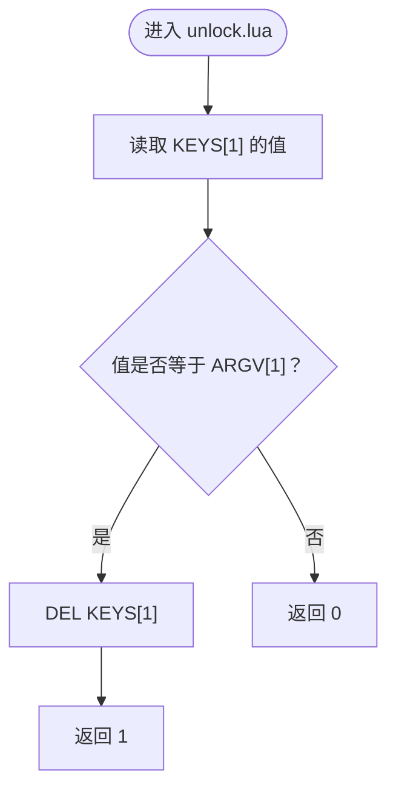
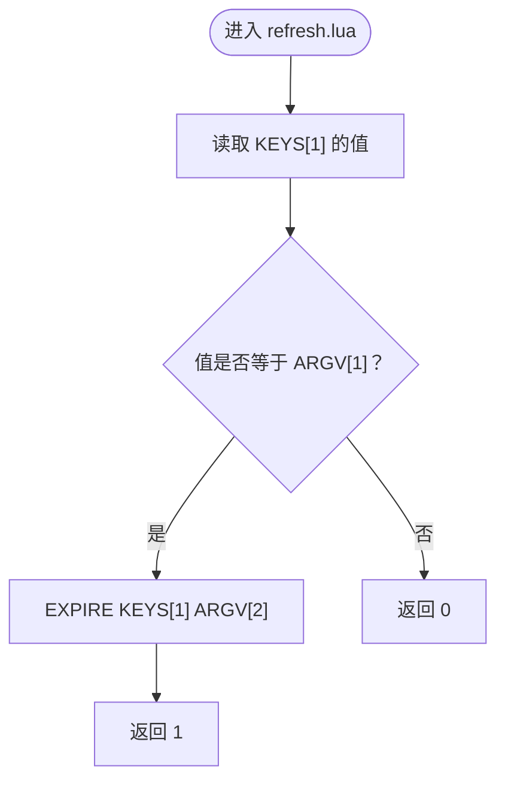
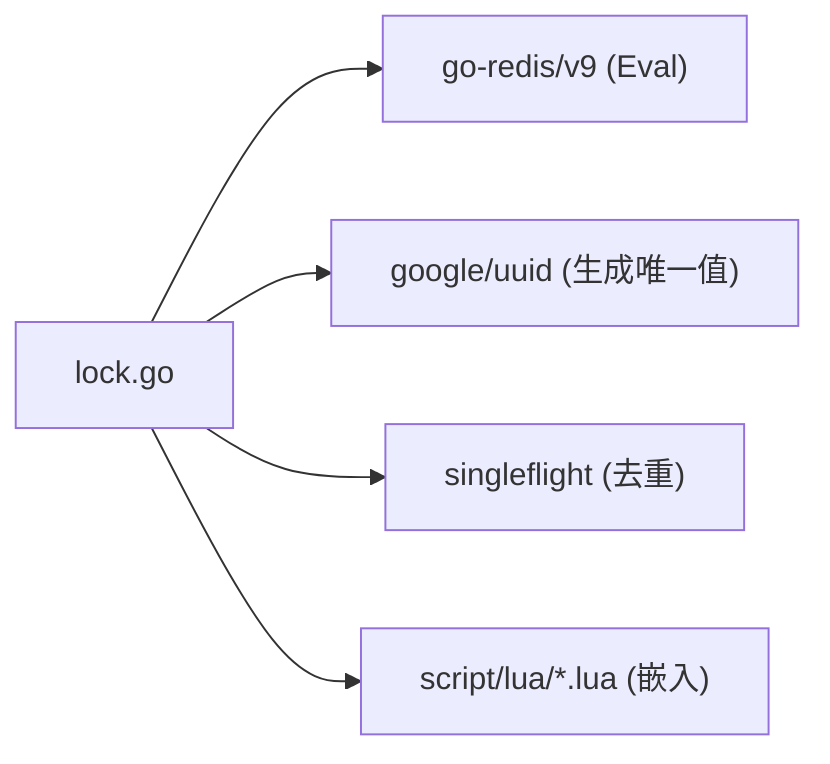

# Lua 脚本实现

<cite>
**本文引用的文件**   
- [lock.lua](file://script/lua/lock.lua)
- [unlock.lua](file://script/lua/unlock.lua)
- [refresh.lua](file://script/lua/refresh.lua)
- [demo/lock.lua](file://demo/lock.lua)
- [demo/unlock.lua](file://demo/unlock.lua)
- [demo/refresh.lua](file://demo/refresh.lua)
- [lock.go](file://lock.go)
- [README.md](file://README.md)
</cite>

## 目录
1. [简介](#简介)
2. [项目结构](#项目结构)
3. [核心组件](#核心组件)
4. [架构总览](#架构总览)
5. [详细组件分析](#详细组件分析)
6. [依赖关系分析](#依赖关系分析)
7. [性能与一致性考量](#性能与一致性考量)
8. [故障排查指南](#故障排查指南)
9. [结论](#结论)

## 简介
本文件聚焦于 Redis 分布式锁的 Lua 脚本实现，围绕以下三个脚本展开：
- lock.lua：分布式锁获取与续期（在持有者身份匹配时刷新过期时间）
- unlock.lua：安全解锁（仅当锁值匹配时才删除 key）
- refresh.lua：续期（仅当锁值匹配时才延长过期时间）

同时结合 Go 侧客户端调用逻辑，解释为何使用 Lua 脚本而非多个独立 Redis 命令，以及这种方式如何保证原子性与一致性。

## 项目结构
仓库中与 Lua 脚本相关的核心位置如下：
- script/lua：生产可用的 Lua 脚本集合
- demo：课程演示用脚本（包含不同实现风格，便于对比学习）
- lock.go：Go 客户端封装，负责嵌入并执行 Lua 脚本、重试策略、自动续期等

图表来源
- [lock.go:30-37](file://lock.go#L30-L37)
- [lock.lua:1-13](file://script/lua/lock.lua#L1-L13)
- [unlock.lua:1-6](file://script/lua/unlock.lua#L1-L6)
- [refresh.lua:1-6](file://script/lua/refresh.lua#L1-L6)

章节来源
- [README.md:1-13](file://README.md#L1-L13)

## 核心组件
- Lua 脚本层
  - lock.lua：尝试设置键值对并附带过期时间；若已存在且值匹配则刷新过期时间；否则返回空字符串表示竞争失败。
  - unlock.lua：先读取当前值并与传入标识比较，相等则删除 key，否则返回 0。
  - refresh.lua：先读取当前值并与传入标识比较，相等则设置新的过期时间，否则返回 0。
- Go 客户端层
  - 通过 go-redis 的 Eval 执行 Lua 脚本，将 key 和 value、过期时间作为参数传递。
  - 提供带重试的 Lock、TryLock、Refresh、Unlock 等方法，并支持自动续期。

章节来源
- [lock.lua:1-13](file://script/lua/lock.lua#L1-L13)
- [unlock.lua:1-6](file://script/lua/unlock.lua#L1-L6)
- [refresh.lua:1-6](file://script/lua/refresh.lua#L1-L6)
- [lock.go:94-149](file://lock.go#L94-L149)
- [lock.go:219-251](file://lock.go#L219-L251)

## 架构总览
下图展示了 Go 客户端与 Redis 之间通过 Lua 脚本交互的整体流程。

图表来源
- [lock.go:94-149](file://lock.go#L94-L149)
- [lock.go:219-251](file://lock.go#L219-L251)
- [lock.lua:1-13](file://script/lua/lock.lua#L1-L13)
- [unlock.lua:1-6](file://script/lua/unlock.lua#L1-L6)
- [refresh.lua:1-6](file://script/lua/refresh.lua#L1-L6)

## 详细组件分析

### lock.lua：分布式锁获取与续期
- 输入参数
  - KEYS[1]：锁的键名
  - ARGV[1]：锁的唯一标识（由 Go 客户端生成）
  - ARGV[2]：过期时间（秒）
- 返回值
  - "OK"：加锁成功，或为持有者刷新过期时间成功
  - ""：锁已被其他持有者占用，竞争失败
- 处理逻辑
  - 若 key 不存在：设置 key=ARGV[1]，并设置过期时间为 ARGV[2]
  - 若 key 存在且值等于 ARGV[1]：说明当前调用方是锁的真正持有者，刷新过期时间为 ARGV[2]
  - 否则：返回空字符串，表示锁被他人持有
- 原子性说明
  - 整个判断与写入/更新过程在一个 Lua 脚本中执行，Redis 单线程执行 Lua 脚本，保证该段逻辑的原子性，避免“检查-设置”之间的竞态条件。

图表来源
- [lock.lua:1-13](file://script/lua/lock.lua#L1-L13)

章节来源
- [lock.lua:1-13](file://script/lua/lock.lua#L1-L13)
- [lock.go:94-149](file://lock.go#L94-L149)

### unlock.lua：安全解锁机制
- 输入参数
  - KEYS[1]：锁的键名
  - ARGV[1]：锁的唯一标识（必须与当前值一致才可解锁）
- 返回值
  - 1：成功删除 key（解锁成功）
  - 0：key 不存在或值不匹配（解锁失败）
- 安全要点
  - 先 get 再 del 在同一脚本内完成，确保只有真正的锁持有者才能解锁，防止误解锁或并发下的“删错 key”。

图表来源
- [unlock.lua:1-6](file://script/lua/unlock.lua#L1-L6)

章节来源
- [unlock.lua:1-6](file://script/lua/unlock.lua#L1-L6)
- [lock.go:231-251](file://lock.go#L231-L251)

### refresh.lua：续期逻辑
- 输入参数
  - KEYS[1]：锁的键名
  - ARGV[1]：锁的唯一标识
  - ARGV[2]：新的过期时间（秒）
- 返回值
  - 1：成功设置过期时间（续期成功）
  - 0：key 不存在或值不匹配（续期失败）
- 安全要点
  - 仅在值匹配时设置过期时间，确保只有锁的真正持有者可以续期，避免其他进程误续期。

图表来源
- [refresh.lua:1-6](file://script/lua/refresh.lua#L1-L6)

章节来源
- [refresh.lua:1-6](file://script/lua/refresh.lua#L1-L6)
- [lock.go:219-229](file://lock.go#L219-L229)

### 为什么使用 Lua 脚本而不是多个 Redis 命令
- 原子性与一致性
  - Redis 在执行 Lua 脚本时是单线程串行执行的，脚本内的多条命令不会被其他命令插入，从而保证“读-判-写”的原子性。
  - 如果使用多个独立命令（如 GET -> SETNX -> EXPIRE），中间可能被其他客户端操作打断，导致状态不一致。
- 减少网络往返
  - 一次 EVAL 即可执行多步逻辑，降低网络开销与延迟抖动的影响。
- 可移植性与可测试性
  - 业务逻辑下沉到 Redis 服务端，客户端只需传参，减少客户端分支复杂度。

章节来源
- [lock.go:94-149](file://lock.go#L94-L149)
- [lock.go:219-251](file://lock.go#L219-L251)

### 与 demo 脚本的差异说明
- demo/lock.lua
  - 采用“先判断后分支”的方式：如果值匹配则 pexpire，否则 set NX PX。
  - 与 script/lua/lock.lua 的区别在于：demo 版本未处理“已存在但值不匹配”的情况，语义上更偏向“要么续期，要么加锁”，而生产版明确区分了“加锁成功”“续期成功”“竞争失败”。
- demo/unlock.lua / demo/refresh.lua
  - 与生产版逻辑基本一致，均基于“值匹配才操作”的安全模式。

章节来源
- [demo/lock.lua:1-8](file://demo/lock.lua#L1-L8)
- [demo/unlock.lua:1-8](file://demo/unlock.lua#L1-L8)
- [demo/refresh.lua:1-8](file://demo/refresh.lua#L1-L8)

## 依赖关系分析
- Go 客户端通过 embed 将 Lua 脚本打包进二进制，并在运行时通过 redis.Cmdable.Eval 执行。
- 关键依赖
  - go-redis/v9：提供 Eval 接口
  - google/uuid：生成锁的唯一标识
  - golang.org/x/sync/singleflight：合并重复请求，减少并发竞争时的重复计算

图表来源
- [lock.go:17-28](file://lock.go#L17-L28)
- [lock.go:30-37](file://lock.go#L30-L37)

章节来源
- [lock.go:17-28](file://lock.go#L17-L28)
- [lock.go:30-37](file://lock.go#L30-L37)

## 性能与一致性考量
- 原子性保障
  - 所有“读-判-写”逻辑均在 Lua 脚本内完成，避免跨命令竞态。
- 超时与重试
  - Go 客户端对 Lock 提供整体超时与重试策略，避免因短暂拥塞导致的加锁失败。
- 自动续期
  - 提供 AutoRefresh 后台协程周期性调用 Refresh，确保长时间任务不会因过期而被中断。
- 资源释放
  - Unlock 使用 sync.Once 确保只发送一次信号，避免重复关闭 channel 引发 panic。

章节来源
- [lock.go:62-134](file://lock.go#L62-L134)
- [lock.go:170-217](file://lock.go#L170-L217)
- [lock.go:231-251](file://lock.go#L231-L251)

## 故障排查指南
- 常见错误
  - ErrFailedToPreemptLock：超过重试次数仍未获得锁，通常表示锁长期被其他客户端持有。
  - ErrLockNotHold：尝试解锁或续期时发现当前客户端并非锁的真正持有者，可能原因包括：
    - 锁已过期并被其他客户端重新获取
    - 绕过 rlock 直接操作 Redis
- 诊断建议
  - 检查 Redis 中对应 key 是否存在及其值是否与本地生成的唯一标识一致
  - 确认是否启用了自动续期，且续期间隔小于锁过期时间
  - 观察网络异常与 Redis 连接问题，必要时调整重试策略与超时配置

章节来源
- [lock.go:39-44](file://lock.go#L39-L44)
- [lock.go:219-251](file://lock.go#L219-L251)

## 结论
通过将分布式锁的核心逻辑下沉至 Lua 脚本，本项目在保证原子性与一致性的前提下，提供了简洁可靠的加锁、解锁与续期能力。Go 客户端在此基础上实现了重试、自动续期与安全的错误处理，适合在高并发场景下稳定运行。对于需要更高灵活性的场景，可参考 demo 中的脚本思路进行扩展，但应始终遵循“值匹配才操作”的安全原则。