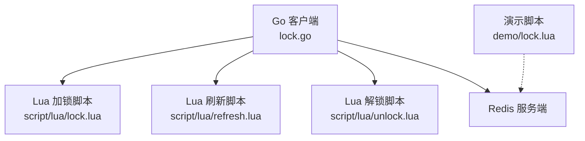
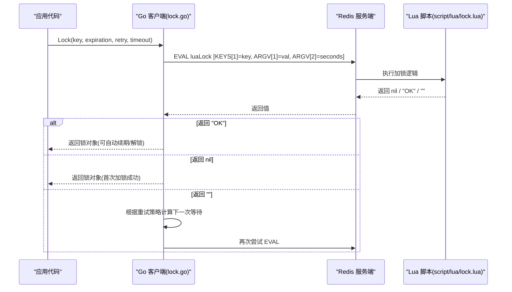
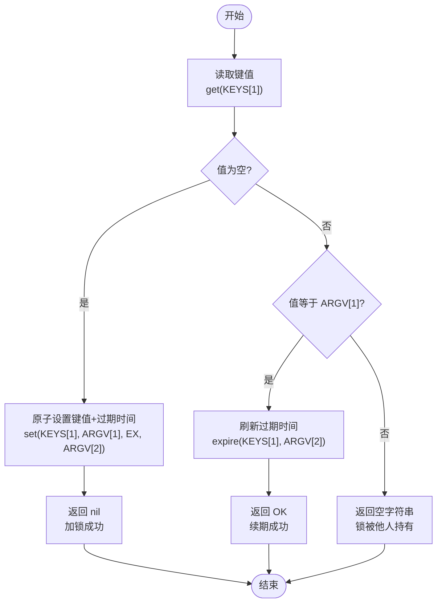
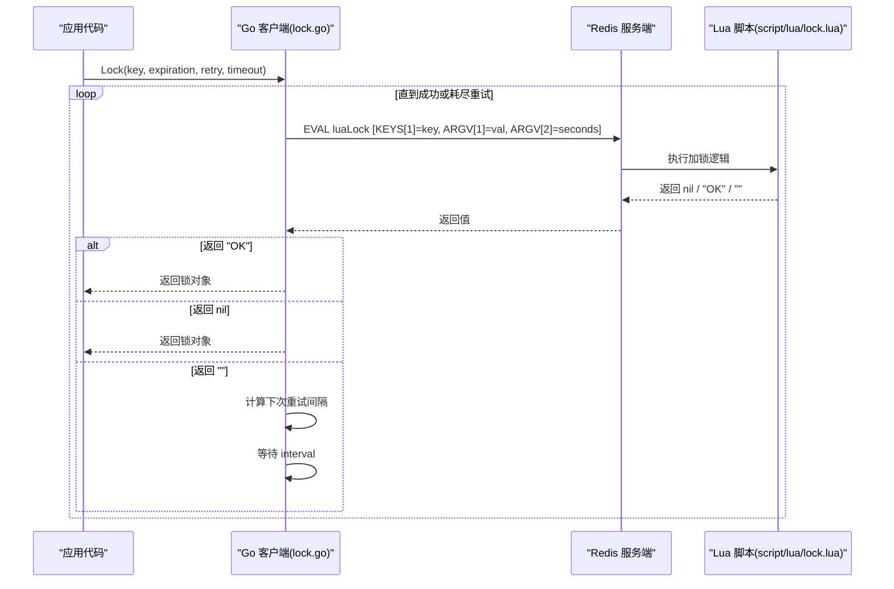
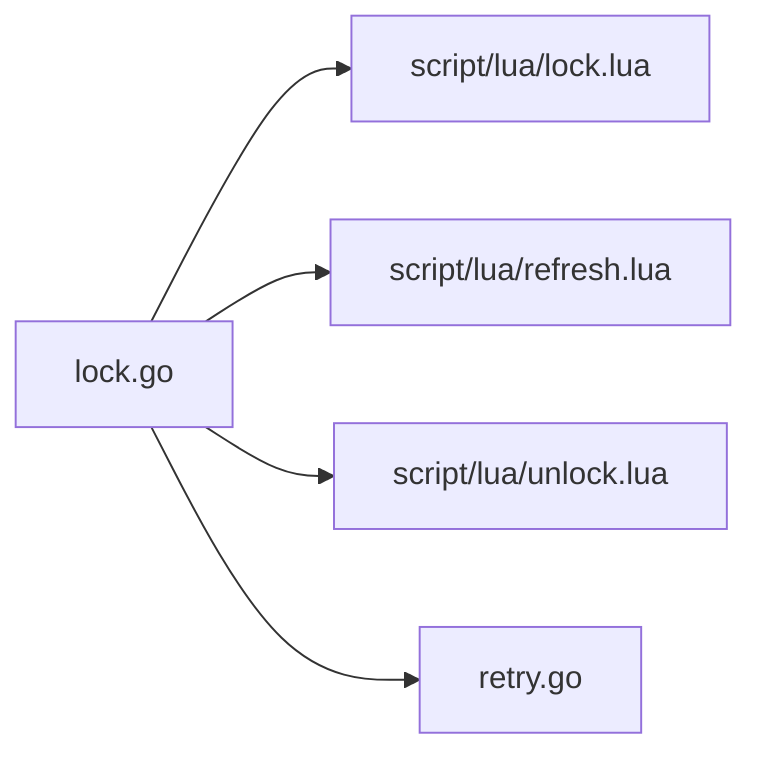

# lock.lua 加锁脚本

<cite>
**本文引用的文件**   
- [script/lua/lock.lua](file://script/lua/lock.lua)
- [demo/lock.lua](file://demo/lock.lua)
- [lock.go](file://lock.go)
- [retry.go](file://retry.go)
- [README.md](file://README.md)
</cite>

## 目录
1. [简介](#简介)
2. [项目结构](#项目结构)
3. [核心组件](#核心组件)
4. [架构总览](#架构总览)
5. [详细组件分析](#详细组件分析)
6. [依赖关系分析](#依赖关系分析)
7. [性能与可靠性考虑](#性能与可靠性考虑)
8. [故障排查指南](#故障排查指南)
9. [结论](#结论)
10. [附录：调用示例与流程图](#附录调用示例与流程图)

## 简介
本文件针对分布式锁的 Lua 脚本 lock.lua 进行技术文档化，重点解析以下要点：
- KEYS[1]、ARGV[1]、ARGV[2] 参数的语义与作用
- get 命令检查键是否存在、SETNX 原子性保证、EX/PX 过期时间设置机制
- 三种返回值的含义：nil（成功加锁）、"OK"（刷新过期时间）、空字符串（锁被其他客户端持有）
- 重试场景下的逻辑处理，以及如何判断上一次是否加锁成功
- 结合 Go 客户端调用流程，给出具体调用示例与执行流程图

## 项目结构
仓库中与分布式锁相关的核心文件如下：
- script/lua/lock.lua：生产可用的加锁脚本（使用 EX 过期时间）
- demo/lock.lua：教学演示脚本（使用 PX 毫秒级过期时间）
- lock.go：Go 客户端封装，负责生成唯一值、调用 Lua 脚本、重试与自动续期
- retry.go：重试策略接口与固定间隔重试实现
- README.md：项目说明与版本要求



图表来源
- [lock.go:30-38](file://lock.go#L30-L38)
- [script/lua/lock.lua:1-13](file://script/lua/lock.lua#L1-L13)
- [demo/lock.lua:1-8](file://demo/lock.lua#L1-L8)

章节来源
- [README.md:1-13](file://README.md#L1-L13)

## 核心组件
- Lua 加锁脚本（script/lua/lock.lua）
  - 通过 get 读取键值，判断是否已存在
  - 若不存在则用 SET ... EX 原子设置键与过期时间
  - 若值等于当前客户端标识则刷新过期时间并返回 "OK"
  - 否则返回空字符串表示锁被他人持有
- Go 客户端（lock.go）
  - 生成唯一值作为锁标识
  - 调用 Redis EVAL 执行 Lua 脚本
  - 根据返回值决定加锁成功或继续重试
  - 提供 TryLock、SingleflightLock、Refresh、Unlock 等能力
- 重试策略（retry.go）
  - 定义 Next() 接口，支持固定间隔重试

章节来源
- [script/lua/lock.lua:1-13](file://script/lua/lock.lua#L1-L13)
- [lock.go:94-134](file://lock.go#L94-L134)
- [retry.go:19-35](file://retry.go#L19-L35)

## 架构总览
下图展示了 Go 客户端与 Redis 之间通过 Lua 脚本完成分布式锁获取的整体交互。



图表来源
- [lock.go:94-134](file://lock.go#L94-L134)
- [script/lua/lock.lua:1-13](file://script/lua/lock.lua#L1-L13)

## 详细组件分析

### Lua 加锁脚本（script/lua/lock.lua）
该脚本是分布式锁的核心实现，采用“先读后写”的策略，并通过原子操作保证一致性。

- 参数说明
  - KEYS[1]：锁的键名，由调用方传入
  - ARGV[1]：锁的值，即客户端唯一标识（例如 UUID），用于校验所有权
  - ARGV[2]：过期时间（秒），用于设置键的生存周期

- 关键步骤
  - 第一步：get KEYS[1]
    - 如果返回 false（键不存在），进入“加锁分支”
    - 如果返回非 false，进入“已有值分支”，比较是否与 ARGV[1] 相等
  - 第二步：加锁分支
    - 使用 set KEYS[1] ARGV[1] EX ARGV[2] 原子设置键、值和过期时间
    - 返回 nil 表示加锁成功
  - 第三步：已有值分支
    - 如果 val == ARGV[1]，说明当前客户端持有锁，调用 expire KEYS[1] ARGV[2] 刷新过期时间，并返回 "OK"
    - 否则，返回空字符串 ""，表示锁被其他客户端持有

- 返回值语义
  - nil：加锁成功（首次获得锁）
  - "OK"：刷新过期时间成功（续期）
  - ""：锁已被其他客户端持有（竞争失败）

- 原子性与一致性
  - get + set/expire 在 Lua 脚本中顺序执行，Redis 单线程执行 Lua 脚本，保证中间状态不会被其他客户端观察到
  - 通过 ARGV[1] 校验所有权，避免误删他人持有的锁



图表来源
- [script/lua/lock.lua:1-13](file://script/lua/lock.lua#L1-L13)

章节来源
- [script/lua/lock.lua:1-13](file://script/lua/lock.lua#L1-L13)

### 对比：演示脚本（demo/lock.lua）
演示脚本与生产脚本思路一致，但细节不同：
- 使用 pexpire 和 PX 毫秒级过期时间
- 使用 NX 条件设置键（仅当键不存在时设置）
- 返回值语义与生产脚本略有差异（pexpire/set 的原生返回值）

注意：在生产环境中建议使用 script/lua/lock.lua，其语义更清晰且与 Go 客户端约定一致。

章节来源
- [demo/lock.lua:1-8](file://demo/lock.lua#L1-L8)

### Go 客户端调用流程（lock.go）
- 生成唯一值：客户端生成一个唯一标识（如 UUID），作为 ARGV[1]
- 调用 EVAL：将 KEYS[1]=key、ARGV[1]=val、ARGV[2]=expiration.Seconds 传给 Lua 脚本
- 处理返回值：
  - "OK"：视为续期成功，返回锁对象
  - nil：首次加锁成功，返回锁对象
  - ""：竞争失败，按重试策略继续尝试
- 超时与错误：
  - 网络或服务器异常直接返回错误
  - 上下文超时会中断重试循环



图表来源
- [lock.go:94-134](file://lock.go#L94-L134)
- [script/lua/lock.lua:1-13](file://script/lua/lock.lua#L1-L13)

章节来源
- [lock.go:94-134](file://lock.go#L94-L134)

### 重试策略（retry.go）
- RetryStrategy 接口定义了 Next() 方法，返回下一次重试的间隔以及是否继续重试
- FixIntervalRetry 提供固定间隔重试实现，支持最大重试次数控制

章节来源
- [retry.go:19-35](file://retry.go#L19-L35)

## 依赖关系分析
- lock.go 通过 go:embed 嵌入 script/lua/*.lua 脚本，并在运行时通过 redis.Cmdable.EVAL 执行
- lock.go 依赖 retry.go 的重试策略接口以控制重试行为
- 所有 Lua 脚本在 Redis 端原子执行，避免竞态条件



图表来源
- [lock.go:30-38](file://lock.go#L30-L38)
- [retry.go:19-35](file://retry.go#L19-L35)

章节来源
- [lock.go:30-38](file://lock.go#L30-L38)
- [retry.go:19-35](file://retry.go#L19-L35)

## 性能与可靠性考虑
- 原子性保障
  - Lua 脚本在 Redis 单线程模型下顺序执行，确保 get 与 set/expire 之间的状态不会被其他客户端干扰
- 过期时间管理
  - 生产脚本使用 EX（秒）；演示脚本使用 PX（毫秒）与 NX 条件设置
  - 建议业务侧合理设置过期时间，避免锁过早失效
- 重试与退避
  - 通过 RetryStrategy 控制重试频率与次数，避免雪崩式重试
- 所有权校验
  - 通过 ARGV[1] 唯一标识校验，防止误删他人持有的锁

[本节为通用指导，不直接分析具体文件]

## 故障排查指南
- 常见问题
  - 锁未释放：检查 Unlock 是否正确调用，确认解锁脚本返回值是否为预期
  - 锁提前过期：检查过期时间设置是否过短，或是否忘记续期
  - 重复加锁：确认客户端是否使用了相同的唯一值，避免覆盖他人锁
- 诊断建议
  - 观察 Lua 脚本返回值："OK" 表示续期成功，"" 表示竞争失败，nil 表示首次加锁成功
  - 检查 Redis 键是否存在及 TTL 变化，确认过期时间是否按预期刷新

章节来源
- [lock.go:219-250](file://lock.go#L219-L250)
- [script/lua/lock.lua:1-13](file://script/lua/lock.lua#L1-L13)

## 结论
lock.lua 通过“先读后写”的 Lua 脚本实现了可靠的分布式锁获取与续期逻辑。配合 Go 客户端的重试策略与唯一值校验，能够在高并发环境下安全地协调多个客户端对共享资源的访问。生产环境推荐使用 script/lua/lock.lua，并结合合理的过期时间与重试策略，以获得更好的稳定性与性能。

[本节为总结性内容，不直接分析具体文件]

## 附录：调用示例与流程图

### 调用示例（概念性描述）
- 初始化客户端：创建 Redis 连接并实例化 rlock.Client
- 加锁：调用 Lock(key, expiration, retry, timeout)，传入锁键名、过期时间、重试策略与整体超时
- 续期：在业务执行期间定期调用 Refresh() 延长锁的有效期
- 解锁：业务完成后调用 Unlock() 释放锁

章节来源
- [lock.go:94-134](file://lock.go#L94-L134)
- [lock.go:219-250](file://lock.go#L219-L250)

### 执行流程图（加锁与续期）
```mermaid
flowchart TD
S["开始"] --> A["生成唯一值 val"]
A --> B["EVAL luaLock<br/>KEYS[1]=key<br/>ARGV[1]=val<br/>ARGV[2]=seconds"]
B --> C{"返回值"}
C --> |"nil"| D["加锁成功"]
C --> |"OK"| E["续期成功"]
C --> |""| F["竞争失败"]
F --> G["根据重试策略等待 interval"]
G --> B
D --> H["返回锁对象"]
E --> H
H --> I["业务执行"]
I --> J["定时 Refresh() 续期"]
J --> K["Unlock() 释放锁"]
```

图表来源
- [lock.go:94-134](file://lock.go#L94-L134)
- [script/lua/lock.lua:1-13](file://script/lua/lock.lua#L1-L13)