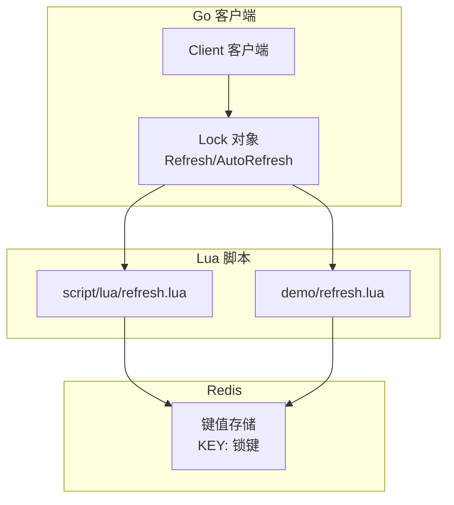
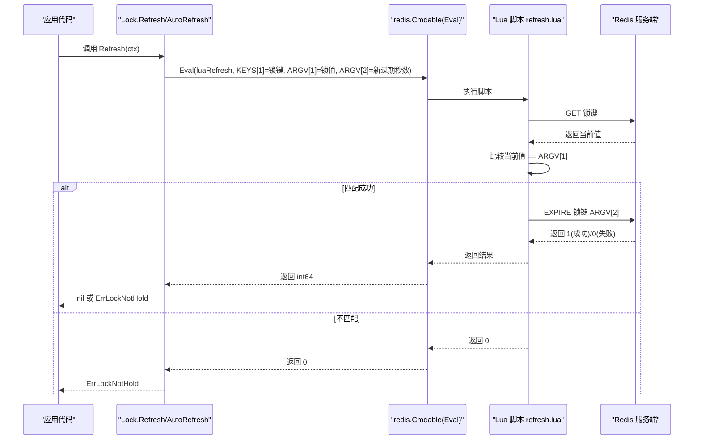
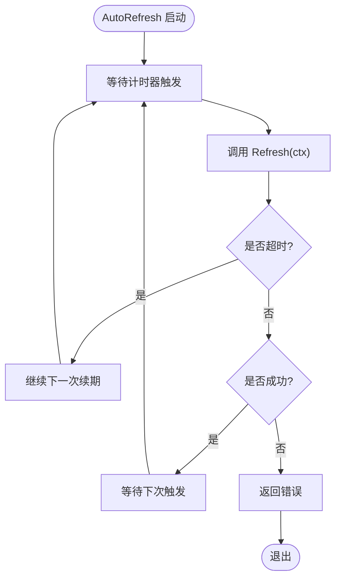
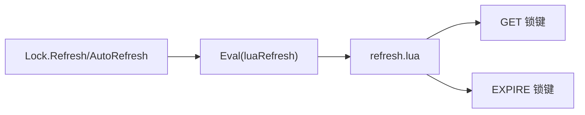
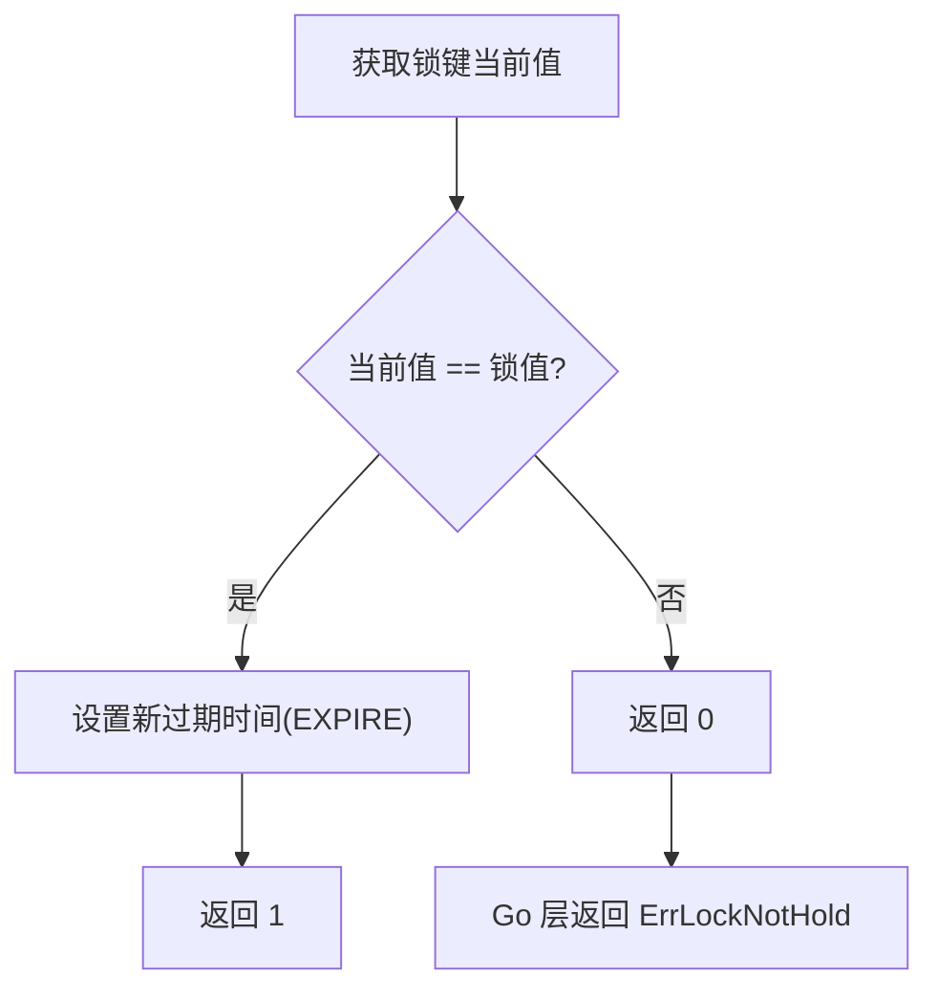

# refresh.lua 续期脚本

<cite>
**本文引用的文件**   
- [script/lua/refresh.lua](file://script/lua/refresh.lua)
- [demo/refresh.lua](file://demo/refresh.lua)
- [lock.go](file://lock.go)
- [lock_test.go](file://lock_test.go)
- [lock_e2e_test.go](file://lock_e2e_test.go)
</cite>

## 目录
1. [简介](#简介)
2. [项目结构](#项目结构)
3. [核心组件](#核心组件)
4. [架构总览](#架构总览)
5. [详细组件分析](#详细组件分析)
6. [依赖关系分析](#依赖关系分析)
7. [性能与可靠性考虑](#性能与可靠性考虑)
8. [故障排查指南](#故障排查指南)
9. [结论](#结论)
10. [附录：参数、返回值与最佳实践](#附录参数返回值与最佳实践)

## 简介
本文件围绕分布式锁的“续期”能力，聚焦于 Lua 脚本 refresh.lua 及其在 Go 客户端中的集成方式。文档将深入解析：
- 如何通过 Redis 的 expire 命令延长锁的有效期
- 续期操作的安全性保证（仅锁的真正持有者可续期）
- 自动续期的工作原理（定时器触发时机、续期间隔策略）
- 续期失败的可能原因与处理方式
- 参数说明、返回值含义与执行流程
- 自动续期的配置示例与最佳实践

## 项目结构
本项目采用“Lua 脚本 + Go 客户端封装”的方式实现分布式锁。与续期相关的核心文件包括：
- script/lua/refresh.lua：生产级续期脚本
- demo/refresh.lua：演示用续期脚本（使用 pexpire）
- lock.go：Go 客户端对续期 API 的封装与自动续期调度
- lock_test.go / lock_e2e_test.go：单元测试与端到端测试用例

图表来源
- [lock.go:170-229](file://lock.go#L170-L229)
- [script/lua/refresh.lua:1-6](file://script/lua/refresh.lua#L1-L6)
- [demo/refresh.lua:1-8](file://demo/refresh.lua#L1-L8)

章节来源
- [lock.go:170-229](file://lock.go#L170-L229)
- [script/lua/refresh.lua:1-6](file://script/lua/refresh.lua#L1-L6)
- [demo/refresh.lua:1-8](file://demo/refresh.lua#L1-L8)

## 核心组件
- Lock.Refresh(ctx)：单次续期调用，内部通过 Eval 执行 Lua 脚本，校验锁归属并尝试延长过期时间。
- Lock.AutoRefresh(interval, timeout)：后台定时任务，周期性调用 Refresh，直到解锁或出错。
- script/lua/refresh.lua：原子性检查+续期逻辑，确保只有锁的真正持有者才能续期。
- demo/refresh.lua：演示脚本，使用 pexpire（毫秒级过期），便于理解续期语义。

章节来源
- [lock.go:170-229](file://lock.go#L170-L229)
- [script/lua/refresh.lua:1-6](file://script/lua/refresh.lua#L1-L6)
- [demo/refresh.lua:1-8](file://demo/refresh.lua#L1-L8)

## 架构总览
下图展示了从 Go 客户端到 Redis 的续期调用链，以及 Lua 脚本如何保证原子性与安全性。

图表来源
- [lock.go:219-229](file://lock.go#L219-L229)
- [script/lua/refresh.lua:1-6](file://script/lua/refresh.lua#L1-L6)

## 详细组件分析

### Lua 续期脚本：script/lua/refresh.lua
该脚本实现了“先校验、后续期”的原子操作：
- 输入参数
  - KEYS[1]：锁键
  - ARGV[1]：锁值（由客户端生成，用于身份校验）
  - ARGV[2]：新的过期时间（单位：秒）
- 处理逻辑
  - 读取锁键当前值并与 ARGV[1] 比较
  - 若相等，则对锁键设置新的过期时间（expire）
  - 否则返回 0，表示未持有锁或键不存在
- 返回值
  - 1：成功续期
  - 0：未持有锁或键不存在

安全要点
- 通过“值比对 + 续期”在同一 Lua 事务中完成，避免竞态条件
- 只有锁值完全匹配的客户端才能续期，防止误续他人锁

章节来源
- [script/lua/refresh.lua:1-6](file://script/lua/refresh.lua#L1-L6)

### 演示脚本：demo/refresh.lua
- 与生产脚本类似，但使用 pexpire（毫秒级过期）
- 适合演示和教学场景，帮助理解续期语义

章节来源
- [demo/refresh.lua:1-8](file://demo/refresh.lua#L1-L8)

### Go 客户端封装：Lock.Refresh 与 AutoRefresh
- Refresh(ctx)
  - 调用 Eval 执行 Lua 脚本
  - 传入参数：锁键、锁值、过期秒数
  - 若返回非 1，则返回 ErrLockNotHold
  - 网络错误直接透传
- AutoRefresh(interval, timeout)
  - 使用 time.Ticker 周期性触发续期
  - 每次续期使用 context.WithTimeout(timeout) 控制单次续期超时
  - 当续期超时（context.DeadlineExceeded）时，继续重试，避免漏掉一次续期
  - 收到解锁信号时停止循环

图表来源
- [lock.go:170-217](file://lock.go#L170-L217)

章节来源
- [lock.go:170-229](file://lock.go#L170-L229)

## 依赖关系分析
- Go 层通过 redis.Cmdable.Eval 执行 Lua 脚本
- Lua 脚本依赖 Redis 的 GET 与 EXPIRE 命令
- 自动续期依赖 Go 标准库 time.Ticker 与 context 超时机制

图表来源
- [lock.go:219-229](file://lock.go#L219-L229)
- [script/lua/refresh.lua:1-6](file://script/lua/refresh.lua#L1-L6)

章节来源
- [lock.go:219-229](file://lock.go#L219-L229)
- [script/lua/refresh.lua:1-6](file://script/lua/refresh.lua#L1-L6)

## 性能与可靠性考虑
- 原子性
  - 校验与续期在 Lua 中一次性执行，避免并发竞争导致误续
- 幂等性
  - 多次续期不会造成副作用，只要锁值不变即可重复续期
- 超时处理
  - AutoRefresh 对单次续期设置超时，避免阻塞；超时情况下继续重试，提高鲁棒性
- 资源释放
  - AutoRefresh 会在解锁或错误时停止 ticker 并关闭通道，避免 goroutine 泄漏

章节来源
- [lock.go:170-217](file://lock.go#L170-L217)
- [lock.go:219-229](file://lock.go#L219-L229)

## 故障排查指南
常见续期失败原因及处理建议：
- 未持有锁（ERR_LOCK_NOT_HOLD）
  - 现象：Lua 返回 0，Go 层返回 ErrLockNotHold
  - 可能原因：锁已过期或被其他客户端覆盖；业务提前释放了锁
  - 处理：记录日志，终止后续业务逻辑，必要时告警
- Redis 不可用或网络异常
  - 现象：Eval 返回网络错误
  - 处理：根据错误类型决定是否重试；对于不可恢复错误应快速失败
- 续期超时
  - 现象：context.DeadlineExceeded
  - 处理：AutoRefresh 会忽略超时并继续下一次续期；业务侧需判断是否可容忍短暂续期延迟

章节来源
- [lock.go:219-229](file://lock.go#L219-L229)
- [lock_test.go:475-541](file://lock_test.go#L475-L541)

## 结论
refresh.lua 通过“值校验 + 续期”的原子操作，确保了分布式锁续期的安全性与正确性。Go 客户端在此基础上提供了简洁的 Refresh 接口与自动续期机制 AutoRefresh，帮助开发者以最小成本支撑长时间运行的任务，避免因锁提前过期导致的并发问题。合理设置续期间隔与超时，并结合错误处理与监控告警，可在高可用场景中稳定运行。

## 附录：参数、返回值与最佳实践

### 参数说明
- KEYS[1]：锁键
- ARGV[1]：锁值（客户端生成，唯一标识锁持有者）
- ARGV[2]：新的过期时间（单位：秒）

### 返回值含义
- 1：续期成功
- 0：未持有锁或键不存在
- 非 1：Go 层返回 ErrLockNotHold

### 执行流程

图表来源
- [script/lua/refresh.lua:1-6](file://script/lua/refresh.lua#L1-L6)

### 自动续期配置示例与最佳实践
- 续期间隔 interval
  - 建议设置为锁过期时间的 1/3 ~ 1/2，预留足够余量应对 GC 停顿、调度抖动
- 单次续期超时 timeout
  - 建议略大于网络往返 RTT，避免频繁重试放大负载
- 错误处理
  - 区分上下文超时与业务错误；对不可恢复错误尽快失败
- 监控与告警
  - 统计续期失败率、超时次数；出现异常及时告警
- 与解锁配合
  - 确保 AutoRefresh 在 Unlock 后停止；避免解锁后仍尝试续期

章节来源
- [lock.go:170-217](file://lock.go#L170-L217)
- [lock_test.go:367-473](file://lock_test.go#L367-L473)
- [lock_e2e_test.go:222-231](file://lock_e2e_test.go#L222-L231)