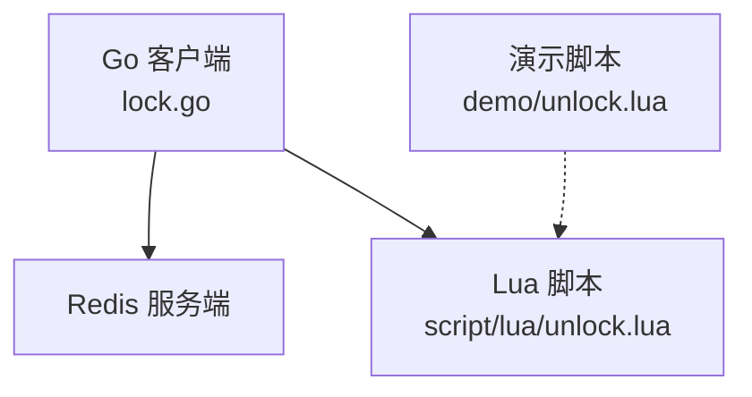
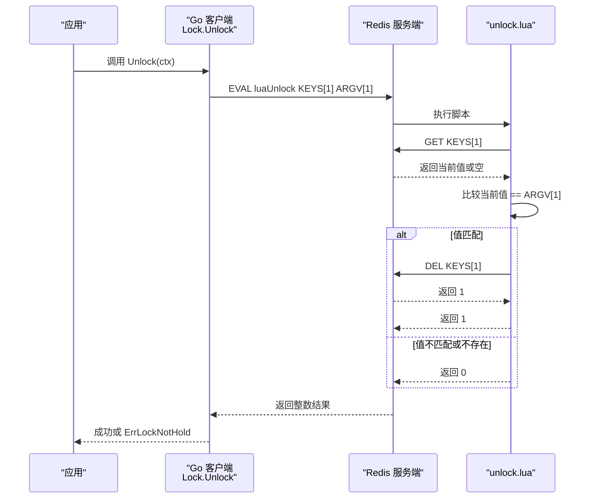
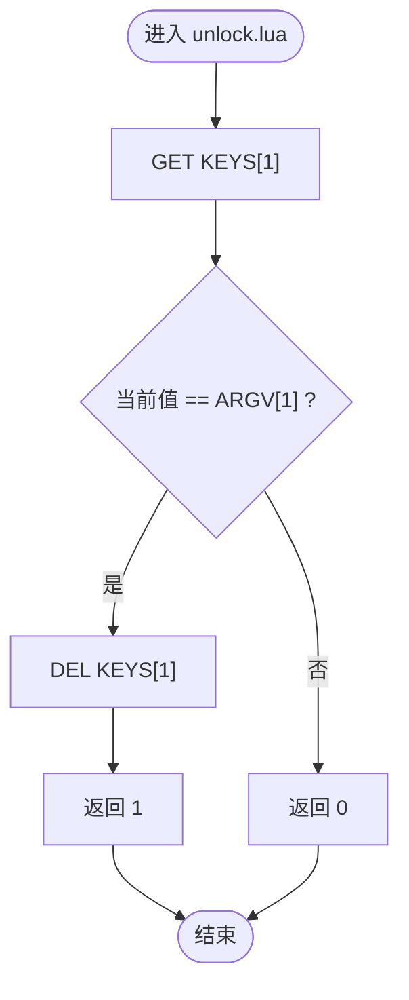
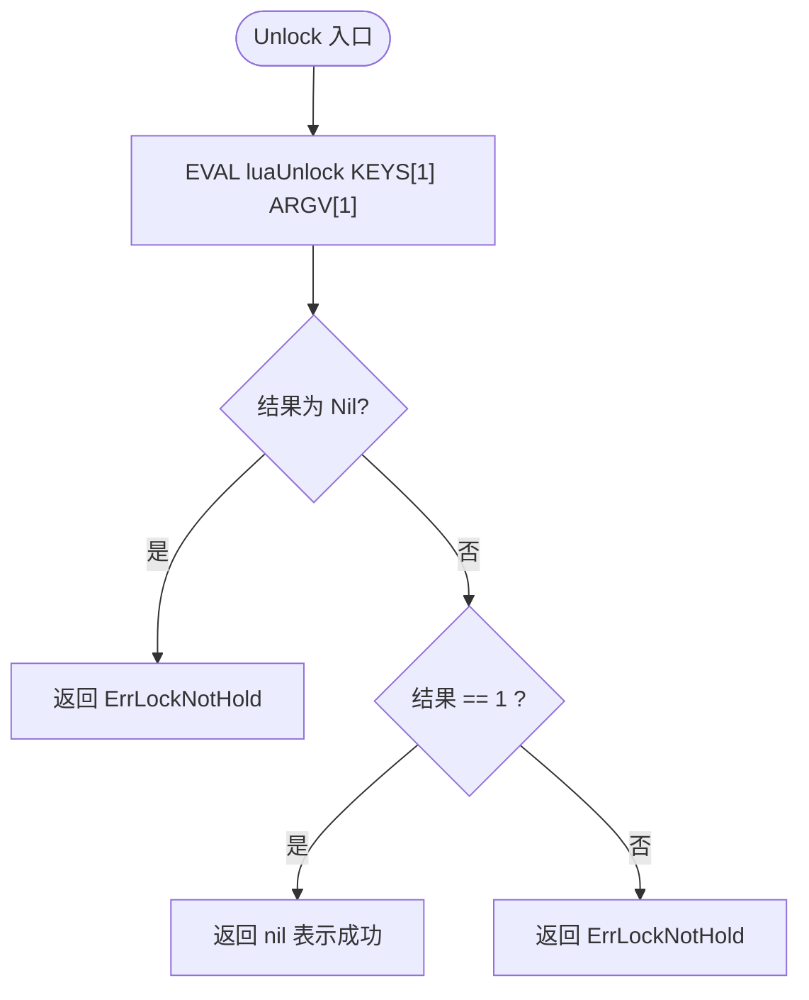
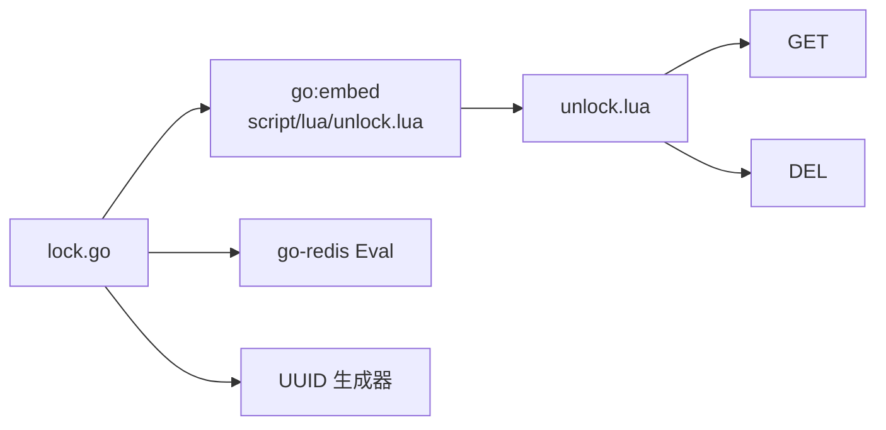

# unlock.lua 解锁脚本

<cite>
**本文引用的文件**   
- [demo/unlock.lua](file://demo/unlock.lua)
- [script/lua/unlock.lua](file://script/lua/unlock.lua)
- [lock.go](file://lock.go)
- [README.md](file://README.md)
</cite>

## 目录
1. [简介](#简介)
2. [项目结构](#项目结构)
3. [核心组件](#核心组件)
4. [架构总览](#架构总览)
5. [详细组件分析](#详细组件分析)
6. [依赖关系分析](#依赖关系分析)
7. [性能与并发特性](#性能与并发特性)
8. [故障排查指南](#故障排查指南)
9. [结论](#结论)
10. [附录：参数、返回值与错误处理](#附录参数返回值与错误处理)

## 简介
本文件为分布式锁的解锁脚本 unlock.lua 的技术文档。重点说明如何通过“值比较 + 原子删除”的方式，确保只有锁的真正持有者才能释放锁，从而避免误删其他客户端持有的锁。文档还涵盖 DEL 命令的使用条件与执行流程、并发安全性保证、参数与返回值含义、错误处理逻辑以及最佳实践示例路径。

## 项目结构
本项目包含两套 unlock.lua：
- demo/unlock.lua：教学演示版本，注释更丰富，便于理解思路。
- script/lua/unlock.lua：实际嵌入 Go 代码并使用的生产版本，更为精简。

Go 侧通过 go:embed 将 script/lua/unlock.lua 编译进二进制，并在 Lock.Unlock 中调用该脚本完成解锁。

图表来源
- [lock.go:30-37](file://lock.go#L30-L37)
- [script/lua/unlock.lua:1-6](file://script/lua/unlock.lua#L1-L6)
- [demo/unlock.lua:1-8](file://demo/unlock.lua#L1-L8)

章节来源
- [README.md:1-13](file://README.md#L1-L13)
- [lock.go:30-37](file://lock.go#L30-L37)

## 核心组件
- Lua 解锁脚本（unlock.lua）：在 Redis 端原子地执行“取值比较 + 条件删除”，保证只有锁值匹配时才删除键。
- Go 客户端封装（lock.go）：负责生成唯一锁值、调用 Lua 脚本、解析返回值并映射为业务错误。

章节来源
- [script/lua/unlock.lua:1-6](file://script/lua/unlock.lua#L1-L6)
- [demo/unlock.lua:1-8](file://demo/unlock.lua#L1-L8)
- [lock.go:231-251](file://lock.go#L231-L251)

## 架构总览
下图展示从 Go 客户端到 Redis 的解锁调用链，强调 Lua 脚本在 Redis 端的原子性保障。

图表来源
- [lock.go:231-251](file://lock.go#L231-L251)
- [script/lua/unlock.lua:1-6](file://script/lua/unlock.lua#L1-L6)

## 详细组件分析

### unlock.lua 脚本机制
- 输入
  - KEYS[1]：要解锁的键名。
  - ARGV[1]：期望的锁值（即加锁时写入的唯一标识）。
- 执行流程
  1) 读取 KEYS[1] 的当前值。
  2) 与 ARGV[1] 进行严格相等比较。
  3) 若相等，则执行 DEL KEYS[1]；否则直接返回 0。
- 关键要点
  - 比较与删除在同一 Lua 脚本内原子执行，避免竞态条件。
  - 仅当锁值完全一致才允许删除，防止误删其他客户端的锁。

图表来源
- [script/lua/unlock.lua:1-6](file://script/lua/unlock.lua#L1-L6)
- [demo/unlock.lua:1-8](file://demo/unlock.lua#L1-L8)

章节来源
- [script/lua/unlock.lua:1-6](file://script/lua/unlock.lua#L1-L6)
- [demo/unlock.lua:1-8](file://demo/unlock.lua#L1-L8)

### Go 侧调用与错误处理
- 调用方式
  - 使用 client.Eval 执行 luaUnlock，传入 KEYS[1]=l.key 与 ARGV[1]=l.value。
- 返回值处理
  - 若 Redis 返回 redis.Nil（键不存在），映射为 ErrLockNotHold。
  - 若返回非 1 的整数，也视为未持有锁，返回 ErrLockNotHold。
  - 其他网络/超时等错误按原样向上抛出。
- 防重复解锁
  - 使用 sync.Once 关闭内部 channel，避免多次 Unlock 导致 panic。

图表来源
- [lock.go:231-251](file://lock.go#L231-L251)

章节来源
- [lock.go:231-251](file://lock.go#L231-L251)

### 为什么需要身份验证机制
- 多客户端竞争同一资源时，若不加校验直接 DEL，可能导致 A 客户端释放了 B 客户端的锁，引发数据不一致。
- 通过“唯一值 + 原子比较+删除”，确保只有真正持有锁的客户端才能释放锁，即使发生过期重入、网络抖动或并发竞争也能保持正确性。

章节来源
- [lock.go:40-44](file://lock.go#L40-L44)
- [script/lua/unlock.lua:1-6](file://script/lua/unlock.lua#L1-L6)

### 并发环境下的安全性保证
- 原子性：Lua 脚本在 Redis 单线程模型下顺序执行，GET 与 DEL 之间不会被其他命令插入。
- 唯一性：每个锁持有者拥有唯一的 value（由 UUID 生成），不同客户端不会互相干扰。
- 幂等性：重复解锁会返回 0 或触发 ErrLockNotHold，不会造成副作用。

章节来源
- [lock.go:53-60](file://lock.go#L53-L60)
- [script/lua/unlock.lua:1-6](file://script/lua/unlock.lua#L1-L6)

## 依赖关系分析
- Go 层依赖
  - 通过 go:embed 将 script/lua/unlock.lua 编译进二进制。
  - 使用 github.com/redis/go-redis/v9 的 Eval 接口执行 Lua。
  - 使用 google/uuid 生成唯一锁值。
- Lua 层依赖
  - 仅依赖 Redis 内置命令 GET 与 DEL。

图表来源
- [lock.go:17-28](file://lock.go#L17-L28)
- [lock.go:30-37](file://lock.go#L30-L37)
- [script/lua/unlock.lua:1-6](file://script/lua/unlock.lua#L1-L6)

章节来源
- [lock.go:17-28](file://lock.go#L17-L28)
- [lock.go:30-37](file://lock.go#L30-L37)

## 性能与并发特性
- 性能
  - 单次 EVAL 包含一次 GET 和可能的 DEL，整体为 O(1)。
  - 由于 Lua 在 Redis 单线程执行，避免了额外同步开销。
- 并发
  - 高并发场景下，多个客户端同时尝试解锁同一 key，只有值匹配的请求能成功删除，其余返回 0。
  - 建议结合重试策略与超时控制，避免长时间阻塞。

章节来源
- [script/lua/unlock.lua:1-6](file://script/lua/unlock.lua#L1-L6)
- [lock.go:231-251](file://lock.go#L231-L251)

## 故障排查指南
- 常见现象
  - 解锁失败并返回 ErrLockNotHold：可能原因包括锁已过期被他人重新获取、锁值不一致、键不存在、或有人绕过 rlock 直接操作 Redis。
- 定位步骤
  1) 确认加锁时生成的 value 是否正确传递到解锁脚本。
  2) 检查 Redis 中对应 key 的当前值是否与预期一致。
  3) 查看是否有外部进程直接修改或删除了该 key。
  4) 观察是否出现重复解锁导致的 ErrLockNotHold。
- 修复建议
  - 确保所有解锁都通过 Lock.Unlock 进行，不要直接 DEL。
  - 合理设置锁过期时间，避免长事务导致锁提前过期。
  - 对网络异常与超时进行重试与降级处理。

章节来源
- [lock.go:40-44](file://lock.go#L40-L44)
- [lock.go:231-251](file://lock.go#L231-L251)

## 结论
unlock.lua 通过“值比较 + 原子删除”的机制，确保了分布式锁释放的正确性与安全性。配合 Go 层的错误映射与防重复解锁保护，能够在高并发环境下稳定工作。开发者应始终通过 API 提供的 Unlock 方法释放锁，避免直接操作 Redis，以保证一致性。

## 附录：参数、返回值与错误处理

- 参数说明
  - KEYS[1]：待解锁的键名。
  - ARGV[1]：期望的锁值（必须与加锁时写入的值完全一致）。

- 返回值含义
  - 1：成功删除键，表示解锁成功。
  - 0：键不存在或值不匹配，表示解锁失败。

- 错误处理逻辑（Go 侧）
  - redis.Nil：映射为 ErrLockNotHold。
  - 非 1 的整数：映射为 ErrLockNotHold。
  - 其他错误：原样返回（如网络、超时等）。

- 使用示例与最佳实践
  - 参考路径：[lock.go:231-251](file://lock.go#L231-L251)
  - 最佳实践
    - 始终使用 Lock.Unlock 释放锁，不要直接 DEL。
    - 确保加锁与解锁使用相同的 value。
    - 对解锁失败进行适当重试或告警，但避免无限重试。
    - 合理设置锁过期时间，避免长任务导致锁提前过期。
    - 避免在业务逻辑中直接操作 Redis 中的锁键，以免破坏一致性。

章节来源
- [script/lua/unlock.lua:1-6](file://script/lua/unlock.lua#L1-L6)
- [demo/unlock.lua:1-8](file://demo/unlock.lua#L1-L8)
- [lock.go:231-251](file://lock.go#L231-L251)