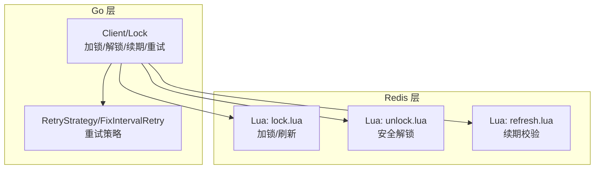
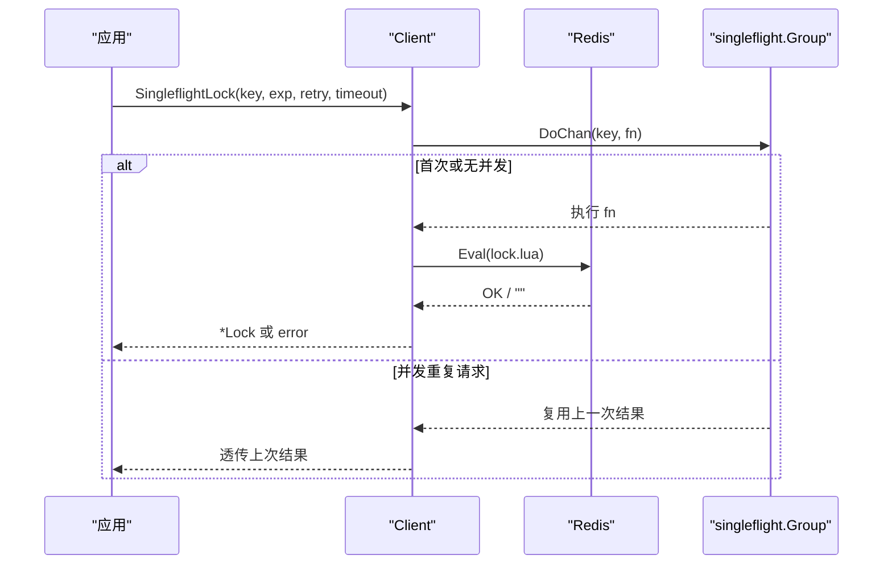
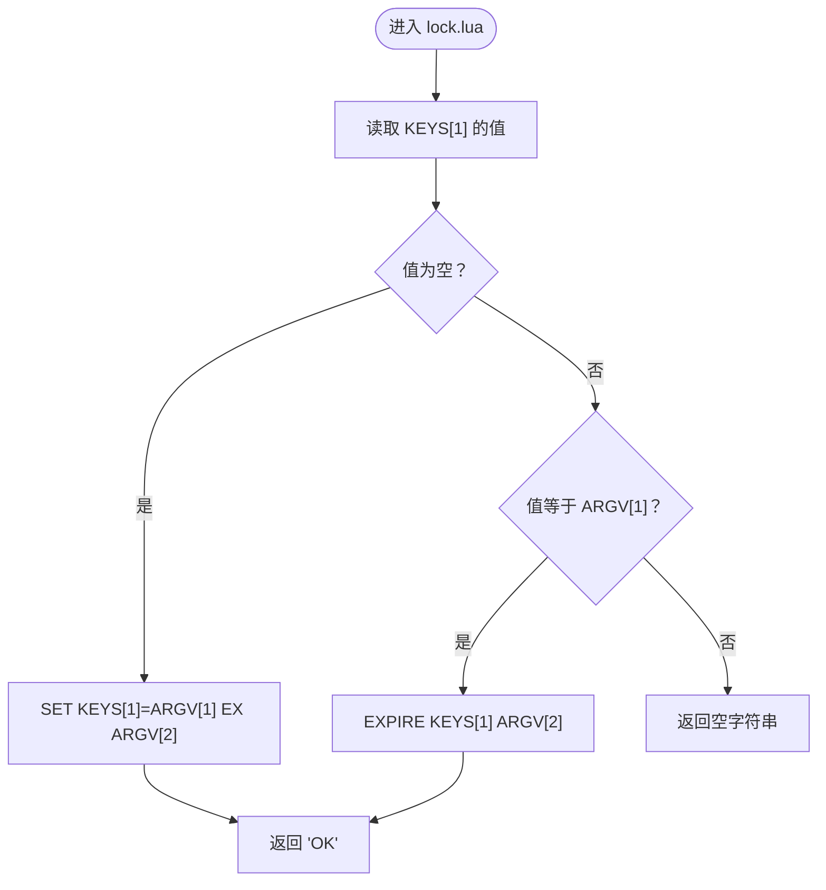
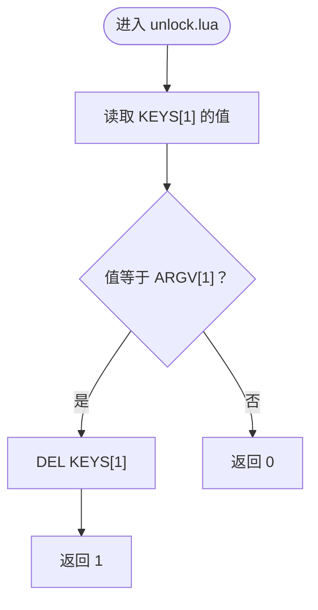
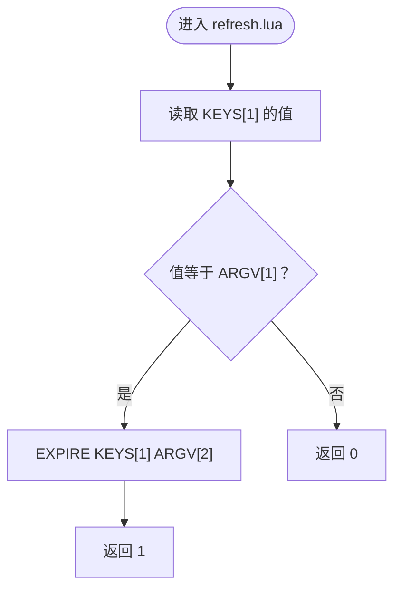
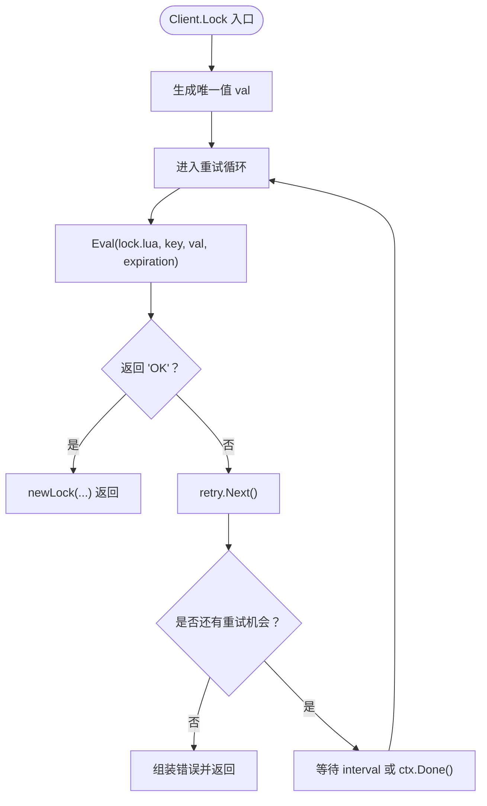
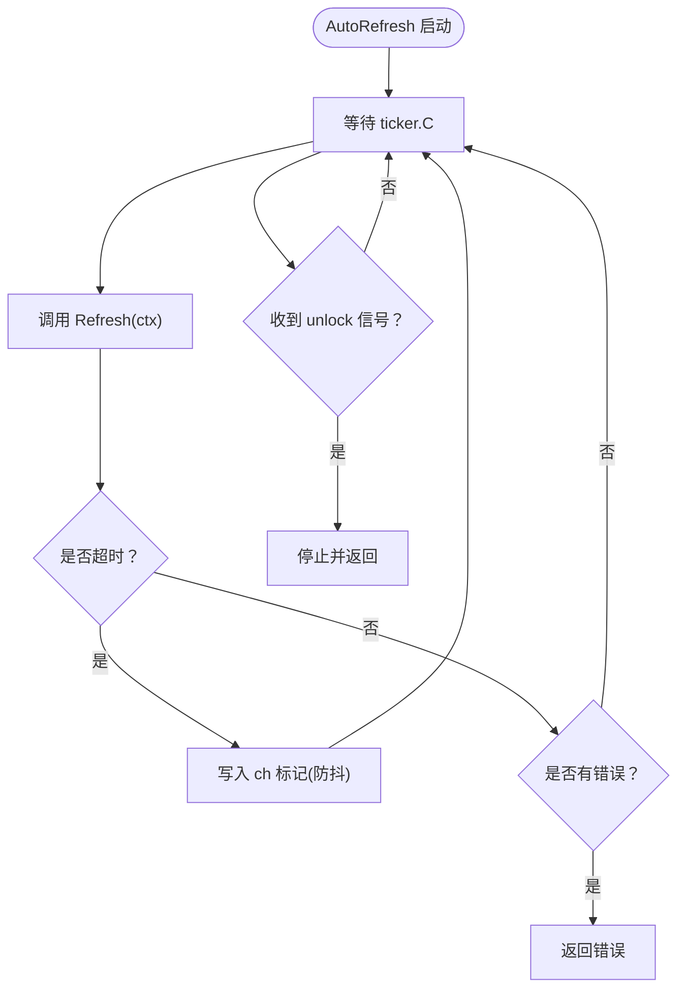
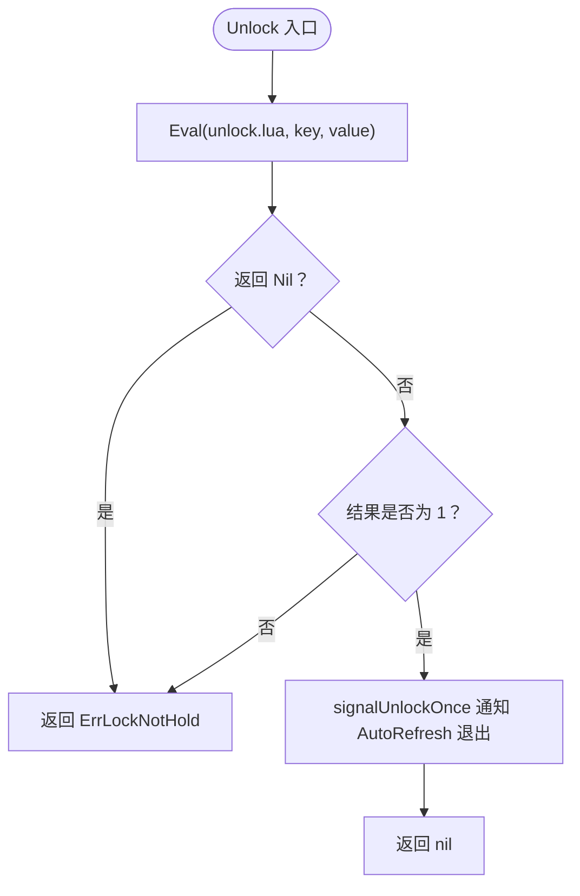
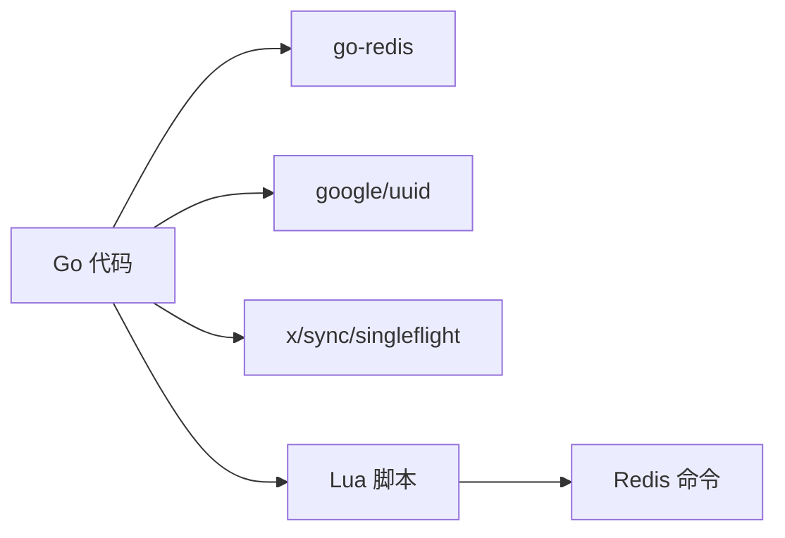

# 实现细节

<cite>
**本文引用的文件**   
- [lock.go](file://lock.go)
- [retry.go](file://retry.go)
- [script/lua/lock.lua](file://script/lua/lock.lua)
- [script/lua/unlock.lua](file://script/lua/unlock.lua)
- [script/lua/refresh.lua](file://script/lua/refresh.lua)
- [README.md](file://README.md)
</cite>

## 目录
1. [简介](#简介)
2. [项目结构](#项目结构)
3. [核心组件](#核心组件)
4. [架构总览](#架构总览)
5. [详细组件分析](#详细组件分析)
6. [依赖关系分析](#依赖关系分析)
7. [性能与内存优化建议](#性能与内存优化建议)
8. [故障排查指南](#故障排查指南)
9. [结论](#结论)

## 简介
本项目是一个基于 Redis 的分布式锁库，提供加锁、解锁、续期、重试以及 singleflight 去重等能力。其核心思想是：通过 Lua 脚本在 Redis 侧原子地完成“判断持有者 + 设置/刷新过期时间”的操作，从而避免竞态条件；Go 层负责重试策略、超时控制、自动续期以及并发安全封装。

## 项目结构
仓库采用按职责划分的扁平结构：
- Go 层核心逻辑集中在 lock.go（客户端、锁对象、重试循环、singleflight）和 retry.go（重试策略接口与固定间隔实现）。
- Lua 脚本位于 script/lua 目录，分别实现加锁、解锁、续期的原子操作。
- README 说明运行环境与版本要求。

图表来源
- [lock.go:46-168](file://lock.go#L46-L168)
- [retry.go:19-35](file://retry.go#L19-L35)
- [script/lua/lock.lua:1-13](file://script/lua/lock.lua#L1-L13)
- [script/lua/unlock.lua:1-6](file://script/lua/unlock.lua#L1-L6)
- [script/lua/refresh.lua:1-6](file://script/lua/refresh.lua#L1-L6)

章节来源
- [README.md:1-13](file://README.md#L1-L13)

## 核心组件
- Client：封装 Redis 连接、值生成器、singleflight 组，对外暴露 Lock/TryLock/SingleflightLock 等方法。
- Lock：表示一次成功获取的锁，包含 key/value/expiration，并提供 Refresh/AutoRefresh/Unlock。
- RetryStrategy：重试策略接口，定义 Next() 返回下一次重试间隔与是否继续重试。
- FixIntervalRetry：固定间隔重试实现，支持最大重试次数。

章节来源
- [lock.go:46-168](file://lock.go#L46-L168)
- [retry.go:19-35](file://retry.go#L19-L35)

## 架构总览
整体流程由 Go 层发起请求，调用 Redis 执行 Lua 脚本完成原子性操作；同时结合 context 超时、Timer/Ticker 控制重试与续期节奏，并通过 singleflight 合并重复加锁请求，降低热点 key 下的竞争压力。

图表来源
- [lock.go:62-82](file://lock.go#L62-L82)
- [lock.go:94-134](file://lock.go#L94-L134)
- [script/lua/lock.lua:1-13](file://script/lua/lock.lua#L1-L13)

## 详细组件分析

### 加锁算法（lock.lua）
- 输入参数：KEYS[1] 为锁键名；ARGV[1] 为唯一标识值；ARGV[2] 为过期秒数。
- 行为：
  - 若 key 不存在：原子设置 key=value，并设置过期时间。
  - 若 key 存在且 value 等于传入值：视为“已持有”，仅刷新过期时间，返回“OK”。
  - 否则：他人持有锁，返回空字符串。
- 设计要点：
  - 将“判断 + 设置/刷新”放在 Lua 中保证原子性，避免并发下出现误判。
  - 支持“持锁方续期”语义，便于 AutoRefresh 场景。

图表来源
- [script/lua/lock.lua:1-13](file://script/lua/lock.lua#L1-L13)

章节来源
- [script/lua/lock.lua:1-13](file://script/lua/lock.lua#L1-L13)

### 安全解锁（unlock.lua）
- 输入参数：KEYS[1] 为锁键名；ARGV[1] 为唯一标识值。
- 行为：
  - 若当前值等于 ARGV[1]：删除 key，返回 1。
  - 否则：返回 0。
- 设计要点：
  - 防止误删他人持有的锁，确保只有锁持有者能释放。

图表来源
- [script/lua/unlock.lua:1-6](file://script/lua/unlock.lua#L1-L6)

章节来源
- [script/lua/unlock.lua:1-6](file://script/lua/unlock.lua#L1-L6)

### 续期逻辑（refresh.lua）
- 输入参数：KEYS[1] 为锁键名；ARGV[1] 为唯一标识值；ARGV[2] 为新的过期秒数。
- 行为：
  - 若当前值等于 ARGV[1]：刷新过期时间为 ARGV[2]，返回 1。
  - 否则：返回 0。
- 设计要点：
  - 仅允许锁持有者续期，避免被其他进程覆盖过期时间。

图表来源
- [script/lua/refresh.lua:1-6](file://script/lua/refresh.lua#L1-L6)

章节来源
- [script/lua/refresh.lua:1-6](file://script/lua/refresh.lua#L1-L6)

### Go 层加锁与重试（Client.Lock）
- 流程：
  - 生成唯一值 val。
  - 使用 context.WithTimeout 包裹单次 Eval 调用，避免阻塞。
  - 若返回“OK”：构造 Lock 对象返回。
  - 若失败：根据 RetryStrategy.Next() 决定等待间隔与是否继续重试。
  - 非超时错误直接返回，避免对不可恢复错误进行无意义重试。
- 返回值约定：
  - context.DeadlineExceeded：整体调用超时，无法确定最终是否加锁成功。
  - ErrFailedToPreemptLock：超过重试次数且未发生通信错误。
  - 其他错误：网络/Redis 异常。

图表来源
- [lock.go:94-134](file://lock.go#L94-L134)
- [retry.go:19-35](file://retry.go#L19-L35)

章节来源
- [lock.go:94-134](file://lock.go#L94-L134)
- [retry.go:19-35](file://retry.go#L19-L35)

### TryLock 与 SingleflightLock
- TryLock：
  - 使用 SET NX 原子尝试加锁，失败返回 ErrFailedToPreemptLock。
  - 适合一次性快速失败的场景。
- SingleflightLock：
  - 基于 singleflight.Group.DoChan 合并相同 key 的并发加锁请求。
  - 首个 goroutine 实际执行加锁，其余复用结果，显著降低热点 key 竞争。
  - 当首个 goroutine 完成后，调用 Forget(key) 释放 group 内部状态。

```mermaid
classDiagram
class Client {
+client
+g
+valuer()
+Lock(ctx,key,exp,retry,timeout) *Lock,error
+TryLock(ctx,key,exp) *Lock,error
+SingleflightLock(ctx,key,exp,retry,timeout) *Lock,error
}
class Lock {
+client
+key
+value
+expiration
+AutoRefresh(interval,timeout) error
+Refresh(ctx) error
+Unlock(ctx) error
}
class RetryStrategy {
<<interface>>
+Next() (time.Duration,bool)
}
class FixIntervalRetry {
+Interval
+Max
+cnt
+Next() (time.Duration,bool)
}
Client --> Lock : "创建"
Client --> RetryStrategy : "使用"
FixIntervalRetry ..|> RetryStrategy
```

图表来源
- [lock.go:46-168](file://lock.go#L46-L168)
- [retry.go:19-35](file://retry.go#L19-L35)

章节来源
- [lock.go:62-149](file://lock.go#L62-L149)
- [retry.go:19-35](file://retry.go#L19-L35)

### 自动续期（Lock.AutoRefresh）
- 使用 Ticker 周期性触发续期，并通过 channel 与 unlock 信号协调退出。
- 处理续期超时的情况：
  - 若 Refresh 返回 context.DeadlineExceeded，则通过带缓冲 channel 标记“有积压的续期任务”，并在下一个 tick 再次尝试，避免频繁唤醒。
- 当收到 unlock 信号时立即停止续期。

图表来源
- [lock.go:170-217](file://lock.go#L170-L217)
- [lock.go:219-229](file://lock.go#L219-L229)

章节来源
- [lock.go:170-217](file://lock.go#L170-L217)
- [lock.go:219-229](file://lock.go#L219-L229)

### 解锁流程（Lock.Unlock）
- 调用 unlock.lua 原子判断并删除 key。
- 若 Redis 返回 Nil 或结果为 0，均视为“未持有锁”，返回 ErrLockNotHold。
- 使用 sync.Once 确保 unlock 信号只发送一次，避免重复关闭 channel 导致 panic。

图表来源
- [lock.go:231-251](file://lock.go#L231-L251)

章节来源
- [lock.go:231-251](file://lock.go#L231-L251)

## 依赖关系分析
- Go 层依赖：
  - redis/go-redis/v9：Redis 客户端与 Cmdable 抽象。
  - google/uuid：生成唯一值。
  - golang.org/x/sync/singleflight：并发请求合并。
- Lua 脚本依赖：
  - Redis 命令：GET/SET/EXPIRE/DEL/PX/EX 等。

图表来源
- [lock.go:17-28](file://lock.go#L17-L28)
- [script/lua/lock.lua:1-13](file://script/lua/lock.lua#L1-L13)
- [script/lua/unlock.lua:1-6](file://script/lua/unlock.lua#L1-L6)
- [script/lua/refresh.lua:1-6](file://script/lua/refresh.lua#L1-L6)

章节来源
- [lock.go:17-28](file://lock.go#L17-L28)

## 性能与内存优化建议
- 合理设置过期时间：
  - 业务处理耗时应明显小于锁过期时间，避免频繁续期或锁提前失效。
  - 续期间隔建议略小于过期时间的 1/3~1/2，留出余量应对 GC 抖动与网络延迟。
- 重试策略调优：
  - 使用指数退避替代固定间隔可降低突发竞争下的放大效应（可自定义 RetryStrategy）。
  - 限制最大重试次数，避免长时间占用资源。
- singleflight 使用：
  - 对热点 key 强烈建议使用 SingleflightLock，减少 Redis 端竞争与网络往返。
- 批量与流水线：
  - 本库以单条 Eval 为主，避免复杂事务；在高吞吐场景可考虑分片 key 分散热点。
- 内存使用：
  - Lock 对象仅保存必要元数据（key/value/expiration），开销极低。
  - AutoRefresh 中的 Ticker 与 channel 会在 Unlock 后及时清理，注意不要长期持有未使用的 Lock。
- 监控与告警：
  - 统计加锁失败率、续期失败率、解锁失败率，定位热点 key 与异常节点。

[本节为通用指导，不直接分析具体文件]

## 故障排查指南
- 常见错误与含义：
  - ErrFailedToPreemptLock：超过重试次数仍未获得锁，通常因竞争激烈或业务处理过慢。
  - ErrLockNotHold：尝试解锁或续期时发现未持有锁，可能有人绕过本库直接操作 Redis。
  - context.DeadlineExceeded：整体调用超时，无法确定最终是否加锁成功，需要幂等处理。
- 排查步骤：
  - 检查 Redis 连通性与延迟，确认是否存在网络抖动或 Redis 过载。
  - 核对业务处理时长与锁过期时间配置是否匹配。
  - 查看是否误用 TryLock 或并发多次解锁导致状态不一致。
  - 对热点 key 启用 SingleflightLock 并观察竞争下降效果。
- 日志与观测：
  - 记录每次加锁/解锁/续期的耗时与返回值，配合指标面板分析瓶颈。

章节来源
- [lock.go:39-44](file://lock.go#L39-L44)
- [lock.go:94-134](file://lock.go#L94-L134)
- [lock.go:219-251](file://lock.go#L219-L251)

## 结论
该分布式锁实现通过 Lua 脚本保证原子性，Go 层提供重试、超时、自动续期与 singleflight 去重等工程化能力，兼顾正确性与可用性。在生产环境中，建议结合业务特征调整过期时间与续期策略，合理使用 SingleflightLock 缓解热点竞争，并完善监控告警体系以确保稳定性。