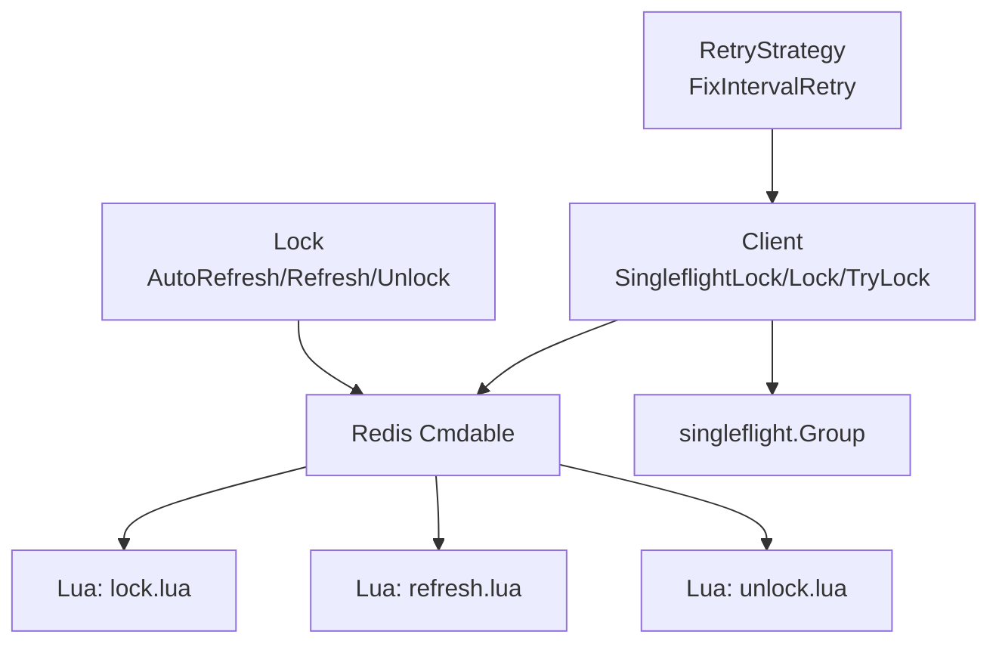
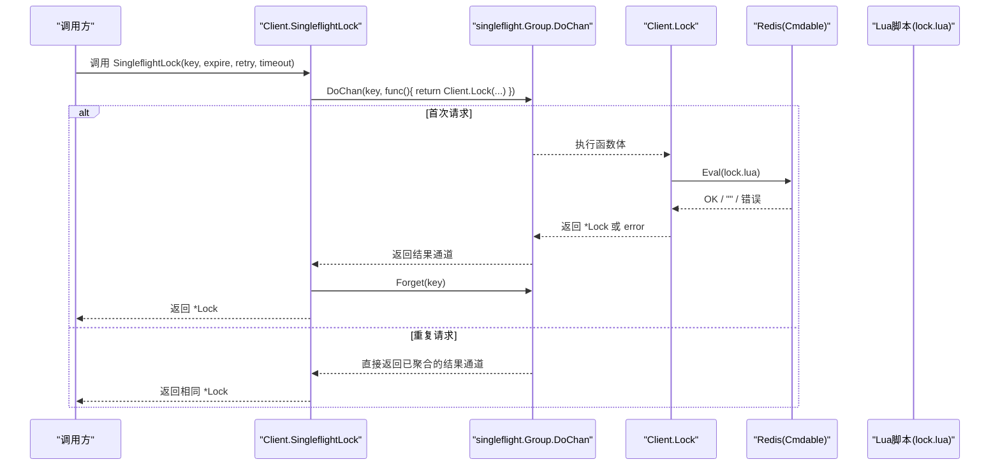
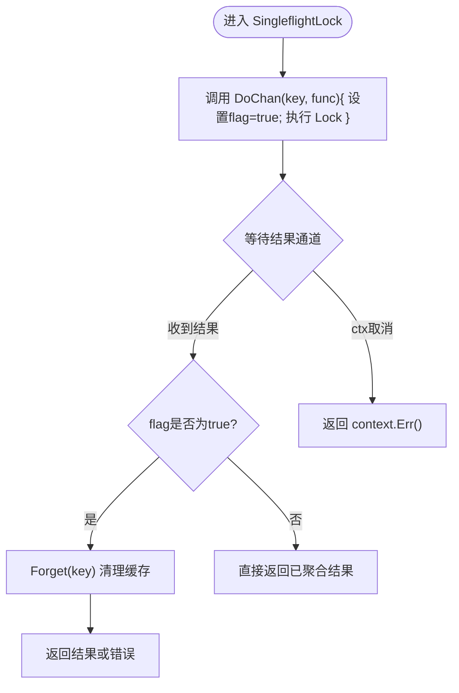
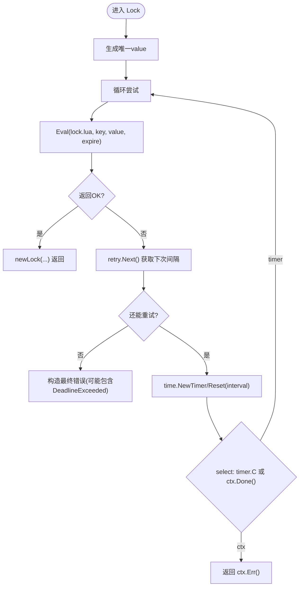
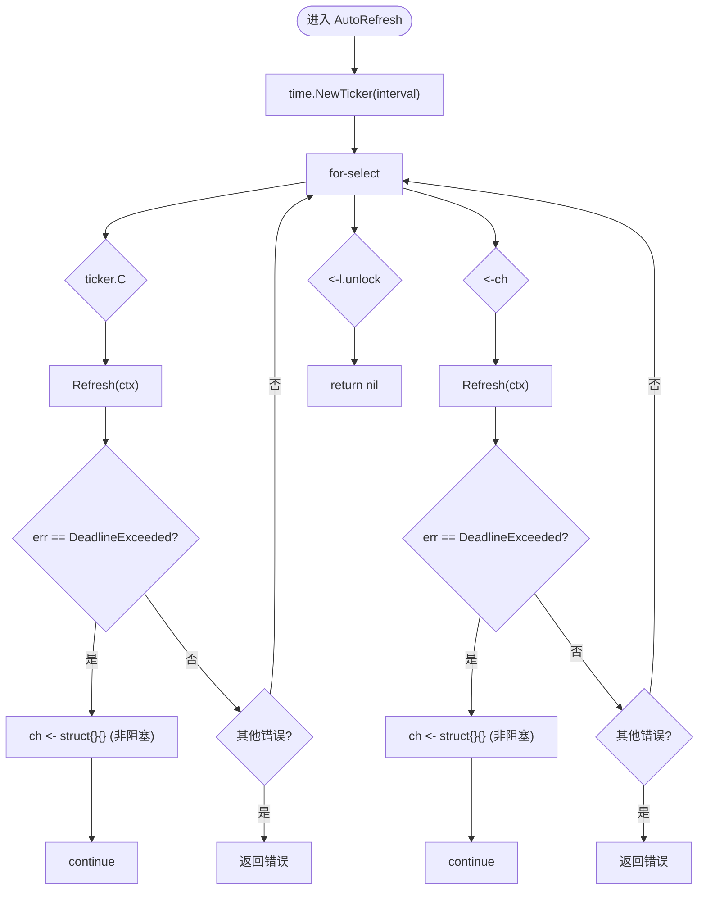
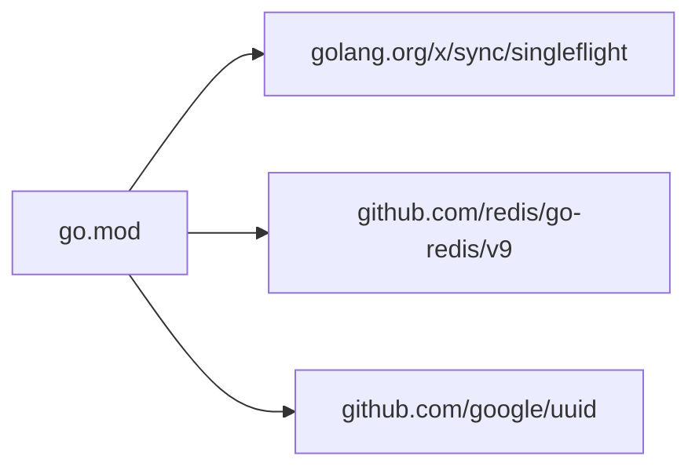

# 并发控制

<cite>
**本文引用的文件**   
- [lock.go](file://lock.go)
- [retry.go](file://retry.go)
- [lock.lua](file://script/lua/lock.lua)
- [refresh.lua](file://script/lua/refresh.lua)
- [unlock.lua](file://script/lua/unlock.lua)
- [go.mod](file://go.mod)
</cite>

## 目录
1. [简介](#简介)
2. [项目结构](#项目结构)
3. [核心组件](#核心组件)
4. [架构总览](#架构总览)
5. [详细组件分析](#详细组件分析)
6. [依赖关系分析](#依赖关系分析)
7. [性能与并发特性](#性能与并发特性)
8. [故障排查指南](#故障排查指南)
9. [结论](#结论)

## 简介
本文聚焦 redis-lock 的并发控制机制，重点解析以下能力：
- SingleflightLock 如何利用 golang.org/x/sync/singleflight 对同一 key 的重复加锁请求进行去重，避免竞态条件。
- DoChan 模式在请求合并、结果复用和内存释放方面的行为。
- Unlock 方法中通过信号通道与 sync.Once 防止重复解锁导致的 panic。
- AutoRefresh 方法的 goroutine 管理与 channel 通信，处理定时刷新与解锁信号的竞争。
- 并发安全的设计模式与潜在的性能影响分析。

## 项目结构
本项目围绕 Redis 分布式锁实现，核心逻辑集中在 lock.go，Lua 脚本封装原子操作于 script/lua 下，重试策略定义在 retry.go，外部依赖声明在 go.mod。



图表来源
- [lock.go:46-82](file://lock.go#L46-L82)
- [lock.go:94-149](file://lock.go#L94-L149)
- [lock.go:151-251](file://lock.go#L151-L251)
- [lock.lua:1-13](file://script/lua/lock.lua#L1-L13)
- [refresh.lua:1-6](file://script/lua/refresh.lua#L1-L6)
- [unlock.lua:1-6](file://script/lua/unlock.lua#L1-L6)
- [retry.go:19-35](file://retry.go#L19-L35)

章节来源
- [lock.go:1-252](file://lock.go#L1-L252)
- [retry.go:1-36](file://retry.go#L1-L36)
- [lock.lua:1-13](file://script/lua/lock.lua#L1-L13)
- [refresh.lua:1-6](file://script/lua/refresh.lua#L1-L6)
- [unlock.lua:1-6](file://script/lua/unlock.lua#L1-L6)

## 核心组件
- Client：持有 Redis 客户端与 singleflight.Group，提供 SingleflightLock、Lock、TryLock。
- Lock：表示一次成功获取的锁，提供 Refresh、AutoRefresh、Unlock。
- RetryStrategy：重试策略接口，FixIntervalRetry 为固定间隔重试实现。
- Lua 脚本：lock.lua、refresh.lua、unlock.lua 保证加锁、续期、解锁的原子性。

章节来源
- [lock.go:46-82](file://lock.go#L46-L82)
- [lock.go:94-149](file://lock.go#L94-L149)
- [lock.go:151-251](file://lock.go#L151-L251)
- [retry.go:19-35](file://retry.go#L19-L35)

## 架构总览
下图展示从调用方到 Redis 的完整流程，以及 singleflight 的去重路径。



图表来源
- [lock.go:62-82](file://lock.go#L62-L82)
- [lock.go:94-134](file://lock.go#L94-L134)
- [lock.lua:1-13](file://script/lua/lock.lua#L1-L13)

## 详细组件分析

### SingleflightLock 与 DoChan 模式
- 请求去重：DoChan 以 key 作为分组键，同一 key 的多次调用会被合并，仅执行一次底层 Lock。
- 结果复用：被合并的请求共享同一个结果通道，等待同一份返回值，避免重复网络往返。
- 内存释放：当 flag 为 true（即当前 goroutine 是实际执行者）时，调用 Forget(key) 主动清理 singleflight 内部缓存，避免长期占用内存；非执行者直接复用结果，不触发 Forget。
- 超时与取消：外层 select 监听 ctx.Done()，确保调用方上下文取消能及时返回。



图表来源
- [lock.go:62-82](file://lock.go#L62-L82)

章节来源
- [lock.go:62-82](file://lock.go#L62-L82)

### Lock 加锁与重试
- 值生成：使用 uuid 生成唯一 value，用于后续续期与解锁校验。
- 重试策略：基于 RetryStrategy.Next() 决定下一次重试间隔与是否继续重试。
- 超时语义：整体调用受 timeout 控制；若最后一次重试本身超时，会同时携带 context.DeadlineExceeded 与“重试耗尽”的错误信息。
- Lua 原子性：lock.lua 先判断 key 是否存在，不存在则 set EX，存在且值为自身则 expire 续期，否则返回空串表示被他人持有。



图表来源
- [lock.go:94-134](file://lock.go#L94-L134)
- [lock.lua:1-13](file://script/lua/lock.lua#L1-L13)
- [retry.go:19-35](file://retry.go#L19-L35)

章节来源
- [lock.go:94-134](file://lock.go#L94-L134)
- [retry.go:19-35](file://retry.go#L19-L35)
- [lock.lua:1-13](file://script/lua/lock.lua#L1-L13)

### TryLock 快速失败
- 使用 SETNX + value 的方式一次性尝试加锁，失败立即返回 ErrFailedToPreemptLock，适合无重试的快速探测场景。

章节来源
- [lock.go:136-149](file://lock.go#L136-L149)

### Lock 续期与自动续期
- Refresh：通过 lua 脚本校验 value 一致后更新过期时间，不一致返回 ErrLockNotHold。
- AutoRefresh：
  - 使用 time.Ticker 周期性触发续期。
  - 使用容量为 1 的 ch 通道承载“需要再次续期”的信号，避免阻塞。
  - 当 Refresh 返回 context.DeadlineExceeded 时，将信号回写 ch 并 continue，以便尽快再次尝试续期。
  - 监听 l.unlock 通道，一旦收到即退出 AutoRefresh 循环。
  - defer 中停止 ticker 并关闭 ch，确保资源释放。



图表来源
- [lock.go:170-217](file://lock.go#L170-L217)
- [lock.go:219-229](file://lock.go#L219-L229)

章节来源
- [lock.go:170-217](file://lock.go#L170-L217)
- [lock.go:219-229](file://lock.go#L219-L229)

### Unlock 与防重复解锁
- 使用 sync.Once 包裹向 unlock 通道写入与关闭通道的动作，确保只执行一次，避免多次 Unlock 导致 panic。
- 无论 Redis 返回成功与否，都会尝试发送解锁信号给 AutoRefresh 协程，使其退出。
- 若 Redis 返回 Nil 或非 1，分别返回 ErrLockNotHold 或其他错误。

```mermaid
classDiagram
class Lock {
-client
-key
-value
-expiration
-unlock chan struct{}
-signalUnlockOnce sync.Once
+Refresh(ctx) error
+AutoRefresh(interval, timeout) error
+Unlock(ctx) error
}
```

图表来源
- [lock.go:151-168](file://lock.go#L151-L168)
- [lock.go:231-251](file://lock.go#L231-L251)

章节来源
- [lock.go:231-251](file://lock.go#L231-L251)

## 依赖关系分析
- 外部库：
  - golang.org/x/sync/singleflight：提供 DoChan 与 Forget，用于请求合并与缓存清理。
  - github.com/redis/go-redis/v9：Redis 客户端抽象 Cmdable。
  - github.com/google/uuid：生成唯一锁值。
- 模块版本：见 go.mod。



图表来源
- [go.mod:1-20](file://go.mod#L1-L20)

章节来源
- [go.mod:1-20](file://go.mod#L1-L20)

## 性能与并发特性
- 请求合并收益：
  - 同一 key 的并发加锁请求被合并为一次 Redis 调用，显著降低网络开销与锁竞争抖动。
  - 减少重复 Lua 脚本执行与 Redis 负载。
- 内存管理：
  - 通过 Forget(key) 及时释放 singleflight 内部状态，避免长时间持有大对象或大量 key 的缓存。
  - AutoRefresh 中的 ch 容量为 1，避免堆积信号；defer 关闭通道与停止 ticker，防止泄漏。
- 并发安全：
  - Unlock 使用 sync.Once 保证信号发送与通道关闭仅发生一次，避免重复解锁 panic。
  - AutoRefresh 使用多路 select 协调 ticker、ch 与 unlock 信号，避免死锁与资源泄露。
- 潜在风险与建议：
  - DoChan 的 Forget 仅在 flag 为 true 时调用，若业务侧未调用 SingleflightLock 而是直接调用 Lock，则不会触发 Forget，需自行注意缓存清理策略。
  - AutoRefresh 在 Refresh 超时时采用“尽力重试”的策略，但无法区分“续期成功但未及时返回”与“确实失败”，上层应结合业务容忍度做降级或告警。
  - 高并发场景下，建议合理设置 interval 与 timeout，避免频繁续期造成 Redis 压力。

[本节为通用性能讨论，不直接分析具体代码行]

## 故障排查指南
- 现象：多次调用 Unlock 导致 panic
  - 原因：未使用 sync.Once 保护 unlock 通道写入与关闭。
  - 解决：确保 Unlock 中通过 sync.Once 执行一次信号发送与通道关闭。
  - 参考位置
    - [lock.go:231-251](file://lock.go#L231-L251)

- 现象：AutoRefresh 一直运行不退出的
  - 原因：Unlock 未正确发送信号或通道未关闭。
  - 排查：检查 Unlock 是否成功执行，以及 AutoRefresh 是否正确监听 l.unlock。
  - 参考位置
    - [lock.go:170-217](file://lock.go#L170-L217)
    - [lock.go:231-251](file://lock.go#L231-L251)

- 现象：SingleflightLock 返回相同锁实例
  - 说明：这是预期行为，DoChan 合并了重复请求，返回同一结果。
  - 参考位置
    - [lock.go:62-82](file://lock.go#L62-L82)

- 现象：续期失败返回 ErrLockNotHold
  - 原因：value 不匹配或 key 已被删除，说明锁不再由当前客户端持有。
  - 排查：确认是否有人绕过 rlock 直接操作 Redis，或锁已过期并被其他客户端抢占。
  - 参考位置
    - [lock.go:219-229](file://lock.go#L219-L229)
    - [refresh.lua:1-6](file://script/lua/refresh.lua#L1-L6)

- 现象：加锁最终报错“重试机会耗尽”
  - 原因：达到最大重试次数仍未成功；若最后一次重试本身超时，会叠加 context.DeadlineExceeded。
  - 排查：检查 Redis 可用性、网络延迟、Lua 脚本执行耗时。
  - 参考位置
    - [lock.go:94-134](file://lock.go#L94-L134)
    - [retry.go:19-35](file://retry.go#L19-L35)

章节来源
- [lock.go:62-82](file://lock.go#L62-L82)
- [lock.go:94-134](file://lock.go#L94-L134)
- [lock.go:170-217](file://lock.go#L170-L217)
- [lock.go:219-229](file://lock.go#L219-L229)
- [lock.go:231-251](file://lock.go#L231-L251)
- [retry.go:19-35](file://retry.go#L19-L35)
- [refresh.lua:1-6](file://script/lua/refresh.lua#L1-L6)

## 结论
本实现通过 singleflight 的 DoChan 模式对同一 key 的并发加锁请求进行合并，有效避免了重复请求带来的竞态与资源浪费；配合 Lua 脚本保证 Redis 操作的原子性。Lock 的生命周期管理通过 channel 与 sync.Once 协同，确保 AutoRefresh 能优雅退出，Unlock 不会因重复调用而 panic。在高并发场景下，建议合理配置重试策略、续期间隔与超时，并结合业务容错策略进行监控与告警。