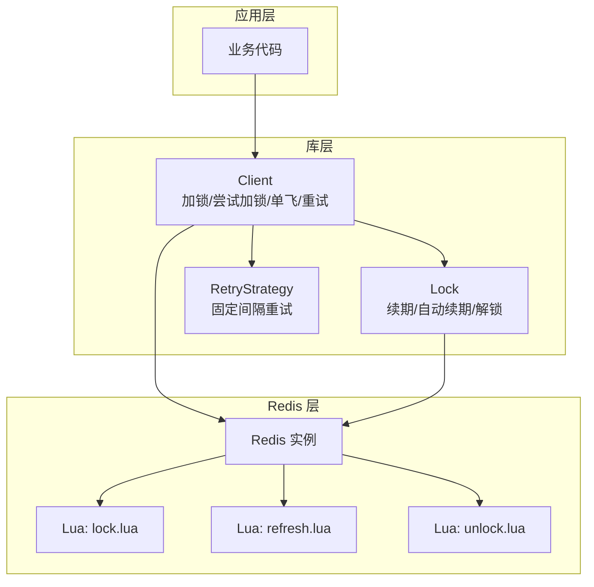
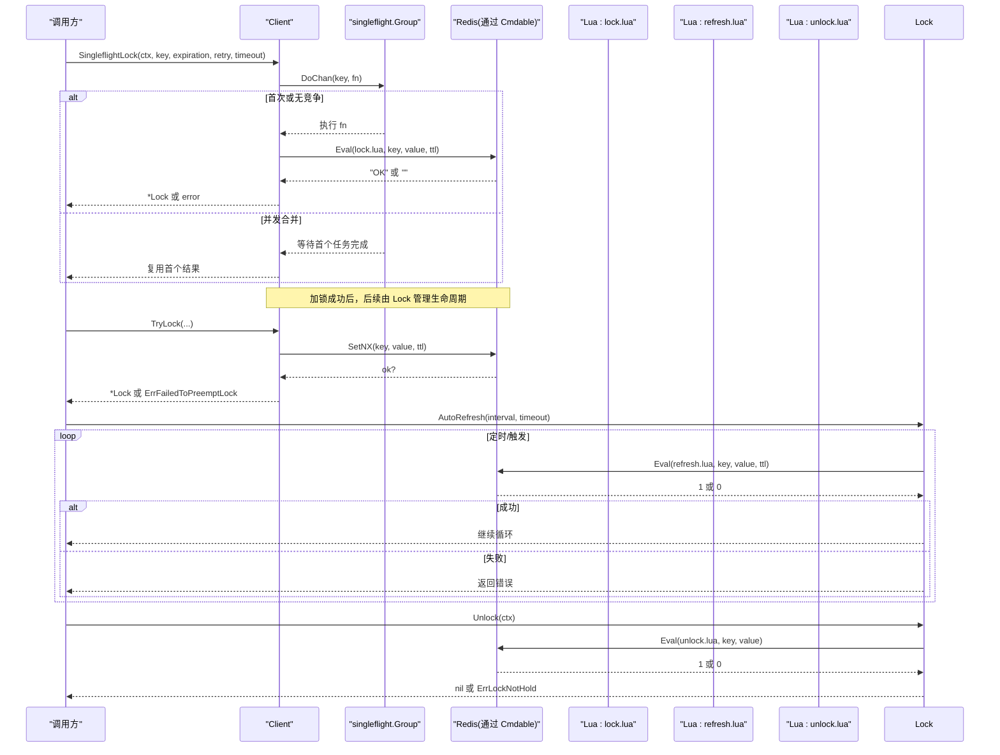
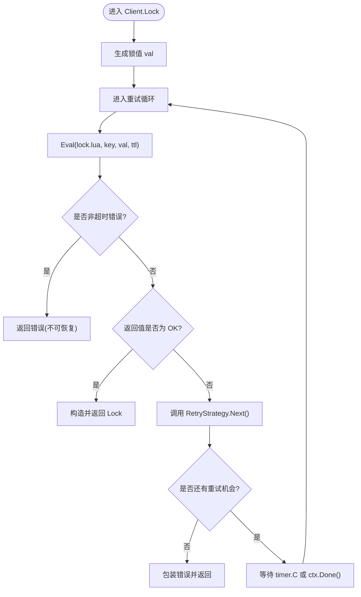
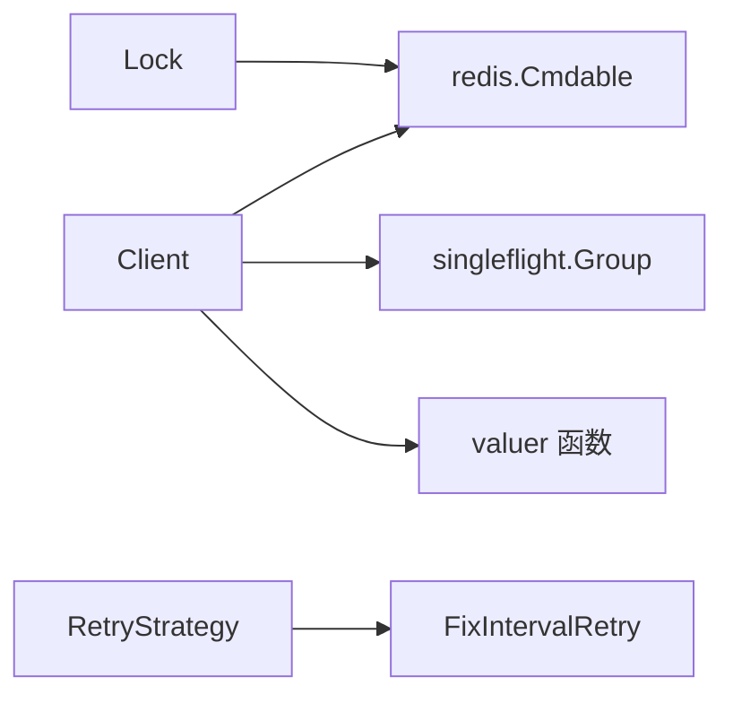

# 架构设计

<cite>
**本文引用的文件**   
- [lock.go](file://lock.go)
- [retry.go](file://retry.go)
- [go.mod](file://go.mod)
- [README.md](file://README.md)
- [script/lua/lock.lua](file://script/lua/lock.lua)
- [script/lua/refresh.lua](file://script/lua/refresh.lua)
- [script/lua/unlock.lua](file://script/lua/unlock.lua)
</cite>

## 目录
1. [引言](#引言)
2. [项目结构](#项目结构)
3. [核心组件](#核心组件)
4. [架构总览](#架构总览)
5. [详细组件分析](#详细组件分析)
6. [依赖关系分析](#依赖关系分析)
7. [性能与并发特性](#性能与并发特性)
8. [故障排查指南](#故障排查指南)
9. [结论](#结论)

## 引言
本仓库实现了一个基于 Redis 的分布式锁库。整体设计围绕两个核心组件展开：
- Client：负责加锁、尝试加锁、单飞（singleflight）控制以及重试策略编排，对外暴露统一的客户端接口。
- Lock：代表一次成功的加锁结果，提供续期、自动续期与解锁等生命周期管理方法。

系统通过 redis.Cmdable 抽象 Redis 客户端能力，使用 Lua 脚本保证原子性，借助 singleflight.Group 抑制重复请求，并通过可插拔的 valuer 函数生成锁值，从而在分布式环境下实现安全、可控且可扩展的锁机制。

## 项目结构
仓库采用“功能模块 + 脚本”的组织方式：
- 核心逻辑集中在 lock.go 与 retry.go。
- Lua 脚本集中放在 script/lua 下，分别用于加锁、续期与解锁。
- go.mod 声明了外部依赖，包括 Redis 客户端、UUID 生成器与 singleflight 包。
- README.md 说明运行环境与用途。



图表来源
- [lock.go:46-168](file://lock.go#L46-L168)
- [retry.go:19-35](file://retry.go#L19-L35)
- [script/lua/lock.lua:1-13](file://script/lua/lock.lua#L1-L13)
- [script/lua/refresh.lua:1-6](file://script/lua/refresh.lua#L1-L6)
- [script/lua/unlock.lua:1-6](file://script/lua/unlock.lua#L1-L6)

章节来源
- [README.md:1-13](file://README.md#L1-L13)
- [go.mod:1-21](file://go.mod#L1-L21)

## 核心组件
- Client
  - 职责：封装 Redis 操作、生成锁值、协调重试与超时、通过 singleflight 去重、返回 Lock 对象。
  - 关键方法：SingleflightLock、Lock、TryLock。
- Lock
  - 职责：表示已持有的锁，提供 Refresh、AutoRefresh、Unlock 等方法进行生命周期管理。
- RetryStrategy
  - 职责：定义重试策略接口；内置 FixIntervalRetry 提供固定间隔重试。

章节来源
- [lock.go:46-168](file://lock.go#L46-L168)
- [retry.go:19-35](file://retry.go#L19-L35)

## 架构总览
下图展示了从调用方到 Redis 的完整交互路径，包含单飞控制、Lua 脚本执行与错误处理分支。



图表来源
- [lock.go:62-149](file://lock.go#L62-L149)
- [lock.go:170-251](file://lock.go#L170-L251)
- [script/lua/lock.lua:1-13](file://script/lua/lock.lua#L1-L13)
- [script/lua/refresh.lua:1-6](file://script/lua/refresh.lua#L1-L6)
- [script/lua/unlock.lua:1-6](file://script/lua/unlock.lua#L1-L6)

## 详细组件分析

### Client 组件
- 设计要点
  - 通过 redis.Cmdable 抽象 Redis 客户端，便于测试与替换底层实现。
  - 内嵌 singleflight.Group，对同一 key 的加锁请求进行合并，避免风暴式重试。
  - 通过 valuer 函数生成唯一锁值，默认使用 UUID，支持未来扩展自定义策略。
  - 提供三种加锁模式：
    - SingleflightLock：带单飞的阻塞式加锁，内部循环等待首个任务完成并复用结果。
    - Lock：带重试与超时的加锁，结合 RetryStrategy 控制退避。
    - TryLock：非阻塞的一次性尝试，底层使用 SETNX。
- 关键流程
  - SingleflightLock：DoChan 包裹 Lock 调用，根据 flag 判断是否释放 singleflight 记录，并在 ctx 取消时及时返回。
  - Lock：循环调用 luaLock，区分超时与非超时错误；若未成功则按 RetryStrategy.Next() 决定下一次重试间隔；耗尽重试机会后返回明确错误。
  - TryLock：直接 SETNX，成功返回 Lock，否则返回 ErrFailedToPreemptLock。



图表来源
- [lock.go:94-134](file://lock.go#L94-L134)
- [retry.go:19-35](file://retry.go#L19-L35)

章节来源
- [lock.go:46-149](file://lock.go#L46-L149)
- [retry.go:19-35](file://retry.go#L19-L35)

### Lock 组件
- 设计要点
  - 持有 Redis 连接、key、value、过期时间与一个单向 channel 用于通知自动续期协程退出。
  - 提供 Refresh：基于 luaRefresh 校验并续期。
  - 提供 AutoRefresh：后台定时刷新，支持超时重试与优雅退出。
  - 提供 Unlock：基于 luaUnlock 原子删除，防止误删他人锁。
- 生命周期
  - 创建：由 Client 在加锁成功后 newLock 构造。
  - 使用：业务持有期间可通过 Refresh/AutoRefresh 维持锁有效性。
  - 结束：调用 Unlock 或 AutoRefresh 收到退出信号后终止。

```mermaid
classDiagram
class Client {
-client : redis.Cmdable
-g : singleflight.Group
-valuer : func() string
+SingleflightLock(ctx, key, expiration, retry, timeout) (*Lock, error)
+Lock(ctx, key, expiration, retry, timeout) (*Lock, error)
+TryLock(ctx, key, expiration) (*Lock, error)
}
class Lock {
-client : redis.Cmdable
-key : string
-value : string
-expiration : time.Duration
-unlock : chan struct{}
-signalUnlockOnce : sync.Once
+AutoRefresh(interval, timeout) error
+Refresh(ctx) error
+Unlock(ctx) error
}
class RetryStrategy {
<<interface>>
+Next() (time.Duration, bool)
}
class FixIntervalRetry {
+Interval : time.Duration
+Max : int
+Next() (time.Duration, bool)
}
Client --> Lock : "创建"
Client --> RetryStrategy : "使用"
FixIntervalRetry ..|> RetryStrategy
```

图表来源
- [lock.go:46-168](file://lock.go#L46-L168)
- [retry.go:19-35](file://retry.go#L19-L35)

章节来源
- [lock.go:151-251](file://lock.go#L151-L251)

### Lua 脚本与原子性
- lock.lua
  - 若 key 不存在则 SET EX；若 key 存在且值为当前 value 则 EXPIRE 续期；否则返回空字符串表示被占用。
- refresh.lua
  - 若 key 的值等于当前 value，则设置新的过期时间；否则返回 0。
- unlock.lua
  - 若 key 的值等于当前 value，则 DEL；否则返回 0。

这些脚本保证了“检查-修改”的原子性，避免竞态条件导致的误删或误续期。

章节来源
- [script/lua/lock.lua:1-13](file://script/lua/lock.lua#L1-L13)
- [script/lua/refresh.lua:1-6](file://script/lua/refresh.lua#L1-L6)
- [script/lua/unlock.lua:1-6](file://script/lua/unlock.lua#L1-L6)

## 依赖关系分析
- 外部依赖
  - github.com/redis/go-redis/v9：提供 redis.Cmdable 接口与命令执行能力。
  - golang.org/x/sync/singleflight：提供 DoChan/Forget 等并发合并能力。
  - github.com/google/uuid：默认锁值生成器。
- 内部耦合
  - Client 强依赖 redis.Cmdable 与 singleflight.Group。
  - Lock 仅依赖 redis.Cmdable，不感知重试与单飞细节，职责清晰。
  - RetryStrategy 为独立接口，FixIntervalRetry 为其具体实现，便于扩展不同退避策略。



图表来源
- [lock.go:46-168](file://lock.go#L46-L168)
- [retry.go:19-35](file://retry.go#L19-L35)
- [go.mod:5-12](file://go.mod#L5-L12)

章节来源
- [go.mod:1-21](file://go.mod#L1-L21)

## 性能与并发特性
- singleflight 去重
  - 对相同 key 的并发加锁请求会被合并，只有首个 goroutine 真正发起 Redis 调用，其余等待首个结果，显著降低 Redis 压力与网络抖动影响。
- 重试与退避
  - 通过 RetryStrategy 控制重试次数与间隔，避免雪崩；默认 FixIntervalRetry 提供固定间隔重试。
- 超时控制
  - 每次 Eval/SetNX 均受 context 超时保护；AutoRefresh 也具备独立的超时通道，避免长时间阻塞。
- 内存与资源
  - Timer/Ticker 在使用后正确 Stop；channel 容量为 1，避免堆积；sync.Once 确保 unlock 信号只发送一次。

[本节为通用性能讨论，不直接分析具体文件]

## 故障排查指南
- 常见错误与含义
  - ErrFailedToPreemptLock：尝试加锁失败（已被其他客户端持有）。
  - ErrLockNotHold：期望持有锁但未持有（可能绕过 rlock 直接操作 Redis）。
  - context.DeadlineExceeded：整体加锁或续期超时，最终状态不确定，需要上层做幂等与补偿。
- 定位建议
  - 检查 Redis 连通性与延迟，确认 Eval/SetNX 是否频繁超时。
  - 核对 valuer 生成的值是否唯一，避免冲突。
  - 观察 RetryStrategy 配置，合理设置 Max 与 Interval，避免过度重试。
  - 确认业务是否在持有锁期间调用了 Unlock，避免提前释放导致后续操作报错。

章节来源
- [lock.go:30-44](file://lock.go#L30-L44)
- [lock.go:94-134](file://lock.go#L94-L134)
- [lock.go:219-251](file://lock.go#L219-L251)

## 结论
该分布式锁库以 Client 与 Lock 的职责分离为核心，通过 redis.Cmdable 抽象 Redis 访问、Lua 脚本保障原子性、singleflight 抑制并发风暴、valuer 提供灵活的锁值生成策略，形成高内聚、低耦合且易于扩展的架构。配合可插拔的重试策略与完善的超时控制，能够在复杂分布式环境中提供稳定可靠的锁能力。