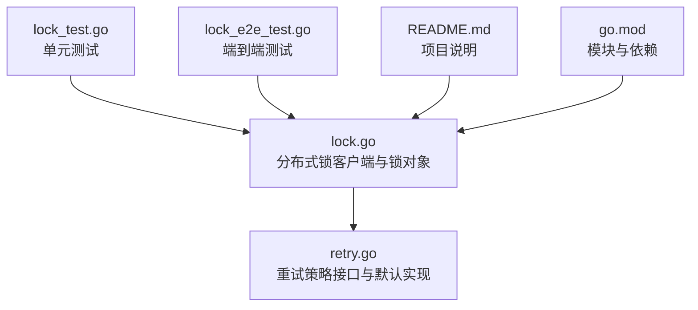
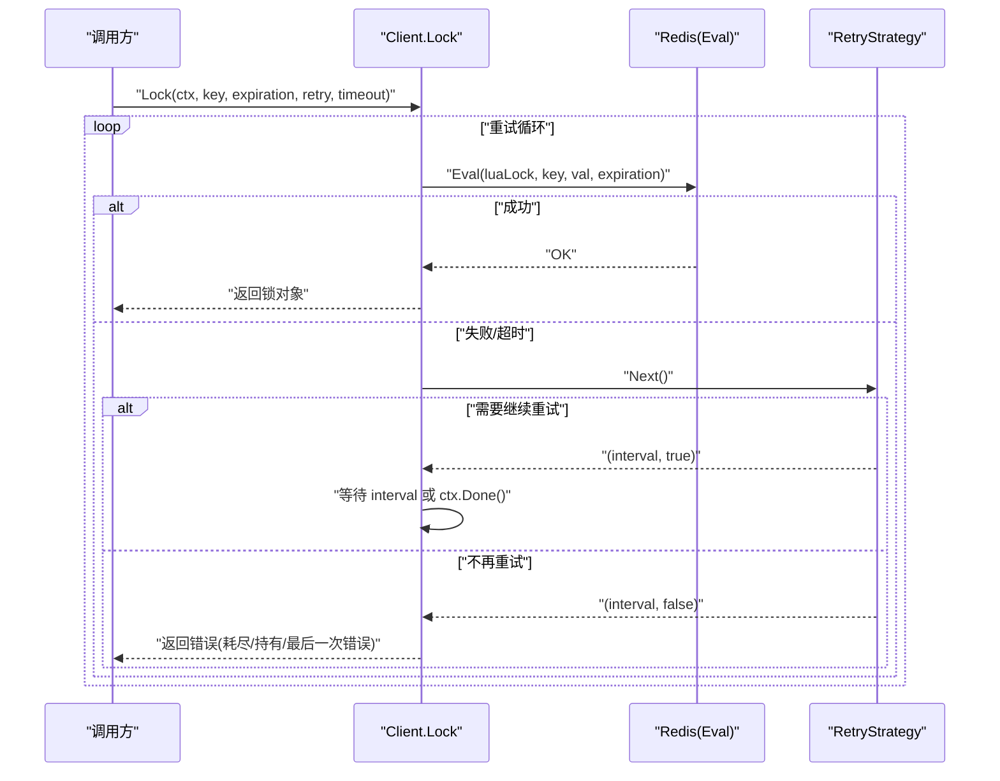
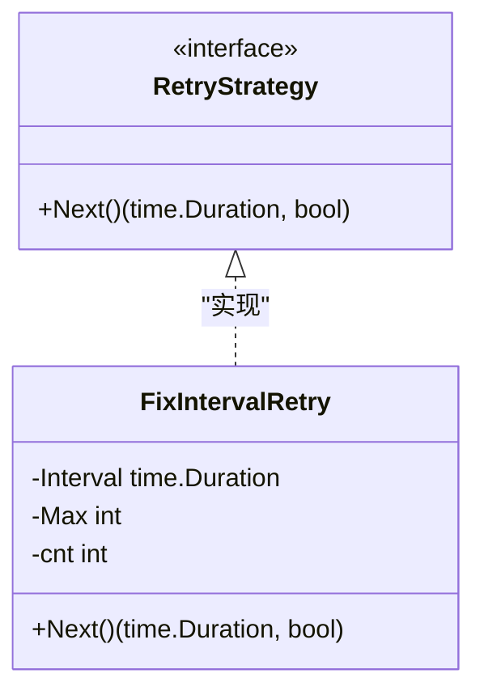
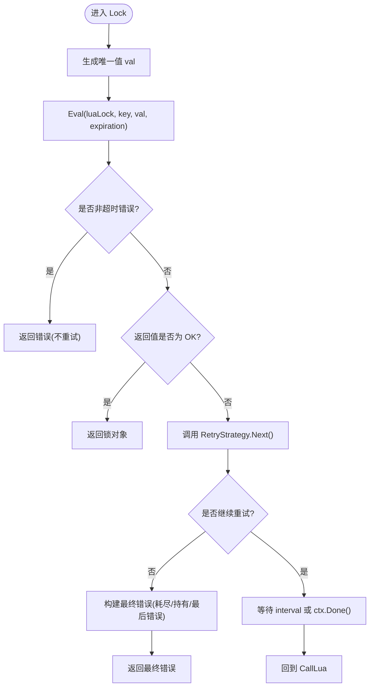
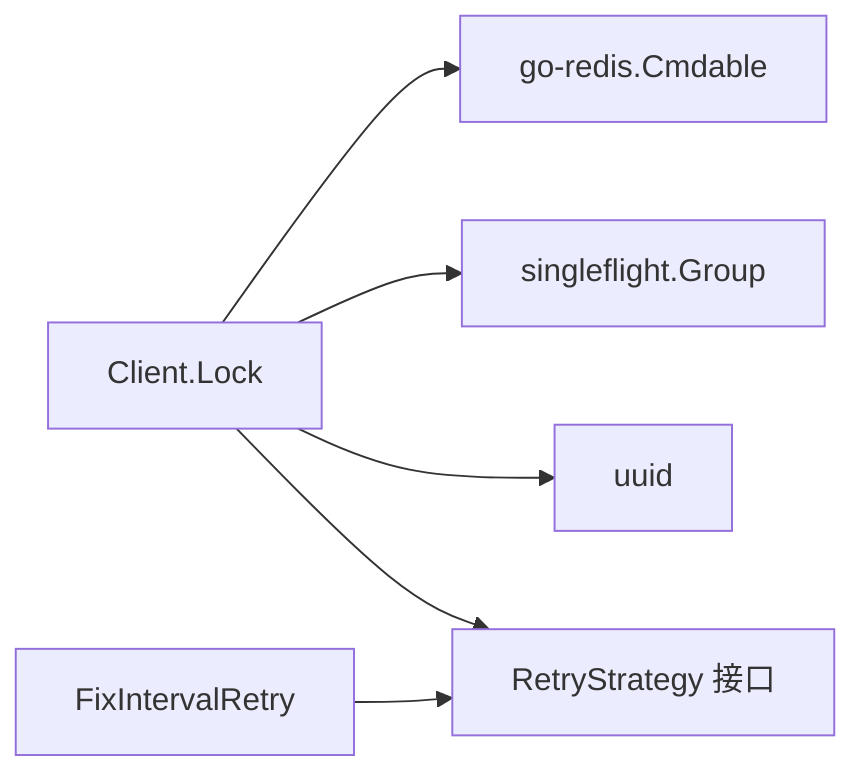

# 重试机制

<cite>
**本文引用的文件**   
- [retry.go](file://retry.go)
- [lock.go](file://lock.go)
- [README.md](file://README.md)
- [go.mod](file://go.mod)
- [lock_test.go](file://lock_test.go)
- [lock_e2e_test.go](file://lock_e2e_test.go)
</cite>

## 目录
1. [引言](#引言)
2. [项目结构](#项目结构)
3. [核心组件](#核心组件)
4. [架构总览](#架构总览)
5. [详细组件分析](#详细组件分析)
6. [依赖关系分析](#依赖关系分析)
7. [性能考量](#性能考量)
8. [故障排查指南](#故障排查指南)
9. [结论](#结论)
10. [附录](#附录)

## 引言
本文件聚焦 redis-lock 的重试机制，系统性解析 RetryStrategy 接口的设计理念与扩展方式，深入剖析 FixIntervalRetry 的实现原理、时间控制与状态管理，并说明在 Lock 方法中如何集成重试逻辑。同时给出错误处理策略（网络超时、Redis 不可用等）以及自定义重试策略的最佳实践与示例路径。

## 项目结构
仓库采用按功能划分的简单结构：
- 核心实现位于 lock.go（分布式锁客户端与锁对象）与 retry.go（重试策略抽象与默认实现）。
- 测试覆盖单元测试与端到端测试，验证重试行为与边界条件。
- README 提供项目背景与运行环境要求；go.mod 声明模块与依赖。

图表来源
- [lock.go:1-252](file://lock.go#L1-L252)
- [retry.go:1-36](file://retry.go#L1-L36)
- [lock_test.go:89-155](file://lock_test.go#L89-L155)
- [lock_e2e_test.go:110-165](file://lock_e2e_test.go#L110-L165)
- [README.md:1-13](file://README.md#L1-L13)
- [go.mod:1-20](file://go.mod#L1-L20)

章节来源
- [README.md:1-13](file://README.md#L1-L13)
- [go.mod:1-20](file://go.mod#L1-L20)

## 核心组件
- RetryStrategy 接口：定义 Next() 返回下一次重试间隔与是否继续重试的决策。
- FixIntervalRetry：固定间隔重试策略，维护内部计数与最大次数，周期性返回固定间隔直至耗尽。
- Client.Lock：基于 Lua 脚本的加锁主流程，集成重试策略与上下文超时控制。
- Client.SingleflightLock：对相同 key 的去重并发加锁，避免重复竞争风暴。

章节来源
- [retry.go:19-35](file://retry.go#L19-L35)
- [lock.go:62-134](file://lock.go#L62-L134)

## 架构总览
下图展示重试机制在分布式锁中的整体交互：调用方通过 Client.Lock 发起加锁请求，内部使用 Redis Eval 执行 Lua 脚本尝试获取锁；若失败或超时，则根据 RetryStrategy.Next() 决定等待时长与是否继续重试；最终返回成功或错误。

图表来源
- [lock.go:94-134](file://lock.go#L94-L134)
- [retry.go:19-35](file://retry.go#L19-L35)

## 详细组件分析

### RetryStrategy 接口设计
- 设计理念
  - 将“何时重试”和“重试多久”从业务逻辑中解耦，便于替换为指数退避、抖动、自适应等策略。
  - Next() 同时返回间隔与继续标志，使策略可表达“无限重试”“有限次数”“动态间隔”等多种语义。
- 扩展点
  - 通过实现 Next() 即可注入自定义策略，无需修改 Lock 主流程。
  - 可与外部配置中心结合，动态调整策略参数。

章节来源
- [retry.go:19-22](file://retry.go#L19-L22)

### FixIntervalRetry 实现原理
- 数据结构
  - Interval：固定等待间隔。
  - Max：最大重试次数。
  - cnt：内部计数器，记录已重试次数。
- 状态管理
  - 每次 Next() 递增计数器，判断是否超过 Max，决定是否继续。
- 时间控制
  - 始终返回固定 Interval，由调用方 Timer 控制等待。
- 复杂度
  - 时间 O(1)，空间 O(1)。

图表来源
- [retry.go:19-35](file://retry.go#L19-L35)

章节来源
- [retry.go:24-35](file://retry.go#L24-L35)

### Lock 方法中的重试集成
- 总体流程
  - 生成唯一值 val，创建带超时的子上下文 lctx。
  - 调用 Redis Eval 执行 Lua 脚本尝试加锁。
  - 若返回 OK，直接返回锁对象。
  - 若非超时错误（如连接断开、EOF），立即返回错误，不重试。
  - 若超时或锁被占用，调用 RetryStrategy.Next() 决定下一步。
  - 若不再重试，构造最终错误（包含“最后一次错误”或“锁被人持有”）。
  - 否则等待 interval，期间监听 ctx.Done() 以支持外层取消。
- 重试时机选择原因
  - 仅在“超时或锁被占用”时重试，避免对非可恢复错误进行无意义重试。
  - 使用定时器等待策略返回的间隔，保证可控且可预测的重试节奏。
- 错误处理策略
  - context.DeadlineExceeded：视为可重试场景，交由策略决定是否继续。
  - 其他错误（网络/Redis 异常）：直接返回，不进行重试。
  - 耗尽重试机会：封装错误信息，区分“最后一次重试错误”与“锁被人持有”。

图表来源
- [lock.go:94-134](file://lock.go#L94-L134)

章节来源
- [lock.go:94-134](file://lock.go#L94-L134)

### SingleflightLock 与重试的关系
- 作用：对相同 key 的并发加锁请求进行合并，减少竞争风暴与重复计算。
- 与重试的配合：SingleflightLock 内部委托给 Lock，因此重试逻辑仍由 Lock 负责；Singleflight 仅影响并发去重。

章节来源
- [lock.go:62-82](file://lock.go#L62-L82)

## 依赖关系分析
- 外部依赖
  - go-redis/v9：Redis 客户端与 Cmdable 接口。
  - singleflight：并发请求合并。
  - uuid：生成唯一值。
- 内部依赖
  - Lock 主流程依赖 RetryStrategy 接口，实现与调用解耦。
  - FixIntervalRetry 作为默认实现，提供固定间隔重试能力。

图表来源
- [lock.go:17-28](file://lock.go#L17-L28)
- [retry.go:19-35](file://retry.go#L19-L35)
- [go.mod:5-12](file://go.mod#L5-L12)

章节来源
- [go.mod:1-20](file://go.mod#L1-L20)
- [lock.go:17-28](file://lock.go#L17-L28)

## 性能考量
- 重试频率与间隔
  - 固定间隔策略简单高效，但在高竞争场景可能造成惊群效应；可考虑指数退避+抖动策略降低热点冲突。
- 定时器复用
  - Lock 内部复用 time.Timer，避免频繁分配，提升 GC 友好性。
- 并发合并
  - SingleflightLock 减少重复竞争，显著降低 Redis 压力与 CPU 消耗。
- 超时控制
  - 外层 ctx 与内层 lctx 双重超时，确保资源及时释放与快速失败。

[本节为通用指导，不涉及具体文件分析]

## 故障排查指南
- 常见错误类型
  - context.DeadlineExceeded：整体调用超时，可能发生在重试等待阶段或 Lua 执行阶段。
  - ErrFailedToPreemptLock：超过重试次数且未出现通信错误，表示锁一直被人持有。
  - 其他错误：网络中断、Redis 不可用、EOF 等，不会触发重试。
- 定位建议
  - 检查 Redis 连通性与延迟，确认 Lua 脚本执行耗时。
  - 观察重试次数与间隔设置，评估是否合理。
  - 使用 SingleflightLock 降低并发竞争带来的抖动。
- 日志与断言
  - 单元测试覆盖了“重试耗尽-最后一次错误”“重试耗尽-锁被持有”“重试后成功”“重试但超时”等场景，可作为回归参考。

章节来源
- [lock.go:84-134](file://lock.go#L84-L134)
- [lock_test.go:89-155](file://lock_test.go#L89-L155)

## 结论
- RetryStrategy 提供了灵活的重试策略抽象，FixIntervalRetry 作为默认实现满足基础场景。
- Lock 方法将重试与超时控制有机结合，既保证可恢复错误的自动重试，又避免对不可恢复错误的无效重试。
- 在高竞争或复杂网络环境下，建议结合业务特征定制重试策略，并配合 SingleflightLock 降低竞争风暴。

[本节为总结性内容，不涉及具体文件分析]

## 附录

### 自定义重试策略最佳实践
- 适用场景
  - 指数退避：随重试次数增加等待时间，缓解热点竞争。
  - 抖动：在退避基础上加入随机抖动，避免同步唤醒导致的惊群。
  - 自适应：根据历史成功率或延迟动态调整间隔。
- 实现要点
  - 严格遵循 RetryStrategy 接口契约，Next() 返回间隔与继续标志。
  - 注意线程安全与状态一致性（如计数器、上次成功时间等）。
  - 与上层超时控制协同，避免长时间阻塞。
- 参考路径
  - 接口定义位置：[retry.go:19-22](file://retry.go#L19-L22)
  - 默认实现位置：[retry.go:24-35](file://retry.go#L24-L35)
  - 集成入口：[lock.go:94-134](file://lock.go#L94-L134)

章节来源
- [retry.go:19-35](file://retry.go#L19-L35)
- [lock.go:94-134](file://lock.go#L94-L134)

### 测试用例参考
- 单元测试覆盖的关键场景
  - 重试耗尽且最后一次错误：验证错误包装与提示。
  - 重试耗尽且锁被持有：验证业务错误语义。
  - 重试后成功：验证正常路径。
  - 重试但超时：验证外层超时优先。
- 端到端测试
  - 使用真实 Redis 验证固定间隔重试与超时行为。

章节来源
- [lock_test.go:89-155](file://lock_test.go#L89-L155)
- [lock_e2e_test.go:110-165](file://lock_e2e_test.go#L110-L165)