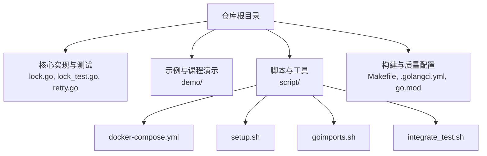
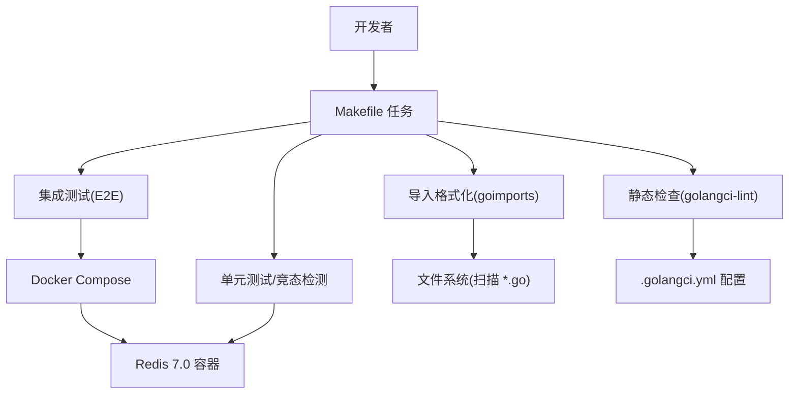
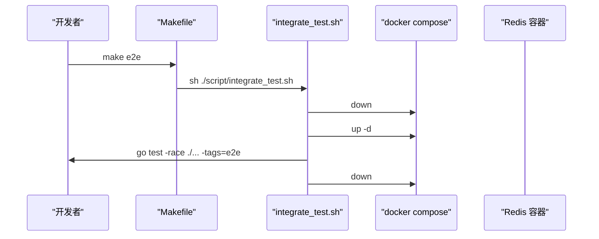
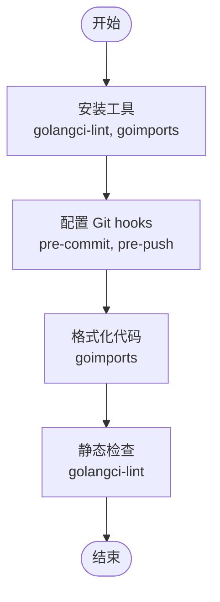
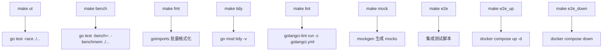
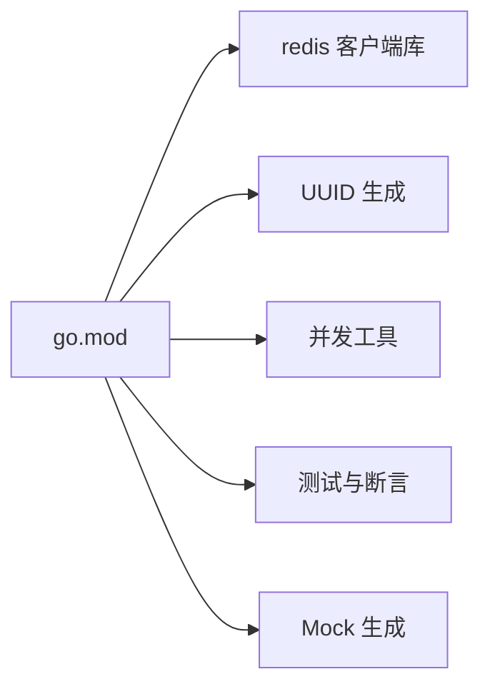

# 开发环境搭建

<cite>
**本文引用的文件**   
- [README.md](file://README.md)
- [Makefile](file://Makefile)
- [go.mod](file://go.mod)
- [script/docker-compose.yml](file://script/docker-compose.yml)
- [script/setup.sh](file://script/setup.sh)
- [script/goimports.sh](file://script/goimports.sh)
- [script/integrate_test.sh](file://script/integrate_test.sh)
- [.golangci.yml](file://.golangci.yml)
</cite>

## 目录
1. [简介](#简介)
2. [项目结构](#项目结构)
3. [核心组件](#核心组件)
4. [架构总览](#架构总览)
5. [详细组件分析](#详细组件分析)
6. [依赖关系分析](#依赖关系分析)
7. [性能与构建注意事项](#性能与构建注意事项)
8. [故障排查指南](#故障排查指南)
9. [结论](#结论)
10. [附录](#附录)

## 简介
本指南面向希望在本地快速搭建 redis-lock 分布式锁库开发环境的开发者。内容涵盖：
- Go 语言环境与 Redis 服务安装
- Docker Compose 一键启动 Redis
- 代码格式化、静态检查与调试器配置建议
- Makefile 常用命令与构建流程
- 代码质量检查配置说明
- 持续集成准备步骤

## 项目结构
仓库采用“功能模块 + 脚本工具”的组织方式：
- 根目录包含核心实现与测试文件，以及构建与质量检查相关配置
- script 目录提供本地环境初始化、Docker Compose、代码格式化工具脚本与集成测试脚本
- demo 目录用于课程演示与辅助学习（非生产可用）

图表来源
- [Makefile:1-45](file://Makefile#L1-L45)
- [script/docker-compose.yml:1-20](file://script/docker-compose.yml#L1-L20)
- [script/setup.sh:1-36](file://script/setup.sh#L1-L36)
- [script/goimports.sh:1-15](file://script/goimports.sh#L1-L15)
- [script/integrate_test.sh:1-21](file://script/integrate_test.sh#L1-L21)

章节来源
- [README.md:1-13](file://README.md#L1-L13)

## 核心组件
- 构建与任务编排：通过 Makefile 统一封装常用命令，包括单元测试、基准测试、格式化、静态检查、依赖整理、Mock 生成、E2E 测试等。
- 依赖管理：使用 Go Modules，指定 Go 版本与第三方依赖。
- 本地 Redis 服务：通过 Docker Compose 拉起 Redis 7.0 实例，供 E2E 测试使用。
- 代码质量：基于 golangci-lint 的静态检查配置；goimports 进行导入格式化。
- 环境初始化：setup.sh 安装必要工具并配置 Git hooks。

章节来源
- [Makefile:1-45](file://Makefile#L1-L45)
- [go.mod:1-21](file://go.mod#L1-L21)
- [script/docker-compose.yml:1-20](file://script/docker-compose.yml#L1-L20)
- [.golangci.yml:1-18](file://.golangci.yml#L1-L18)
- [script/setup.sh:1-36](file://script/setup.sh#L1-L36)

## 架构总览
下图展示了开发环境中的关键组件及其交互：开发者通过 Makefile 触发各类任务，脚本调用 Docker Compose 启动 Redis，Go 测试在容器化 Redis 上运行，静态检查与格式化由本地工具完成。

图表来源
- [Makefile:1-45](file://Makefile#L1-L45)
- [script/docker-compose.yml:1-20](file://script/docker-compose.yml#L1-L20)
- [script/goimports.sh:1-15](file://script/goimports.sh#L1-L15)
- [.golangci.yml:1-18](file://.golangci.yml#L1-L18)

## 详细组件分析

### 依赖与环境要求
- Go 版本：仓库声明了具体 Go 版本，建议使用相同或更高版本以保证可复现构建。
- Redis 版本：文档指出需要 Redis >= v7，Docker Compose 使用 Redis 7.0 镜像。

章节来源
- [README.md:1-13](file://README.md#L1-L13)
- [go.mod:1-21](file://go.mod#L1-L21)
- [script/docker-compose.yml:1-20](file://script/docker-compose.yml#L1-L20)

### Docker Compose 与一键启动
- 服务定义：Redis 服务暴露默认端口，允许空密码以便本地开发。
- 一键启动：通过 Makefile 的 e2e_up/e2e_down 目标调用 docker compose 管理容器生命周期。
- 集成测试：e2e 目标会先停止旧容器、启动新容器、执行带标签的测试，最后清理容器。

图表来源
- [Makefile:31-41](file://Makefile#L31-L41)
- [script/integrate_test.sh:17-20](file://script/integrate_test.sh#L17-L20)
- [script/docker-compose.yml:14-20](file://script/docker-compose.yml#L14-L20)

章节来源
- [script/docker-compose.yml:1-20](file://script/docker-compose.yml#L1-L20)
- [Makefile:31-41](file://Makefile#L31-L41)
- [script/integrate_test.sh:1-21](file://script/integrate_test.sh#L1-L21)

### 开发工具链与代码质量
- 代码格式化：goimports 批量处理所有 Go 源文件，排除特定目录。
- 静态检查：golangci-lint 使用 .golangci.yml 配置，指定 Go 版本与跳过目录。
- 工具安装：setup.sh 自动安装 golangci-lint 与 goimports，并设置 Git hooks。

图表来源
- [script/setup.sh:20-36](file://script/setup.sh#L20-L36)
- [script/goimports.sh:15-15](file://script/goimports.sh#L15-L15)
- [.golangci.yml:15-18](file://.golangci.yml#L15-L18)

章节来源
- [script/setup.sh:1-36](file://script/setup.sh#L1-L36)
- [script/goimports.sh:1-15](file://script/goimports.sh#L1-L15)
- [.golangci.yml:1-18](file://.golangci.yml#L1-L18)

### Makefile 常用命令与构建流程
- 单元测试与竞态检测：ut 目标启用竞态检测。
- 基准测试：bench 目标输出内存分配统计。
- 格式化与依赖整理：fmt 与 tidy 分别负责导入排序与依赖整理。
- 静态检查：lint 目标读取 .golangci.yml 执行检查。
- Mock 生成：mock 目标根据接口生成 mocks 包下的模拟实现。
- E2E 测试：e2e 目标封装容器生命周期与测试执行。

图表来源
- [Makefile:1-45](file://Makefile#L1-L45)

章节来源
- [Makefile:1-45](file://Makefile#L1-L45)

### 代码质量检查配置说明
- golangci-lint：通过 .golangci.yml 指定运行使用的 Go 版本，并跳过某些目录（如 IDE 配置目录）。
- goimports：通过脚本遍历源码目录并对未规范导入的文件进行修复。

章节来源
- [.golangci.yml:1-18](file://.golangci.yml#L1-L18)
- [script/goimports.sh:1-15](file://script/goimports.sh#L1-L15)

### 持续集成准备步骤
- 确保本地开发与 CI 环境一致：
  - 使用与仓库一致的 Go 版本。
  - 在 CI 中安装 golangci-lint 与 goimports。
  - 使用相同的 Docker Compose 配置拉起 Redis。
- 建议在 CI 流水线中依次执行：
  - 依赖整理与校验
  - 静态检查
  - 单元测试（含竞态检测）
  - 基准测试（可选）
  - 集成测试（E2E）

章节来源
- [Makefile:1-45](file://Makefile#L1-L45)
- [script/docker-compose.yml:1-20](file://script/docker-compose.yml#L1-L20)
- [script/integrate_test.sh:1-21](file://script/integrate_test.sh#L1-L21)

## 依赖关系分析
- 直接依赖：
  - Redis 客户端库：用于连接 Redis 服务。
  - UUID 生成：用于生成唯一标识。
  - 并发工具库：用于并发控制。
  - 测试与断言库：用于单元测试与集成测试。
  - Mock 生成工具：用于生成接口模拟实现。
- 间接依赖：由 Go Modules 自动解析与管理。

图表来源
- [go.mod:1-21](file://go.mod#L1-L21)

章节来源
- [go.mod:1-21](file://go.mod#L1-L21)

## 性能与构建注意事项
- 竞态检测：单元测试建议开启竞态检测以尽早发现并发问题。
- 基准测试：基准测试会输出内存分配统计，便于评估优化效果。
- 依赖整理：定期执行依赖整理以保持 go.mod 与 go.sum 一致性。
- 容器资源：本地 Redis 容器默认无密码，适合开发环境；生产环境需另行配置安全策略。

章节来源
- [Makefile:1-45](file://Makefile#L1-L45)
- [script/docker-compose.yml:14-20](file://script/docker-compose.yml#L14-L20)

## 故障排查指南
- 无法连接 Redis：
  - 确认 Docker Compose 已启动且端口映射正常。
  - 检查容器日志与端口占用情况。
- 静态检查失败：
  - 查看 golangci-lint 输出，按提示修复代码风格或潜在问题。
  - 确认 .golangci.yml 配置与本地 Go 版本匹配。
- 格式化异常：
  - 使用 goimports 脚本重新格式化所有 Go 文件。
- 集成测试失败：
  - 使用 e2e 目标自动重启 Redis 容器后重试。
  - 检查测试标签是否正确传递。

章节来源
- [script/docker-compose.yml:14-20](file://script/docker-compose.yml#L14-L20)
- [.golangci.yml:15-18](file://.golangci.yml#L15-L18)
- [script/goimports.sh:15-15](file://script/goimports.sh#L15-L15)
- [script/integrate_test.sh:17-20](file://script/integrate_test.sh#L17-L20)

## 结论
通过本指南，你可以在本地快速搭建 redis-lock 的开发环境：安装 Go 与 Docker，使用 Docker Compose 启动 Redis，借助 Makefile 统一执行格式化、静态检查、测试与基准测试。配合 setup.sh 安装工具与配置 Git hooks，能够显著提升协作效率与代码质量。

## 附录

### 快速上手清单
- 安装 Go 与 Docker
- 初始化环境：执行环境初始化脚本，安装工具并配置 Git hooks
- 启动 Redis：使用 Docker Compose 拉起 Redis 服务
- 运行测试：执行单元测试与集成测试
- 代码质量：执行格式化与静态检查
- 依赖管理：整理依赖并保持版本一致

章节来源
- [script/setup.sh:1-36](file://script/setup.sh#L1-L36)
- [script/docker-compose.yml:1-20](file://script/docker-compose.yml#L1-L20)
- [Makefile:1-45](file://Makefile#L1-L45)