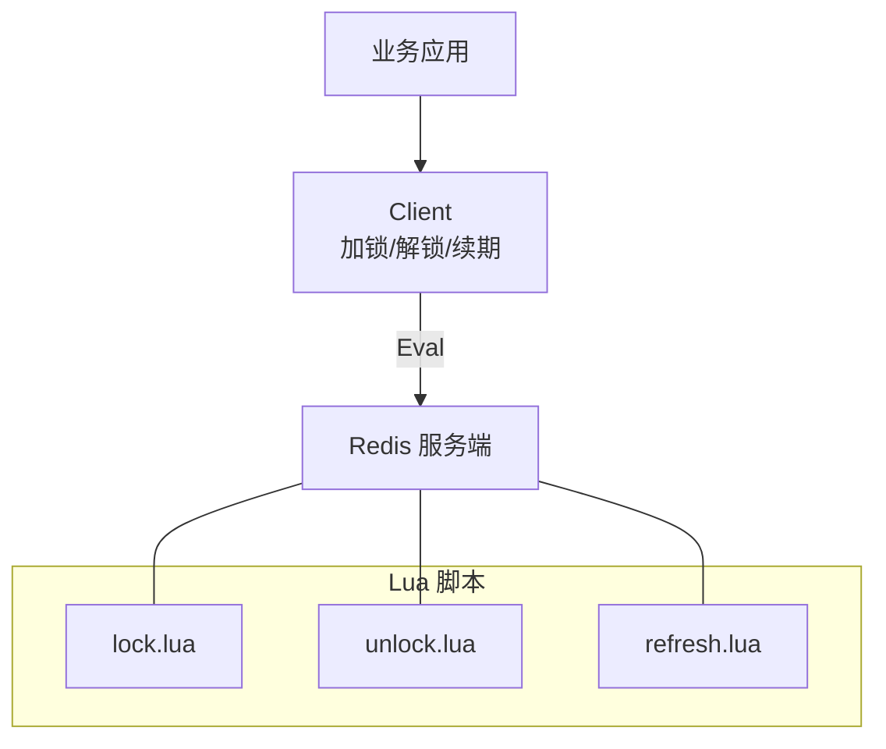
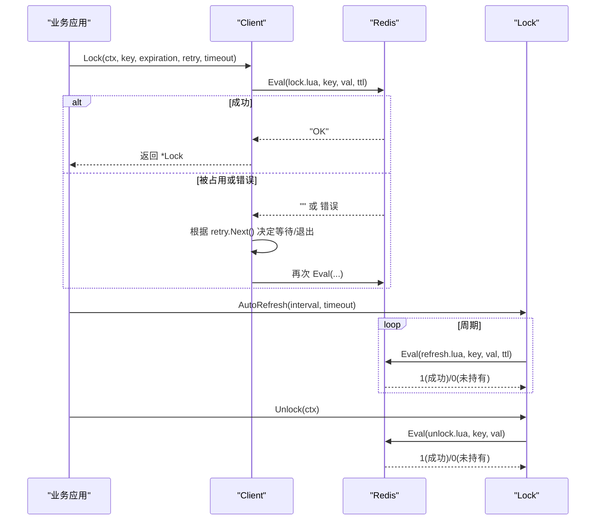
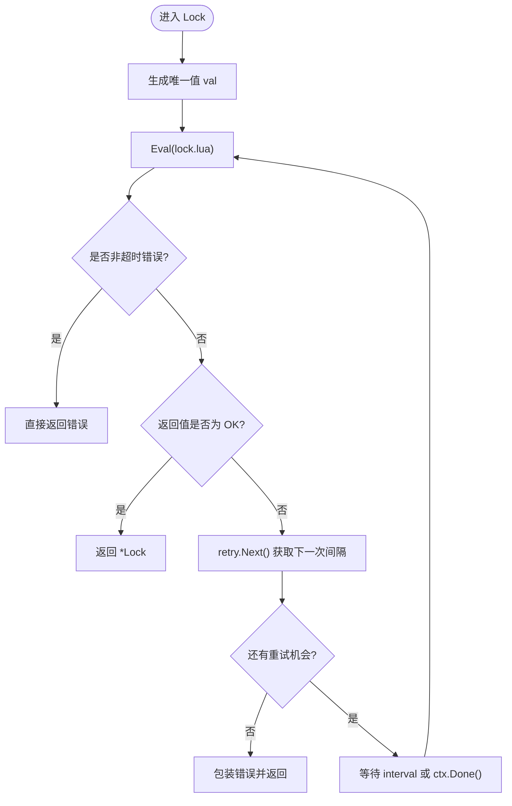
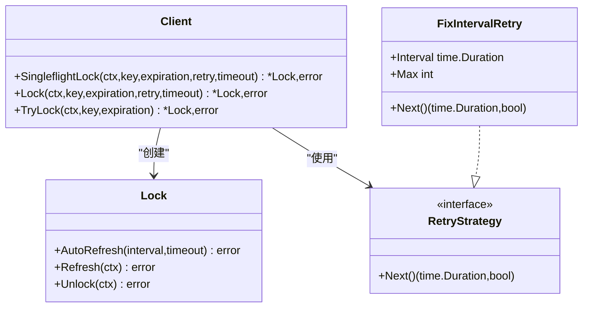
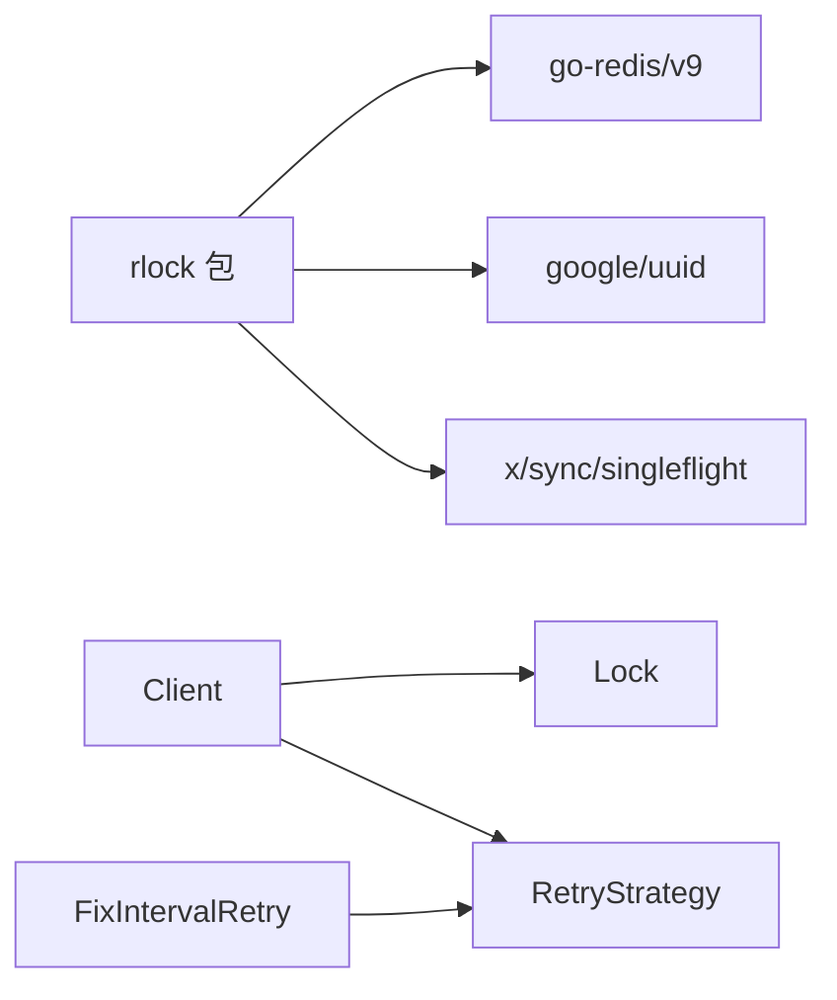

# 故障排除

<cite>
**本文引用的文件**   
- [README.md](file://README.md)
- [lock.go](file://lock.go)
- [retry.go](file://retry.go)
- [script/lua/lock.lua](file://script/lua/lock.lua)
- [script/lua/unlock.lua](file://script/lua/unlock.lua)
- [script/lua/refresh.lua](file://script/lua/refresh.lua)
- [lock_test.go](file://lock_test.go)
- [lock_e2e_test.go](file://lock_e2e_test.go)
</cite>

## 目录
1. [简介](#简介)
2. [项目结构](#项目结构)
3. [核心组件](#核心组件)
4. [架构总览](#架构总览)
5. [详细组件分析](#详细组件分析)
6. [依赖关系分析](#依赖关系分析)
7. [性能与调优](#性能与调优)
8. [常见问题与解决方案](#常见问题与解决方案)
9. [监控指标与告警建议](#监控指标与告警建议)
10. [日志规范与诊断方法](#日志规范与诊断方法)
11. [结论](#结论)

## 简介
本指南面向使用 redis-lock 库的开发者，聚焦于分布式锁在真实环境中的故障定位、恢复与优化。内容覆盖加锁失败原因、锁泄露预防与检测、网络异常重试策略、性能调优参数、监控指标与告警、以及日志规范化与诊断方法。所有分析与建议均基于仓库源码与测试用例。

## 项目结构
redis-lock 采用“Go 客户端 + Lua 脚本”的组合：
- Go 层负责重试、超时控制、并发去抖（singleflight）、自动续期与解锁流程编排。
- Lua 脚本在 Redis 侧原子执行加锁、解锁、续期逻辑，避免竞态条件。

图表来源
- [lock.go:62-149](file://lock.go#L62-L149)
- [script/lua/lock.lua:1-13](file://script/lua/lock.lua#L1-L13)
- [script/lua/unlock.lua:1-6](file://script/lua/unlock.lua#L1-L6)
- [script/lua/refresh.lua:1-6](file://script/lua/refresh.lua#L1-L6)

章节来源
- [README.md:1-13](file://README.md#L1-L13)

## 核心组件
- Client：对外暴露加锁、尝试加锁、单飞加锁、自动续期等能力。
- Lock：持有锁状态，提供 Refresh、Unlock、AutoRefresh 等方法。
- RetryStrategy：重试策略接口；FixIntervalRetry 为固定间隔重试实现。
- Lua 脚本：lock.lua、unlock.lua、refresh.lua 保证原子性。

关键职责与行为要点：
- Lock 通过 Eval 调用 lock.lua，支持“不存在则设置并带过期时间”和“值相同则续期”。
- TryLock 使用 SetNX 非阻塞尝试加锁。
- Unlock 通过 unlock.lua 校验 value 后删除 key。
- Refresh 通过 refresh.lua 校验 value 后更新过期时间。
- AutoRefresh 周期性调用 Refresh，并在收到解锁信号时退出。

章节来源
- [lock.go:46-168](file://lock.go#L46-L168)
- [retry.go:19-35](file://retry.go#L19-L35)
- [script/lua/lock.lua:1-13](file://script/lua/lock.lua#L1-L13)
- [script/lua/unlock.lua:1-6](file://script/lua/unlock.lua#L1-L6)
- [script/lua/refresh.lua:1-6](file://script/lua/refresh.lua#L1-L6)

## 架构总览
下图展示一次典型加锁流程（含重试）与续期/解锁流程的关系。

图表来源
- [lock.go:94-149](file://lock.go#L94-L149)
- [lock.go:170-251](file://lock.go#L170-L251)
- [script/lua/lock.lua:1-13](file://script/lua/lock.lua#L1-L13)
- [script/lua/refresh.lua:1-6](file://script/lua/refresh.lua#L1-L6)
- [script/lua/unlock.lua:1-6](file://script/lua/unlock.lua#L1-L6)

## 详细组件分析

### 加锁与重试机制
- Lock 方法会循环调用 Lua 脚本进行加锁或续期，结合 RetryStrategy 控制重试间隔与次数，并通过 context 控制整体超时。
- 当 Redis 返回非超时错误（如连接断开、EOF），立即返回错误，不再重试。
- 当达到最大重试次数且无错误，返回“抢锁失败”语义的错误；若最后一次重试超时，同时包含超时语义。

图表来源
- [lock.go:94-134](file://lock.go#L94-L134)
- [retry.go:19-35](file://retry.go#L19-L35)

章节来源
- [lock.go:84-134](file://lock.go#L84-L134)
- [lock_test.go:32-177](file://lock_test.go#L32-L177)

### TryLock 非阻塞加锁
- 使用 SetNX 原子设置键值对并带过期时间。
- 若返回 false，表示已被其他客户端持有或竞争失败，返回“抢锁失败”。
- 若网络或服务器异常，直接返回底层错误。

章节来源
- [lock.go:136-149](file://lock.go#L136-L149)
- [lock_test.go:179-252](file://lock_test.go#L179-L252)

### 解锁与续期
- Unlock：通过 unlock.lua 校验 value 一致后删除 key，否则返回“未持有锁”。
- Refresh：通过 refresh.lua 校验 value 一致后刷新过期时间，否则返回“未持有锁”。
- AutoRefresh：定时调用 Refresh，遇到超时继续重试，直到收到解锁信号或发生不可恢复错误。

图表来源
- [lock.go:46-168](file://lock.go#L46-L168)
- [retry.go:19-35](file://retry.go#L19-L35)

章节来源
- [lock.go:170-251](file://lock.go#L170-L251)
- [lock_test.go:367-473](file://lock_test.go#L367-L473)
- [lock_test.go:475-541](file://lock_test.go#L475-L541)

### Lua 脚本语义
- lock.lua：若 key 不存在则 SET EX；若 key 存在且值等于传入的 val，则 EXPIRE 续期；否则返回空串表示被占用。
- unlock.lua：仅当 key 的值等于 val 时才 DEL，否则返回 0。
- refresh.lua：仅当 key 的值等于 val 时才 EXPIRE，否则返回 0。

章节来源
- [script/lua/lock.lua:1-13](file://script/lua/lock.lua#L1-L13)
- [script/lua/unlock.lua:1-6](file://script/lua/unlock.lua#L1-L6)
- [script/lua/refresh.lua:1-6](file://script/lua/refresh.lua#L1-L6)

## 依赖关系分析
- 外部依赖：go-redis/v9 作为 Redis 客户端抽象；google/uuid 用于生成锁值；golang.org/x/sync/singleflight 用于并发去抖。
- 内部耦合：Client 与 Lock 强耦合；Lock 依赖 Redis Cmdable 执行 Lua 脚本；RetryStrategy 可插拔。

图表来源
- [lock.go:17-28](file://lock.go#L17-L28)
- [retry.go:19-35](file://retry.go#L19-L35)

章节来源
- [lock.go:17-28](file://lock.go#L17-L28)
- [retry.go:19-35](file://retry.go#L19-L35)

## 性能与调优
- 加锁路径选择
  - 高并发短临界区：优先 TryLock，减少网络往返与重试开销。
  - 需要自动重试与超时控制：使用 Lock，合理配置 RetryStrategy 与 timeout。
- 重试策略
  - 固定间隔重试：FixIntervalRetry.Interval 不宜过小，避免放大 Redis 压力；Max 需结合业务 SLA 设定。
  - 建议结合指数退避（可扩展自定义 RetryStrategy）降低雪崩风险。
- 超时与续期
  - timeout 应大于单次 Eval 的网络 RTT 与 Redis 处理耗时，通常设置为数百毫秒到数秒。
  - expiration 要大于业务临界区最长执行时间，并为 GC/调度抖动预留余量。
  - AutoRefresh 的 interval 建议小于 expiration 的 1/3~1/2，避免到期前未续期。
- 并发去抖
  - SingleflightLock 可合并同一 key 的重复请求，降低热点 key 的 Redis 压力。
- 连接池与网络
  - 调整 go-redis 的连接池大小、读写超时、重试次数等参数，以匹配集群规模与延迟分布。

[本节为通用指导，不直接分析具体文件]

## 常见问题与解决方案

### 加锁失败的原因与处理
- 锁被占用
  - 现象：Lock 多次重试后仍返回“抢锁失败”。
  - 排查：检查是否存在长事务或慢查询导致锁长期持有；确认是否有多个进程竞争同一 key。
  - 处理：缩短临界区、优化业务逻辑；必要时提高重试次数或延长 timeout。
- 网络异常或 Redis 不可用
  - 现象：出现非超时错误（如 EOF、连接断开）。
  - 处理：记录错误并快速失败；在更上层做熔断与降级；确保客户端具备重连机制。
- 超时
  - 现象：context.DeadlineExceeded。
  - 注意：此时无法确定最终是否加锁成功，应避免幂等性缺失的业务分支。
  - 处理：在上层做幂等保护；对关键路径增加补偿与核对逻辑。

章节来源
- [lock.go:84-134](file://lock.go#L84-L134)
- [lock_test.go:84-155](file://lock_test.go#L84-L155)

### 锁泄露的预防与检测
- 预防措施
  - 始终使用提供的 Unlock 释放锁，不要在业务代码中直接操作 Redis 删除 key。
  - 使用 AutoRefresh 维持锁有效期，防止业务长时间运行导致锁提前过期。
  - 为每个实例生成唯一 value，避免误删他人锁。
- 检测手段
  - 监控 key 的 TTL 与存活时间，发现异常长 TTL 或频繁变更。
  - 统计解锁失败（ErrLockNotHold）比例，定位潜在泄露点。
  - 定期巡检 Redis 中残留锁 key，结合业务日志关联排查。

章节来源
- [lock.go:170-251](file://lock.go#L170-L251)
- [script/lua/unlock.lua:1-6](file://script/lua/unlock.lua#L1-L6)
- [script/lua/refresh.lua:1-6](file://script/lua/refresh.lua#L1-L6)

### 网络异常时的重试与容错
- 重试策略
  - Lock 仅在非超时错误时立即返回，避免对不可恢复错误进行无效重试。
  - 对于超时，按 RetryStrategy 继续重试，直至耗尽或成功。
- 容错建议
  - 在业务层区分“确定失败”（如 ErrFailedToPreemptLock）与“不确定结果”（如超时）两类错误，分别走不同分支。
  - 对关键路径引入幂等与补偿，确保即使部分节点认为加锁成功也能安全回滚。

章节来源
- [lock.go:94-134](file://lock.go#L94-L134)
- [retry.go:19-35](file://retry.go#L19-L35)

### 续期失败与自动续期
- 现象
  - Refresh 返回“未持有锁”，可能因为 value 不一致或 key 已过期。
  - AutoRefresh 遇到超时会继续重试，但需关注错误累积与资源占用。
- 处理
  - 捕获 Refresh 错误，必要时重新加锁或通知上层中断。
  - 调整 AutoRefresh 的 interval 与 timeout，避免频繁失败。

章节来源
- [lock.go:170-229](file://lock.go#L170-L229)
- [lock_test.go:367-473](file://lock_test.go#L367-L473)

### 解锁失败
- 现象
  - Unlock 返回“未持有锁”，可能由于 key 过期、value 不一致或被第三方删除。
- 处理
  - 记录上下文信息（key、value、实例标识），便于审计与定位。
  - 避免二次解锁导致的副作用；在业务层做好幂等。

章节来源
- [lock.go:231-251](file://lock.go#L231-L251)
- [lock_test.go:254-311](file://lock_test.go#L254-L311)

## 监控指标与告警建议
- 加锁成功率
  - 定义：成功加锁次数 / 总加锁尝试次数。
  - 告警：低于阈值（如 95%）持续一段时间触发。
- 加锁耗时分布
  - 定义：P50/P95/P99 加锁耗时。
  - 告警：P99 超过 SLA（如 > 1s）持续一段时间。
- 重试次数分布
  - 定义：每次加锁的重试次数直方图。
  - 告警：平均重试次数升高或尾部重试次数激增。
- 续期成功率
  - 定义：成功续期次数 / 总续期尝试次数。
  - 告警：低于阈值（如 99%）持续一段时间。
- 解锁失败率
  - 定义：解锁失败次数 / 总解锁次数。
  - 告警：高于阈值（如 1%）持续一段时间。
- 锁存活时长
  - 定义：锁 key 的平均 TTL 与最大值。
  - 告警：异常长 TTL 或突增。
- Redis 健康度
  - 定义：连接错误、超时、命令延迟。
  - 告警：连接错误率上升、RTT 升高。

[本节为通用指导，不直接分析具体文件]

## 日志规范与诊断方法
- 日志字段建议
  - 请求 ID、实例 ID、key、value、操作类型（lock/trylock/refresh/unlock）、耗时、错误码、错误信息、Redis 地址。
- 分级策略
  - 正常路径：INFO 级别记录关键步骤（加锁成功、解锁成功）。
  - 异常路径：ERROR 级别记录错误详情与上下文。
  - 调试路径：DEBUG 级别记录重试次数、间隔、Lua 返回值。
- 诊断步骤
  - 先定位错误类型：抢锁失败、未持有锁、网络异常、超时。
  - 再查看对应 key 的 TTL 与值变化轨迹，判断是否存在泄露或误删。
  - 结合业务日志，确认临界区执行时间与锁过期时间的匹配关系。
  - 针对热点 key，观察 Singleflight 的去抖效果与重试风暴情况。

[本节为通用指导，不直接分析具体文件]

## 结论
redis-lock 通过 Lua 脚本保证原子性，配合 Go 层的重试、超时与自动续期，提供了稳健的分布式锁能力。在生产环境中，建议：
- 明确区分“确定失败”和“不确定结果”的错误分支，做好幂等与补偿。
- 合理配置重试策略、超时与过期时间，避免锁泄露与性能退化。
- 建立完善的监控与日志体系，及时发现并定位问题。
- 对热点 key 启用并发去抖，降低 Redis 压力。

[本节为总结性内容，不直接分析具体文件]