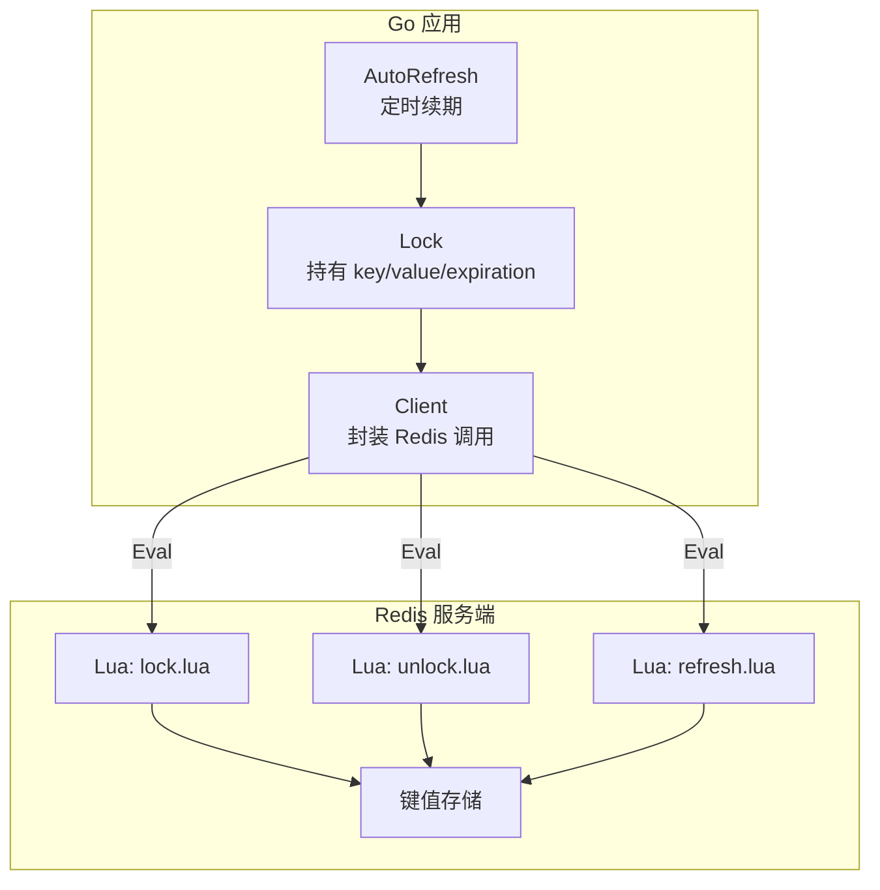
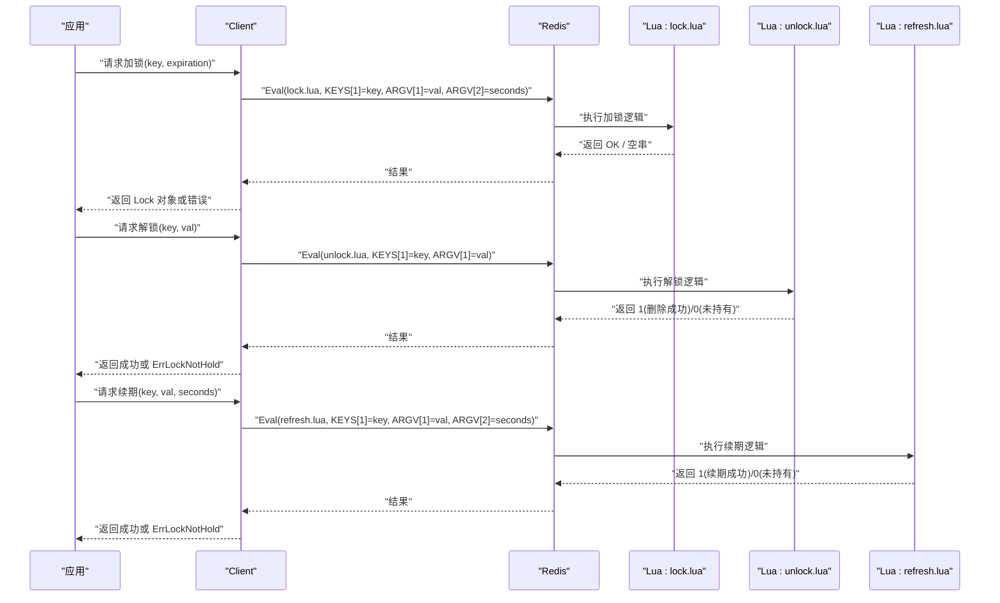
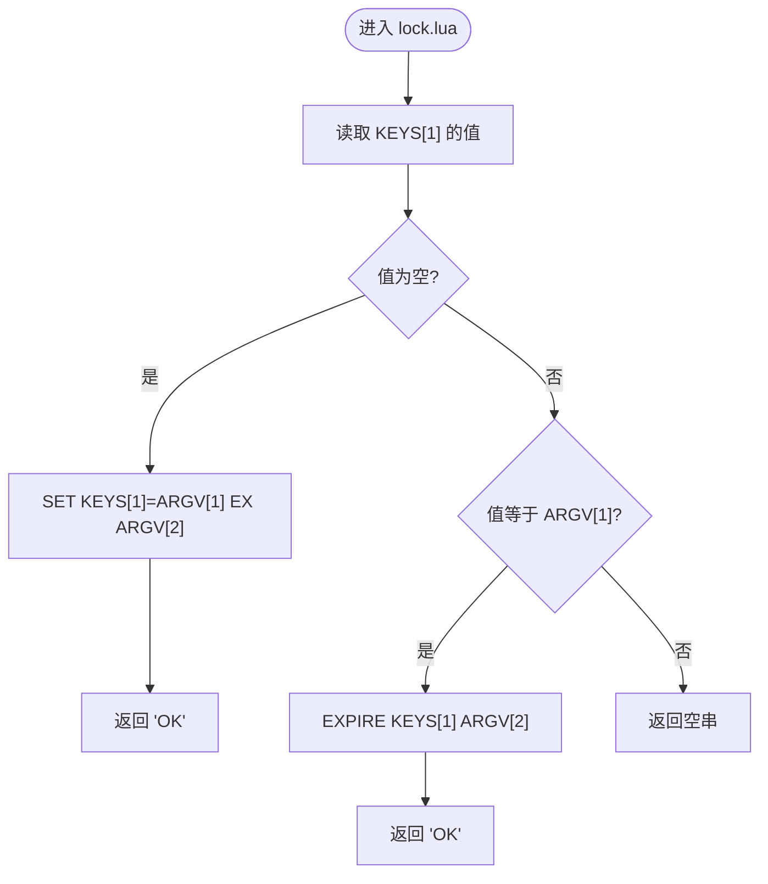
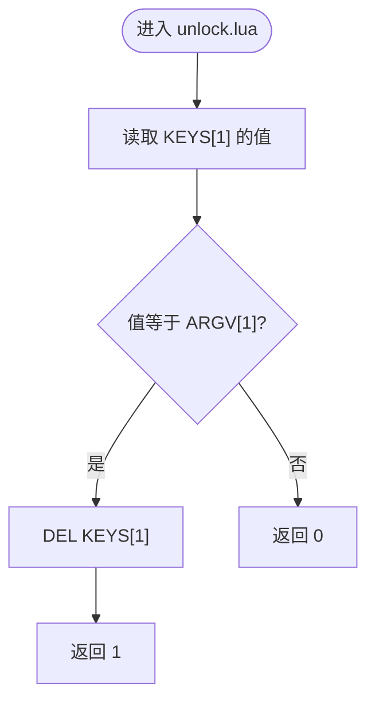
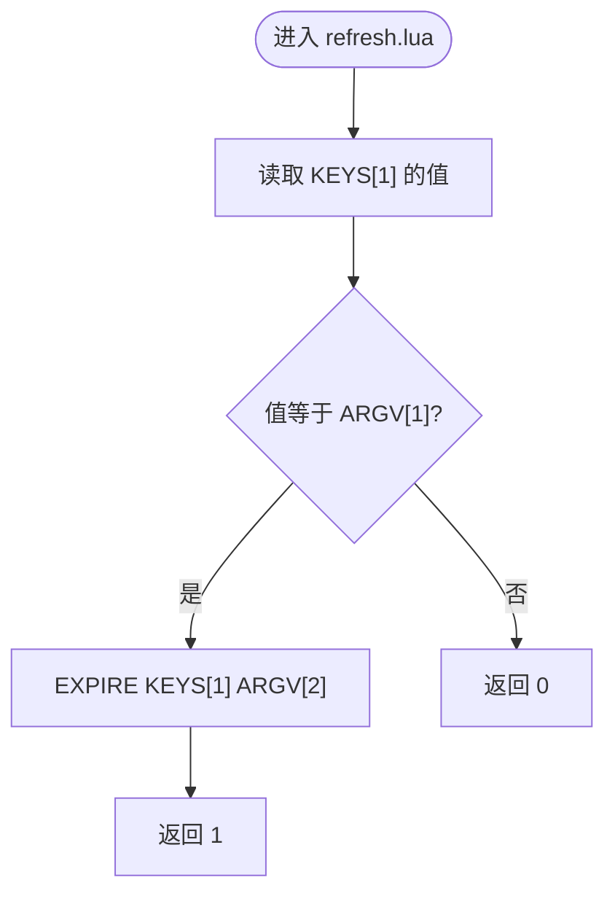
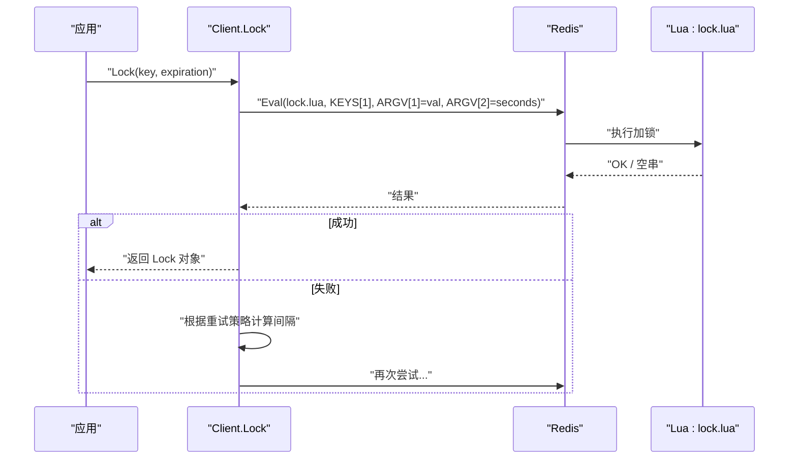
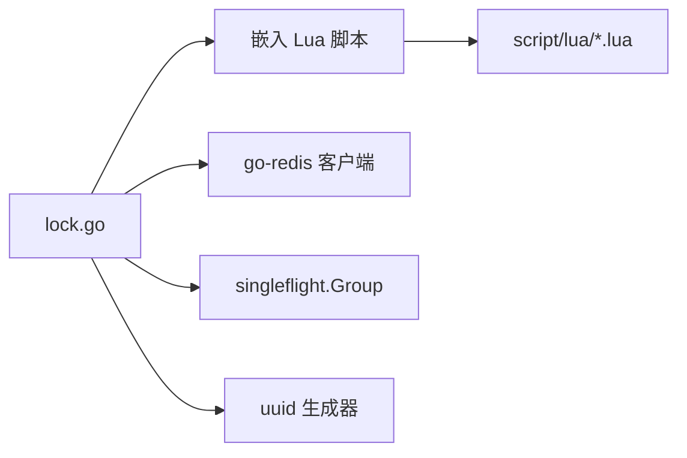

# Lua 脚本机制

<cite>
**本文引用的文件**   
- [lock.go](file://lock.go)
- [script/lua/lock.lua](file://script/lua/lock.lua)
- [script/lua/unlock.lua](file://script/lua/unlock.lua)
- [script/lua/refresh.lua](file://script/lua/refresh.lua)
- [demo/lock.lua](file://demo/lock.lua)
- [demo/unlock.lua](file://demo/unlock.lua)
- [demo/refresh.lua](file://demo/refresh.lua)
- [README.md](file://README.md)
</cite>

## 目录
1. [简介](#简介)
2. [项目结构](#项目结构)
3. [核心组件](#核心组件)
4. [架构总览](#架构总览)
5. [详细组件分析](#详细组件分析)
6. [依赖关系分析](#依赖关系分析)
7. [性能与优化建议](#性能与优化建议)
8. [故障排查指南](#故障排查指南)
9. [结论](#结论)

## 简介
本技术文档聚焦于 Redis 分布式锁中的 Lua 脚本机制，重点解释为什么必须使用 Lua 脚本、原子性保证的重要性，以及三个核心脚本 lock.lua、unlock.lua、refresh.lua 的实现逻辑。文档同时覆盖参数传递、返回值含义、错误处理机制，并提供调试与性能优化建议，帮助开发者深入理解底层实现细节。

## 项目结构
本项目围绕 Redis 分布式锁实现，关键代码位于 Go 层与 Lua 脚本层：
- Go 层负责客户端封装、重试策略、自动续期、上下文超时控制等。
- Lua 脚本层提供加锁、解锁、续期的原子操作，确保在 Redis 侧的强一致性。

图表来源
- [lock.go:62-134](file://lock.go#L62-L134)
- [lock.go:170-229](file://lock.go#L170-L229)
- [lock.go:231-251](file://lock.go#L231-L251)
- [script/lua/lock.lua:1-13](file://script/lua/lock.lua#L1-L13)
- [script/lua/unlock.lua:1-6](file://script/lua/unlock.lua#L1-L6)
- [script/lua/refresh.lua:1-6](file://script/lua/refresh.lua#L1-L6)

章节来源
- [README.md:1-13](file://README.md#L1-L13)

## 核心组件
- Client：封装 Redis 连接与 Eval 调用，提供加锁、尝试加锁、单飞并发保护等能力。
- Lock：表示一次成功获取的锁，包含 key、value、expiration，并支持自动续期与手动刷新。
- Lua 脚本：
  - lock.lua：加锁或续期（根据 value 是否匹配）。
  - unlock.lua：校验并删除锁。
  - refresh.lua：校验并续期。

章节来源
- [lock.go:46-60](file://lock.go#L46-L60)
- [lock.go:151-168](file://lock.go#L151-L168)
- [script/lua/lock.lua:1-13](file://script/lua/lock.lua#L1-L13)
- [script/lua/unlock.lua:1-6](file://script/lua/unlock.lua#L1-L6)
- [script/lua/refresh.lua:1-6](file://script/lua/refresh.lua#L1-L6)

## 架构总览
下图展示从 Go 客户端到 Redis 的完整交互流程，包括加锁、解锁、续期三个阶段。

图表来源
- [lock.go:94-134](file://lock.go#L94-L134)
- [lock.go:219-229](file://lock.go#L219-L229)
- [lock.go:231-251](file://lock.go#L231-L251)
- [script/lua/lock.lua:1-13](file://script/lua/lock.lua#L1-L13)
- [script/lua/unlock.lua:1-6](file://script/lua/unlock.lua#L1-L6)
- [script/lua/refresh.lua:1-6](file://script/lua/refresh.lua#L1-L6)

## 详细组件分析

### 为什么必须使用 Lua 脚本？
- 原子性保证：分布式锁的关键在于“检查并设置”、“检查并删除”、“检查并续期”这些多步操作必须在 Redis 端原子执行，避免并发竞争导致的状态不一致。
- 网络往返最小化：将逻辑下沉到 Redis 侧，减少多次命令的网络开销与竞态窗口。
- 可观测性与可控性：通过脚本统一行为，便于测试、审计与优化。

章节来源
- [script/lua/lock.lua:1-13](file://script/lua/lock.lua#L1-L13)
- [script/lua/unlock.lua:1-6](file://script/lua/unlock.lua#L1-L6)
- [script/lua/refresh.lua:1-6](file://script/lua/refresh.lua#L1-L6)

### 参数传递与返回值约定
- KEYS[1]：锁的键名。
- ARGV[1]：锁的值（唯一标识，通常为 UUID），用于校验所有权。
- ARGV[2]：过期时间（秒），用于设置或续期。
- 返回值约定：
  - 加锁：成功返回 "OK"；失败返回空串。
  - 解锁：成功返回 1；失败返回 0。
  - 续期：成功返回 1；失败返回 0。

章节来源
- [script/lua/lock.lua:1-13](file://script/lua/lock.lua#L1-L13)
- [script/lua/unlock.lua:1-6](file://script/lua/unlock.lua#L1-L6)
- [script/lua/refresh.lua:1-6](file://script/lua/refresh.lua#L1-L6)
- [lock.go:104-113](file://lock.go#L104-L113)
- [lock.go:219-229](file://lock.go#L219-L229)
- [lock.go:231-251](file://lock.go#L231-L251)

### 加锁脚本 lock.lua 分析
- 逻辑要点：
  - 若 key 不存在，则设置 key=value，并设置过期时间。
  - 若 key 存在且 value 匹配，则视为当前持有者进行续期。
  - 否则，说明被其他客户端持有，返回失败。
- 设计考量：
  - 通过 value 校验防止误删他人锁。
  - 区分“首次加锁”和“续期”两种路径，提升可用性。

图表来源
- [script/lua/lock.lua:1-13](file://script/lua/lock.lua#L1-L13)

章节来源
- [script/lua/lock.lua:1-13](file://script/lua/lock.lua#L1-L13)

### 解锁脚本 unlock.lua 分析
- 逻辑要点：
  - 读取 KEYS[1] 的值并与 ARGV[1] 比较。
  - 若相等，则删除该 key，返回 1。
  - 否则返回 0，表示未持有锁或值不匹配。

图表来源
- [script/lua/unlock.lua:1-6](file://script/lua/unlock.lua#L1-L6)

章节来源
- [script/lua/unlock.lua:1-6](file://script/lua/unlock.lua#L1-L6)

### 续期脚本 refresh.lua 分析
- 逻辑要点：
  - 读取 KEYS[1] 的值并与 ARGV[1] 比较。
  - 若相等，则更新过期时间为 ARGV[2]，返回 1。
  - 否则返回 0，表示未持有锁或值不匹配。

图表来源
- [script/lua/refresh.lua:1-6](file://script/lua/refresh.lua#L1-L6)

章节来源
- [script/lua/refresh.lua:1-6](file://script/lua/refresh.lua#L1-L6)

### Go 层集成与错误处理
- 加锁流程：
  - 生成唯一 value（UUID）。
  - 调用 Eval 执行 lock.lua，传入 key、value、过期时间（秒）。
  - 解析返回值："OK" 表示成功，否则按重试策略继续尝试。
  - 超时或达到重试上限时返回相应错误。
- 解锁流程：
  - 调用 Eval 执行 unlock.lua，传入 key、value。
  - 解析返回值：1 表示成功，0 或 redis.Nil 表示未持有锁。
- 续期流程：
  - 调用 Eval 执行 refresh.lua，传入 key、value、过期时间（秒）。
  - 解析返回值：1 表示成功，0 表示未持有锁。

图表来源
- [lock.go:94-134](file://lock.go#L94-L134)
- [script/lua/lock.lua:1-13](file://script/lua/lock.lua#L1-L13)

章节来源
- [lock.go:94-134](file://lock.go#L94-L134)
- [lock.go:219-229](file://lock.go#L219-L229)
- [lock.go:231-251](file://lock.go#L231-L251)

### demo 脚本与生产脚本的差异
- demo 脚本更简洁，适合教学演示；生产脚本在边界条件与返回值上更严谨。
- 差异点示例：
  - demo/lock.lua 使用 SET NX PX 进行加锁；生产 script/lua/lock.lua 使用 GET + SET EX 分支处理，并在匹配时显式续期。
  - demo/unlock.lua 与 demo/refresh.lua 注释与命名更直白；生产版本保持紧凑实现。

章节来源
- [demo/lock.lua:1-8](file://demo/lock.lua#L1-L8)
- [demo/unlock.lua:1-8](file://demo/unlock.lua#L1-L8)
- [demo/refresh.lua:1-8](file://demo/refresh.lua#L1-L8)
- [script/lua/lock.lua:1-13](file://script/lua/lock.lua#L1-L13)
- [script/lua/unlock.lua:1-6](file://script/lua/unlock.lua#L1-L6)
- [script/lua/refresh.lua:1-6](file://script/lua/refresh.lua#L1-L6)

## 依赖关系分析
- Go 层通过 embed 将 Lua 脚本打包进二进制，运行时直接 Eval 执行，避免外部依赖。
- Client 依赖 Redis 客户端库（go-redis）进行网络通信。
- Lock 对象内部维护 channel 与信号量，用于自动续期与优雅退出。

图表来源
- [lock.go:17-28](file://lock.go#L17-L28)
- [lock.go:30-38](file://lock.go#L30-L38)

章节来源
- [lock.go:17-28](file://lock.go#L17-L28)
- [lock.go:30-38](file://lock.go#L30-L38)

## 性能与优化建议
- 使用 EVAL 而非多条命令：减少网络往返与竞态窗口，提高吞吐与一致性。
- 合理设置过期时间：避免频繁续期造成额外负载；结合业务耗时估算。
- 重试策略调优：指数退避或抖动随机，避免雪崩；限制最大重试次数。
- 单飞并发保护：对同一 key 的加锁请求合并，降低 Redis 压力。
- 自动续期节流：避免高频续期，结合业务心跳周期调整 ticker 间隔。
- 监控与指标：记录加锁成功率、平均延迟、续期失败率，定位热点 key。

[本节为通用指导，不涉及具体文件分析]

## 故障排查指南
- 常见错误与含义：
  - 加锁失败：可能由于锁被占用或网络超时；检查重试策略与上下文超时。
  - 解锁失败（ErrLockNotHold）：可能是 value 不匹配或被其他客户端绕过 rlock 直接操作 Redis。
  - 续期失败（ErrLockNotHold）：可能已过期或被其他客户端抢占。
- 排查步骤：
  - 确认 key 是否存在及对应 value 是否正确。
  - 检查 Redis 日志与慢查询，评估脚本执行耗时。
  - 验证客户端是否重复解锁或异常退出导致未释放锁。
  - 观察自动续期是否正常工作，必要时调整 interval 与 timeout。

章节来源
- [lock.go:39-44](file://lock.go#L39-L44)
- [lock.go:219-229](file://lock.go#L219-L229)
- [lock.go:231-251](file://lock.go#L231-L251)

## 结论
通过 Lua 脚本将加锁、解锁、续期逻辑下沉至 Redis 侧，实现了分布式锁的原子性与强一致性。Go 层在此基础上提供了重试、单飞、自动续期等实用能力，使分布式锁在生产环境中具备高可用与易运维特性。开发者应严格遵循脚本的参数与返回值约定，并结合业务场景调优重试与续期策略，以获得稳定可靠的分布式同步能力。