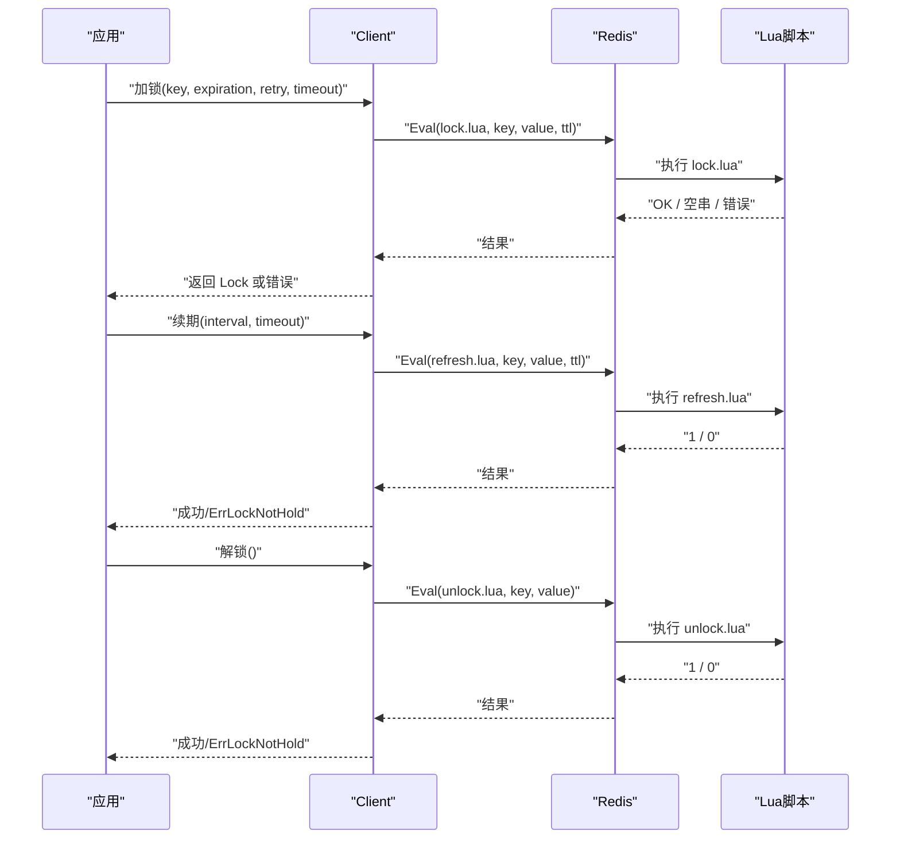
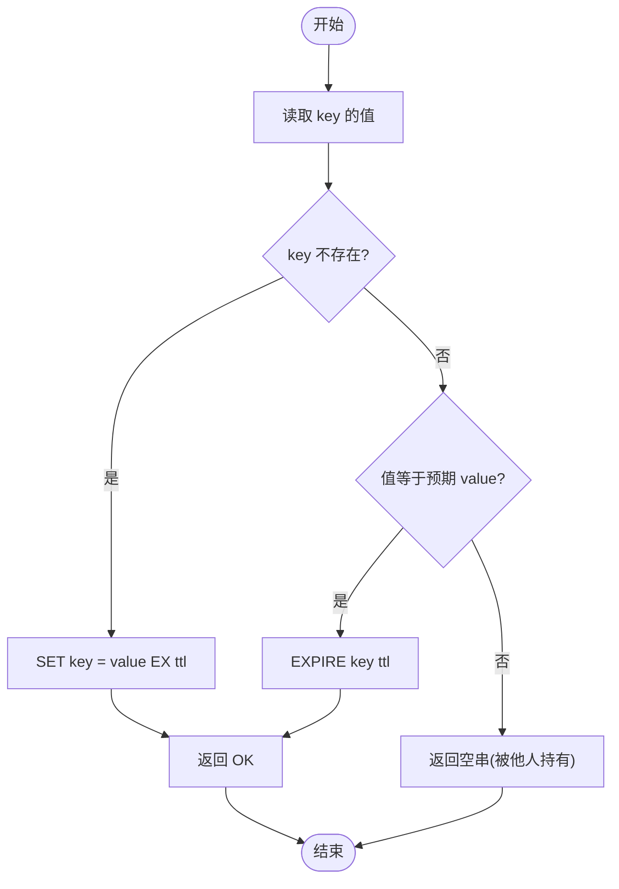
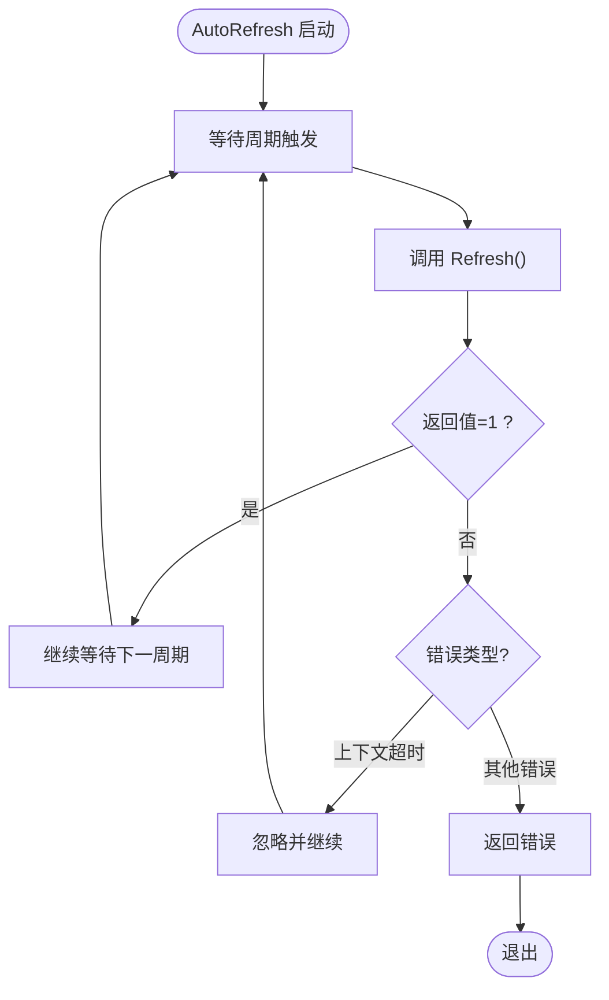
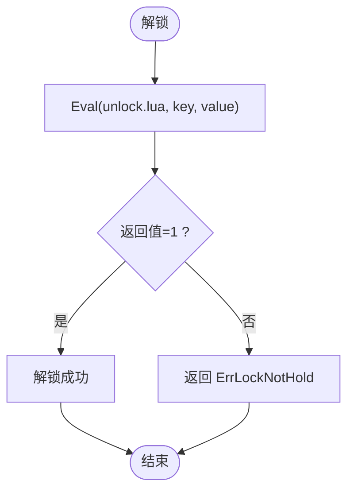
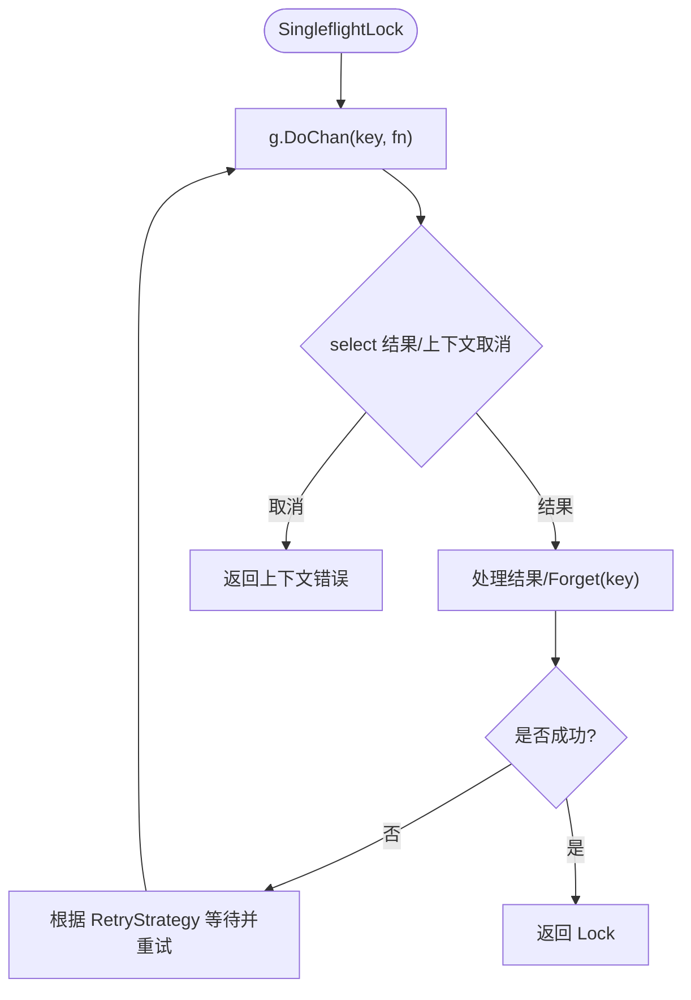
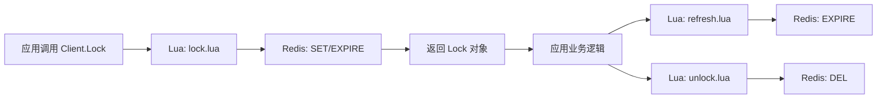

# Redis 实现原理

<cite>
**本文引用的文件**   
- [lock.go](file://lock.go)
- [retry.go](file://retry.go)
- [script/lua/lock.lua](file://script/lua/lock.lua)
- [script/lua/refresh.lua](file://script/lua/refresh.lua)
- [script/lua/unlock.lua](file://script/lua/unlock.lua)
- [demo/lock.lua](file://demo/lock.lua)
- [demo/refresh.lua](file://demo/refresh.lua)
- [demo/unlock.lua](file://demo/unlock.lua)
- [README.md](file://README.md)
</cite>

## 目录
1. [引言](#引言)
2. [项目结构](#项目结构)
3. [核心组件](#核心组件)
4. [架构总览](#架构总览)
5. [详细组件分析](#详细组件分析)
6. [依赖关系分析](#依赖关系分析)
7. [性能与可靠性考量](#性能与可靠性考量)
8. [故障排查指南](#故障排查指南)
9. [结论](#结论)

## 引言
本仓库实现了一个基于 Redis 的分布式锁，提供加锁、自动续期与解锁能力。其设计重点在于：
- 使用 Redis 的高性能与原子性保证跨进程/跨机器的互斥访问。
- 通过 Lua 脚本将“判断 + 设置/更新/删除”合并为一次原子执行，避免竞态条件。
- 引入过期时间防止死锁，并提供自动续期机制支持长时间任务。
- 封装重试策略与单次飞（singleflight）去重，提升成功率并降低并发风暴。

选择 Redis 的原因：
- 高性能：内存存储、单线程命令执行，天然具备低延迟与高吞吐。
- 原子操作：SETNX、EXPIRE/PX、DEL 等命令在 Redis 中是原子的；Lua 脚本可组合多个命令为原子执行。
- 广泛采用：生态成熟、客户端库丰富、运维经验丰富。

**章节来源**
- [README.md:1-13](file://README.md#L1-L13)

## 项目结构
仓库主要包含以下部分：
- Go 核心逻辑：Client/Lock 类型、加锁/解锁/续期流程、重试策略。
- Lua 脚本：嵌入到 Go 二进制中，用于在 Redis 侧原子执行关键逻辑。
- demo 脚本：教学示例脚本，便于理解思路。
- 测试与辅助脚本：集成测试、环境准备等。

```mermaid
graph TB
subgraph "Go 应用"
Client["Client<br/>加锁/解锁/续期"]
Lock["Lock<br/>持有锁状态"]
Retry["RetryStrategy<br/>固定间隔重试"]
end
subgraph "Redis 服务端"
LuaLock["Lua: lock.lua"]
LuaRefresh["Lua: refresh.lua"]
LuaUnlock["Lua: unlock.lua"]
KV["键值存储<br/>key -> value(唯一标识)"]
end
Client --> |Eval(lock.lua)| LuaLock
Client --> |Eval(refresh.lua)| LuaRefresh
Client --> |Eval(unlock.lua)| LuaUnlock
LuaLock --> KV
LuaRefresh --> KV
LuaUnlock --> KV
Client --> Retry
```

**图表来源**
- [lock.go:46-60](file://lock.go#L46-L60)
- [lock.go:94-149](file://lock.go#L94-L149)
- [lock.go:170-251](file://lock.go#L170-L251)
- [script/lua/lock.lua:1-13](file://script/lua/lock.lua#L1-L13)
- [script/lua/refresh.lua:1-6](file://script/lua/refresh.lua#L1-L6)
- [script/lua/unlock.lua:1-6](file://script/lua/unlock.lua#L1-L6)

**章节来源**
- [lock.go:15-28](file://lock.go#L15-L28)
- [lock.go:46-60](file://lock.go#L46-L60)
- [retry.go:19-35](file://retry.go#L19-L35)

## 核心组件
- Client：对外暴露加锁、尝试加锁、带 singleflight 的去重加锁等方法，内部维护 Redis 连接与值生成器。
- Lock：表示已获取的锁对象，封装 key/value/expiration，并提供 Refresh/Unlock/AutoRefresh。
- RetryStrategy：定义重试策略接口，内置固定间隔重试 FixIntervalRetry。
- Lua 脚本：lock.lua/refresh.lua/unlock.lua，分别实现加锁、续期、解锁的原子逻辑。

关键职责划分：
- Go 层负责流程编排、超时控制、重试与并发安全。
- Redis 层通过 Lua 脚本保证“读-判-写”的原子性，避免竞态。

**章节来源**
- [lock.go:46-60](file://lock.go#L46-L60)
- [lock.go:151-168](file://lock.go#L151-L168)
- [retry.go:19-35](file://retry.go#L19-L35)
- [script/lua/lock.lua:1-13](file://script/lua/lock.lua#L1-L13)
- [script/lua/refresh.lua:1-6](file://script/lua/refresh.lua#L1-L6)
- [script/lua/unlock.lua:1-6](file://script/lua/unlock.lua#L1-L6)

## 架构总览
下图展示客户端与 Redis 之间的交互时序，涵盖加锁、续期、解锁三个关键路径。



**图表来源**
- [lock.go:94-149](file://lock.go#L94-L149)
- [lock.go:219-251](file://lock.go#L219-L251)
- [script/lua/lock.lua:1-13](file://script/lua/lock.lua#L1-L13)
- [script/lua/refresh.lua:1-6](file://script/lua/refresh.lua#L1-L6)
- [script/lua/unlock.lua:1-6](file://script/lua/unlock.lua#L1-L6)

## 详细组件分析

### 加锁流程与 SETNX 的作用
- 推荐路径（Lua 原子化）：Client.Lock 调用 Eval(lock.lua)，在 Redis 侧完成“读取 key -> 判断是否等于预期值 -> 不存在则 SET EX -> 存在且匹配则刷新 TTL”。该方式避免了多次网络往返与竞态。
- 快速路径（非阻塞）：Client.TryLock 直接使用 SETNX 设置 key=value 并附带过期时间，若失败直接返回竞争失败。适用于对延迟敏感、允许立即失败的场合。

为什么需要 Lua 脚本？
- 将“get + set/expire”合并为一次原子执行，避免“检查后设置”的经典竞态。
- 在重试场景下，能够识别“自己上一次是否已成功加锁”，从而正确刷新过期时间而非重复覆盖。



**图表来源**
- [script/lua/lock.lua:1-13](file://script/lua/lock.lua#L1-L13)
- [lock.go:94-149](file://lock.go#L94-L149)

**章节来源**
- [lock.go:94-149](file://lock.go#L94-L149)
- [script/lua/lock.lua:1-13](file://script/lua/lock.lua#L1-L13)

### 续期机制与 AutoRefresh
- 手动续期：Lock.Refresh 调用 refresh.lua，校验当前 key 的值是否为自身 value，若是则刷新过期时间，否则返回“未持有锁”错误。
- 自动续期：Lock.AutoRefresh 启动定时任务，周期性调用 Refresh，直到收到解锁信号或发生错误。



**图表来源**
- [lock.go:170-217](file://lock.go#L170-L217)
- [script/lua/refresh.lua:1-6](file://script/lua/refresh.lua#L1-L6)

**章节来源**
- [lock.go:170-217](file://lock.go#L170-L217)
- [script/lua/refresh.lua:1-6](file://script/lua/refresh.lua#L1-L6)

### 解锁流程
- Unlock 调用 unlock.lua，仅当 key 的值等于自身 value 时才删除 key，确保不会误删他人持有的锁。
- 为避免重复解锁导致 panic，内部使用 Once 与 channel 进行幂等处理。



**图表来源**
- [lock.go:231-251](file://lock.go#L231-L251)
- [script/lua/unlock.lua:1-6](file://script/lua/unlock.lua#L1-L6)

**章节来源**
- [lock.go:231-251](file://lock.go#L231-L251)
- [script/lua/unlock.lua:1-6](file://script/lua/unlock.lua#L1-L6)

### 重试与 Singleflight
- 重试策略：RetryStrategy.Next 决定下一次重试间隔与是否继续重试；FixIntervalRetry 提供固定间隔重试。
- Singleflight：SingleflightLock 对同一 key 的并发加锁请求进行合并，减少 Redis 压力与重复计算。



**图表来源**
- [lock.go:62-82](file://lock.go#L62-L82)
- [retry.go:19-35](file://retry.go#L19-L35)

**章节来源**
- [lock.go:62-82](file://lock.go#L62-L82)
- [retry.go:19-35](file://retry.go#L19-L35)

### 数据流图：加锁/续期/解锁


**图表来源**
- [lock.go:94-149](file://lock.go#L94-L149)
- [lock.go:219-251](file://lock.go#L219-L251)
- [script/lua/lock.lua:1-13](file://script/lua/lock.lua#L1-L13)
- [script/lua/refresh.lua:1-6](file://script/lua/refresh.lua#L1-L6)
- [script/lua/unlock.lua:1-6](file://script/lua/unlock.lua#L1-L6)

## 依赖关系分析
- Go 层依赖 go-redis 客户端进行 Redis 通信。
- Lua 脚本通过 redis.call 调用 Redis 命令，保证原子性。
- 值生成器默认使用 UUID，确保不同客户端/实例的 value 唯一。

```mermaid
classDiagram
class Client {
-client : redis.Cmdable
-g : singleflight.Group
-valuer : func() string
+NewClient(client)
+SingleflightLock(ctx,key,expiration,retry,timeout) *Lock,error
+Lock(ctx,key,expiration,retry,timeout) *Lock,error
+TryLock(ctx,key,expiration) *Lock,error
}
class Lock {
-client : redis.Cmdable
-key : string
-value : string
-expiration : time.Duration
-unlock : chan struct{}
+AutoRefresh(interval,timeout) error
+Refresh(ctx) error
+Unlock(ctx) error
}
class RetryStrategy {
<<interface>>
+Next() (time.Duration,bool)
}
class FixIntervalRetry {
+Interval : time.Duration
+Max : int
+Next() (time.Duration,bool)
}
Client --> Lock : "创建"
Client --> RetryStrategy : "使用"
FixIntervalRetry ..|> RetryStrategy
```

**图表来源**
- [lock.go:46-60](file://lock.go#L46-L60)
- [lock.go:94-149](file://lock.go#L94-L149)
- [lock.go:151-168](file://lock.go#L151-L168)
- [lock.go:170-251](file://lock.go#L170-L251)
- [retry.go:19-35](file://retry.go#L19-L35)

**章节来源**
- [lock.go:46-60](file://lock.go#L46-L60)
- [lock.go:94-149](file://lock.go#L94-L149)
- [lock.go:151-168](file://lock.go#L151-L168)
- [lock.go:170-251](file://lock.go#L170-L251)
- [retry.go:19-35](file://retry.go#L19-L35)

## 性能与可靠性考量
- 原子性与一致性
  - 使用 Lua 脚本将“判断+写入/更新/删除”合并为一次执行，避免竞态。
  - TryLock 使用 SETNX 作为快速路径，适合低延迟、可接受立即失败的场景。
- 超时与死锁防护
  - 所有 key 均设置过期时间，即使客户端崩溃也能自动释放，防止死锁。
  - AutoRefresh 周期性续期，保障长任务期间锁不失效。
- 重试与退避
  - 通过 RetryStrategy 控制重试间隔与次数，避免雪崩。
  - Singleflight 合并相同 key 的并发加锁请求，降低 Redis 压力。
- 幂等与安全性
  - 解锁前校验 value，确保只释放自己的锁。
  - Unlock 内部使用 Once 与 channel 防止重复解锁导致的 panic。
- 潜在问题与建议
  - 时钟漂移：建议合理设置过期时间与续期间隔，避免频繁续期失败。
  - 网络抖动：结合重试策略与上下文超时，提高鲁棒性。
  - 大 key/热点 key：注意 key 命名空间隔离，避免热点冲突。

[本节为通用指导，不直接分析具体文件]

## 故障排查指南
- 常见错误
  - 抢锁失败：超过重试次数或最后一次重试仍失败。
  - 未持有锁：解锁或续期时检测到 key 不存在或 value 不匹配，可能被人绕过 rlock 直接操作 Redis。
  - 上下文超时：整体加锁或续期调用超时，需检查网络与 Redis 负载。
- 定位步骤
  - 检查 Redis 中对应 key 是否存在及其 TTL。
  - 确认 value 是否与当前客户端一致，避免误删他人锁。
  - 观察 AutoRefresh 是否正常运行，必要时调整 interval 与 timeout。
  - 评估重试策略参数，避免过于激进导致放大负载。

**章节来源**
- [lock.go:39-44](file://lock.go#L39-L44)
- [lock.go:114-122](file://lock.go#L114-L122)
- [lock.go:219-251](file://lock.go#L219-L251)

## 结论
该实现以 Redis 为核心，借助 Lua 脚本保证原子性，结合过期时间、自动续期与重试机制，提供了稳定可靠的分布式锁能力。通过 Singleflight 降低并发风暴风险，并通过严格的 value 校验确保解锁安全。建议在业务中使用 Lua 原子路径以获得更强的一致性，同时合理配置过期时间与续期策略，以平衡安全性与可用性。

[本节为总结性内容，不直接分析具体文件]