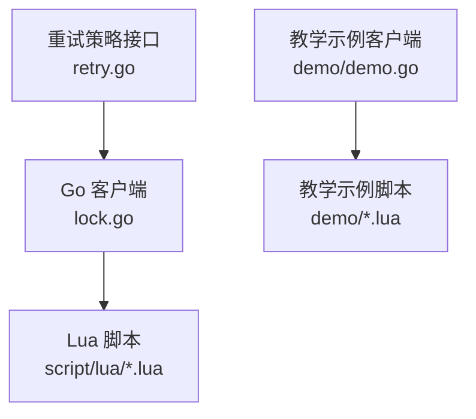
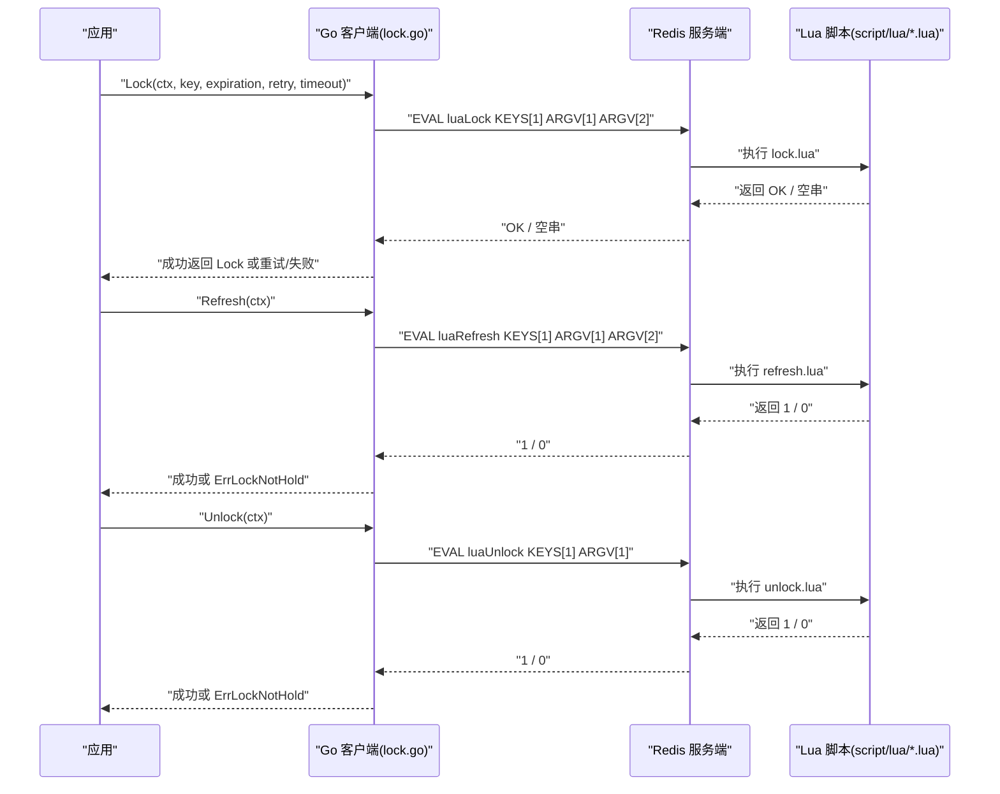
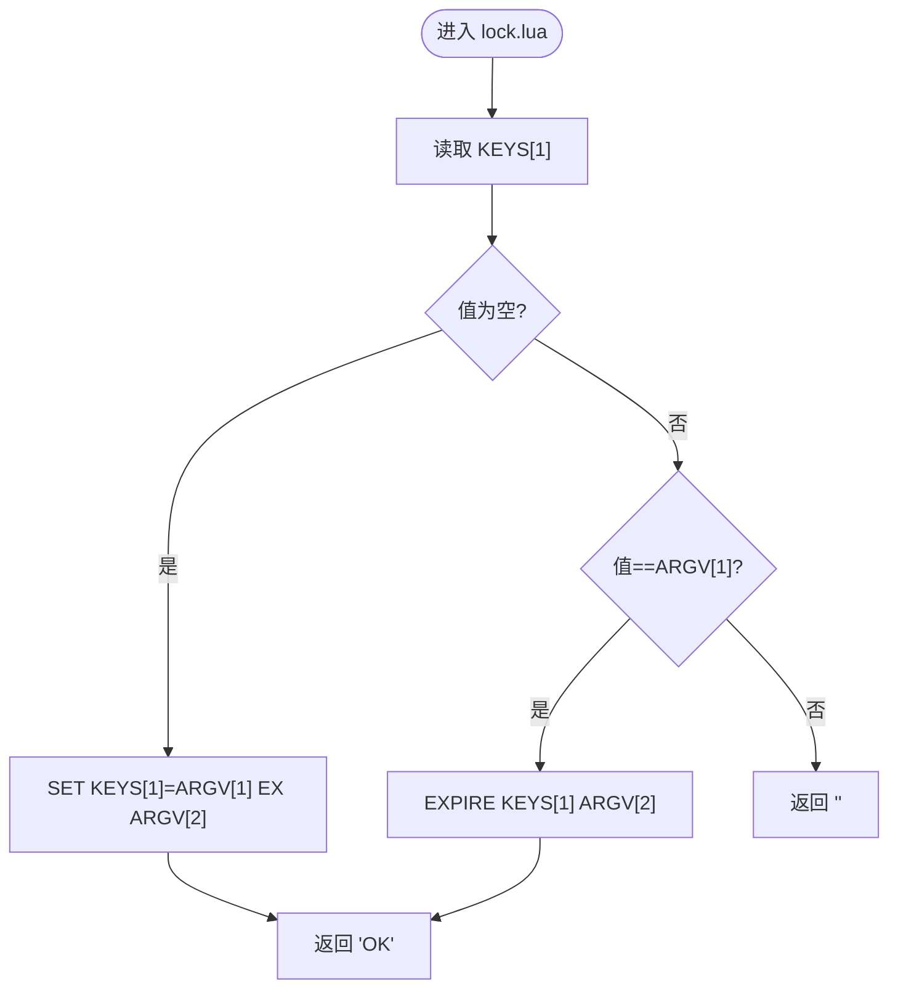
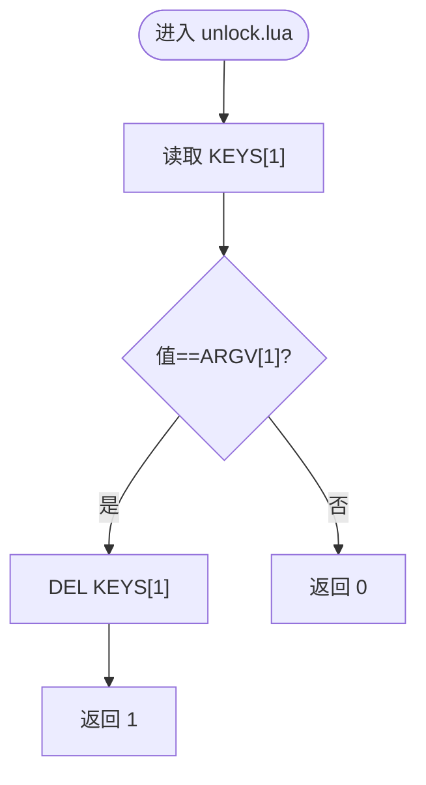
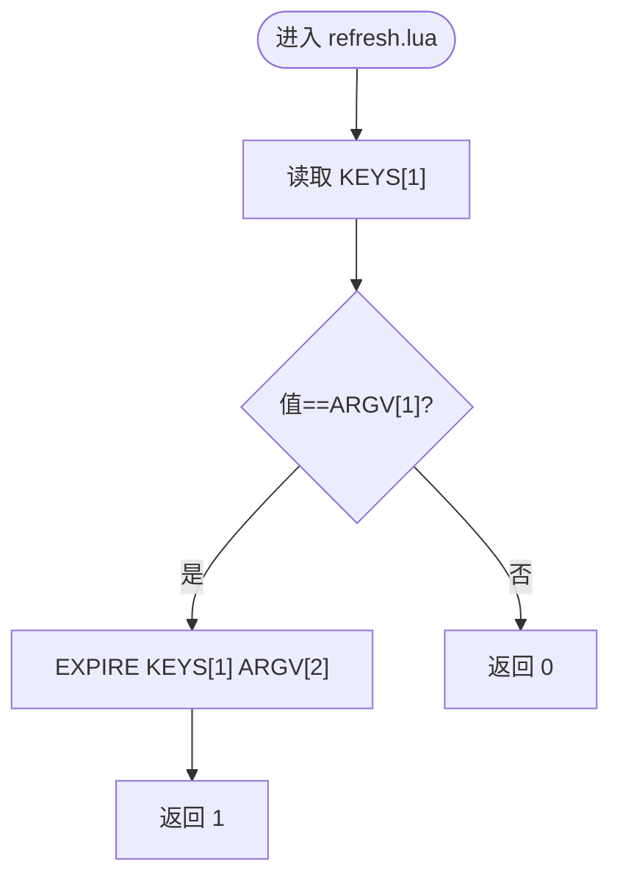
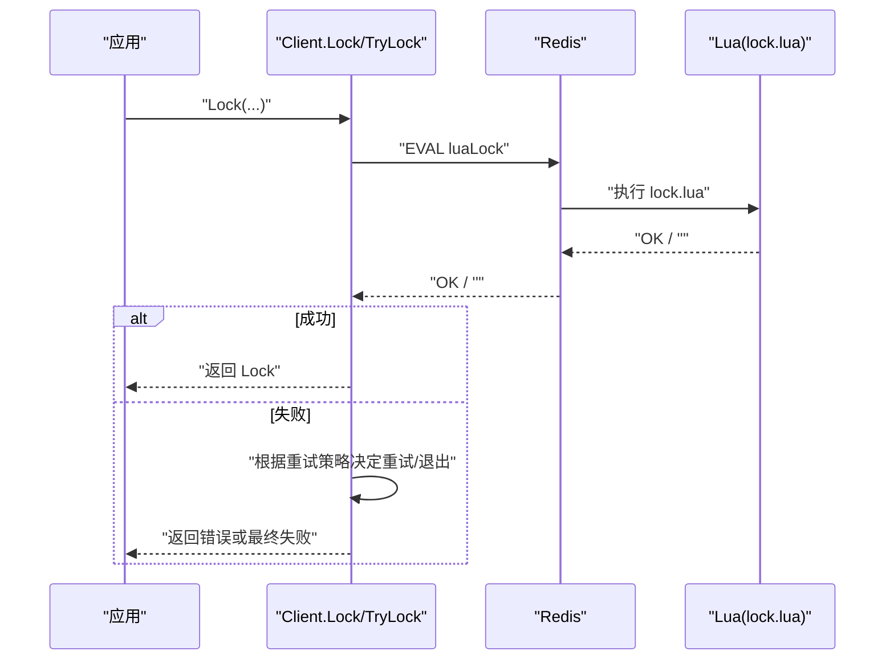
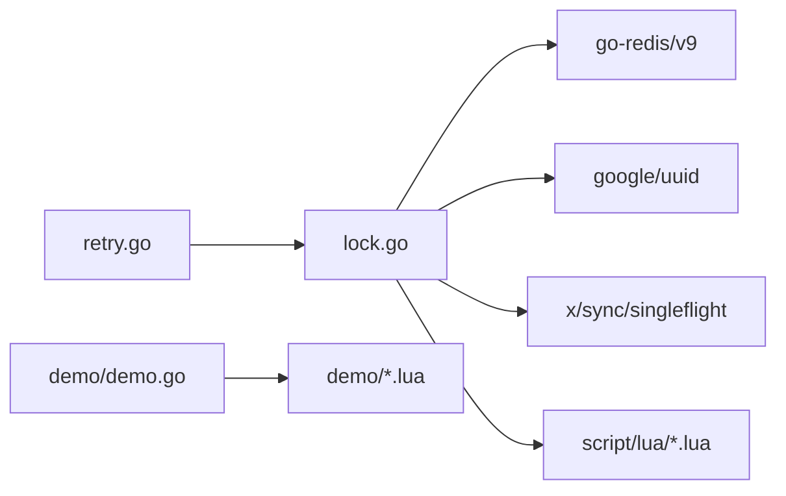

# 原子性保证机制

<cite>
**本文引用的文件**   
- [README.md](file://README.md)
- [lock.go](file://lock.go)
- [retry.go](file://retry.go)
- [demo/demo.go](file://demo/demo.go)
- [script/lua/lock.lua](file://script/lua/lock.lua)
- [script/lua/unlock.lua](file://script/lua/unlock.lua)
- [script/lua/refresh.lua](file://script/lua/refresh.lua)
- [demo/lock.lua](file://demo/lock.lua)
- [demo/unlock.lua](file://demo/unlock.lua)
- [demo/refresh.lua](file://demo/refresh.lua)
</cite>

## 目录
1. [简介](#简介)
2. [项目结构](#项目结构)
3. [核心组件](#核心组件)
4. [架构总览](#架构总览)
5. [详细组件分析](#详细组件分析)
6. [依赖关系分析](#依赖关系分析)
7. [性能与可扩展性](#性能与可扩展性)
8. [故障排查指南](#故障排查指南)
9. [结论](#结论)

## 简介
本文件围绕 Redis 分布式锁的原子性保证机制展开，重点解释：
- 为什么使用 Lua 脚本而非直接组合多个 Redis 命令
- Lua 脚本如何确保加锁、解锁、续期的原子性
- SETNX 的工作原理及其与 Lua 脚本的结合方式
- lock.lua、unlock.lua、refresh.lua 三个脚本的参数、返回值与执行流程
- 在 Go 中调用这些脚本的方式与错误处理
- 性能考量与常见问题解决方案

## 项目结构
仓库包含生产实现与教学示例两套代码：
- 生产实现位于根目录与 script/lua 子目录
- 教学示例位于 demo 子目录（README 说明其用于课程演示，可能包含缺陷）

图表来源
- [lock.go:17-48](file://lock.go#L17-L48)
- [script/lua/lock.lua:1-13](file://script/lua/lock.lua#L1-L13)
- [script/lua/unlock.lua:1-6](file://script/lua/unlock.lua#L1-L6)
- [script/lua/refresh.lua:1-6](file://script/lua/refresh.lua#L1-L6)
- [demo/demo.go:19-40](file://demo/demo.go#L19-L40)
- [demo/lock.lua:1-8](file://demo/lock.lua#L1-L8)
- [demo/unlock.lua:1-8](file://demo/unlock.lua#L1-L8)
- [demo/refresh.lua:1-8](file://demo/refresh.lua#L1-L8)
- [retry.go:19-35](file://retry.go#L19-L35)

章节来源
- [README.md:1-13](file://README.md#L1-L13)

## 核心组件
- 客户端 Client：封装 Redis 连接、值生成器、并发控制与重试逻辑
- 锁对象 Lock：持有 key/value/过期时间，提供 Refresh、Unlock、AutoRefresh 等方法
- Lua 脚本：分别实现加锁、解锁、续期，并通过 EVAL 在 Redis 侧原子执行
- 重试策略 RetryStrategy：定义 Next() 返回下一次重试间隔与是否继续重试

章节来源
- [lock.go:46-60](file://lock.go#L46-L60)
- [lock.go:151-168](file://lock.go#L151-L168)
- [retry.go:19-35](file://retry.go#L19-L35)

## 架构总览
下图展示 Go 客户端通过 redis.Cmdable 调用 EVAL 执行 Lua 脚本，Redis 在服务端原子地执行脚本中的多条命令。

图表来源
- [lock.go:94-134](file://lock.go#L94-L134)
- [lock.go:219-251](file://lock.go#L219-L251)
- [script/lua/lock.lua:1-13](file://script/lua/lock.lua#L1-L13)
- [script/lua/unlock.lua:1-6](file://script/lua/unlock.lua#L1-L6)
- [script/lua/refresh.lua:1-6](file://script/lua/refresh.lua#L1-L6)

## 详细组件分析

### 为什么需要 Lua 脚本而不是直接使用 Redis 命令
- 原子性需求：加锁、解锁、续期都涉及“先判断再修改”的多步操作。若拆成多个独立命令，在高并发下会出现竞态条件（例如两个客户端同时读到 key 不存在并写入）。
- 事务限制：Redis 事务不保证原子性（EXEC 前可被其他客户端打断），且不支持条件分支。
- Lua 优势：EVAL 将脚本整体发送到 Redis 服务端，在执行期间不会被其他命令插入，天然具备原子性；同时支持条件分支与返回值，便于表达复杂逻辑。

章节来源
- [lock.go:94-134](file://lock.go#L94-L134)
- [script/lua/lock.lua:1-13](file://script/lua/lock.lua#L1-L13)

### SETNX 的工作原理与结合方式
- SETNX 语义：当键不存在时设置值并返回 true；否则返回 false。该操作本身是原子的。
- 适用场景：一次性尝试获取锁且不考虑自动续期、重试等复杂逻辑时，可直接使用 SETNX。
- 与 Lua 的关系：
  - 简单路径：TryLock 直接使用 SETNX 完成一次尝试加锁。
  - 复杂路径：Lua 脚本内部也采用“读取-判断-写入”的模式，但通过 EVAL 保证多步操作的原子性，从而支持更复杂的加锁/续期逻辑。

章节来源
- [lock.go:136-149](file://lock.go#L136-L149)
- [demo/demo.go:112-124](file://demo/demo.go#L112-L124)

### 脚本一：lock.lua（加锁与续期）
- 参数
  - KEYS[1]：锁键名
  - ARGV[1]：客户端唯一标识（value）
  - ARGV[2]：过期时间（秒）
- 返回值
  - 成功加锁或续期：字符串 "OK"
  - 竞争失败：空字符串 ""
- 执行流程
  1) 读取当前值
  2) 若键不存在：SET 带 EX 原子设置键与过期时间
  3) 若值等于传入 value：EXPIRE 刷新过期时间并返回 "OK"
  4) 否则：返回空串表示被他人持有

图表来源
- [script/lua/lock.lua:1-13](file://script/lua/lock.lua#L1-L13)

章节来源
- [script/lua/lock.lua:1-13](file://script/lua/lock.lua#L1-L13)
- [lock.go:94-134](file://lock.go#L94-L134)

### 脚本二：unlock.lua（解锁）
- 参数
  - KEYS[1]：锁键名
  - ARGV[1]：客户端唯一标识（value）
- 返回值
  - 成功删除：整数 1
  - 未持有或键不存在：整数 0
- 执行流程
  1) 读取当前值
  2) 若值等于传入 value：DEL 删除键并返回 1
  3) 否则：返回 0

图表来源
- [script/lua/unlock.lua:1-6](file://script/lua/unlock.lua#L1-L6)

章节来源
- [script/lua/unlock.lua:1-6](file://script/lua/unlock.lua#L1-L6)
- [lock.go:231-251](file://lock.go#L231-L251)

### 脚本三：refresh.lua（续期）
- 参数
  - KEYS[1]：锁键名
  - ARGV[1]：客户端唯一标识（value）
  - ARGV[2]：新的过期时间（秒）
- 返回值
  - 成功续期：整数 1
  - 未持有或键不存在：整数 0
- 执行流程
  1) 读取当前值
  2) 若值等于传入 value：EXPIRE 设置新过期时间并返回 1
  3) 否则：返回 0

图表来源
- [script/lua/refresh.lua:1-6](file://script/lua/refresh.lua#L1-L6)

章节来源
- [script/lua/refresh.lua:1-6](file://script/lua/refresh.lua#L1-L6)
- [lock.go:219-229](file://lock.go#L219-L229)

### Go 客户端调用与错误处理
- 加锁
  - 通过 client.Eval 调用 luaLock，传入 key、value、过期时间（秒）
  - 成功返回 "OK"，构造 Lock 对象；否则根据重试策略决定是否重试
  - 非超时错误通常不可恢复（如网络断开、服务端异常），直接返回
- TryLock
  - 直接使用 SETNX 进行一次尝试，成功则返回 Lock，失败返回竞争错误
- 续期
  - 通过 client.Eval 调用 luaRefresh，校验返回值是否为 1，否则返回“未持有锁”错误
- 解锁
  - 通过 client.Eval 调用 luaUnlock，校验返回值是否为 1，否则返回“未持有锁”错误
  - 使用 sync.Once 避免重复解锁导致 panic

图表来源
- [lock.go:94-134](file://lock.go#L94-L134)
- [script/lua/lock.lua:1-13](file://script/lua/lock.lua#L1-L13)

章节来源
- [lock.go:94-149](file://lock.go#L94-L149)
- [lock.go:219-251](file://lock.go#L219-L251)

### 教学示例与生产实现的差异
- 教学示例（demo）
  - 使用 demo/*.lua 脚本，参数与返回值略有不同（例如续期使用毫秒、布尔返回值等）
  - 适合学习理解，但 README 明确提示可能存在缺陷
- 生产实现（lock.go + script/lua/*.lua）
  - 统一以秒为单位传递过期时间
  - 返回值与错误语义更严谨，配合重试策略与 singleflight 去重

章节来源
- [README.md:6-10](file://README.md#L6-L10)
- [demo/lock.lua:1-8](file://demo/lock.lua#L1-L8)
- [demo/unlock.lua:1-8](file://demo/unlock.lua#L1-L8)
- [demo/refresh.lua:1-8](file://demo/refresh.lua#L1-L8)
- [demo/demo.go:75-124](file://demo/demo.go#L75-L124)

## 依赖关系分析
- 模块耦合
  - lock.go 依赖 redis.Cmdable 进行网络通信
  - lock.go 嵌入并调用 script/lua/*.lua 脚本
  - retry.go 提供重试策略接口，供 Client.Lock 使用
  - demo/demo.go 为教学示例，结构与 lock.go 类似但脚本与参数不同
- 外部依赖
  - go-redis/v9：提供 Eval、SetNX 等能力
  - google/uuid：生成唯一 value
  - golang.org/x/sync/singleflight：对相同 key 的加锁请求进行合并，避免惊群

图表来源
- [lock.go:17-28](file://lock.go#L17-L28)
- [lock.go:30-38](file://lock.go#L30-L38)
- [retry.go:19-35](file://retry.go#L19-L35)
- [demo/demo.go:19-40](file://demo/demo.go#L19-L40)

章节来源
- [lock.go:17-48](file://lock.go#L17-L48)
- [retry.go:19-35](file://retry.go#L19-L35)
- [demo/demo.go:19-40](file://demo/demo.go#L19-L40)

## 性能与可扩展性
- 原子性与网络往返
  - 使用 Lua 脚本将多步操作合并为一次 EVAL，减少网络往返与竞态风险
- 重试策略
  - 通过 RetryStrategy 抽象，支持固定间隔、指数退避等策略，降低热点 key 竞争时的抖动
- 并发控制
  - singleflight 对同一 key 的加锁请求进行合并，避免大量重复请求冲击 Redis
- 续期与自动续期
  - AutoRefresh 基于 ticker 定时调用 Refresh，结合上下文超时控制，避免长时间阻塞
- 潜在问题与建议
  - 过期时间单位一致性：生产实现使用秒，教学示例使用毫秒，需保持调用方一致
  - 时钟漂移：续期依赖本地时间与 Redis 时间同步，建议 NTP 校准
  - 大 Key 与慢查询：避免在 Lua 脚本中进行复杂计算或遍历大集合
  - 重试风暴：合理配置最大重试次数与间隔，必要时引入随机抖动

章节来源
- [lock.go:62-82](file://lock.go#L62-L82)
- [lock.go:94-134](file://lock.go#L94-L134)
- [lock.go:170-217](file://lock.go#L170-L217)
- [retry.go:19-35](file://retry.go#L19-L35)

## 故障排查指南
- 常见错误
  - 未持有锁（ErrLockNotHold）：解锁或续期时发现 value 不匹配或 key 不存在
  - 抢锁失败（ErrFailedToPreemptLock）：超过重试次数仍未获得锁
  - 上下文超时（context.DeadlineExceeded）：整体加锁或续期调用超时
- 排查步骤
  - 检查 Redis 中对应 key 是否存在以及 value 是否与客户端一致
  - 确认 Lua 脚本版本与调用参数（单位、顺序）一致
  - 观察重试策略配置是否过于激进导致频繁竞争
  - 检查网络连通性与 Redis 服务端状态
- 日志与定位
  - 记录 EVAL 调用的 key、value、过期时间
  - 区分网络错误与服务端业务错误（如返回 0/"" 的含义）

章节来源
- [lock.go:39-44](file://lock.go#L39-L44)
- [lock.go:94-134](file://lock.go#L94-L134)
- [lock.go:219-251](file://lock.go#L219-L251)

## 结论
- Lua 脚本是保证分布式锁原子性的关键：它将“判断-修改”多步操作收敛到 Redis 服务端单次执行，避免竞态条件。
- 生产实现通过 lock.lua、unlock.lua、refresh.lua 分别覆盖加锁、解锁、续期三大场景，并在 Go 层提供重试、并发合并与错误语义化。
- 对于简单场景可使用 SETNX 快速实现一次性加锁；对于需要续期与重试的场景应优先使用 Lua 脚本方案。
- 在生产环境中，应关注过期时间单位一致性、重试策略配置、NTP 同步与监控告警，以确保锁的正确性与稳定性。