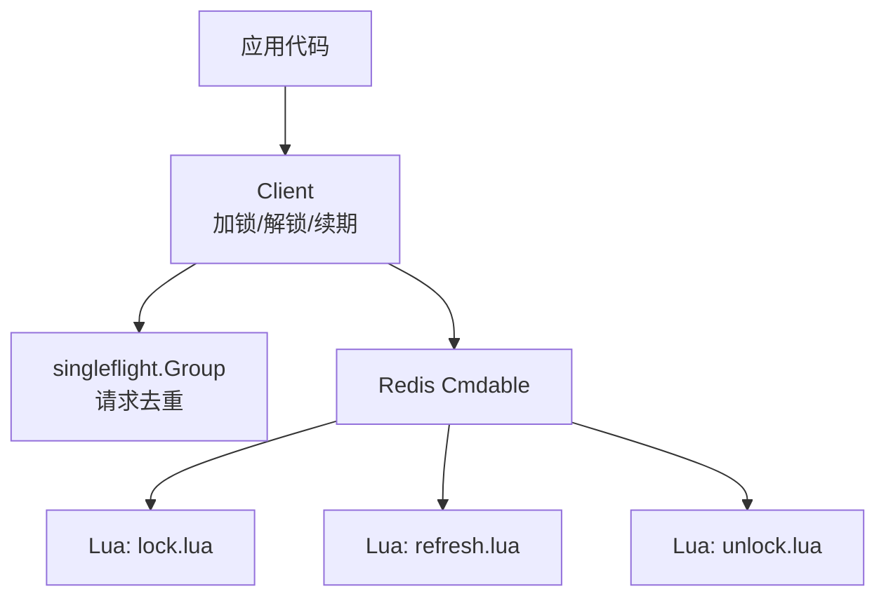
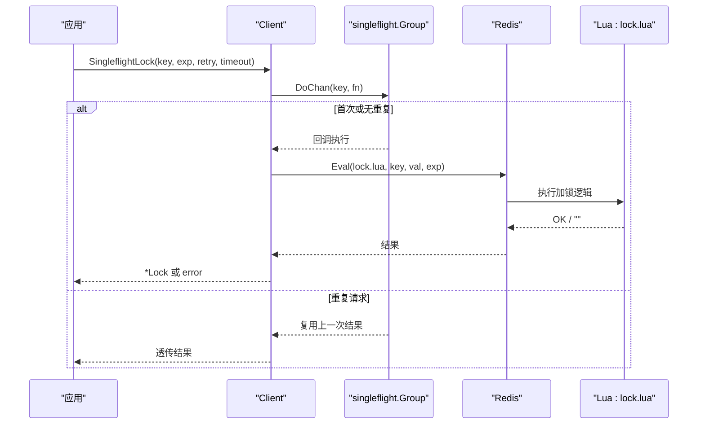
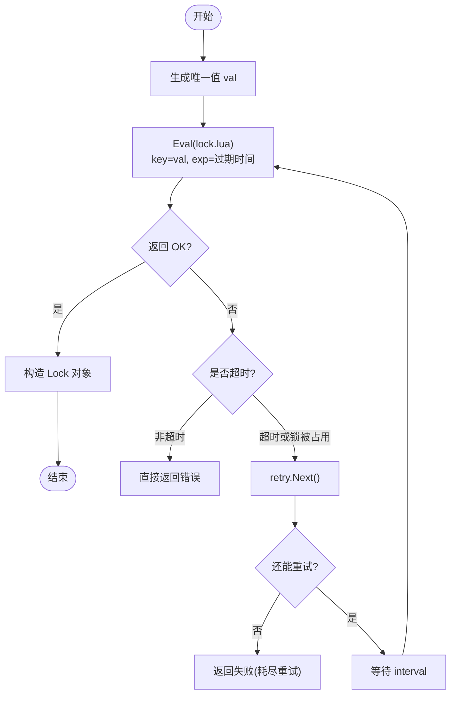
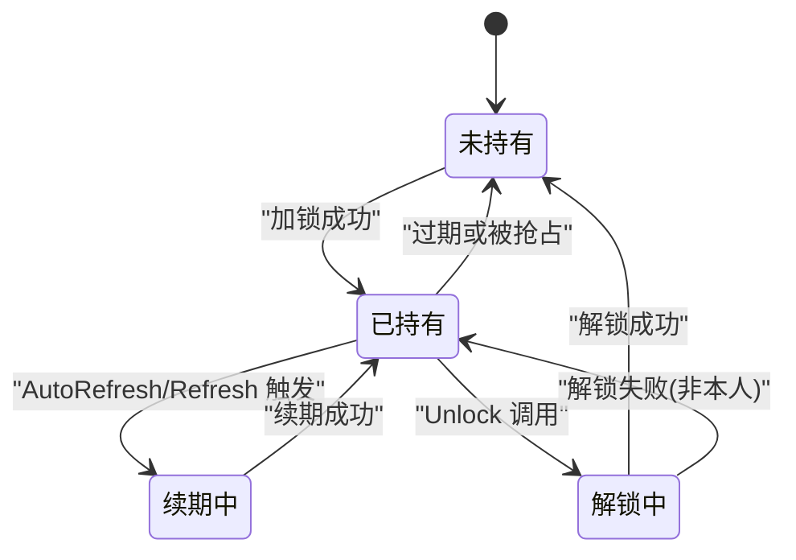
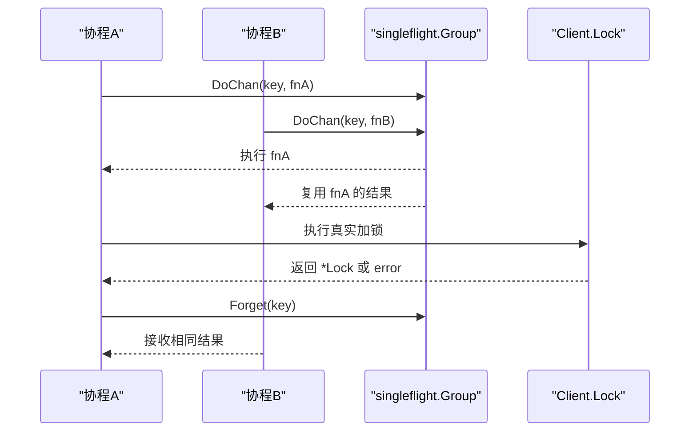
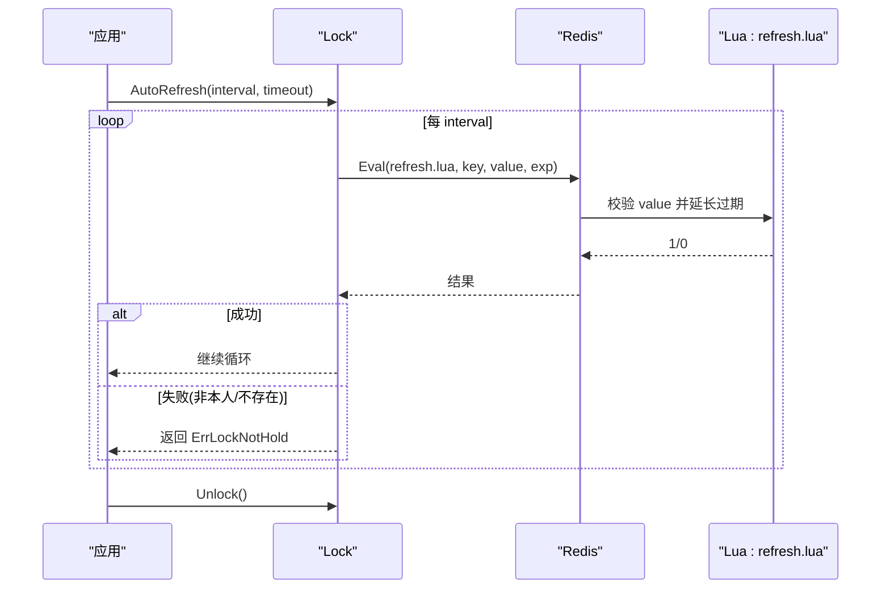
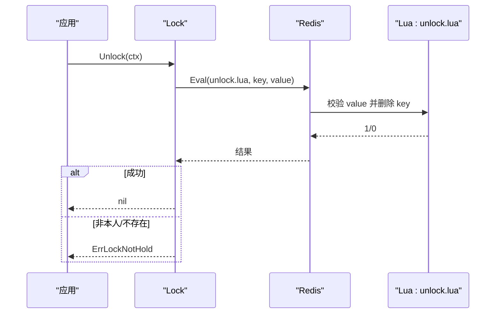
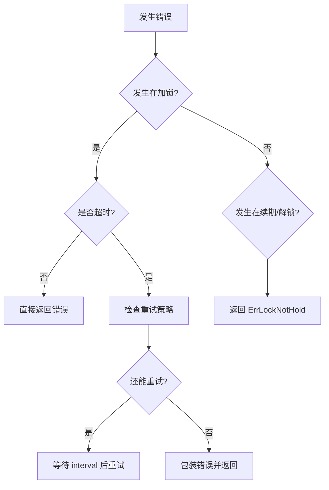
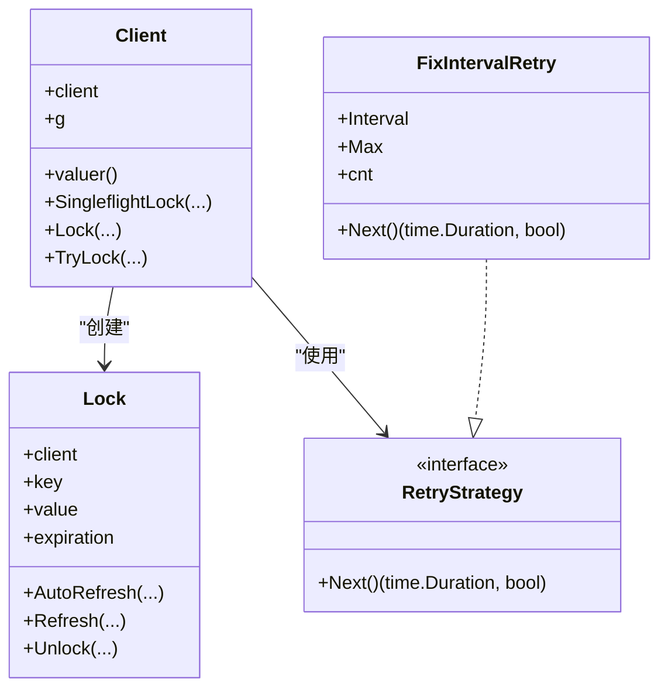

# 数据流图与状态转换

<cite>
**本文引用的文件**   
- [lock.go](file://lock.go)
- [retry.go](file://retry.go)
- [demo.go](file://demo/demo.go)
- [lock.lua](file://script/lua/lock.lua)
- [refresh.lua](file://script/lua/refresh.lua)
- [unlock.lua](file://script/lua/unlock.lua)
</cite>

## 目录
1. [简介](#简介)
2. [项目结构](#项目结构)
3. [核心组件](#核心组件)
4. [架构总览](#架构总览)
5. [详细组件分析](#详细组件分析)
6. [依赖关系分析](#依赖关系分析)
7. [性能考量](#性能考量)
8. [故障排查指南](#故障排查指南)
9. [结论](#结论)

## 简介
本文面向 Redis 分布式锁的数据流与状态机，系统化梳理从应用调用到 Redis 存储的完整路径，并给出加锁、续期、解锁的时序图；同时定义锁的状态转换（未持有、已持有、续期中、解锁中），解释 SingleflightLock 的并发控制与去重策略，对比 TryLock 与 Lock 的差异与选型建议，并覆盖异常处理与错误传播。

## 项目结构
仓库采用“库实现 + 示例演示 + Lua 脚本”的分层组织：
- 库实现：lock.go 提供 Client/Lock 类型及加锁、重试、续期、解锁等能力；retry.go 提供重试策略接口与固定间隔实现。
- Lua 脚本：script/lua 下包含原子化的加锁、续期、解锁脚本，确保 Redis 端操作原子性。
- 示例：demo/demo.go 提供可独立运行的示例客户端，便于理解用法与行为。

**图表来源**
- [lock.go:46-60](file://lock.go#L46-L60)
- [lock.go:62-82](file://lock.go#L62-L82)
- [lock.go:94-149](file://lock.go#L94-L149)
- [lock.go:170-251](file://lock.go#L170-L251)
- [lock.lua:1-13](file://script/lua/lock.lua#L1-L13)
- [refresh.lua:1-6](file://script/lua/refresh.lua#L1-L6)
- [unlock.lua:1-6](file://script/lua/unlock.lua#L1-L6)

**章节来源**
- [lock.go:17-28](file://lock.go#L17-L28)
- [lock.go:46-60](file://lock.go#L46-L60)
- [retry.go:19-35](file://retry.go#L19-L35)
- [lock.lua:1-13](file://script/lua/lock.lua#L1-L13)
- [refresh.lua:1-6](file://script/lua/refresh.lua#L1-L6)
- [unlock.lua:1-6](file://script/lua/unlock.lua#L1-L6)

## 核心组件
- Client：封装 Redis 连接、值生成器、singleflight.Group，对外暴露 SingleflightLock、Lock、TryLock。
- Lock：表示一次成功加锁后的句柄，支持 AutoRefresh、Refresh、Unlock。
- RetryStrategy：重试策略接口，FixIntervalRetry 为固定间隔重试实现。
- Lua 脚本：在 Redis 侧保证加锁、续期、解锁的原子性与幂等性。

关键职责划分：
- 加锁主流程：Lock/TryLock 通过 Eval/SetNX 与 Redis 交互，配合 retry 进行重试。
- 并发去重：SingleflightLock 基于 singleflight.Group 对相同 key 的请求合并。
- 生命周期管理：Lock.AutoRefresh 周期性续期，Unlock 释放锁并通知自动续期停止。

**章节来源**
- [lock.go:46-60](file://lock.go#L46-L60)
- [lock.go:62-149](file://lock.go#L62-L149)
- [lock.go:151-251](file://lock.go#L151-L251)
- [retry.go:19-35](file://retry.go#L19-L35)

## 架构总览
下图展示从应用到 Redis 的端到端数据流：应用调用 Client.SingleflightLock/Lock/TryLock，经 singleflight 去重后，通过 redis.Cmdable 执行 Lua 脚本完成加锁；成功后返回 Lock 对象，后续通过 Refresh/AutoRefresh 续期，Unlock 释放。

**图表来源**
- [lock.go:62-82](file://lock.go#L62-L82)
- [lock.go:94-134](file://lock.go#L94-L134)
- [lock.lua:1-13](file://script/lua/lock.lua#L1-L13)

## 详细组件分析

### 加锁数据流与状态转换

#### 加锁流程图（含重试）

**图表来源**
- [lock.go:94-134](file://lock.go#L94-L134)
- [lock.lua:1-13](file://script/lua/lock.lua#L1-L13)

#### 锁状态转换图
状态集合：未持有、已持有、续期中、解锁中。

说明：
- 未持有：初始态或解锁后。
- 已持有：成功加锁后进入。
- 续期中：刷新过程中，避免长时间阻塞；刷新成功回到已持有。
- 解锁中：尝试释放锁；若发现非本人持有则回退到已持有（由上层判断）。

**图表来源**
- [lock.go:170-251](file://lock.go#L170-L251)

#### TryLock 与 Lock 的区别与选型
- TryLock：单次 SetNX 尝试，不重试；适合快速失败、非阻塞场景。
- Lock：带重试与整体超时控制；适合需要尽力获取锁的场景。
- 选择建议：
  - 高延迟敏感且允许失败：TryLock。
  - 需要提高成功率且可接受重试：Lock。
  - 多实例并发竞争同一 key：优先使用 SingleflightLock 去重。

**章节来源**
- [lock.go:136-149](file://lock.go#L136-L149)
- [lock.go:84-93](file://lock.go#L84-L93)

### SingleflightLock 并发控制与去重策略
- 机制：对相同 key 的请求，通过 singleflight.Group.DoChan 合并，仅执行一次实际加锁，其余请求复用结果。
- 关键点：
  - 首次调用设置 flag=true 标记自己发起真实任务。
  - 收到结果后调用 Forget 清理该 key 的任务记录，避免内存泄漏。
  - 监听 ctx.Done 以支持取消。
- 效果：显著降低热点 key 的并发竞争压力，减少 Redis 负载与网络往返。

**图表来源**
- [lock.go:62-82](file://lock.go#L62-L82)

**章节来源**
- [lock.go:62-82](file://lock.go#L62-L82)

### 续期与解锁时序

#### 续期时序（AutoRefresh）

**图表来源**
- [lock.go:170-229](file://lock.go#L170-L229)
- [refresh.lua:1-6](file://script/lua/refresh.lua#L1-L6)

#### 解锁时序

**图表来源**
- [lock.go:231-251](file://lock.go#L231-L251)
- [unlock.lua:1-6](file://script/lua/unlock.lua#L1-L6)

### 异常处理与错误传播
- 加锁阶段：
  - 非超时错误（如网络断开、服务端异常）立即返回。
  - 超时或锁被占用时，依据 retry 决定是否继续重试。
  - 重试耗尽返回包装错误，区分“最后一次重试错误”和“锁被人持有”。
- 续期阶段：
  - 返回 0 或 redis.Nil 视为未持有锁，向上抛出 ErrLockNotHold。
- 解锁阶段：
  - redis.Nil 或非 1 结果均视为未持有锁，返回 ErrLockNotHold。
  - 使用 sync.Once 防止重复解锁导致 panic，并确保 AutoRefresh 能安全退出。

**图表来源**
- [lock.go:94-134](file://lock.go#L94-L134)
- [lock.go:219-251](file://lock.go#L219-L251)

**章节来源**
- [lock.go:84-93](file://lock.go#L84-L93)
- [lock.go:94-134](file://lock.go#L94-L134)
- [lock.go:219-251](file://lock.go#L219-L251)

## 依赖关系分析
- Client 依赖：
  - redis.Cmdable：用于发送命令与执行 Lua。
  - singleflight.Group：用于同 key 请求合并。
  - uuid：生成唯一值。
- Lock 依赖：
  - redis.Cmdable：执行续期与解锁。
  - Lua 脚本：保证原子性。
- 重试策略：
  - RetryStrategy 接口解耦重试算法，FixIntervalRetry 提供固定间隔实现。

**图表来源**
- [lock.go:46-60](file://lock.go#L46-L60)
- [lock.go:151-251](file://lock.go#L151-L251)
- [retry.go:19-35](file://retry.go#L19-L35)

**章节来源**
- [lock.go:46-60](file://lock.go#L46-L60)
- [lock.go:151-251](file://lock.go#L151-L251)
- [retry.go:19-35](file://retry.go#L19-L35)

## 性能考量
- 单飞去重：SingleflightLock 对热点 key 极大降低 Redis 压力，避免惊群效应。
- Lua 原子性：加锁、续期、解锁均在 Redis 侧原子执行，减少竞态条件与网络往返。
- 重试策略：合理配置重试间隔与次数，平衡成功率与时延。
- 自动续期：AutoRefresh 使用 ticker 与 channel 双通道调度，避免阻塞主流程；注意超时处理以避免堆积。

[本节为通用指导，不涉及具体文件分析]

## 故障排查指南
- 常见错误：
  - 加锁失败：检查重试策略是否过短、Redis 连通性、Lua 脚本是否正确嵌入。
  - 未持有锁：确认 value 是否一致，是否存在绕过库直接操作 Redis 的情况。
  - 续期失败：检查 AutoRefresh 是否仍在运行、上下文是否被取消、Redis 是否可用。
- 定位步骤：
  - 打印/监控 Eval 返回值与错误码。
  - 观察 singleflight 的去重效果（相同 key 的请求数）。
  - 核对 Lock.value 与 Redis 中的值是否一致。
- 恢复建议：
  - 调整重试参数与超时。
  - 确保 Unlock 被正确调用，避免死锁。
  - 对 AutoRefresh 增加健康检查与告警。

**章节来源**
- [lock.go:84-93](file://lock.go#L84-L93)
- [lock.go:219-251](file://lock.go#L219-L251)

## 结论
本方案通过 singleflight 去重、Lua 原子脚本与可插拔重试策略，构建了高可靠、低开销的 Redis 分布式锁。其数据流清晰、状态机明确，适用于多种业务场景。实践中应结合业务 SLA 选择合适的 TryLock/Lock 模式，并合理配置续期与重试参数，以获得最佳稳定性与性能。