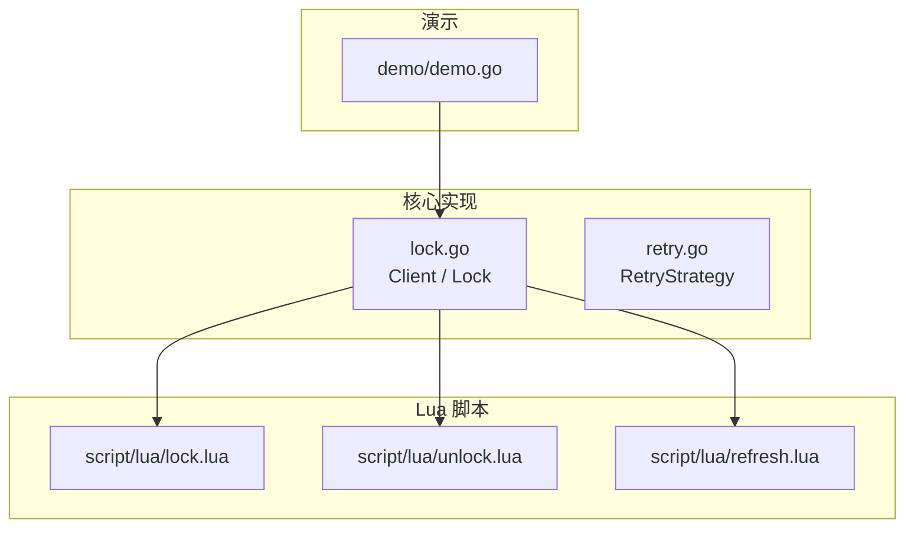
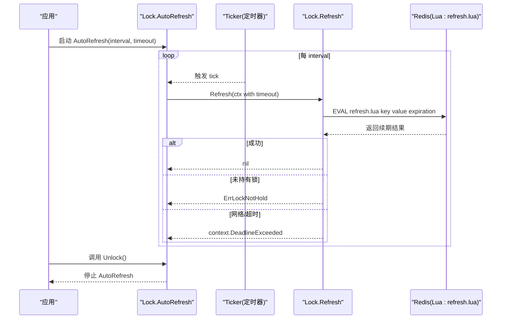
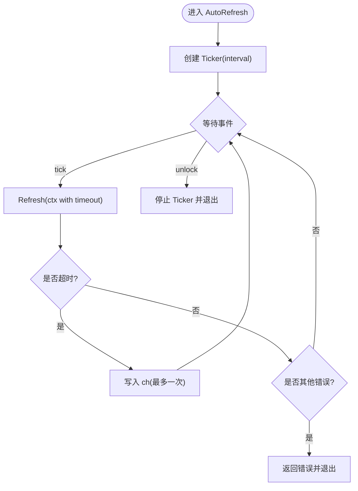
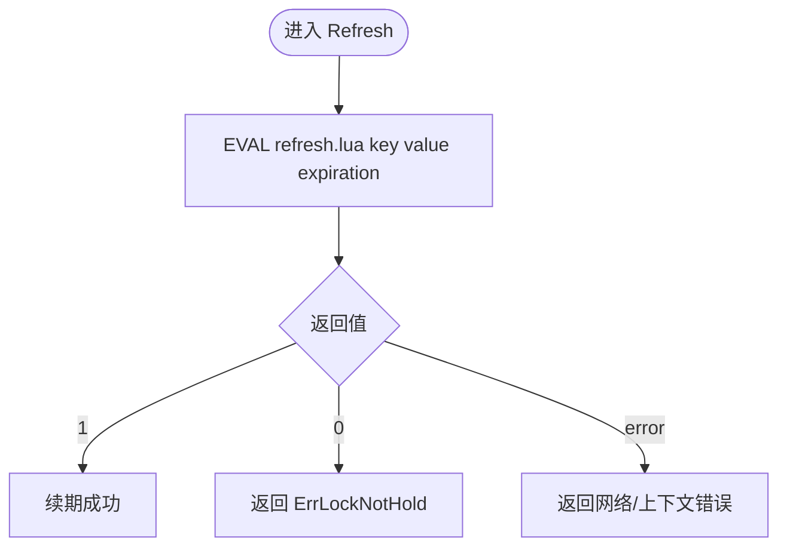
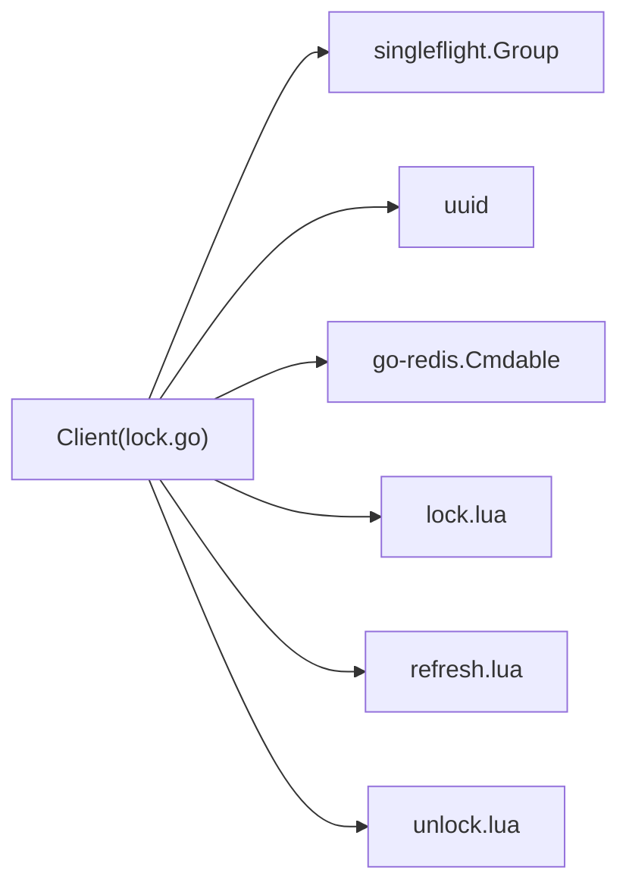

# 锁续期策略

<cite>
**本文引用的文件**   
- [lock.go](file://lock.go)
- [retry.go](file://retry.go)
- [script/lua/refresh.lua](file://script/lua/refresh.lua)
- [script/lua/lock.lua](file://script/lua/lock.lua)
- [script/lua/unlock.lua](file://script/lua/unlock.lua)
- [demo/demo.go](file://demo/demo.go)
- [README.md](file://README.md)
</cite>

## 目录
1. [简介](#简介)
2. [项目结构](#项目结构)
3. [核心组件](#核心组件)
4. [架构总览](#架构总览)
5. [详细组件分析](#详细组件分析)
6. [依赖关系分析](#依赖关系分析)
7. [性能与资源管理](#性能与资源管理)
8. [故障排查指南](#故障排查指南)
9. [结论](#结论)
10. [附录：使用示例与模式](#附录使用示例与模式)

## 简介
本文件聚焦 Redis 分布式锁的“续期策略”，围绕 AutoRefresh 定时续期、Refresh Lua 原子续期、以及长时间运行任务中的续期间隔与超时配置展开，给出实现原理、安全性保证、失败处理机制与最佳实践。该库基于 Redis 7+ 与 Go 18+，通过 Lua 脚本保证加锁、解锁与续期的原子性与一致性。

## 项目结构
仓库采用“核心实现 + Lua 脚本 + 演示代码”的分层组织方式：
- 核心实现：lock.go（Client/Lock）、retry.go（重试策略）
- Lua 脚本：script/lua/{lock,unlock,refresh}.lua
- 演示代码：demo/demo.go（教学用途，存在已知缺陷）
- 文档与说明：README.md

图表来源
- [lock.go:17-44](file://lock.go#L17-L44)
- [script/lua/lock.lua:1-13](file://script/lua/lock.lua#L1-L13)
- [script/lua/unlock.lua:1-6](file://script/lua/unlock.lua#L1-L6)
- [script/lua/refresh.lua:1-6](file://script/lua/refresh.lua#L1-L6)
- [demo/demo.go:19-40](file://demo/demo.go#L19-L40)

章节来源
- [README.md:1-13](file://README.md#L1-L13)

## 核心组件
- Client：封装 Redis 客户端，提供加锁、尝试加锁、单飞并发控制等能力。
- Lock：表示已获取的分布式锁，支持自动续期、手动续期、解锁。
- RetryStrategy：定义重试间隔与次数策略，用于加锁阶段的重试控制。

关键职责
- AutoRefresh：按固定周期触发续期，直到解锁或发生不可恢复错误。
- Refresh：调用 Lua 脚本安全地延长锁过期时间。
- Unlock：原子校验并删除锁键。

章节来源
- [lock.go:46-60](file://lock.go#L46-L60)
- [lock.go:151-168](file://lock.go#L151-L168)
- [retry.go:19-35](file://retry.go#L19-L35)

## 架构总览
AutoRefresh 与 Refresh 的交互流程如下：

图表来源
- [lock.go:170-229](file://lock.go#L170-L229)
- [script/lua/refresh.lua:1-6](file://script/lua/refresh.lua#L1-L6)

## 详细组件分析

### AutoRefresh 定时续期器
- 触发机制
  - 使用 time.NewTicker 以固定 interval 触发续期。
  - 每次触发时创建带超时的 context（timeout），调用 Refresh。
- 并发与取消
  - 监听三个通道：ticker.C、ch（用于合并连续超时）、l.unlock（解锁信号）。
  - 当 Refresh 返回 context.DeadlineExceeded 时，将一次“继续尝试”的信号写入 ch；若后续再次触发，会跳过重复写入，避免堆积。
  - 收到 l.unlock 后，立即退出循环，释放 ticker 与 channel。
- 错误传播
  - 非超时错误直接返回给调用方，AutoRefresh 终止。
  - 超时错误不会中断循环，而是继续下一次 tick。

图表来源
- [lock.go:170-217](file://lock.go#L170-L217)

章节来源
- [lock.go:170-217](file://lock.go#L170-L217)

### Refresh 原子续期（Lua）
- 执行过程
  - 调用 Lua 脚本 refresh.lua，传入参数：KEYS[1]=key，ARGV[1]=value，ARGV[2]=expiration（秒）。
  - Lua 脚本先判断当前值是否等于 value，若是则设置过期时间为 expiration，否则返回 0。
- 返回值语义
  - 返回 1：续期成功。
  - 返回 0：未持有锁（值不匹配或 key 不存在）。
  - 网络/超时：返回 error（如 context.DeadlineExceeded）。
- 安全性保证
  - 通过 Lua 脚本的原子性，确保“检查值 + 设置过期”在同一执行上下文中完成，避免竞态条件。
  - 仅当 value 匹配时才续期，防止误续他人持有的锁。

图表来源
- [lock.go:219-229](file://lock.go#L219-L229)
- [script/lua/refresh.lua:1-6](file://script/lua/refresh.lua#L1-L6)

章节来源
- [lock.go:219-229](file://lock.go#L219-L229)
- [script/lua/refresh.lua:1-6](file://script/lua/refresh.lua#L1-L6)

### 续期策略在长时间运行任务中的应用
- 典型场景
  - 后台任务、批处理作业、长耗时业务逻辑需要持有分布式锁直至完成。
  - 为防止锁因过期被提前释放，需周期性续期。
- 参数选择建议
  - 续期间隔 interval：应明显小于锁过期时间 expiration，通常取 expiration 的 1/3~1/2，预留足够余量应对 GC、调度抖动与网络延迟。
  - 续期超时 timeout：应小于 interval，确保在一次 tick 内完成续期，避免多次 tick 堆积。
  - 锁过期时间 expiration：根据任务最大执行时长与可容忍的并发冲突窗口设定，兼顾安全性与资源占用。
- 生命周期管理
  - 在任务开始前启动 AutoRefresh，并在任务结束或异常路径中调用 Unlock，确保 AutoRefresh 退出。

章节来源
- [lock.go:170-217](file://lock.go#L170-L217)
- [lock.go:219-229](file://lock.go#L219-L229)

### 续期失败的处理机制
- 超时处理
  - Refresh 返回 context.DeadlineExceeded 时，AutoRefresh 不会退出，而是继续下一次 tick，具备容错自愈能力。
- 未持有锁
  - Refresh 返回 ErrLockNotHold 时，AutoRefresh 会终止并向调用方返回错误，提示上层进行清理或告警。
- 其他错误
  - 网络异常、Redis 不可用等错误会直接返回，AutoRefresh 终止。
- 重试策略（加锁阶段）
  - 加锁阶段的 RetryStrategy 决定重试间隔与次数，与续期无关，但影响整体可用性。
  - FixIntervalRetry 提供固定间隔与最大次数的简单实现。

章节来源
- [lock.go:170-229](file://lock.go#L170-L229)
- [retry.go:19-35](file://retry.go#L19-L35)

### 与解锁的协作
- Unlock 通过 Lua 脚本 unlock.lua 原子校验并删除 key。
- AutoRefresh 通过 l.unlock 通道感知解锁信号并退出循环，避免无效续期。

章节来源
- [lock.go:231-251](file://lock.go#L231-L251)
- [script/lua/unlock.lua:1-6](file://script/lua/unlock.lua#L1-L6)

## 依赖关系分析
- lock.go 依赖
  - go-redis/v9：Redis 客户端接口 Cmdable。
  - singleflight.Group：对同一 key 的加锁请求去重，减少竞争风暴。
  - uuid：生成唯一 value，区分不同锁实例。
- Lua 脚本
  - lock.lua：加锁与刷新过期时间的原子逻辑。
  - refresh.lua：续期逻辑，仅当 value 匹配才设置过期。
  - unlock.lua：解锁逻辑，仅当 value 匹配才删除 key。

图表来源
- [lock.go:17-28](file://lock.go#L17-L28)
- [script/lua/lock.lua:1-13](file://script/lua/lock.lua#L1-L13)
- [script/lua/refresh.lua:1-6](file://script/lua/refresh.lua#L1-L6)
- [script/lua/unlock.lua:1-6](file://script/lua/unlock.lua#L1-L6)

章节来源
- [lock.go:17-28](file://lock.go#L17-L28)

## 性能与资源管理
- 定时器开销
  - AutoRefresh 为每个锁实例维护一个 Ticker，建议在任务结束后及时 Unlock，避免长期持有 goroutine 与定时器。
- 续期间隔与超时
  - interval 不宜过小，避免频繁网络往返；timeout 应小于 interval，避免重叠续期。
- Lua 脚本原子性
  - 续期操作在 Redis 侧原子执行，降低客户端重试带来的额外压力。
- 单飞加锁
  - 使用 singleflight 合并相同 key 的加锁请求，减少竞争与 Redis 压力。

章节来源
- [lock.go:62-82](file://lock.go#L62-L82)
- [lock.go:170-217](file://lock.go#L170-L217)

## 故障排查指南
- 现象：AutoRefresh 一直运行但未续期成功
  - 检查 Refresh 是否返回 ErrLockNotHold，确认 value 是否仍匹配。
  - 检查是否存在绕过 rlock 直接操作 Redis 的情况。
- 现象：续期频繁超时
  - 增大 timeout 或优化网络；检查 Redis 负载与延迟。
  - 调整 interval，确保 timeout << interval。
- 现象：解锁失败
  - 检查 Unlock 返回值是否为 ErrLockNotHold，确认是否由其他进程释放了锁。
- 现象：加锁反复失败
  - 检查 RetryStrategy 的最大次数与间隔是否合理；观察最后一次重试的错误类型。

章节来源
- [lock.go:170-229](file://lock.go#L170-L229)
- [lock.go:231-251](file://lock.go#L231-L251)
- [retry.go:19-35](file://retry.go#L19-L35)

## 结论
AutoRefresh 通过固定周期触发 Refresh，结合 Lua 脚本的原子性，实现了安全可靠的分布式锁续期。合理的 interval 与 timeout 配置、完善的错误处理与资源释放，是保障长时间运行任务稳定性的关键。建议在业务侧遵循“短超时、适中周期、及时解锁”的原则，并结合监控与告警提升可观测性。

## 附录：使用示例与模式
- 基本用法
  - 加锁：使用 Client.Lock 或 TryLock 获取锁。
  - 启动续期：调用 Lock.AutoRefresh(interval, timeout)。
  - 完成任务：调用 Lock.Unlock 释放锁，AutoRefresh 自动退出。
- 参考实现位置
  - 核心 API：Client.Lock/TryLock/AutoRefresh/Refresh/Unlock
  - Lua 脚本：refresh.lua、unlock.lua、lock.lua
  - 演示代码：demo/demo.go（教学用途，存在已知缺陷，不建议直接用于生产）

章节来源
- [lock.go:62-149](file://lock.go#L62-L149)
- [lock.go:170-251](file://lock.go#L170-L251)
- [script/lua/refresh.lua:1-6](file://script/lua/refresh.lua#L1-L6)
- [script/lua/unlock.lua:1-6](file://script/lua/unlock.lua#L1-L6)
- [script/lua/lock.lua:1-13](file://script/lua/lock.lua#L1-L13)
- [demo/demo.go:144-190](file://demo/demo.go#L144-L190)