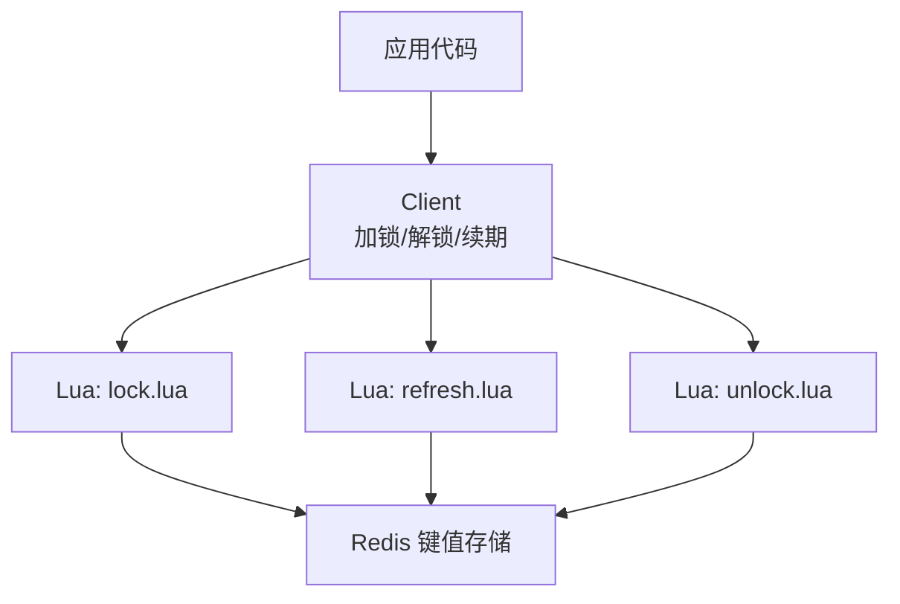
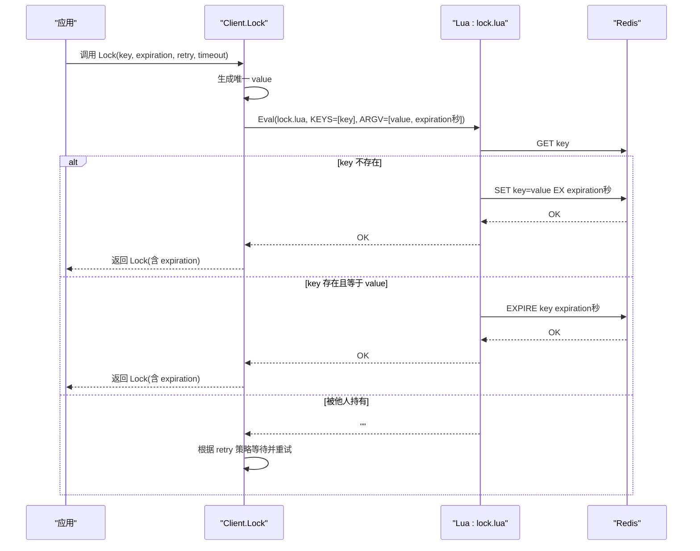
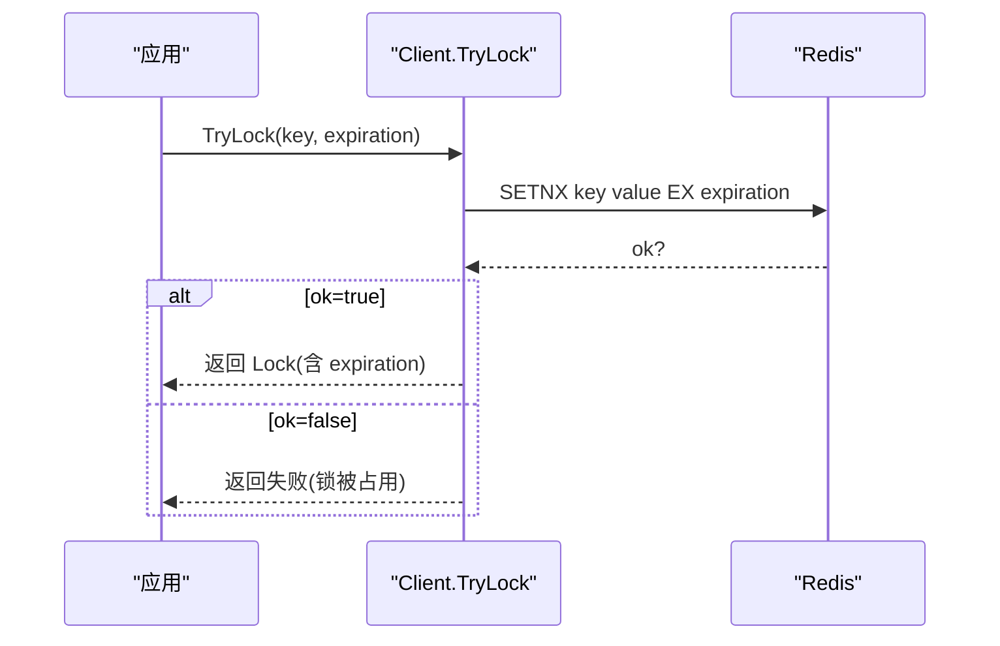
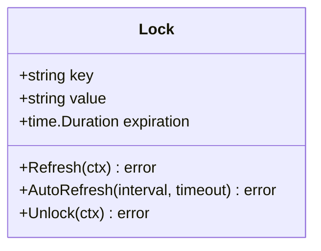
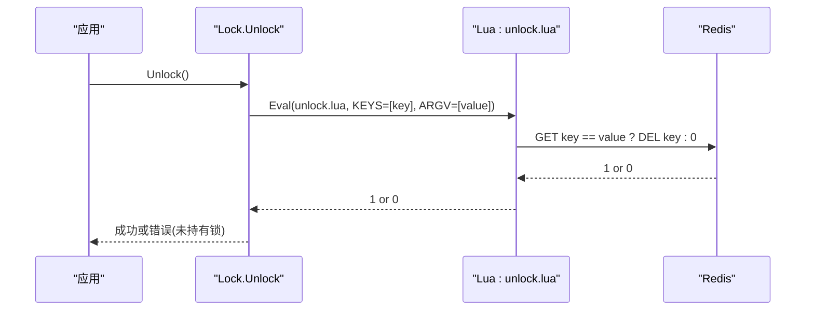
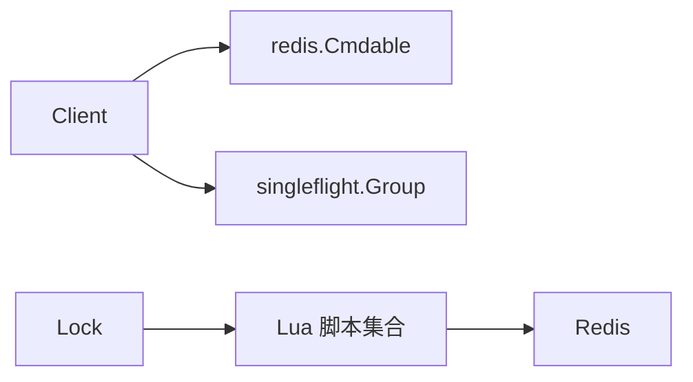

# 锁过期机制

<cite>
**本文引用的文件**   
- [lock.go](file://lock.go)
- [script/lua/lock.lua](file://script/lua/lock.lua)
- [script/lua/refresh.lua](file://script/lua/refresh.lua)
- [script/lua/unlock.lua](file://script/lua/unlock.lua)
- [demo/demo.go](file://demo/demo.go)
- [README.md](file://README.md)
</cite>

## 目录
1. [引言](#引言)
2. [项目结构](#项目结构)
3. [核心组件](#核心组件)
4. [架构总览](#架构总览)
5. [详细组件分析](#详细组件分析)
6. [依赖关系分析](#依赖关系分析)
7. [性能与可靠性考量](#性能与可靠性考量)
8. [故障排查指南](#故障排查指南)
9. [结论](#结论)
10. [附录：过期时间配置建议与最佳实践](#附录过期时间配置建议与最佳实践)

## 引言
本文件聚焦 Redis 分布式锁的“过期机制”，围绕以下问题展开：
- 为什么需要设置锁过期时间，如何避免死锁？
- Lock 方法中 expiration 参数如何传递到 Redis，以及 TTL 管理机制是什么？
- 不同业务场景下如何选择合适的过期时间？
- 当业务执行时间超过锁过期时间时如何处理？续期机制为何重要？
- 过期时间的最佳实践与常见陷阱。

该实现基于 Redis Lua 脚本保证原子性，并通过客户端重试、自动续期等机制提升可用性。

**章节来源**
- [README.md:1-13](file://README.md#L1-L13)

## 项目结构
仓库采用“核心库 + 示例 + Lua 脚本”的组织方式：
- 核心库 lock.go：提供加锁、尝试加锁、解锁、续期、自动续期等能力。
- Lua 脚本 script/lua/*：封装 Redis 原子操作（SETNX+EXPIRE、刷新 TTL、安全删除）。
- demo/demo.go：教学示例，展示类似实现思路。
- README.md：项目说明与环境要求。



**图表来源**
- [lock.go:94-149](file://lock.go#L94-L149)
- [script/lua/lock.lua:1-13](file://script/lua/lock.lua#L1-L13)
- [script/lua/refresh.lua:1-6](file://script/lua/refresh.lua#L1-L6)
- [script/lua/unlock.lua:1-6](file://script/lua/unlock.lua#L1-L6)

**章节来源**
- [lock.go:1-252](file://lock.go#L1-L252)
- [script/lua/lock.lua:1-13](file://script/lua/lock.lua#L1-L13)
- [script/lua/refresh.lua:1-6](file://script/lua/refresh.lua#L1-L6)
- [script/lua/unlock.lua:1-6](file://script/lua/unlock.lua#L1-L6)
- [demo/demo.go:1-214](file://demo/demo.go#L1-L214)
- [README.md:1-13](file://README.md#L1-L13)

## 核心组件
- Client：对外暴露加锁、尝试加锁、单飞加锁等方法；内部使用 singleflight 去重并发请求，降低热点 key 竞争时的放大效应。
- Lock：表示一次成功加锁的生命周期，包含 key、value、expiration 等元信息，并提供 Refresh/AutoRefresh/Unlock 等方法。
- Lua 脚本：
  - lock.lua：在 key 不存在时 SET 并设置 EXPIRE；若当前持有者再次调用则刷新 TTL；否则返回空串表示被占用。
  - refresh.lua：校验 value 一致后刷新 TTL。
  - unlock.lua：校验 value 一致后删除 key。

这些组件共同构成“带过期时间的分布式锁”。

**章节来源**
- [lock.go:46-60](file://lock.go#L46-L60)
- [lock.go:151-168](file://lock.go#L151-L168)
- [script/lua/lock.lua:1-13](file://script/lua/lock.lua#L1-L13)
- [script/lua/refresh.lua:1-6](file://script/lua/refresh.lua#L1-L6)
- [script/lua/unlock.lua:1-6](file://script/lua/unlock.lua#L1-L6)

## 架构总览
下图展示了从应用调用到 Redis 的完整流程，重点体现 expiration 参数的传递路径与 TTL 管理。



**图表来源**
- [lock.go:94-134](file://lock.go#L94-L134)
- [script/lua/lock.lua:1-13](file://script/lua/lock.lua#L1-L13)

**章节来源**
- [lock.go:94-134](file://lock.go#L94-L134)
- [script/lua/lock.lua:1-13](file://script/lua/lock.lua#L1-L13)

## 详细组件分析

### 加锁与过期时间设置（Lock 方法与 Lua）
- 客户端在每次尝试加锁时，将 expiration（单位：秒）作为参数传给 Lua 脚本。
- Lua 脚本逻辑：
  - 若 key 不存在：SET key=value EX expiration，确保原子性创建并设置过期。
  - 若 key 存在且值为当前 value：EXPIRE key expiration，用于“持锁方自我续期”的场景。
  - 否则：返回空串，表示锁被其他持有者占用。
- 客户端收到 OK 后构造 Lock 对象，保存 expiration，供后续续期使用。

```mermaid
flowchart TD
Start(["进入 Lock"]) --> GenVal["生成唯一 value"]
GenVal --> TryEval["调用 Lua: lock.lua(value, expiration)"]
TryEval --> CheckRes{"返回值?"}
CheckRes --> |OK| ReturnLock["返回 Lock(含 expiration)"]
CheckRes --> |""| RetryCheck{"是否还有重试机会?"}
RetryCheck --> |是| Wait["按策略等待 interval"]
Wait --> TryEval
RetryCheck --> |否| Fail["返回失败(未抢占到锁)"]
```

**图表来源**
- [lock.go:94-134](file://lock.go#L94-L134)
- [script/lua/lock.lua:1-13](file://script/lua/lock.lua#L1-L13)

**章节来源**
- [lock.go:94-134](file://lock.go#L94-L134)
- [script/lua/lock.lua:1-13](file://script/lua/lock.lua#L1-L13)

### 尝试加锁（TryLock）与 TTL
- TryLock 直接使用 SETNX + expiration，适合一次性、短临界区的场景。
- 该路径不经过 Lua，但同样通过 Redis 的过期机制防止死锁。



**图表来源**
- [lock.go:136-149](file://lock.go#L136-L149)

**章节来源**
- [lock.go:136-149](file://lock.go#L136-L149)

### 续期机制（Refresh / AutoRefresh）
- 当业务执行时间可能超过锁过期时间时，需要通过续期延长 TTL，避免中途释放。
- Refresh：校验 value 一致后，重新设置 TTL（传入 expiration 秒）。
- AutoRefresh：后台定时任务周期性调用 Refresh，直到 Unlock 或出错。



**图表来源**
- [lock.go:151-168](file://lock.go#L151-L168)
- [lock.go:170-229](file://lock.go#L170-L229)

**章节来源**
- [lock.go:170-229](file://lock.go#L170-L229)
- [script/lua/refresh.lua:1-6](file://script/lua/refresh.lua#L1-L6)

### 解锁与安全释放（Unlock）
- Unlock 通过 Lua 校验 value 一致后删除 key，避免误删他人持有的锁。
- 若 Redis 返回 Nil 或结果非预期，视为“未持有锁”。



**图表来源**
- [lock.go:231-251](file://lock.go#L231-L251)
- [script/lua/unlock.lua:1-6](file://script/lua/unlock.lua#L1-L6)

**章节来源**
- [lock.go:231-251](file://lock.go#L231-L251)
- [script/lua/unlock.lua:1-6](file://script/lua/unlock.lua#L1-L6)

## 依赖关系分析
- Client 依赖 redis.Cmdable 进行网络 IO。
- Lock 依赖 Lua 脚本完成原子性操作。
- 通过 singleflight 减少同一 key 的高并发重复竞争。



**图表来源**
- [lock.go:17-28](file://lock.go#L17-L28)
- [lock.go:46-60](file://lock.go#L46-L60)
- [lock.go:151-168](file://lock.go#L151-L168)

**章节来源**
- [lock.go:17-28](file://lock.go#L17-L28)
- [lock.go:46-60](file://lock.go#L46-L60)
- [lock.go:151-168](file://lock.go#L151-L168)

## 性能与可靠性考量
- 原子性与一致性：所有关键路径（加锁、续期、解锁）均通过 Lua 保证原子性，避免竞态条件。
- 重试与退避：Lock 支持可插拔的重试策略，结合 context 超时控制整体耗时。
- 防抖与去重：Singleflight 对相同 key 的请求合并，降低 Redis 压力。
- 续期开销：AutoRefresh 会周期性发起网络请求，需合理设置 interval 与 timeout，避免过度消耗资源。

[本节为通用指导，不直接分析具体文件]

## 故障排查指南
- 加锁失败
  - 现象：返回“重试机会耗尽”或“未抢占到锁”。
  - 排查：检查重试策略是否过激、业务是否长时间持有锁但未续期、Redis 是否可用。
  - 相关位置：[lock.go:94-134](file://lock.go#L94-L134)
- 解锁报“未持有锁”
  - 现象：Unlock 返回 ErrLockNotHold。
  - 原因：value 不一致、key 已过期或被他人覆盖。
  - 相关位置：[lock.go:231-251](file://lock.go#L231-L251), [script/lua/unlock.lua:1-6](file://script/lua/unlock.lua#L1-L6)
- 续期失败
  - 现象：Refresh 返回 ErrLockNotHold 或超时。
  - 原因：锁已过期、value 不一致、网络抖动。
  - 相关位置：[lock.go:219-229](file://lock.go#L219-L229), [script/lua/refresh.lua:1-6](file://script/lua/refresh.lua#L1-L6)

**章节来源**
- [lock.go:94-134](file://lock.go#L94-L134)
- [lock.go:219-251](file://lock.go#L219-L251)
- [script/lua/unlock.lua:1-6](file://script/lua/unlock.lua#L1-L6)
- [script/lua/refresh.lua:1-6](file://script/lua/refresh.lua#L1-L6)

## 结论
- 过期时间是分布式锁的关键安全阀，能防止进程崩溃导致的死锁。
- 通过 Lua 脚本将“判断 + 设置/刷新 TTL + 删除”封装为原子操作，保障强一致性。
- 对于长任务，必须配合续期机制，确保业务执行期间锁不被提前释放。
- 合理的过期时间选择与续期策略，是平衡安全性与吞吐量的关键。

[本节为总结性内容，不直接分析具体文件]

## 附录：过期时间配置建议与最佳实践

- 为什么需要设置过期时间
  - 防止死锁：进程异常退出或网络分区导致无法主动解锁时，TTL 自动清理锁。
  - 限制影响范围：避免长期占用资源，缩短故障恢复时间。

- 过期时间设置原理与传递路径
  - Lock 方法将 expiration（秒）传递给 Lua 脚本，脚本在 SET 时设置 EXPIRE，或在持锁方再次调用时刷新 TTL。
  - TryLock 通过 SETNX + EXPIRATION 直接设置过期。
  - 参考：[lock.go:94-134](file://lock.go#L94-L134), [lock.go:136-149](file://lock.go#L136-L149), [script/lua/lock.lua:1-13](file://script/lua/lock.lua#L1-L13)

- 不同场景下的过期时间选择
  - 短时间任务（毫秒级到秒级）
    - 建议：过期时间略大于最大预期执行时间，留出网络与调度抖动余量。
    - 续期：通常不需要，或仅做极少量续期兜底。
  - 长时间任务（分钟级及以上）
    - 建议：设置较短的锁 TTL（例如数秒），配合 AutoRefresh 周期性续期。
    - 续期间隔：小于 TTL 的 1/2~1/3，确保在网络抖动时仍能及时续期。
    - 续期超时：设置合理的单次续期超时，避免阻塞主流程。

- 业务执行时间超过锁过期时间的处理方案
  - 启用续期：使用 AutoRefresh 或手动 Refresh，持续延长 TTL。
  - 监控告警：当续期失败或频繁超时，触发告警以快速定位问题。
  - 幂等与补偿：确保业务具备幂等性，以便在锁失效后安全重试或补偿。

- 最佳实践
  - 始终为锁设置过期时间，绝不依赖“永不过期”的键。
  - 使用 Lua 脚本保证加锁、续期、解锁的原子性。
  - 为每个锁分配唯一 value，并在解锁/续期时严格校验。
  - 合理配置重试策略与整体超时，避免雪崩。
  - 对热点 key 使用 Singleflight 合并请求，降低 Redis 压力。

- 常见陷阱与规避
  - 陷阱：忘记续期导致长任务中途释放锁。
    - 规避：长任务务必开启 AutoRefresh，并监控续期成功率。
  - 陷阱：过期时间设置过小，频繁被释放。
    - 规避：评估 P99 执行时间，预留足够余量；必要时改用“短 TTL + 续期”。
  - 陷阱：过期时间过大，故障恢复慢。
    - 规避：遵循“最小必要原则”，尽量缩短 TTL。
  - 陷阱：直接操作 Redis 绕过 SDK，破坏 value 校验。
    - 规避：统一通过 SDK 提供的接口访问锁。

**章节来源**
- [lock.go:94-134](file://lock.go#L94-L134)
- [lock.go:136-149](file://lock.go#L136-L149)
- [lock.go:170-229](file://lock.go#L170-L229)
- [script/lua/lock.lua:1-13](file://script/lua/lock.lua#L1-L13)
- [script/lua/refresh.lua:1-6](file://script/lua/refresh.lua#L1-L6)
- [script/lua/unlock.lua:1-6](file://script/lua/unlock.lua#L1-L6)