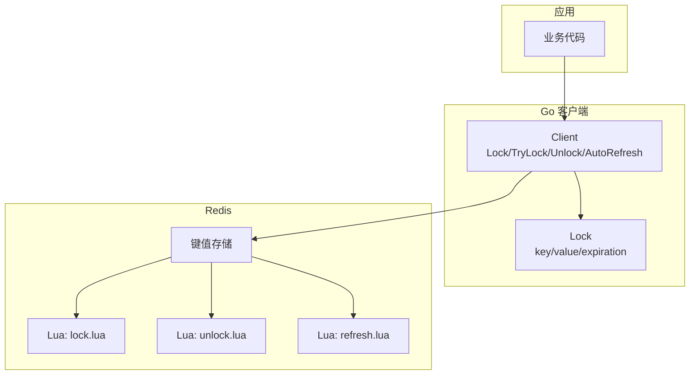
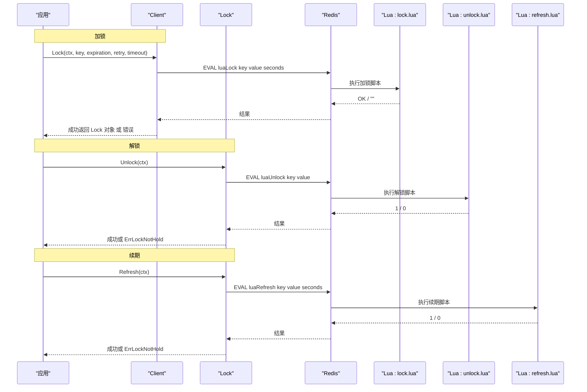
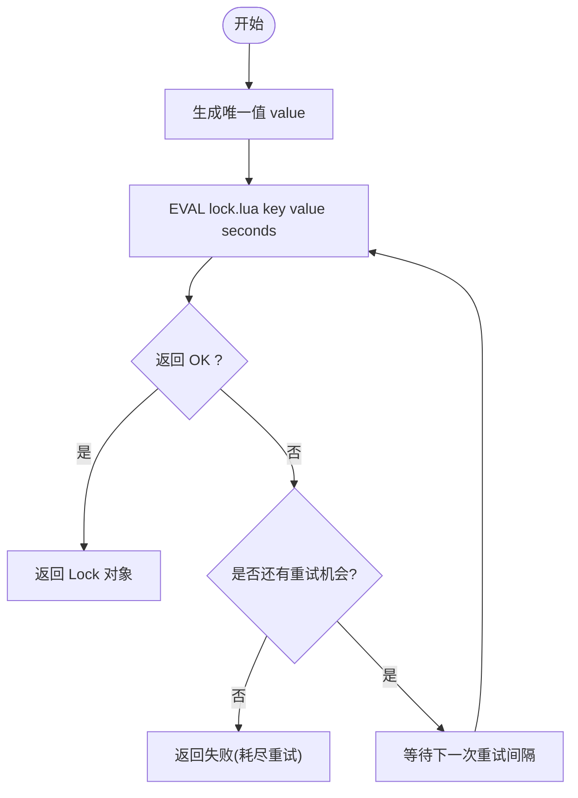
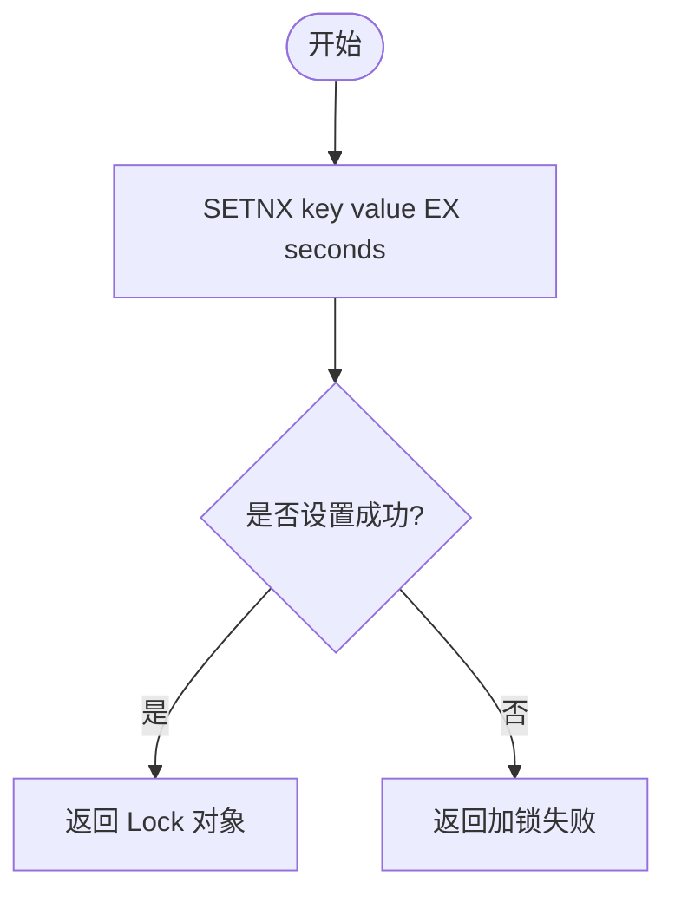
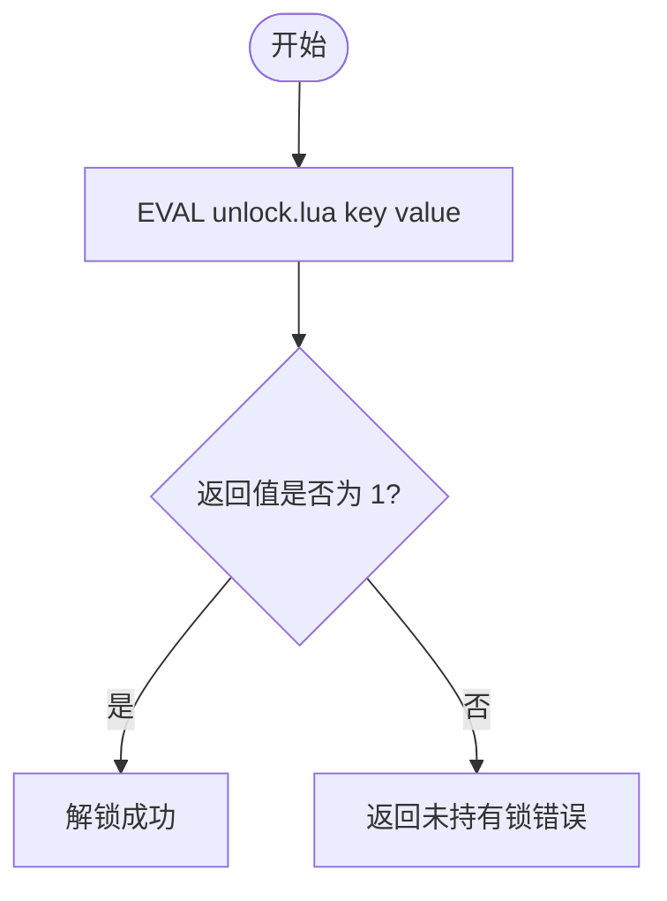
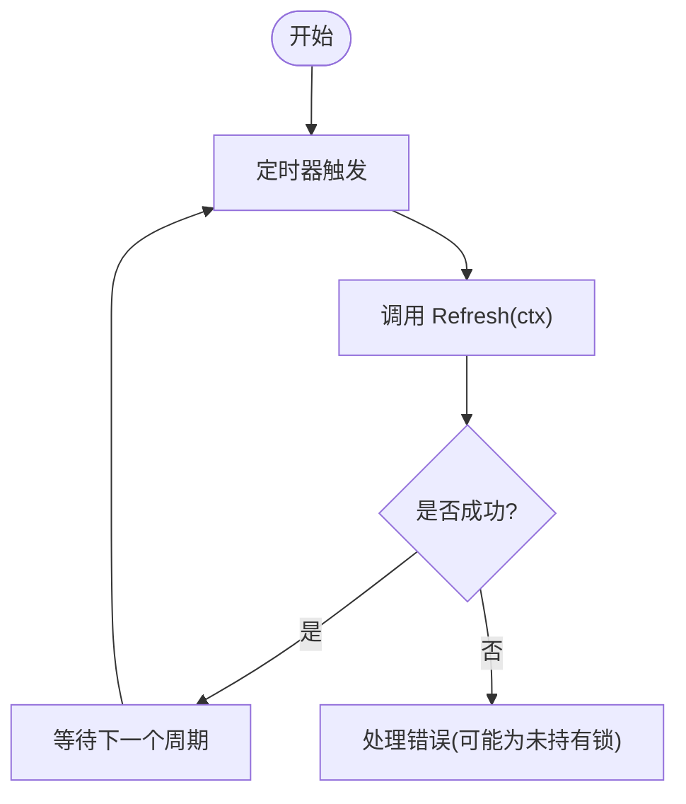
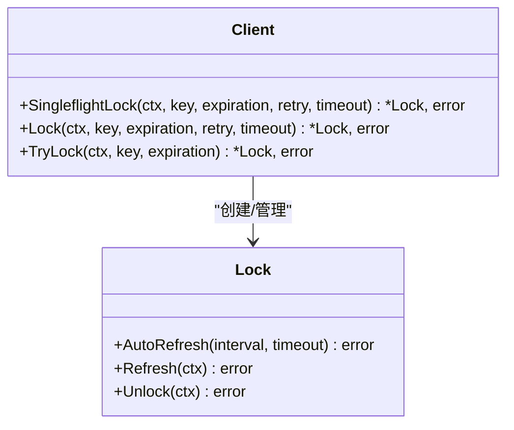
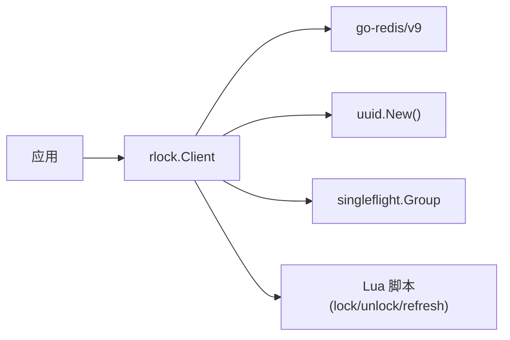

# 分布式锁基础概念

<cite>
**本文引用的文件**   
- [README.md](file://README.md)
- [lock.go](file://lock.go)
- [demo.go](file://demo/demo.go)
- [lock.lua](file://script/lua/lock.lua)
- [unlock.lua](file://script/lua/unlock.lua)
- [refresh.lua](file://script/lua/refresh.lua)
</cite>

## 目录
1. [引言](#引言)
2. [项目结构](#项目结构)
3. [核心组件](#核心组件)
4. [架构总览](#架构总览)
5. [详细组件分析](#详细组件分析)
6. [依赖关系分析](#依赖关系分析)
7. [性能与可靠性考量](#性能与可靠性考量)
8. [故障排查指南](#故障排查指南)
9. [结论](#结论)
10. [附录：通用模式与最佳实践](#附录通用模式与最佳实践)

## 引言
分布式锁是在分布式系统中协调多个进程或节点对共享资源进行互斥访问的基础设施。它通过一个外部协调者（例如 Redis）保证同一时刻只有一个客户端能持有某把“锁”，从而避免并发写入导致的竞态条件、数据不一致等问题。

为什么需要分布式锁？
- 多进程/多实例并行执行时，可能同时读取并修改同一份数据，导致覆盖更新、重复消费等竞态问题。
- 定时任务在集群中可能被多次触发，造成重复执行。
- 跨服务调用链中需要对全局唯一性做约束（如唯一订单号生成）。

本仓库基于 Redis 实现了一个可重试、支持续期与自动续期的分布式锁库，并通过 Lua 脚本保证加锁、解锁、续期的原子性。

**章节来源**
- [README.md:1-13](file://README.md#L1-L13)

## 项目结构
该仓库包含核心实现、示例代码与测试脚本：
- 核心实现：lock.go 提供 Client/Lock 类型及加锁、尝试加锁、解锁、续期、自动续期等方法；retry.go 提供重试策略接口（未在本节展开）。
- Lua 脚本：script/lua/lock.lua、unlock.lua、refresh.lua 分别实现加锁、解锁、续期的原子逻辑。
- 示例代码：demo/demo.go 演示了类似实现的用法与流程。
- 文档与配置：README.md 说明依赖版本与课程相关说明。

**图表来源**
- [lock.go:46-158](file://lock.go#L46-L158)
- [lock.go:170-251](file://lock.go#L170-L251)
- [lock.lua:1-13](file://script/lua/lock.lua#L1-L13)
- [unlock.lua:1-6](file://script/lua/unlock.lua#L1-L6)
- [refresh.lua:1-6](file://script/lua/refresh.lua#L1-L6)

**章节来源**
- [lock.go:1-252](file://lock.go#L1-L252)
- [demo.go:1-214](file://demo/demo.go#L1-L214)
- [lock.lua:1-13](file://script/lua/lock.lua#L1-L13)
- [unlock.lua:1-6](file://script/lua/unlock.lua#L1-L6)
- [refresh.lua:1-6](file://script/lua/refresh.lua#L1-L6)

## 核心组件
- Client：封装 Redis 连接与加锁主流程，支持带超时与重试的 Lock、一次性 TryLock、以及 SingleflightLock（防抖合并重复请求）。
- Lock：表示一次成功获取的锁，持有 key、value、过期时间等信息，并提供 Unlock、Refresh、AutoRefresh。
- Lua 脚本：
  - lock.lua：若 key 不存在则设置键值并设置过期时间；若 key 已存在且 value 相同则刷新过期时间；否则返回失败。
  - unlock.lua：仅当 key 的值为当前 value 时才删除 key，确保只能由持有者释放。
  - refresh.lua：仅当 key 的值为当前 value 时才刷新过期时间。

这些组件共同实现了分布式锁的关键特性：互斥性、原子性、超时机制与可重入性（在同一客户端内通过 value 匹配实现“伪重入”）。

**章节来源**
- [lock.go:46-158](file://lock.go#L46-L158)
- [lock.go:170-251](file://lock.go#L170-L251)
- [lock.lua:1-13](file://script/lua/lock.lua#L1-L13)
- [unlock.lua:1-6](file://script/lua/unlock.lua#L1-L6)
- [refresh.lua:1-6](file://script/lua/refresh.lua#L1-L6)

## 架构总览
下图展示了从应用到 Redis 的完整交互路径，包括加锁、解锁与续期三个关键流程。

**图表来源**
- [lock.go:94-134](file://lock.go#L94-L134)
- [lock.go:231-251](file://lock.go#L231-L251)
- [lock.go:219-229](file://lock.go#L219-L229)
- [lock.lua:1-13](file://script/lua/lock.lua#L1-L13)
- [unlock.lua:1-6](file://script/lua/unlock.lua#L1-L6)
- [refresh.lua:1-6](file://script/lua/refresh.lua#L1-L6)

## 详细组件分析

### 加锁流程（Lock）
- 使用唯一 value（UUID）标识锁持有者。
- 通过 EVAL 执行 Lua 脚本，保证“判断+设置/刷新”的原子性。
- 支持整体超时与内部重试：根据 RetryStrategy 决定间隔重试，直到成功或耗尽次数。
- 使用 singleflight 合并相同 key 的并发加锁请求，减少风暴式重试。

**图表来源**
- [lock.go:94-134](file://lock.go#L94-L134)
- [lock.lua:1-13](file://script/lua/lock.lua#L1-L13)

**章节来源**
- [lock.go:94-134](file://lock.go#L94-L134)
- [lock.lua:1-13](file://script/lua/lock.lua#L1-L13)

### 尝试加锁（TryLock）
- 直接调用 SETNX + EXPIRE 语义（通过客户端封装），非阻塞，立即返回是否成功。
- 适用于快速失败场景，不主动重试。

**图表来源**
- [lock.go:136-149](file://lock.go#L136-L149)

**章节来源**
- [lock.go:136-149](file://lock.go#L136-L149)

### 解锁流程（Unlock）
- 仅当 key 的值为当前 value 时才删除 key，防止误删他人持有的锁。
- 若 key 不存在或 value 不匹配，返回“未持有锁”错误。

**图表来源**
- [lock.go:231-251](file://lock.go#L231-L251)
- [unlock.lua:1-6](file://script/lua/unlock.lua#L1-L6)

**章节来源**
- [lock.go:231-251](file://lock.go#L231-L251)
- [unlock.lua:1-6](file://script/lua/unlock.lua#L1-L6)

### 续期与自动续期（Refresh / AutoRefresh）
- Refresh：校验 value 后刷新过期时间，防止长时间任务被提前释放。
- AutoRefresh：后台定时任务周期性调用 Refresh，并在收到解锁信号时停止。

**图表来源**
- [lock.go:170-217](file://lock.go#L170-L217)
- [lock.go:219-229](file://lock.go#L219-L229)
- [refresh.lua:1-6](file://script/lua/refresh.lua#L1-L6)

**章节来源**
- [lock.go:170-217](file://lock.go#L170-L217)
- [lock.go:219-229](file://lock.go#L219-L229)
- [refresh.lua:1-6](file://script/lua/refresh.lua#L1-L6)

### 类图（核心类型关系）

**图表来源**
- [lock.go:46-158](file://lock.go#L46-L158)
- [lock.go:170-251](file://lock.go#L170-L251)

**章节来源**
- [lock.go:46-158](file://lock.go#L46-L158)
- [lock.go:170-251](file://lock.go#L170-L251)

## 依赖关系分析
- Go 客户端依赖 Redis 驱动（go-redis/v9）与 UUID 生成器。
- 通过 embed 将 Lua 脚本打包进二进制，避免运行时加载脚本路径问题。
- 使用 singleflight 合并相同 key 的并发加锁请求，降低 Redis 压力。

**图表来源**
- [lock.go:17-28](file://lock.go#L17-L28)
- [lock.go:30-38](file://lock.go#L30-L38)
- [lock.go:46-51](file://lock.go#L46-L51)

**章节来源**
- [lock.go:17-28](file://lock.go#L17-L28)
- [lock.go:30-38](file://lock.go#L30-L38)
- [lock.go:46-51](file://lock.go#L46-L51)

## 性能与可靠性考量
- 原子性：所有关键操作（加锁、解锁、续期）均通过 Lua 脚本在 Redis 侧原子执行，避免中间状态。
- 重试与退避：Lock 方法支持按策略重试，避免瞬时拥塞导致的失败；TryLock 适合快速失败场景。
- 防抖合并：SingleflightLock 对相同 key 的请求进行合并，显著降低竞争热点下的 Redis 压力。
- 超时与续期：锁具备过期时间，长任务可通过 Refresh/AutoRefresh 延长有效期，避免被提前释放。
- 安全性：解锁与续期均校验 value，确保只有锁持有者才能操作。

[本节为通用指导，不直接分析具体文件]

## 故障排查指南
常见问题与定位思路：
- 加锁一直失败：
  - 检查 Redis 连通性与网络延迟；关注 context.DeadlineExceeded 与重试耗尽错误。
  - 观察是否存在大量并发请求竞争同一 key，考虑使用 SingleflightLock 合并请求。
- 解锁报“未持有锁”：
  - 确认 value 是否一致；可能存在绕过客户端直接操作 Redis 的情况。
  - 检查是否在锁过期后被其他客户端抢占。
- 任务中途被释放：
  - 确认是否启用了续期（Refresh/AutoRefresh），并确保续期间隔小于锁过期时间。
- 性能抖动：
  - 评估重试策略与间隔；避免过短的重试间隔导致放大流量。
  - 监控 Redis 命令耗时与慢查询日志。

**章节来源**
- [lock.go:84-134](file://lock.go#L84-L134)
- [lock.go:231-251](file://lock.go#L231-L251)
- [lock.go:170-217](file://lock.go#L170-L217)

## 结论
本仓库提供了一个基于 Redis 的分布式锁实现，通过 Lua 脚本保证原子性，结合重试、续期与单飞合并等机制，满足生产环境对互斥、安全与可靠性的要求。初学者可据此理解分布式锁的核心概念与典型用法，并迁移到其他语言与中间件。

[本节为总结性内容，不直接分析具体文件]

## 附录：通用模式与最佳实践
- 基本加锁/解锁流程
  - 生成唯一标识（如 UUID）作为 value。
  - 使用原子操作（Lua 或 SETNX+EXPIRE 组合）设置键值与过期时间。
  - 业务完成后调用解锁，确保只删除自己的 key。
- 可重入性
  - 同一客户端再次加锁时，若检测到 value 相同，应允许刷新过期时间而非重新设置。
- 超时与续期
  - 为锁设置合理过期时间，防止死锁。
  - 长任务需周期性续期，续期间隔应小于过期时间。
- 重试与退避
  - 加锁失败时可指数退避重试，避免雪崩。
  - 区分“网络/超时错误”和“已被占用”的错误，决定是否继续重试。
- 防抖与限流
  - 对热点 key 使用单飞合并（Singleflight）减少重复请求。
  - 结合速率限制与熔断保护下游系统。
- 多语言实现要点
  - Java：可使用 Redisson 或 Jedis + Lua 脚本。
  - Python：可使用 redis-py + Lua 脚本或第三方库如 redis-lock。
  - Node.js：可使用 ioredis + Lua 脚本。
  - 关键点：务必保证加锁、解锁、续期的原子性，并使用唯一 value 校验所有权。

[本节为通用指导，不直接分析具体文件]