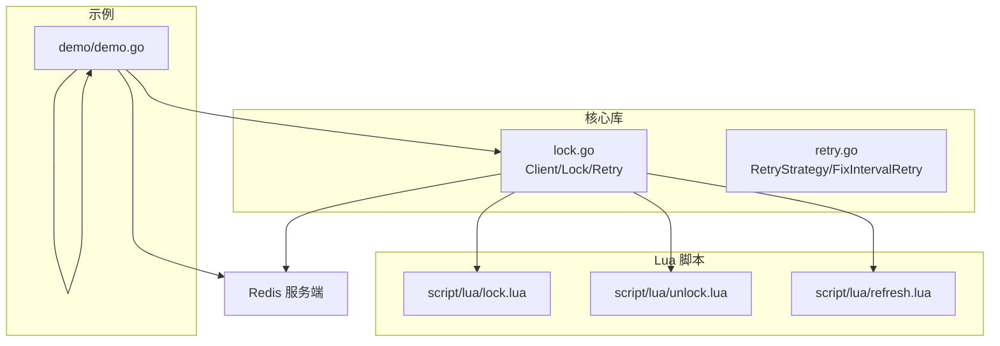
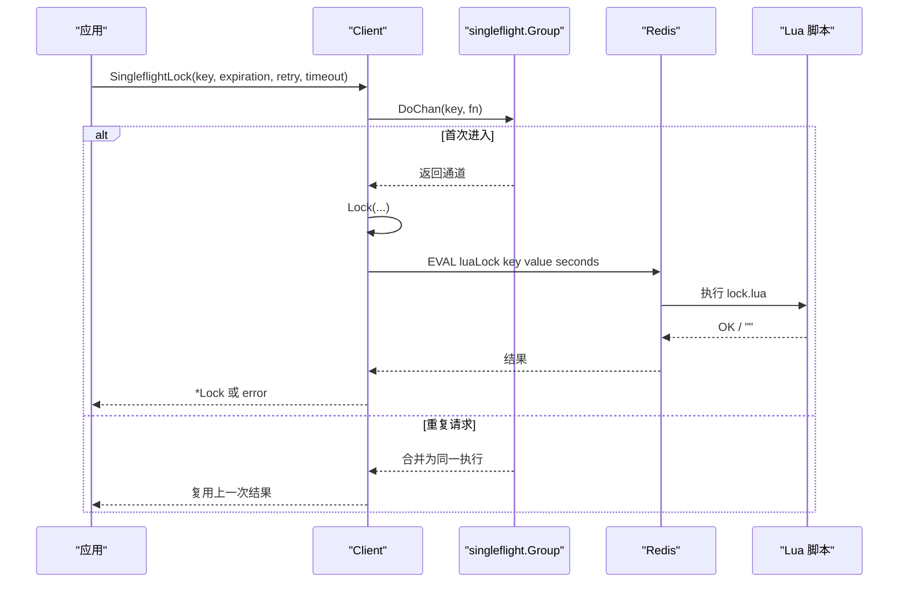
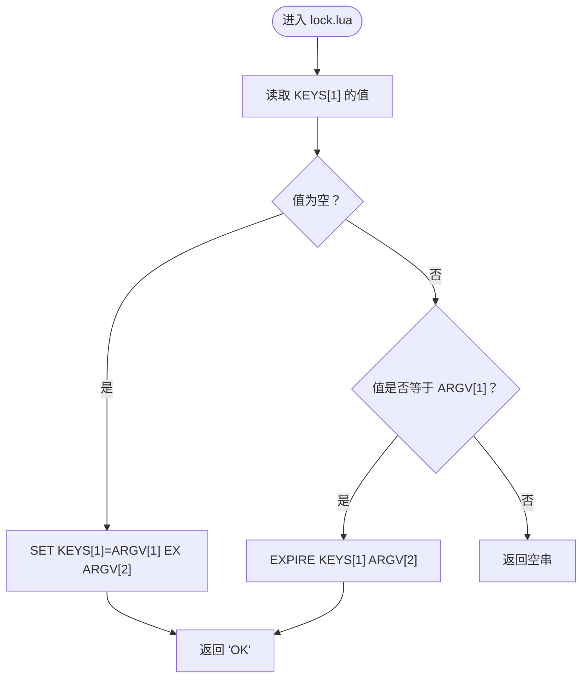
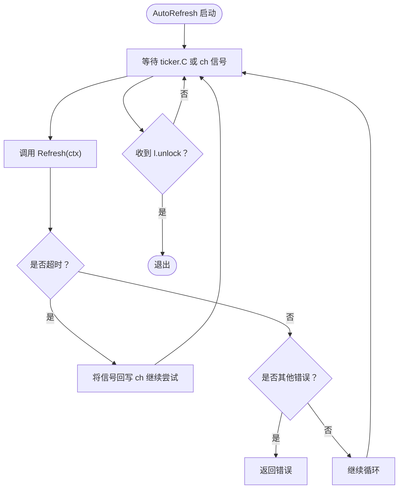
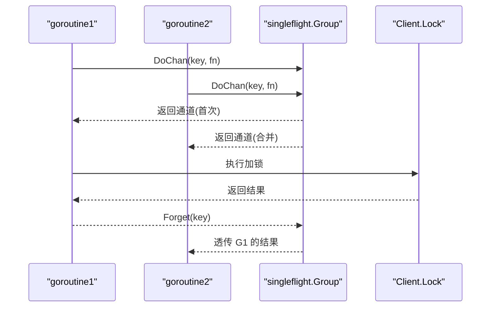
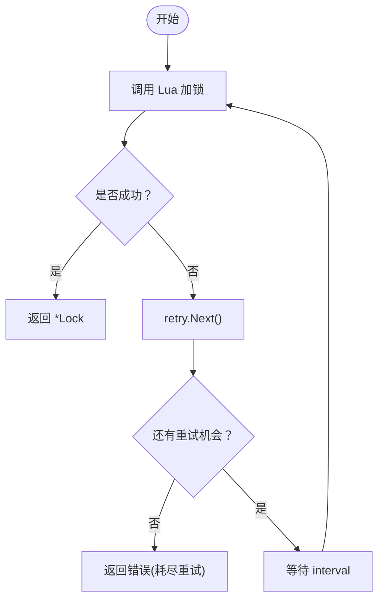
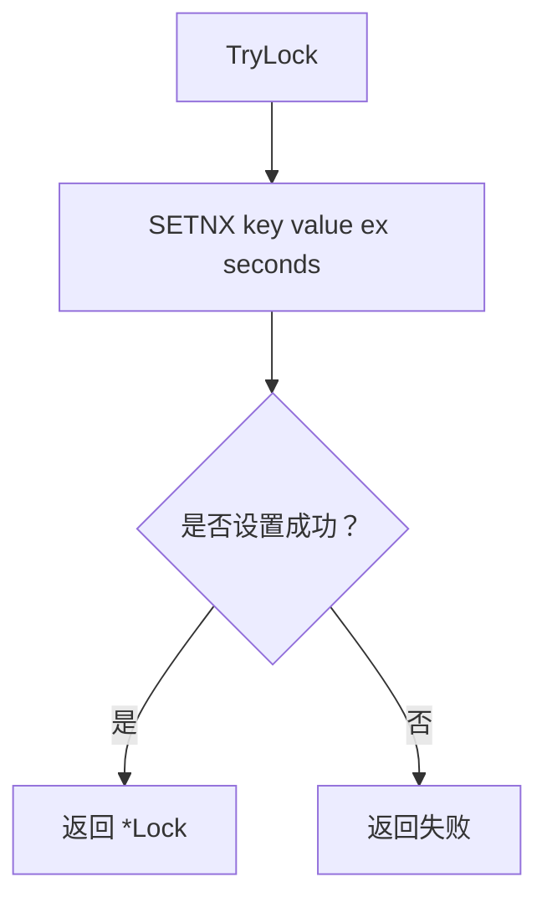
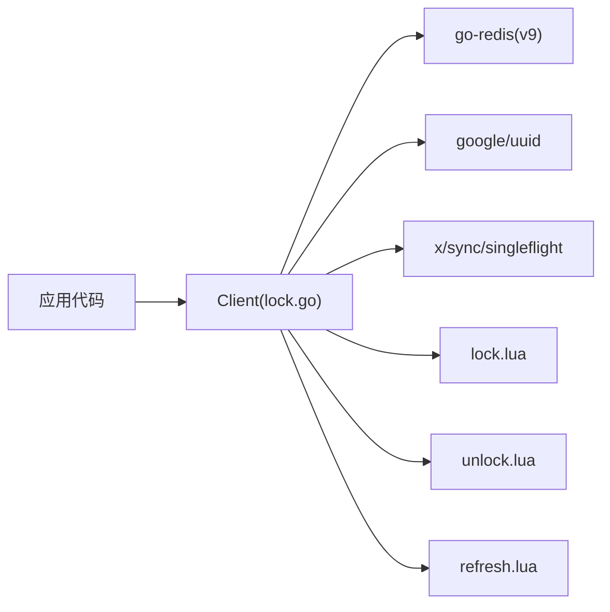

# 核心概念

<cite>
**本文引用的文件**   
- [README.md](file://README.md)
- [lock.go](file://lock.go)
- [retry.go](file://retry.go)
- [demo/demo.go](file://demo/demo.go)
- [script/lua/lock.lua](file://script/lua/lock.lua)
- [script/lua/unlock.lua](file://script/lua/unlock.lua)
- [script/lua/refresh.lua](file://script/lua/refresh.lua)
</cite>

## 目录
1. [简介](#简介)
2. [项目结构](#项目结构)
3. [核心组件](#核心组件)
4. [架构总览](#架构总览)
5. [详细组件分析](#详细组件分析)
6. [依赖关系分析](#依赖关系分析)
7. [性能与可靠性考量](#性能与可靠性考量)
8. [故障排查指南](#故障排查指南)
9. [结论](#结论)

## 简介
本仓库实现了一个基于 Redis 的分布式锁库，重点解决在分布式系统中对共享资源的互斥访问问题。其设计目标包括：
- 通过原子性保证加锁、解锁和续期操作的正确性
- 提供可重试的抢锁策略与超时控制
- 支持自动续期以延长锁的生命周期
- 使用 singleflight 模式避免重复请求导致的竞态条件
- 使用 UUID 作为锁标识，确保多实例间唯一性

该库要求 Redis >= v7（其他版本理论上可用但未充分测试），Go >= 18。

**章节来源**
- [README.md:1-13](file://README.md#L1-L13)

## 项目结构
仓库采用“核心库 + 示例演示 + Lua 脚本”的分层组织方式：
- 核心库：lock.go、retry.go
- 示例演示：demo/demo.go（教学用途）
- Lua 脚本：script/lua/{lock,unlock,refresh}.lua（嵌入到 Go 代码中执行）



**图表来源**
- [lock.go:17-28](file://lock.go#L17-L28)
- [script/lua/lock.lua:1-13](file://script/lua/lock.lua#L1-L13)
- [script/lua/unlock.lua:1-6](file://script/lua/unlock.lua#L1-L6)
- [script/lua/refresh.lua:1-6](file://script/lua/refresh.lua#L1-L6)
- [demo/demo.go:19-40](file://demo/demo.go#L19-L40)

**章节来源**
- [lock.go:17-28](file://lock.go#L17-L28)
- [demo/demo.go:19-40](file://demo/demo.go#L19-L40)

## 核心组件
- Client：封装 Redis 客户端能力，提供加锁、尝试加锁、带 singleflight 的加锁入口
- Lock：表示一次成功加锁后的资源持有者，提供刷新、自动刷新、解锁等能力
- RetryStrategy：定义重试策略接口；FixIntervalRetry 提供固定间隔重试实现
- Lua 脚本：lock.lua、unlock.lua、refresh.lua 分别负责加锁、解锁、续期的原子操作

关键职责划分：
- Client.Lock：带重试与超时的加锁流程，内部调用 Lua 脚本保证原子性
- Client.TryLock：非阻塞的一次性尝试加锁
- Client.SingleflightLock：基于 singleflight 去重，避免并发重复请求导致的多份竞争
- Lock.AutoRefresh：定时任务驱动续期，直到显式解锁或发生错误
- Lock.Refresh：单次续期，校验当前持有者并更新过期时间
- Lock.Unlock：仅允许锁持有者删除键，防止误删他人锁

**章节来源**
- [lock.go:46-60](file://lock.go#L46-L60)
- [lock.go:94-149](file://lock.go#L94-L149)
- [lock.go:151-168](file://lock.go#L151-L168)
- [lock.go:170-251](file://lock.go#L170-L251)
- [retry.go:19-35](file://retry.go#L19-L35)

## 架构总览
下图展示了从应用调用到 Redis 的完整交互路径，以及 Lua 脚本在其中的作用。



**图表来源**
- [lock.go:62-82](file://lock.go#L62-L82)
- [lock.go:94-134](file://lock.go#L94-L134)
- [script/lua/lock.lua:1-13](file://script/lua/lock.lua#L1-L13)

## 详细组件分析

### 分布式锁基本原理与重要性
- 互斥性：同一时刻只有一个进程能持有锁
- 安全性：只有锁持有者才能释放锁
- 死锁避免：设置过期时间，即使持有者崩溃也能自动释放
- 高可用：借助 Redis 的高吞吐与持久化能力，支撑大规模分布式场景

这些特性共同保障分布式系统中的数据一致性与业务幂等性。

[本节为概念性说明，不直接分析具体文件]

### Redis 作为存储介质的优势
- 原子性：EVAL 执行的 Lua 脚本在 Redis 单线程模型下原子执行，避免竞态
- 高性能：内存数据库，低延迟，适合高频加解锁
- 简单可靠：SETNX、EXPIRE、DEL 等命令组合配合 Lua 可实现复杂逻辑

**章节来源**
- [lock.go:104-113](file://lock.go#L104-L113)
- [script/lua/lock.lua:1-13](file://script/lua/lock.lua#L1-L13)

### Lua 脚本的关键作用
- lock.lua：判断键是否存在；不存在则 SET+EX；若值等于当前 value 则 EXPIRE 续期；否则返回空串
- unlock.lua：仅当键值匹配时 DEL，防止误删他人锁
- refresh.lua：校验持有者后更新过期时间



**图表来源**
- [script/lua/lock.lua:1-13](file://script/lua/lock.lua#L1-L13)

**章节来源**
- [script/lua/lock.lua:1-13](file://script/lua/lock.lua#L1-L13)
- [script/lua/unlock.lua:1-6](file://script/lua/unlock.lua#L1-L6)
- [script/lua/refresh.lua:1-6](file://script/lua/refresh.lua#L1-L6)

### 锁的过期时间与续期机制
- 过期时间：加锁时设置 EXPIRE，避免死锁
- 手动续期：Lock.Refresh 调用 refresh.lua，校验持有者后刷新过期时间
- 自动续期：Lock.AutoRefresh 启动定时器周期性调用 Refresh，直到 Unlock 触发停止



**图表来源**
- [lock.go:170-217](file://lock.go#L170-L217)
- [lock.go:219-229](file://lock.go#L219-L229)

**章节来源**
- [lock.go:170-229](file://lock.go#L170-L229)

### UUID 生成器在锁标识中的作用
- 每个锁请求生成一个全局唯一的 value（UUID），用于区分不同实例持有的锁
- 解锁与续期均校验 value，确保只有真正的持有者可以操作

```mermaid
classDiagram
class Client {
-client redis.Cmdable
-g singleflight.Group
-valuer func() string
+NewClient(client)
+SingleflightLock(ctx,key,expiration,retry,timeout)
+Lock(ctx,key,expiration,retry,timeout)
+TryLock(ctx,key,expiration)
}
class Lock {
-client redis.Cmdable
-key string
-value string
-expiration time.Duration
-unlock chan struct{}
+AutoRefresh(interval,timeout)
+Refresh(ctx)
+Unlock(ctx)
}
Client --> Lock : "创建并返回"
```

**图表来源**
- [lock.go:46-60](file://lock.go#L46-L60)
- [lock.go:151-168](file://lock.go#L151-L168)

**章节来源**
- [lock.go:53-60](file://lock.go#L53-L60)
- [lock.go:151-168](file://lock.go#L151-L168)

### singleflight 模式避免竞态条件
- 相同 key 的并发加锁请求会被合并，只执行一次底层加锁逻辑
- 未获取到锁的请求会复用第一次的结果，减少 Redis 压力与网络抖动影响



**图表来源**
- [lock.go:62-82](file://lock.go#L62-L82)

**章节来源**
- [lock.go:62-82](file://lock.go#L62-L82)

### 重试策略与超时控制
- RetryStrategy.Next 决定下一次重试间隔与是否继续重试
- FixIntervalRetry 提供固定间隔与最大次数限制
- Client.Lock 在每次失败后按策略休眠并重试，直至达到整体超时或耗尽重试次数



**图表来源**
- [lock.go:94-134](file://lock.go#L94-L134)
- [retry.go:19-35](file://retry.go#L19-L35)

**章节来源**
- [lock.go:94-134](file://lock.go#L94-L134)
- [retry.go:19-35](file://retry.go#L19-L35)

### TryLock 与 Lock 的区别
- TryLock：一次性尝试，立即返回成功或失败，适合快速失败场景
- Lock：带重试与超时，适合需要尽力获取锁的场景



**图表来源**
- [lock.go:136-149](file://lock.go#L136-L149)

**章节来源**
- [lock.go:136-149](file://lock.go#L136-L149)

## 依赖关系分析
- 外部依赖
  - github.com/redis/go-redis/v9：Redis 客户端抽象 Cmdable
  - github.com/google/uuid：生成唯一锁标识
  - golang.org/x/sync/singleflight：请求合并
- 内部依赖
  - Client 依赖 Redis 客户端与 singleflight
  - Lock 依赖 Redis 客户端与 Lua 脚本
  - 所有 Lua 脚本通过 go:embed 嵌入到二进制中



**图表来源**
- [lock.go:17-28](file://lock.go#L17-L28)
- [lock.go:30-38](file://lock.go#L30-L38)

**章节来源**
- [lock.go:17-28](file://lock.go#L17-L28)
- [lock.go:30-38](file://lock.go#L30-L38)

## 性能与可靠性考量
- 原子性保障：所有关键路径通过 Lua 脚本在 Redis 侧原子执行，避免中间状态
- 降低竞争风暴：singleflight 合并重复请求，显著降低 Redis 压力
- 可控重试：通过 RetryStrategy 灵活配置退避策略，避免雪崩
- 自动续期：长任务可通过 AutoRefresh 维持锁有效性，避免中途过期
- 安全释放：解锁前校验 value，防止误删他人锁

[本节为通用指导，不直接分析具体文件]

## 故障排查指南
- 常见错误
  - 未持有锁：解锁或续期时返回“未持有锁”，可能因锁已过期或被他人覆盖
  - 抢锁失败：超过重试次数仍未获取锁，需检查业务逻辑与重试策略
  - 上下文超时：整体加锁或续期调用被取消，需评估超时参数
- 定位建议
  - 确认 Redis 连接与权限正常
  - 检查 Lua 脚本是否被正确嵌入与加载
  - 观察 singleflight 是否有效合并重复请求
  - 核对过期时间与续期间隔的配置是否合理

**章节来源**
- [lock.go:39-44](file://lock.go#L39-L44)
- [lock.go:104-134](file://lock.go#L104-L134)
- [lock.go:219-251](file://lock.go#L219-L251)

## 结论
该分布式锁库通过 Redis 与 Lua 脚本的组合，提供了具备原子性、高性能与可扩展性的分布式锁实现。结合 singleflight 与可插拔的重试策略，能够在复杂分布式环境中稳定工作。开发者应合理配置过期时间、续期间隔与重试策略，并结合业务场景选择合适的加锁方式（TryLock 或 Lock），以获得最佳的性能与可靠性。

[本节为总结性内容，不直接分析具体文件]