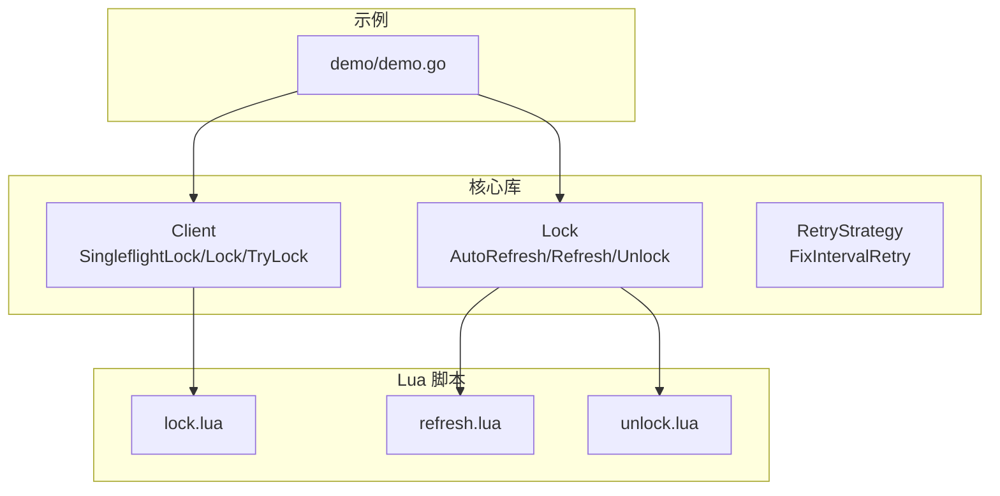
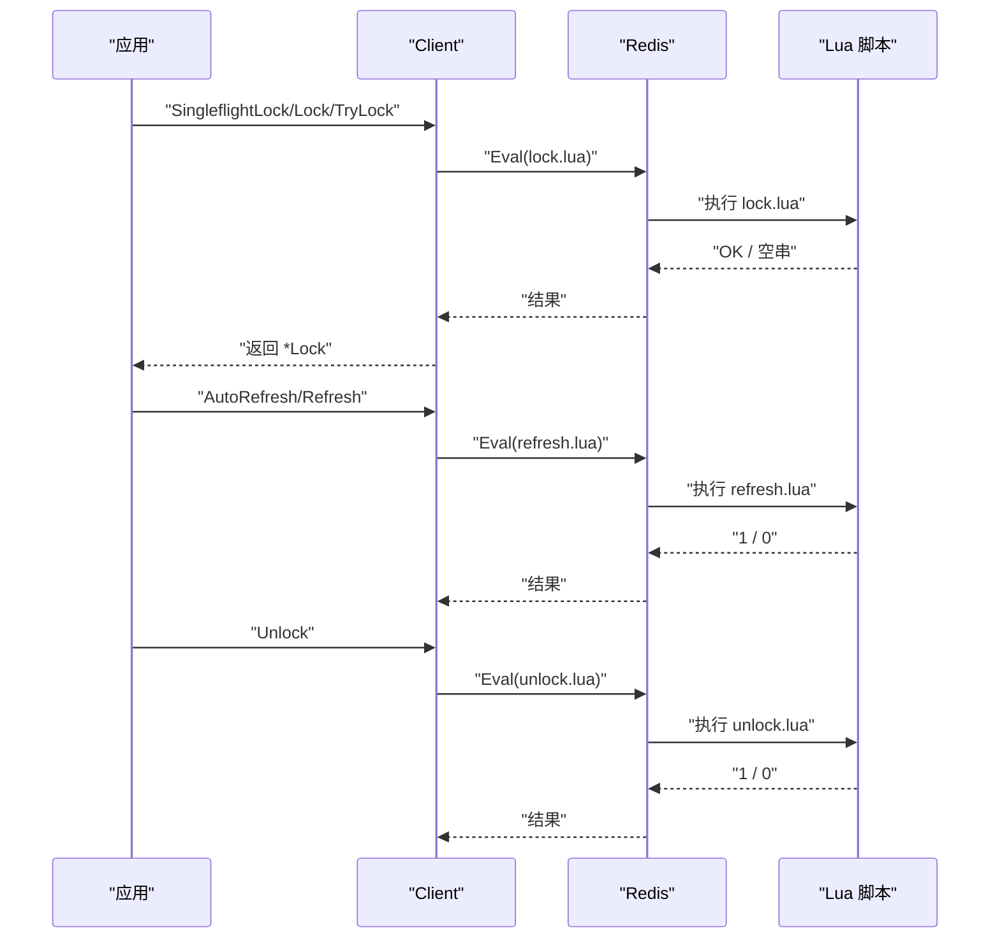
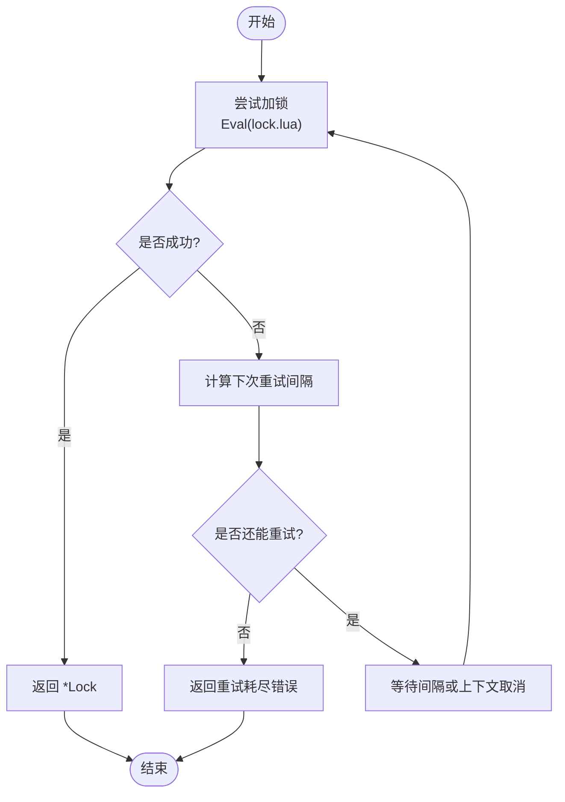
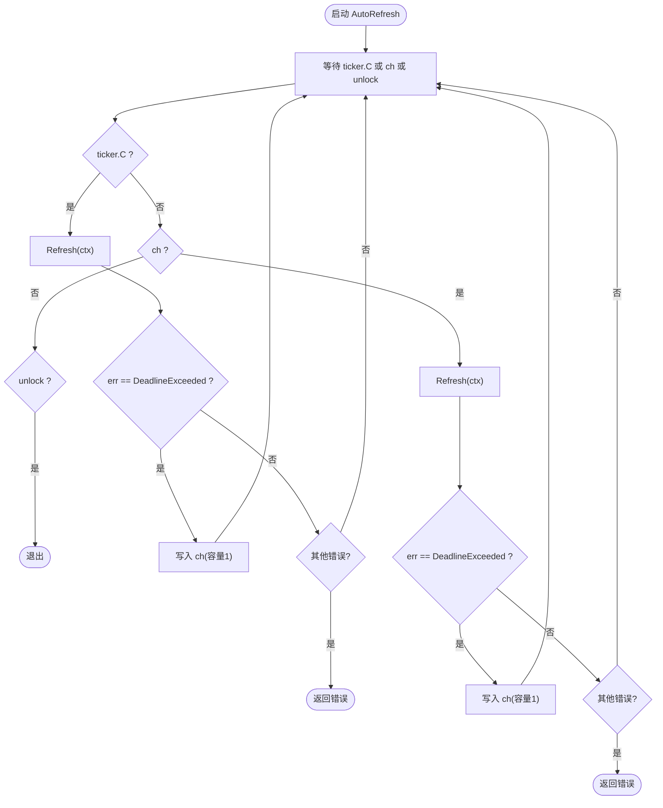
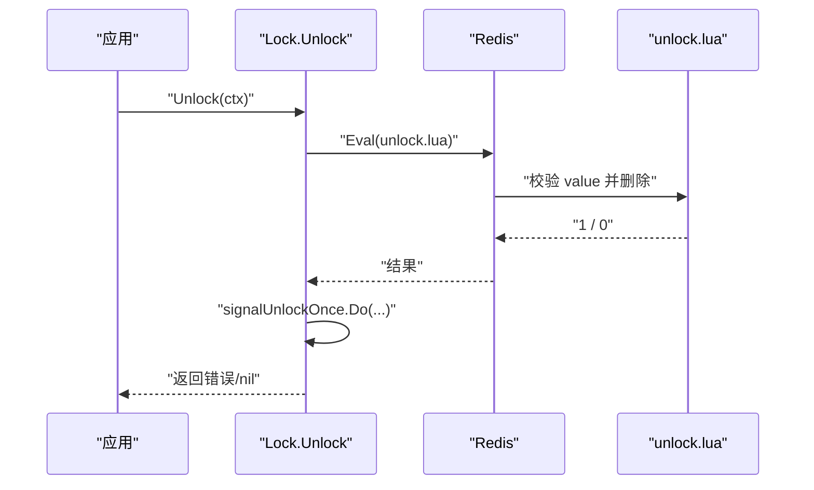
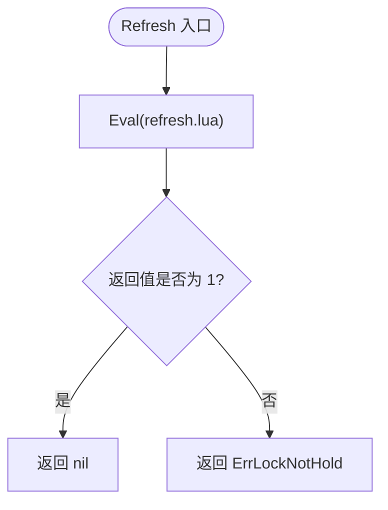
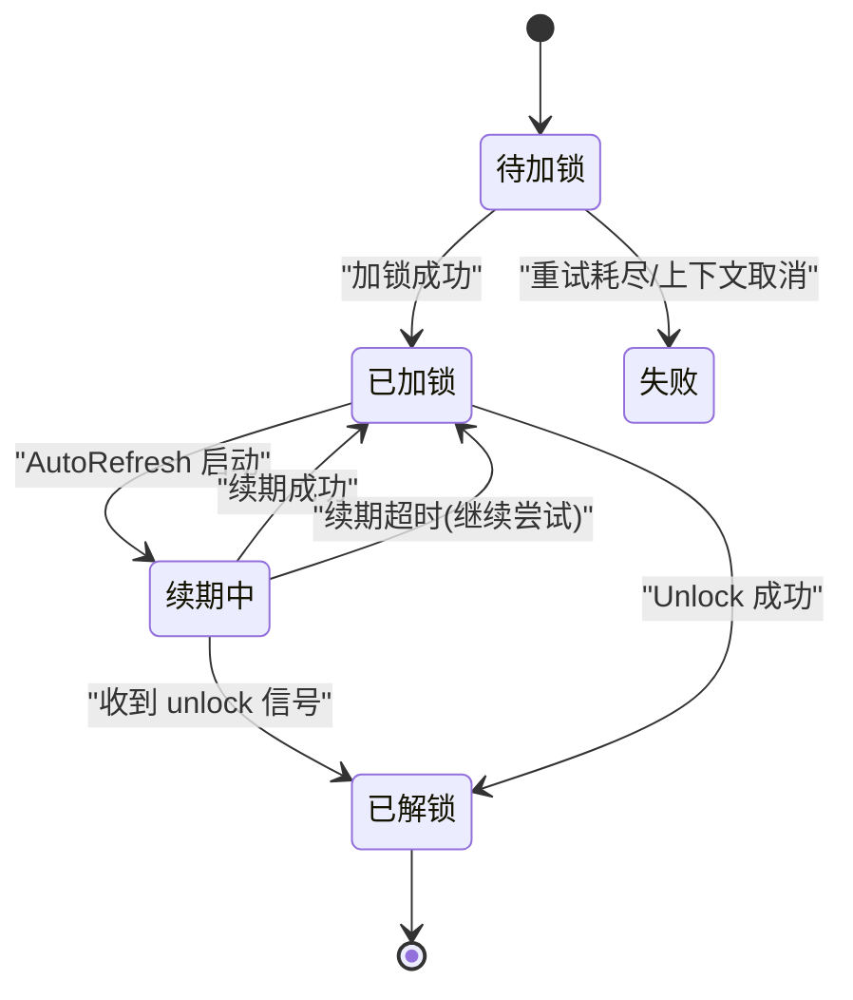
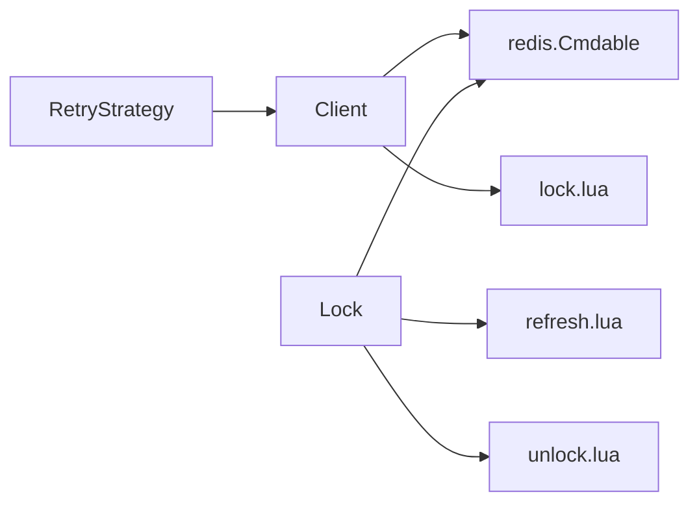

# 锁生命周期管理

<cite>
**本文引用的文件**   
- [lock.go](file://lock.go)
- [retry.go](file://retry.go)
- [demo.go](file://demo/demo.go)
- [lock.lua](file://script/lua/lock.lua)
- [refresh.lua](file://script/lua/refresh.lua)
- [unlock.lua](file://script/lua/unlock.lua)
</cite>

## 目录
1. [简介](#简介)
2. [项目结构](#项目结构)
3. [核心组件](#核心组件)
4. [架构总览](#架构总览)
5. [详细组件分析](#详细组件分析)
6. [依赖关系分析](#依赖关系分析)
7. [性能与并发特性](#性能与并发特性)
8. [故障排查指南](#故障排查指南)
9. [结论](#结论)
10. [附录：使用模式与最佳实践](#附录使用模式与最佳实践)

## 简介
本文件围绕分布式锁的生命周期管理展开，重点解释 Lock 结构体的设计理念、关键字段含义、自动续期 AutoRefresh 的实现原理（定时器控制、超时处理、并发安全），以及 unlock 信号通道与 sync.Once 在防止重复解锁中的作用。文档通过状态图与时序图展示锁从创建到销毁的完整流程，并给出常见使用模式与最佳实践建议。

## 项目结构
仓库采用“核心库 + 示例 + Lua 脚本”的分层组织方式：
- 核心库：提供 Client、Lock、重试策略等能力
- 示例：演示用法与对比实现
- Lua 脚本：封装原子性加锁、续租、解锁逻辑



图表来源
- [lock.go:46-149](file://lock.go#L46-L149)
- [lock.go:151-251](file://lock.go#L151-L251)
- [retry.go:19-35](file://retry.go#L19-L35)
- [lock.lua:1-13](file://script/lua/lock.lua#L1-L13)
- [refresh.lua:1-6](file://script/lua/refresh.lua#L1-L6)
- [unlock.lua:1-6](file://script/lua/unlock.lua#L1-L6)
- [demo.go:42-124](file://demo/demo.go#L42-L124)

章节来源
- [lock.go:17-28](file://lock.go#L17-L28)
- [lock.go:46-149](file://lock.go#L46-L149)
- [lock.go:151-251](file://lock.go#L151-L251)
- [retry.go:19-35](file://retry.go#L19-L35)
- [lock.lua:1-13](file://script/lua/lock.lua#L1-L13)
- [refresh.lua:1-6](file://script/lua/refresh.lua#L1-L6)
- [unlock.lua:1-6](file://script/lua/unlock.lua#L1-L6)
- [demo.go:42-124](file://demo/demo.go#L42-L124)

## 核心组件
- Client：对外暴露加锁接口，支持单次尝试 TryLock、带重试的 Lock、以及基于 singleflight 的去重加锁 SingleflightLock。内部使用 Redis Eval 执行 Lua 脚本完成原子操作。
- Lock：表示一次成功获取的分布式锁，持有 key/value/expiration 等元数据，并提供 AutoRefresh（自动续期）、Refresh（手动续期）、Unlock（释放锁）等方法。
- RetryStrategy：定义重试策略接口；FixIntervalRetry 提供固定间隔重试实现。

章节来源
- [lock.go:46-149](file://lock.go#L46-L149)
- [lock.go:151-251](file://lock.go#L151-L251)
- [retry.go:19-35](file://retry.go#L19-L35)

## 架构总览
下图展示了客户端调用到 Redis 的端到端流程，包括加锁、续期、解锁三个阶段，以及 Lua 脚本在 Redis 侧的原子性保障。



图表来源
- [lock.go:62-149](file://lock.go#L62-L149)
- [lock.go:170-251](file://lock.go#L170-L251)
- [lock.lua:1-13](file://script/lua/lock.lua#L1-L13)
- [refresh.lua:1-6](file://script/lua/refresh.lua#L1-L6)
- [unlock.lua:1-6](file://script/lua/unlock.lua#L1-L6)

## 详细组件分析

### Lock 结构体设计与字段语义
Lock 是分布式锁的核心对象，承载以下关键信息：
- client：Redis 客户端抽象，用于执行 Lua 脚本
- key：锁键名，标识资源
- value：锁值，唯一标识当前持有者，用于防误删
- expiration：过期时间，用于设置 TTL 和续期
- unlock：chan struct{}，容量为 1，作为“已解锁”信号通道，通知 AutoRefresh 退出
- signalUnlockOnce：sync.Once，确保 unlock 信号只发送一次，避免重复关闭 channel 或重复唤醒

```mermaid
classDiagram
class Lock {
-client redis.Cmdable
-key string
-value string
-expiration time.Duration
-unlock chan struct{}
-signalUnlockOnce sync.Once
+AutoRefresh(interval, timeout) error
+Refresh(ctx) error
+Unlock(ctx) error
}
```

图表来源
- [lock.go:151-168](file://lock.go#L151-L168)

章节来源
- [lock.go:151-168](file://lock.go#L151-L168)

### 加锁流程与重试机制
- TryLock：非阻塞尝试，底层使用 SETNX，失败返回“抢占失败”错误。
- Lock：带重试的阻塞式加锁。每次尝试使用 Lua 脚本 lock.lua 进行原子判断与设置；若失败则根据 RetryStrategy 计算下一次重试间隔，并在 context 超时前循环重试。
- SingleflightLock：对相同 key 的加锁请求进行去重，避免雪崩效应。



图表来源
- [lock.go:94-134](file://lock.go#L94-L134)
- [lock.lua:1-13](file://script/lua/lock.lua#L1-L13)
- [retry.go:19-35](file://retry.go#L19-L35)

章节来源
- [lock.go:62-149](file://lock.go#L62-L149)
- [retry.go:19-35](file://retry.go#L19-L35)
- [lock.lua:1-13](file://script/lua/lock.lua#L1-L13)

### 自动续期 AutoRefresh 的原理
AutoRefresh 负责在锁有效期内周期性续期，防止业务耗时过长导致锁提前过期。其核心要点如下：
- 定时器控制：使用 time.NewTicker 按 interval 触发续期任务。
- 超时处理：每次续期使用独立 context.WithTimeout(timeout)，当出现 context.DeadlineExceeded 时，将“需要再次续期”的信号写入缓冲通道 ch，以便后续继续尝试，避免阻塞主循环。
- 并发安全：
  - 使用 select 同时监听 ticker.C、ch、l.unlock，保证任一事件到达都能及时响应。
  - 使用容量为 1 的缓冲通道 ch 合并多次超时重试信号，避免频繁唤醒。
  - 使用 l.unlock 通道作为“停止信号”，由 Unlock 触发，确保 AutoRefresh 能优雅退出。



图表来源
- [lock.go:170-217](file://lock.go#L170-L217)

章节来源
- [lock.go:170-217](file://lock.go#L170-L217)

### 解锁流程与防重复解锁
- Unlock 会调用 Lua 脚本 unlock.lua 进行原子校验与删除，仅当 key 的值等于当前 value 时才删除，避免误删他人持有的锁。
- 为防止重复解锁导致的 panic，使用 sync.Once 包裹“发送 unlock 信号并关闭 channel”的逻辑，确保该副作用只发生一次。
- 如果 Redis 返回 nil（键不存在）或非 1（非当前持有者），则返回“未持有锁”错误。



图表来源
- [lock.go:231-251](file://lock.go#L231-L251)
- [unlock.lua:1-6](file://script/lua/unlock.lua#L1-L6)

章节来源
- [lock.go:231-251](file://lock.go#L231-L251)
- [unlock.lua:1-6](file://script/lua/unlock.lua#L1-L6)

### 续期 Refresh 的实现
- Refresh 调用 Lua 脚本 refresh.lua，仅在 key 的值等于当前 value 时更新过期时间，否则返回“未持有锁”。
- 该方法被 AutoRefresh 定时调用，也允许用户手动调用以主动续期。



图表来源
- [lock.go:219-229](file://lock.go#L219-L229)
- [refresh.lua:1-6](file://script/lua/refresh.lua#L1-L6)

章节来源
- [lock.go:219-229](file://lock.go#L219-L229)
- [refresh.lua:1-6](file://script/lua/refresh.lua#L1-L6)

### 锁生命周期状态图
下图描述锁从创建到销毁的状态变迁，包括正常续期、异常退出、解锁等路径。



图表来源
- [lock.go:94-149](file://lock.go#L94-L149)
- [lock.go:170-251](file://lock.go#L170-L251)

## 依赖关系分析
- Client 依赖 Redis Cmdable 与 Lua 脚本，通过 Eval 执行原子逻辑。
- Lock 依赖 Redis 与 Lua 脚本，并通过 channel 与 sync.Once 实现并发安全的生命周期控制。
- RetryStrategy 为可插拔的重试策略，默认实现 FixIntervalRetry 提供固定间隔重试。



图表来源
- [lock.go:46-149](file://lock.go#L46-L149)
- [lock.go:151-251](file://lock.go#L151-L251)
- [retry.go:19-35](file://retry.go#L19-L35)
- [lock.lua:1-13](file://script/lua/lock.lua#L1-L13)
- [refresh.lua:1-6](file://script/lua/refresh.lua#L1-L6)
- [unlock.lua:1-6](file://script/lua/unlock.lua#L1-L6)

章节来源
- [lock.go:46-149](file://lock.go#L46-L149)
- [lock.go:151-251](file://lock.go#L151-L251)
- [retry.go:19-35](file://retry.go#L19-L35)

## 性能与并发特性
- 原子性：所有加锁、续期、解锁均通过 Lua 脚本在 Redis 侧原子执行，避免竞态条件。
- 去重：SingleflightLock 对相同 key 的并发加锁请求进行合并，减少 Redis 压力与网络抖动影响。
- 重试：Lock 支持可配置的重试策略，结合 context 超时控制整体等待时间。
- 自动续期：AutoRefresh 使用 ticker 与缓冲通道合并超时重试，降低唤醒频率；通过 unlock 信号优雅退出。
- 并发安全：
  - unlock 通道容量为 1，避免重复解锁时的阻塞或 panic。
  - sync.Once 确保 unlock 信号与 channel 关闭只执行一次。

[本节为通用性能讨论，不直接分析具体文件]

## 故障排查指南
- 加锁失败且无错误：可能是锁已被其他持有者占用，检查业务逻辑是否重复加锁或 key 冲突。
- 续期失败返回“未持有锁”：可能 value 不匹配或被外部删除，确认是否绕过 rlock 直接操作 Redis。
- AutoRefresh 卡住：检查 unlock 信号是否被正确触发；确认 Unlock 是否被调用且未被重复调用导致 panic。
- 上下文超时：注意区分“整体加锁超时”与“单次续期超时”，前者可能不确定是否加锁成功，后者可继续重试。

章节来源
- [lock.go:84-134](file://lock.go#L84-L134)
- [lock.go:219-251](file://lock.go#L219-L251)

## 结论
本实现通过 Lua 脚本保证加锁、续期、解锁的原子性，结合 retry 策略与 singleflight 提升可用性；Lock 结构体通过 channel 与 sync.Once 实现安全的生命周期管理。AutoRefresh 在定时器与超时处理之间取得平衡，既能持续续期，又能在解锁时快速退出。遵循本文的使用模式与最佳实践，可在高并发场景下稳定地管理分布式锁。

[本节为总结性内容，不直接分析具体文件]

## 附录：使用模式与最佳实践
- 基本加锁
  - 使用 TryLock 进行非阻塞尝试，适合幂等且可快速失败的场景。
  - 使用 Lock 配合 RetryStrategy 进行带重试的阻塞式加锁，适合强一致性要求。
- 自动续期
  - 在持有锁的业务逻辑执行期间启动 AutoRefresh，确保长时间任务不会因锁过期而中断。
  - 合理设置 interval 与 timeout，interval 应小于 expiration，timeout 应小于网络抖动容忍度。
- 解锁
  - 务必在 defer 中调用 Unlock，确保异常路径也能释放锁。
  - 不要重复调用 Unlock，sync.Once 已做保护，但应避免业务逻辑上的重复释放。
- 并发与去重
  - 在高并发竞争场景下优先使用 SingleflightLock，减少 Redis 压力与惊群效应。
- 错误处理
  - 区分 context.DeadlineExceeded 与 ErrFailedToPreemptLock、ErrLockNotHold，分别采取不同恢复策略。
  - 对于“未持有锁”错误，检查是否存在绕过 rlock 的直接 Redis 操作。

章节来源
- [lock.go:62-149](file://lock.go#L62-L149)
- [lock.go:170-251](file://lock.go#L170-L251)
- [retry.go:19-35](file://retry.go#L19-L35)
- [demo.go:42-124](file://demo/demo.go#L42-L124)