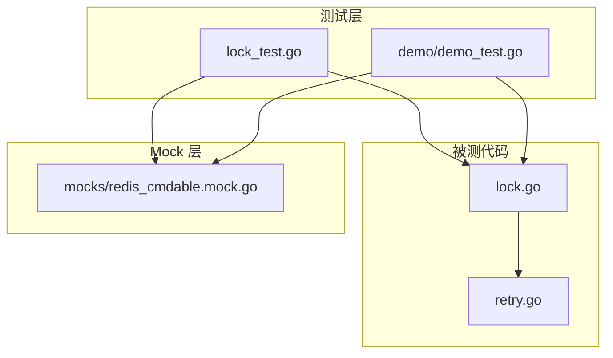
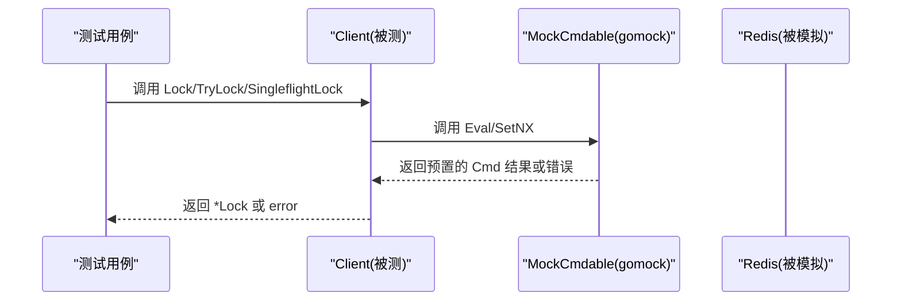
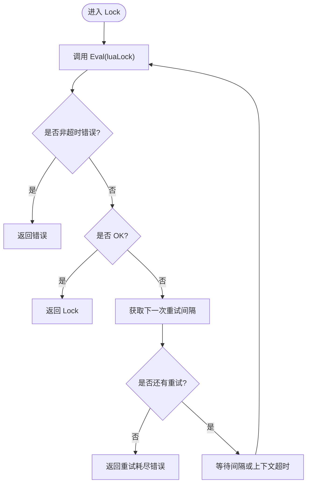
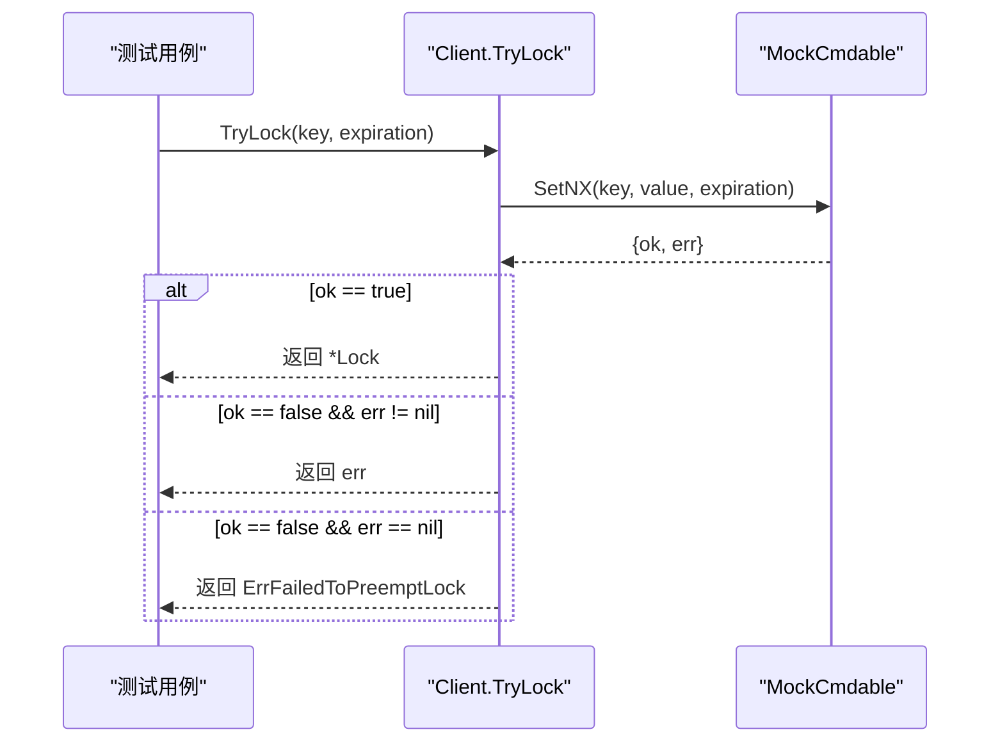
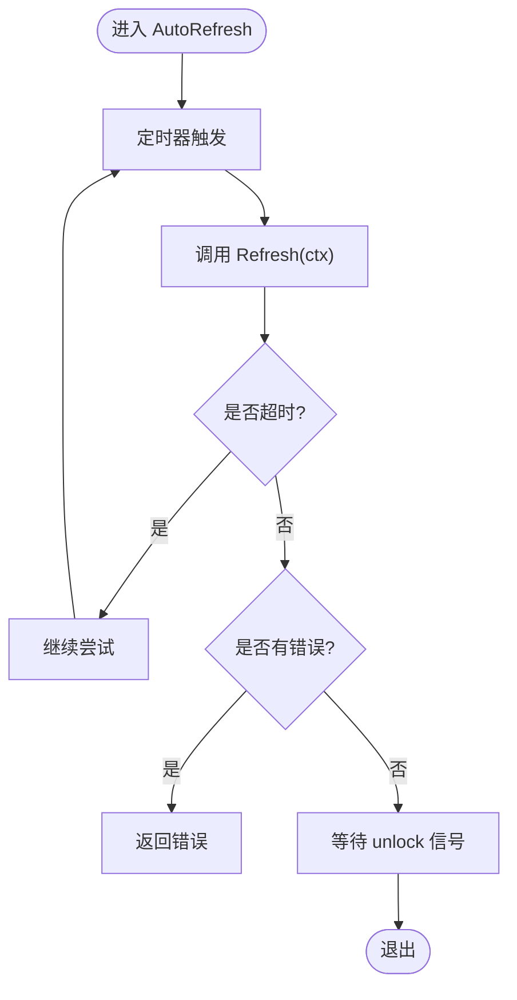
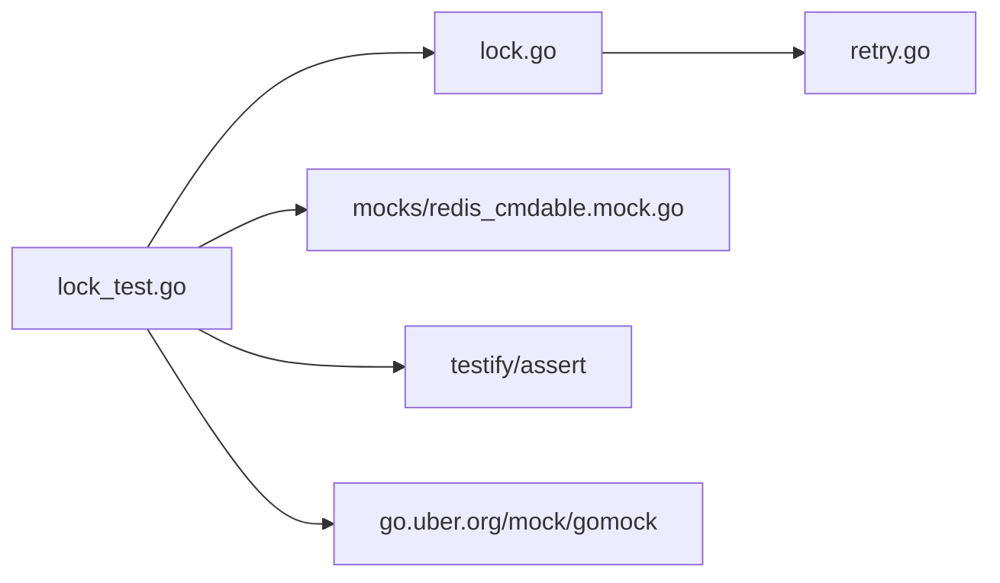

# 单元测试

<cite>
**本文引用的文件**   
- [lock.go](file://lock.go)
- [retry.go](file://retry.go)
- [lock_test.go](file://lock_test.go)
- [redis_cmdable.mock.go](file://mocks/redis_cmdable.mock.go)
- [demo_test.go](file://demo/demo_test.go)
</cite>

## 目录
1. [简介](#简介)
2. [项目结构](#项目结构)
3. [核心组件](#核心组件)
4. [架构总览](#架构总览)
5. [详细组件分析](#详细组件分析)
6. [依赖关系分析](#依赖关系分析)
7. [性能与稳定性考量](#性能与稳定性考量)
8. [故障排查指南](#故障排查指南)
9. [结论](#结论)
10. [附录：测试用例速查表](#附录测试用例速查表)

## 简介
本文件面向 redis-lock 库的单元测试实践，重点说明如何使用 gomock 框架模拟 Redis 客户端（Cmdable 接口），并围绕 MockCmdable 的使用、表驱动测试组织方式、典型业务场景（加锁成功、网络错误、重试机制、自动续期、解锁等）进行系统化讲解。文档同时给出高质量单元测试的最佳实践，包括测试数据准备、断言使用、并发测试注意事项，并通过具体代码路径指引覆盖 Client.Lock、TryLock、SingleflightLock、Lock.Refresh、Lock.AutoRefresh、Lock.Unlock 等方法的各种情况。

## 项目结构
仓库中与单元测试直接相关的核心文件如下：
- lock.go：实现分布式锁的核心逻辑（Client、Lock、重试策略集成、Lua 脚本调用）。
- retry.go：定义重试策略接口 FixIntervalRetry。
- mocks/redis_cmdable.mock.go：由 mockgen 生成的 Cmdable 接口的 Mock 实现，用于隔离 Redis 依赖。
- lock_test.go：主测试文件，覆盖 Lock/TryLock/Unlock/Refresh/AutoRefresh/SingleflightLock 等场景。
- demo/demo_test.go：演示模块中的 TryLock 测试示例，展示另一种表驱动写法。

图表来源
- [lock_test.go:32-177](file://lock_test.go#L32-L177)
- [demo_test.go:31-107](file://demo/demo_test.go#L31-L107)
- [lock.go:46-149](file://lock.go#L46-L149)
- [retry.go:19-35](file://retry.go#L19-L35)
- [redis_cmdable.mock.go:21-38](file://mocks/redis_cmdable.mock.go#L21-L38)

章节来源
- [lock_test.go:1-542](file://lock_test.go#L1-L542)
- [demo_test.go:1-108](file://demo/demo_test.go#L1-L108)
- [lock.go:1-252](file://lock.go#L1-L252)
- [retry.go:1-36](file://retry.go#L1-L36)
- [redis_cmdable.mock.go:1-800](file://mocks/redis_cmdable.mock.go#L1-L800)

## 核心组件
- Client：封装 Redis 客户端（通过 redis.Cmdable 抽象），提供 Lock、TryLock、SingleflightLock 三种加锁模式。
- Lock：表示一次加锁结果，支持 Refresh、AutoRefresh、Unlock。
- RetryStrategy/FixIntervalRetry：固定间隔重试策略，控制重试次数和间隔。
- MockCmdable：基于 go-redis/v9 的 Cmdable 接口生成的 Mock，用于在测试中精确期望 Eval/SetNX 等命令的调用与返回值。

章节来源
- [lock.go:46-149](file://lock.go#L46-L149)
- [retry.go:19-35](file://retry.go#L19-L35)
- [redis_cmdable.mock.go:21-38](file://mocks/redis_cmdable.mock.go#L21-L38)

## 架构总览
下图展示了测试执行时，被测代码与 Mock 之间的交互关系。测试通过 NewClient(mock) 注入 MockCmdable，从而在不连接真实 Redis 的情况下验证业务逻辑。

图表来源
- [lock_test.go:32-177](file://lock_test.go#L32-L177)
- [lock.go:94-149](file://lock.go#L94-L149)
- [redis_cmdable.mock.go:21-38](file://mocks/redis_cmdable.mock.go#L21-L38)

## 详细组件分析

### 使用 gomock 模拟 Redis 客户端（MockCmdable）
- MockCmdable 是 go-redis/v9 的 Cmdable 接口的自动生成实现，包含所有 Redis 命令方法。
- 在测试中通过 NewMockCmdable(ctrl) 创建实例，并使用 EXPECT().Eval(...) 或 EXPECT().SetNX(...) 设置期望调用与返回值。
- 常用技巧：
  - 使用 redis.NewCmd(context.Background(), nil) 构造命令对象，再通过 SetVal/SetErr 设置返回值或错误。
  - 对多次调用的场景，使用 Times(n) 指定调用次数；对任意次调用，使用 AnyTimes()。
  - 使用 gomock.Any() 匹配任意参数，避免严格匹配导致的不稳定测试。

章节来源
- [redis_cmdable.mock.go:21-38](file://mocks/redis_cmdable.mock.go#L21-L38)
- [lock_test.go:51-57](file://lock_test.go#L51-L57)
- [lock_test.go:198-203](file://lock_test.go#L198-L203)

### 表驱动测试的组织方式
- 将不同业务场景以“表驱动”形式组织，每个用例包含 name、mock 构造函数、输入参数、期望结果（wantLock/wantErr）。
- 统一在 for _, tc := range testCases 循环中执行 t.Run(tc.name, ...)，保证用例独立、可并行运行。
- 优点：用例扩展方便、断言集中、易于维护。

章节来源
- [lock_test.go:32-177](file://lock_test.go#L32-L177)
- [demo_test.go:31-107](file://demo/demo_test.go#L31-L107)

### 测试 Client.Lock（带重试的 Lua 加锁）
- 正常加锁成功：Mock.Eval 返回 "OK"，断言返回的 Lock 包含 key、expiration、value 非空。
- 不可重试的网络错误：Mock.Eval 返回错误（如 network error），直接返回该错误。
- 重试耗尽：Mock.Eval 连续失败（超时或锁被占用），超过重试次数后返回“重试机会耗尽”的错误。
- 重试后成功：前几次 Eval 返回空字符串（锁被占），最后一次返回 "OK"，最终成功。
- 重试期间上下文超时：在重试等待过程中触发 context.DeadlineExceeded。

图表来源
- [lock.go:94-134](file://lock.go#L94-L134)
- [lock_test.go:32-177](file://lock_test.go#L32-L177)

章节来源
- [lock.go:94-134](file://lock.go#L94-L134)
- [lock_test.go:32-177](file://lock_test.go#L32-L177)

### 测试 Client.TryLock（原子 SETNX 加锁）
- 加锁成功：Mock.SetNX 返回 true，断言返回的 Lock 字段正确。
- 网络错误：Mock.SetNX 返回 false 且附带错误，直接返回该错误。
- 竞争失败：Mock.SetNX 返回 false 且无错误，返回 ErrFailedToPreemptLock。

图表来源
- [lock.go:136-149](file://lock.go#L136-L149)
- [lock_test.go:179-252](file://lock_test.go#L179-L252)
- [demo_test.go:31-107](file://demo/demo_test.go#L31-L107)

章节来源
- [lock.go:136-149](file://lock.go#L136-L149)
- [lock_test.go:179-252](file://lock_test.go#L179-L252)
- [demo_test.go:31-107](file://demo/demo_test.go#L31-L107)

### 测试 Lock.Unlock（Lua 安全释放）
- 解锁成功：Mock.Eval(luaUnlock) 返回 1，无错误。
- 网络错误：Mock.Eval 返回错误，直接返回该错误。
- 未持有锁：Mock.Eval 返回 0 或 redis.Nil，返回 ErrLockNotHold。

章节来源
- [lock.go:231-251](file://lock.go#L231-L251)
- [lock_test.go:254-311](file://lock_test.go#L254-L311)

### 测试 Lock.Refresh（手动续约）
- 续约成功：Mock.Eval(luaRefresh) 返回 1，无错误。
- 续约失败（redis.Nil）：返回 redis.Nil。
- 未持有锁：返回 0，返回 ErrLockNotHold。

章节来源
- [lock.go:219-229](file://lock.go#L219-L229)
- [lock_test.go:475-541](file://lock_test.go#L475-L541)

### 测试 Lock.AutoRefresh（自动续约）
- 自动续约成功：定时触发 Refresh，直到 Unlock 信号到来。
- 自动续约失败：Refresh 返回非超时错误，立即返回。
- 自动续约超时：Refresh 返回 context.DeadlineExceeded，继续重试直至 Unlock 或外部终止。

图表来源
- [lock.go:170-217](file://lock.go#L170-L217)
- [lock_test.go:367-473](file://lock_test.go#L367-L473)

章节来源
- [lock.go:170-217](file://lock.go#L170-L217)
- [lock_test.go:367-473](file://lock_test.go#L367-L473)

### 测试 Client.SingleflightLock（单飞合并重复请求）
- SingleflightLock 内部复用 Lock 的逻辑，并通过 singleflight.Group 合并相同 key 的并发请求，避免重复加锁。
- 测试中 Mock.Eval 返回 "OK"，断言无错误。
- 并发行为需结合 goroutine 并发调用同一 key 来验证合并效果（当前测试注释 TODO 提示并发测试待完善）。

章节来源
- [lock.go:62-82](file://lock.go#L62-L82)
- [lock_test.go:347-365](file://lock_test.go#L347-L365)

### 重试策略 FixIntervalRetry
- 固定间隔重试，Next() 返回固定 Interval，并在达到 Max 次数后停止重试。
- 在 Lock 中用于控制“锁被占用或超时”时的重试节奏。

章节来源
- [retry.go:19-35](file://retry.go#L19-L35)
- [lock.go:94-134](file://lock.go#L94-L134)
- [lock_test.go:32-177](file://lock_test.go#L32-L177)

## 依赖关系分析
- 被测代码依赖 redis.Cmdable 抽象，测试通过 MockCmdable 替代真实 Redis。
- 测试依赖 testify/assert 与 testify/require 进行断言。
- 测试依赖 go.uber.org/mock/gomock 管理 Mock 生命周期与期望。

图表来源
- [lock_test.go:17-30](file://lock_test.go#L17-L30)
- [lock.go:17-28](file://lock.go#L17-L28)
- [redis_cmdable.mock.go:12-19](file://mocks/redis_cmdable.mock.go#L12-L19)

章节来源
- [lock_test.go:17-30](file://lock_test.go#L17-L30)
- [lock.go:17-28](file://lock.go#L17-L28)
- [redis_cmdable.mock.go:12-19](file://mocks/redis_cmdable.mock.go#L12-L19)

## 性能与稳定性考量
- 使用 Mock 隔离 Redis 依赖，提升测试速度与稳定性。
- 表驱动测试减少重复代码，便于扩展新场景。
- 对于涉及时间控制的逻辑（重试、自动续约），尽量使用短间隔与可控超时，确保测试快速完成。
- 并发相关测试（如 SingleflightLock）应谨慎设计，避免竞态条件导致不稳定。

[本节为通用指导，不直接分析具体文件]

## 故障排查指南
- 如果 Mock 期望未满足：检查 EXPECT().Eval/SetNX 的参数匹配是否正确，必要时使用 gomock.Any() 放宽匹配。
- 如果测试出现死锁或卡住：检查 AutoRefresh 与 Unlock 的信号通道是否正确使用，确保 unlock 信号能被关闭。
- 如果重试逻辑不符合预期：确认 FixIntervalRetry.Max 与 Interval 配置是否符合用例需求，以及上下文超时是否合理。
- 如果解锁行为异常：检查 luaUnlock 返回值是否为 1，以及 redis.Nil 的处理分支。

章节来源
- [lock_test.go:254-311](file://lock_test.go#L254-L311)
- [lock_test.go:367-473](file://lock_test.go#L367-L473)
- [lock.go:219-251](file://lock.go#L219-L251)

## 结论
通过使用 gomock 生成 MockCmdable，并结合表驱动测试，可以高效、稳定地覆盖 redis-lock 库的关键路径：加锁、重试、续约、解锁与并发合并。建议在新增功能时遵循现有测试结构与断言风格，优先使用 Mock 隔离外部依赖，确保测试快速、可靠、可维护。

[本节为总结性内容，不直接分析具体文件]

## 附录：测试用例速查表
- Client.Lock
  - 加锁成功：[lock_test.go:49-67](file://lock_test.go#L49-L67)
  - 不可重试网络错误：[lock_test.go:69-83](file://lock_test.go#L69-L83)
  - 重试耗尽：[lock_test.go:85-99](file://lock_test.go#L85-L99)
  - 重试后成功：[lock_test.go:116-138](file://lock_test.go#L116-L138)
  - 重试期间超时：[lock_test.go:139-154](file://lock_test.go#L139-L154)
- Client.TryLock
  - 加锁成功：[lock_test.go:193-208](file://lock_test.go#L193-L208)
  - 网络错误：[lock_test.go:209-221](file://lock_test.go#L209-L221)
  - 竞争失败：[lock_test.go:222-234](file://lock_test.go#L222-L234)
- Lock.Unlock
  - 解锁成功：[lock_test.go:263-274](file://lock_test.go#L263-L274)
  - 网络错误：[lock_test.go:275-287](file://lock_test.go#L275-L287)
  - 未持有锁：[lock_test.go:288-301](file://lock_test.go#L288-L301)
- Lock.Refresh
  - 续约成功：[lock_test.go:483-498](file://lock_test.go#L483-L498)
  - 续约失败（redis.Nil）：[lock_test.go:499-515](file://lock_test.go#L499-L515)
  - 未持有锁：[lock_test.go:516-532](file://lock_test.go#L516-L532)
- Lock.AutoRefresh
  - 自动续约成功：[lock_test.go:379-402](file://lock_test.go#L379-L402)
  - 自动续约失败：[lock_test.go:403-427](file://lock_test.go#L403-L427)
  - 自动续约超时：[lock_test.go:428-457](file://lock_test.go#L428-L457)
- Client.SingleflightLock
  - 基本成功路径：[lock_test.go:347-365](file://lock_test.go#L347-L365)