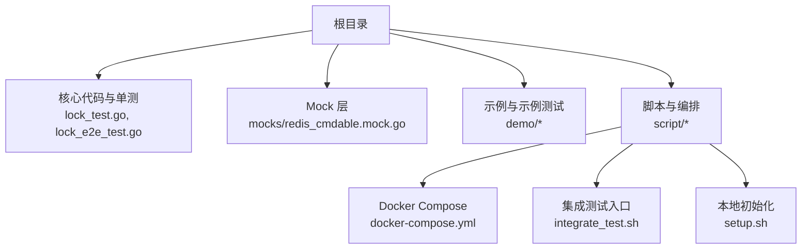
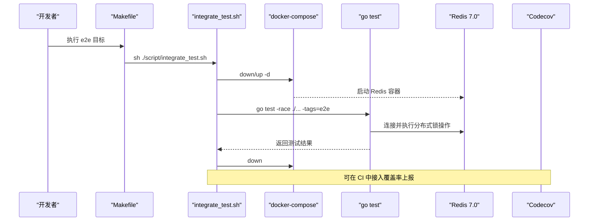
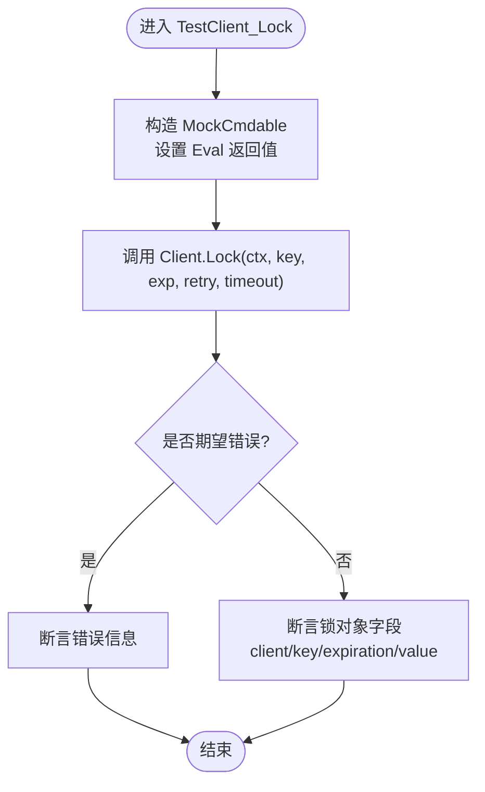
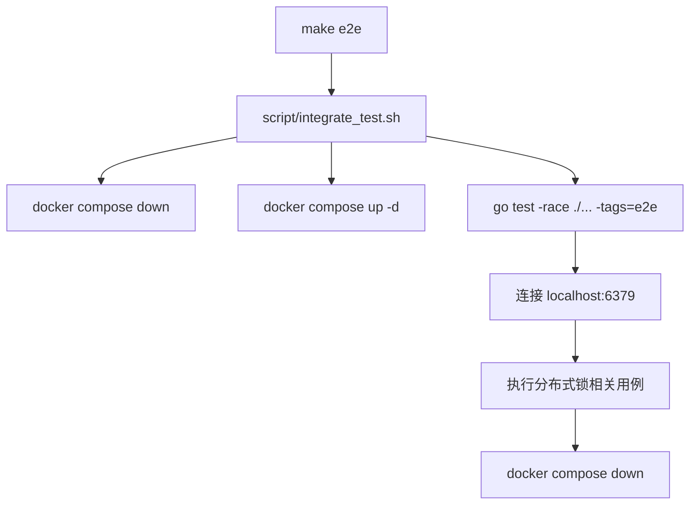
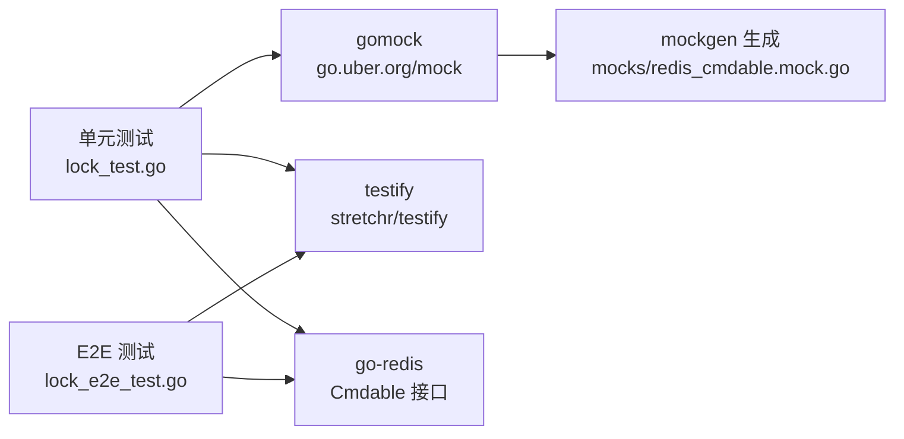

# 测试指南

<cite>
**本文引用的文件**   
- [README.md](file://README.md)
- [Makefile](file://Makefile)
- [go.mod](file://go.mod)
- [.codecov.yml](file://.codecov.yml)
- [script/integrate_test.sh](file://script/integrate_test.sh)
- [script/setup.sh](file://script/setup.sh)
- [script/docker-compose.yml](file://script/docker-compose.yml)
- [lock_test.go](file://lock_test.go)
- [lock_e2e_test.go](file://lock_e2e_test.go)
- [mocks/redis_cmdable.mock.go](file://mocks/redis_cmdable.mock.go)
- [demo/demo_test.go](file://demo/demo_test.go)
- [demo/demo_e2e_test.go](file://demo/demo_e2e_test.go)
</cite>

## 目录
1. [引言](#引言)
2. [项目结构](#项目结构)
3. [核心组件](#核心组件)
4. [架构总览](#架构总览)
5. [详细组件分析](#详细组件分析)
6. [依赖分析](#依赖分析)
7. [性能与并发注意事项](#性能与并发注意事项)
8. [覆盖率配置与监控](#覆盖率配置与监控)
9. [故障排查指南](#故障排查指南)
10. [结论](#结论)
11. [附录：命令速查](#附录命令速查)

## 引言
本指南面向 redis-lock 库的测试实践，覆盖单元测试、集成测试（E2E）、Mock Redis 客户端使用、测试用例组织、覆盖率配置与监控、并发与边界条件测试要点，以及自动化与持续集成的落地方案。目标是帮助读者快速搭建稳定可靠的测试环境，编写高质量、可维护的测试用例，并在 CI 中稳定运行。

## 项目结构
仓库围绕“核心实现 + 测试 + Mock + 脚本”组织：
- 核心实现与主测试位于根目录
- E2E 测试通过 build tag 隔离
- Mock 由 mockgen 生成，用于隔离 Redis 依赖
- 脚本提供本地环境准备、CI 流程与 Docker 编排

图表来源
- [Makefile:1-45](file://Makefile#L1-L45)
- [script/docker-compose.yml:14-20](file://script/docker-compose.yml#L14-L20)
- [script/integrate_test.sh:17-20](file://script/integrate_test.sh#L17-L20)
- [script/setup.sh:20-36](file://script/setup.sh#L20-L36)

章节来源
- [README.md:1-13](file://README.md#L1-L13)
- [Makefile:1-45](file://Makefile#L1-L45)
- [script/docker-compose.yml:14-20](file://script/docker-compose.yml#L14-L20)
- [script/integrate_test.sh:17-20](file://script/integrate_test.sh#L17-L20)
- [script/setup.sh:20-36](file://script/setup.sh#L20-L36)

## 核心组件
- 单元测试
  - 使用 go.uber.org/mock/gomock 与生成的 MockCmdable 隔离 Redis 调用
  - 覆盖加锁、尝试加锁、解锁、续约、自动续约等路径
- 集成/E2E 测试
  - 通过 build tag e2e 隔离，启动真实 Redis 容器执行端到端验证
- Mock 层
  - 基于 Cmdable 接口生成完整 Mock，便于精确断言 Redis 命令调用
- 构建与脚本
  - Makefile 统一入口；脚本负责环境准备与 E2E 执行

章节来源
- [lock_test.go:17-30](file://lock_test.go#L17-L30)
- [lock_e2e_test.go:15-28](file://lock_e2e_test.go#L15-L28)
- [mocks/redis_cmdable.mock.go:1-38](file://mocks/redis_cmdable.mock.go#L1-L38)
- [Makefile:5-45](file://Makefile#L5-L45)

## 架构总览
下图展示测试在本地与 CI 中的整体流程：开发者触发 make 目标或 CI 任务，脚本拉起 Redis，运行对应测试，最后清理资源并上报覆盖率。

图表来源
- [Makefile:30-41](file://Makefile#L30-L41)
- [script/integrate_test.sh:17-20](file://script/integrate_test.sh#L17-L20)
- [script/docker-compose.yml:14-20](file://script/docker-compose.yml#L14-L20)

## 详细组件分析

### 单元测试策略与实现
- 使用 gomock 与 MockCmdable
  - 通过 NewMockCmdable(ctrl) 创建 Mock，并用 EXPECT().Eval/SetNX 等精确断言 Redis 调用
  - 针对 Lua 脚本调用 Eval 进行参数校验，确保 key、value、过期时间等符合预期
- 用例组织
  - 采用 table-driven 测试，每个子用例包含 mock 构造、输入参数、期望结果与错误
  - 对重试、超时、网络错误、锁被占用、锁不存在等分支全覆盖
- 关键场景
  - Lock：Lua 加锁成功、不可重试错误、重试耗尽、竞争失败、最终成功、超时
  - TryLock：SetNX 成功、网络错误、竞争失败
  - Unlock：Lua 解锁成功、网络错误、锁不存在
  - Refresh/AutoRefresh：续约成功、续约失败、续约超时、自动续约期间解锁
  - SingleflightLock：合并重复请求（并发收敛）

图表来源
- [lock_test.go:32-177](file://lock_test.go#L32-L177)

章节来源
- [lock_test.go:32-177](file://lock_test.go#L32-L177)
- [lock_test.go:179-252](file://lock_test.go#L179-L252)
- [lock_test.go:254-311](file://lock_test.go#L254-L311)
- [lock_test.go:347-365](file://lock_test.go#L347-L365)
- [lock_test.go:367-473](file://lock_test.go#L367-L473)
- [lock_test.go:475-541](file://lock_test.go#L475-L541)

### Mock Redis 客户端使用方法
- 生成 Mock
  - 通过 Makefile 的 mock 目标调用 mockgen 生成 mocks/redis_cmdable.mock.go
  - 生成文件实现了 redis.Cmdable 接口的所有方法，便于在测试中精确断言
- 在测试中使用
  - 使用 NewMockCmdable(ctrl) 创建实例
  - 用 EXPECT().Eval(...) 或 EXPECT().SetNX(...) 指定期望调用与返回值
  - 结合 redis.NewCmd/redis.NewBoolResult 等构造响应对象
- 最佳实践
  - 仅断言必要的参数，避免过度耦合
  - 对可变参数使用 gomock.Any() 时注意语义约束
  - 对多次调用使用 Times(n) 或 AnyTimes() 明确次数

章节来源
- [Makefile:43-45](file://Makefile#L43-L45)
- [mocks/redis_cmdable.mock.go:1-38](file://mocks/redis_cmdable.mock.go#L1-L38)
- [lock_test.go:51-57](file://lock_test.go#L51-L57)
- [lock_test.go:198-202](file://lock_test.go#L198-L202)

### 集成测试（E2E）环境搭建与执行
- 环境要求
  - Redis >= v7（脚本使用 bitnami/redis:7.0）
  - Docker 与 docker compose
- 启动方式
  - 手动：make e2e_up 启动 Redis 容器
  - 自动：make e2e 会先 down 再 up，然后执行测试，最后 down
- 测试入口
  - script/integrate_test.sh 封装了容器生命周期与 go test -race ./... -tags=e2e
- 测试内容
  - 覆盖 Lock/TryLock/Refresh/AutoRefresh/Unlock 的真实 Redis 交互
  - 使用 suite 管理测试套件与前置/后置清理

图表来源
- [Makefile:30-41](file://Makefile#L30-L41)
- [script/integrate_test.sh:17-20](file://script/integrate_test.sh#L17-L20)
- [script/docker-compose.yml:14-20](file://script/docker-compose.yml#L14-L20)
- [lock_e2e_test.go:35-45](file://lock_e2e_test.go#L35-L45)

章节来源
- [script/integrate_test.sh:17-20](file://script/integrate_test.sh#L17-L20)
- [script/docker-compose.yml:14-20](file://script/docker-compose.yml#L14-L20)
- [lock_e2e_test.go:30-49](file://lock_e2e_test.go#L30-L49)
- [lock_e2e_test.go:51-152](file://lock_e2e_test.go#L51-L152)
- [lock_e2e_test.go:154-220](file://lock_e2e_test.go#L154-L220)
- [lock_e2e_test.go:222-300](file://lock_e2e_test.go#L222-L300)
- [lock_e2e_test.go:302-321](file://lock_e2e_test.go#L302-L321)
- [lock_e2e_test.go:323-365](file://lock_e2e_test.go#L323-L365)

### 示例模块测试
- demo 目录包含教学演示代码与对应测试
- 单测同样使用 MockCmdable 模拟 Redis 行为
- E2E 示例测试直接连接本地 Redis 验证 TryLock 行为

章节来源
- [demo/demo_test.go:15-29](file://demo/demo_test.go#L15-L29)
- [demo/demo_test.go:31-107](file://demo/demo_test.go#L31-L107)
- [demo/demo_e2e_test.go:15-26](file://demo/demo_e2e_test.go#L15-L26)
- [demo/demo_e2e_test.go:28-100](file://demo/demo_e2e_test.go#L28-L100)

## 依赖分析
- 测试依赖
  - github.com/stretchr/testify：断言与套件
  - go.uber.org/mock：Mock 框架
  - github.com/redis/go-redis/v9：Redis 客户端与 Cmdable 接口
  - golang.org/x/sync：Singleflight 等并发原语
- 工具链
  - golangci-lint、goimports、mockgen
- 版本与兼容性
  - README 声明 Redis >= v7，Go >= 18

图表来源
- [go.mod:5-12](file://go.mod#L5-L12)
- [lock_test.go:17-30](file://lock_test.go#L17-L30)
- [lock_e2e_test.go:19-28](file://lock_e2e_test.go#L19-L28)
- [mocks/redis_cmdable.mock.go:1-19](file://mocks/redis_cmdable.mock.go#L1-L19)

章节来源
- [go.mod:5-12](file://go.mod#L5-L12)
- [README.md:1-5](file://README.md#L1-L5)

## 性能与并发注意事项
- 并发安全
  - 单测中已启用 -race 检测（make ut）
  - E2E 也使用 -race 运行，有助于发现竞态
- 并发收敛
  - SingleflightLock 用于合并重复加锁请求，减少 Redis 压力
  - 建议在高频并发场景下优先使用 SingleflightLock
- 超时与重试
  - 合理设置 timeout 与 RetryStrategy，避免长时间阻塞
  - 区分“可重试错误”和“不可重试错误”，避免无意义重试
- 自动续约
  - AutoRefresh 需配合业务退出信号，避免 goroutine 泄漏
  - 续约间隔应小于锁过期时间，预留缓冲

章节来源
- [Makefile:5-7](file://Makefile#L5-L7)
- [lock_test.go:347-365](file://lock_test.go#L347-L365)
- [lock_test.go:367-473](file://lock_test.go#L367-L473)

## 覆盖率配置与监控
- 覆盖率阈值
  - .codecov.yml 定义 project 与 patch 的目标为 95%，阈值 0.5%
  - 支持 main/dev 分支，CI 失败策略为 error
- 建议
  - 在 CI 中上传覆盖率报告至 Codecov
  - 关注新增代码的 patch 覆盖率，保持高水准

章节来源
- [.codecov.yml:15-39](file://.codecov.yml#L15-L39)

## 故障排查指南
- 无法连接 Redis（E2E）
  - 检查 docker compose 是否成功启动 Redis 容器
  - 确认端口映射 6379 未被占用
  - 在测试 SetupSuite 中已有 Ping 等待逻辑，若仍失败请检查网络与权限
- Mock 断言失败
  - 检查 EXPECT 的参数是否与实现一致（key、value、过期时间、Lua 脚本名）
  - 对可变参数尽量使用具体匹配而非 Any()
- 用例不稳定
  - 增加 sleep 或使用更严格的超时控制
  - 使用 t.Parallel() 时注意共享状态隔离
- 覆盖率不达标
  - 补充边界条件与异常分支用例
  - 使用 testify 的 assert 与 require 组合提升可读性与稳定性

章节来源
- [script/docker-compose.yml:14-20](file://script/docker-compose.yml#L14-L20)
- [lock_e2e_test.go:35-45](file://lock_e2e_test.go#L35-L45)
- [lock_test.go:51-57](file://lock_test.go#L51-L57)

## 结论
通过 gomock 隔离 Redis 依赖、table-driven 组织用例、-race 并发检测与真实 Redis 的 E2E 验证，本项目形成了稳健的测试体系。配合 Makefile 与脚本，本地与 CI 均可一键执行。建议持续完善边界与并发用例，保持覆盖率门槛，确保分布式锁在复杂场景下的可靠性。

## 附录：命令速查
- 运行单元测试（含竞态检测）
  - make ut
- 运行 E2E 测试（自动启停 Redis）
  - make e2e
- 单独启动/停止 Redis 容器
  - make e2e_up / make e2e_down
- 生成 Mock
  - make mock
- 格式化与依赖整理
  - make fmt / make tidy
- 代码质量检查
  - make lint

章节来源
- [Makefile:1-45](file://Makefile#L1-L45)