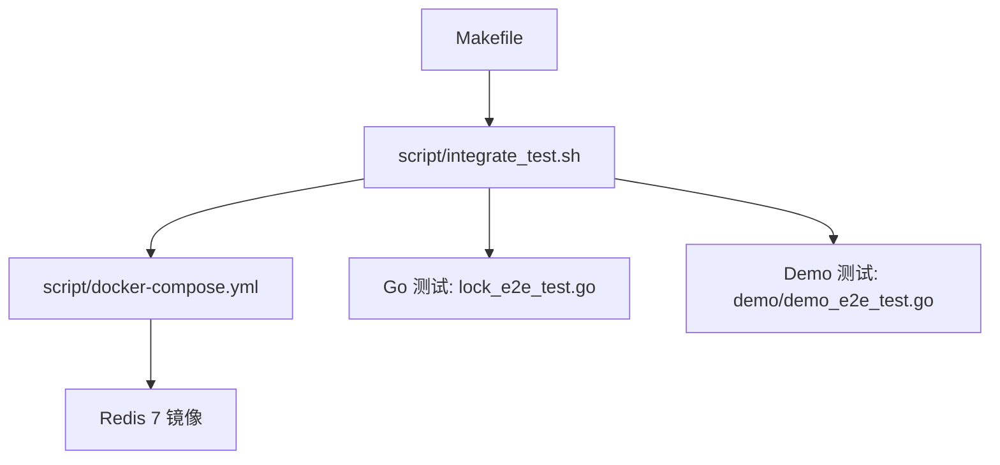
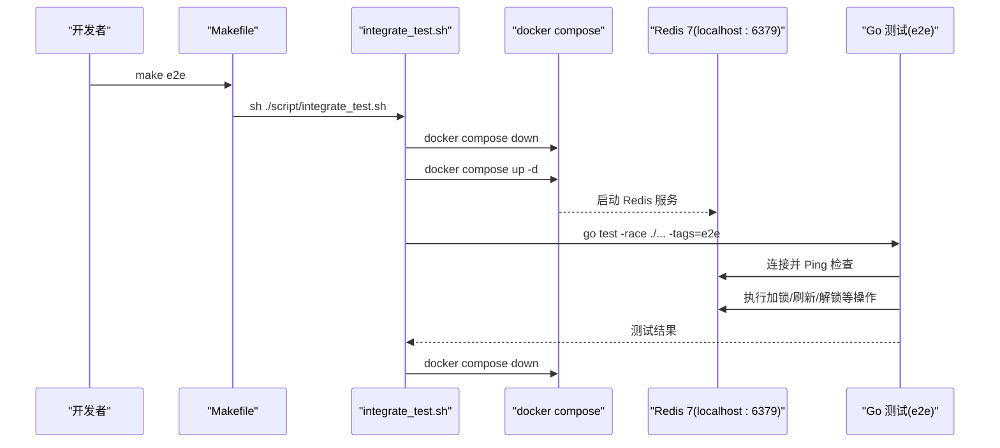
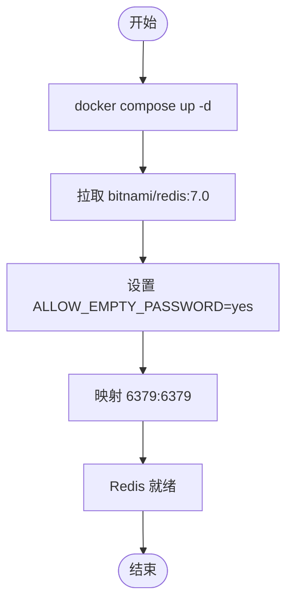
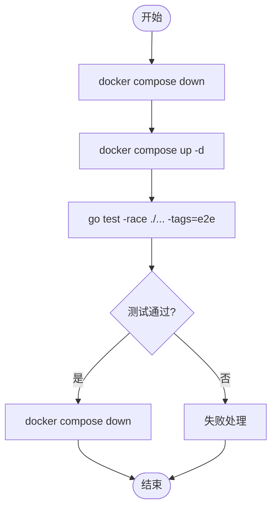
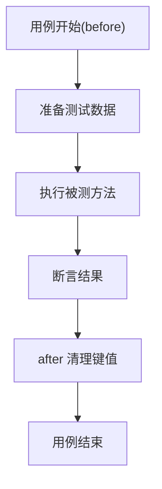
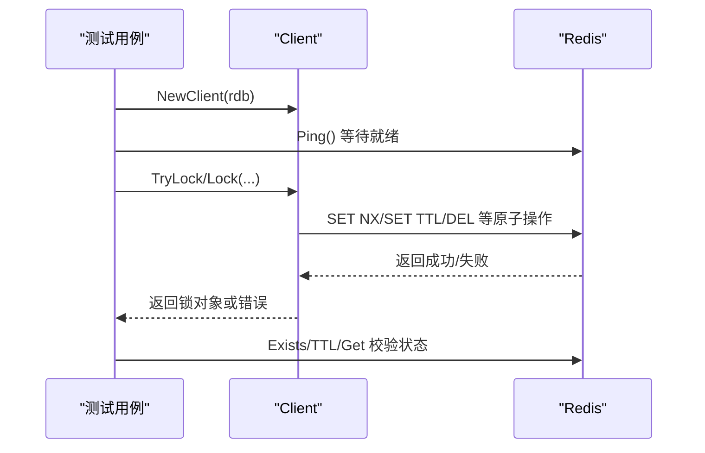
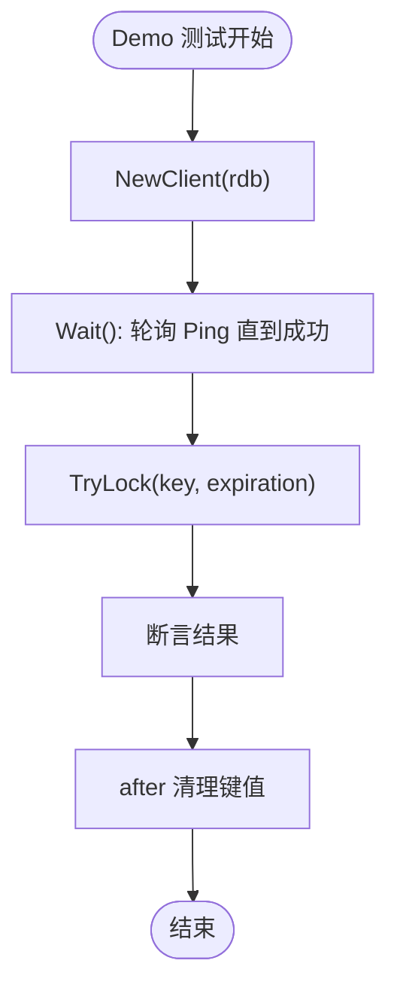
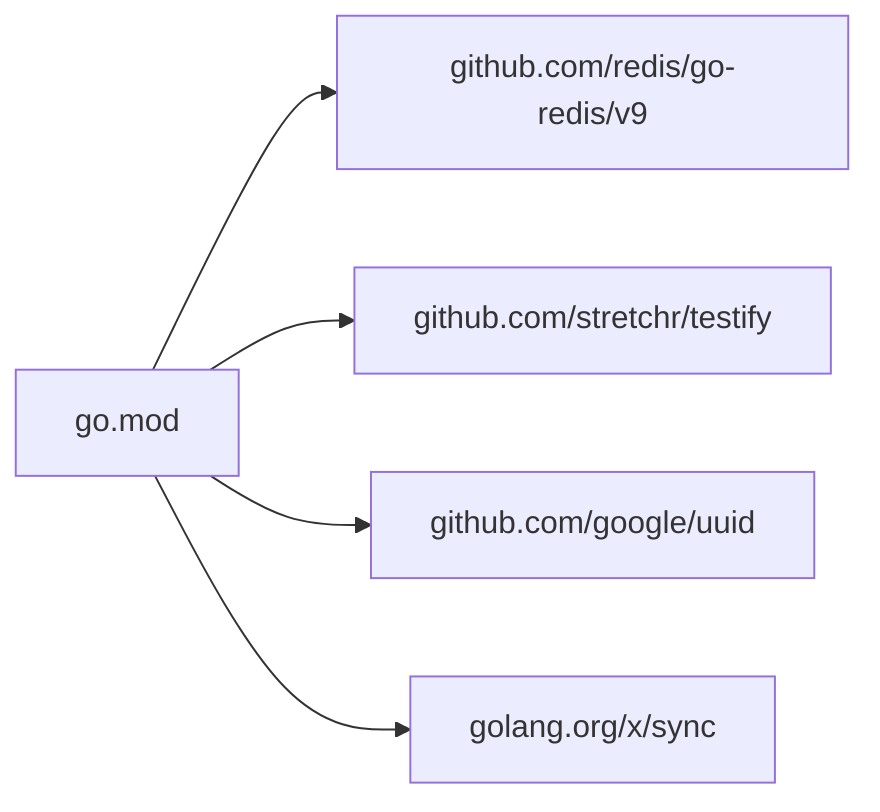
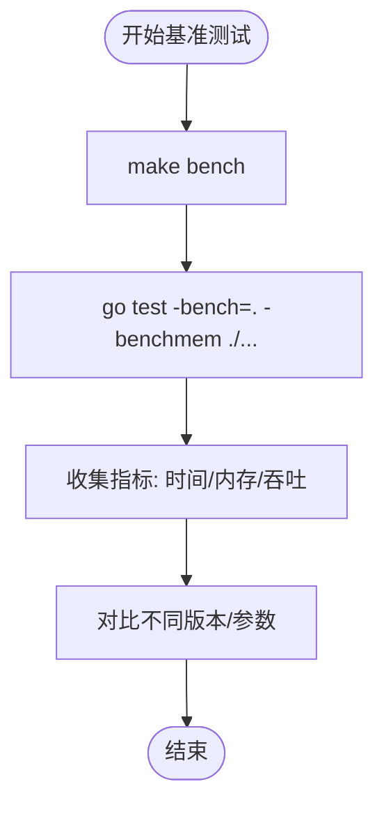

# 集成测试

<cite>
**本文引用的文件**   
- [README.md](file://README.md)
- [script/docker-compose.yml](file://script/docker-compose.yml)
- [script/integrate_test.sh](file://script/integrate_test.sh)
- [Makefile](file://Makefile)
- [lock_e2e_test.go](file://lock_e2e_test.go)
- [demo/demo_e2e_test.go](file://demo/demo_e2e_test.go)
- [go.mod](file://go.mod)
</cite>

## 目录
1. [简介](#简介)
2. [项目结构](#项目结构)
3. [核心组件](#核心组件)
4. [架构总览](#架构总览)
5. [详细组件分析](#详细组件分析)
6. [依赖关系分析](#依赖关系分析)
7. [性能考量与基准测试](#性能考量与基准测试)
8. [故障排查指南](#故障排查指南)
9. [结论](#结论)
10. [附录](#附录)

## 简介
本文件面向 redis-lock 库的集成测试（E2E）实践，目标是帮助读者在本地或 CI 环境中快速搭建 Redis 服务、执行端到端测试、验证分布式锁的真实行为，并给出性能基准测试方法与持续集成示例。文档同时覆盖测试数据清理策略、网络异常与资源竞争的处理建议。

## 项目结构
仓库中与集成测试直接相关的核心文件如下：
- Docker Compose 配置：用于启动真实 Redis 实例
- 集成测试脚本：编排容器生命周期并执行 Go 测试
- Makefile：提供便捷命令入口
- E2E 测试用例：基于真实 Redis 的行为验证
- Demo 模块的 E2E 用例：演示用法与等待就绪逻辑

图表来源
- [Makefile:30-41](file://Makefile#L30-L41)
- [script/integrate_test.sh:17-20](file://script/integrate_test.sh#L17-L20)
- [script/docker-compose.yml:14-20](file://script/docker-compose.yml#L14-L20)

章节来源
- [Makefile:1-45](file://Makefile#L1-L45)
- [script/integrate_test.sh:1-21](file://script/integrate_test.sh#L1-L21)
- [script/docker-compose.yml:1-20](file://script/docker-compose.yml#L1-L20)

## 核心组件
- Docker Compose 服务定义：使用 bitnami/redis:7.0 镜像，暴露端口 6379，允许空密码，便于测试连接。
- 集成测试脚本：先 down 旧容器，再 up 新容器，随后以 race 检测 + e2e 标签运行全部测试，最后 down 容器。
- Makefile 目标：封装 e2e、e2e_up、e2e_down 等常用操作，方便一键执行。
- E2E 测试套件：通过 go:build e2e 标签启用，连接 localhost:6379，构造 Client 并验证加锁、刷新、自动刷新、解锁等行为。
- Demo E2E 测试：以 demo 包为示例，展示 TryLock 的使用方式，并提供 Wait() 等待 Redis 就绪的方法。

章节来源
- [script/docker-compose.yml:14-20](file://script/docker-compose.yml#L14-L20)
- [script/integrate_test.sh:17-20](file://script/integrate_test.sh#L17-L20)
- [Makefile:30-41](file://Makefile#L30-L41)
- [lock_e2e_test.go:15-49](file://lock_e2e_test.go#L15-L49)
- [demo/demo_e2e_test.go:15-36](file://demo/demo_e2e_test.go#L15-L36)

## 架构总览
下图展示了从 Makefile 到 Redis 容器的完整调用链，以及测试用例如何与真实 Redis 交互。

图表来源
- [Makefile:30-41](file://Makefile#L30-L41)
- [script/integrate_test.sh:17-20](file://script/integrate_test.sh#L17-L20)
- [script/docker-compose.yml:14-20](file://script/docker-compose.yml#L14-L20)
- [lock_e2e_test.go:35-44](file://lock_e2e_test.go#L35-L44)

## 详细组件分析

### Docker Compose 配置与 Redis 服务启动
- 镜像版本：bitnami/redis:7.0，满足 README 中“Redis >= v7”的要求。
- 环境变量：ALLOW_EMPTY_PASSWORD=yes，便于测试无需密码连接。
- 端口映射：宿主机 6379 -> 容器 6379，测试代码直连 localhost:6379。

图表来源
- [script/docker-compose.yml:14-20](file://script/docker-compose.yml#L14-L20)

章节来源
- [README.md:1-5](file://README.md#L1-L5)
- [script/docker-compose.yml:14-20](file://script/docker-compose.yml#L14-L20)

### 集成测试执行流程
- 清理旧环境：down 已有容器，避免端口冲突。
- 启动新环境：up -d 后台启动 Redis。
- 执行测试：go test -race ./... -tags=e2e，启用竞态检测并仅运行带 e2e 标签的测试。
- 收尾：down 容器释放资源。

图表来源
- [script/integrate_test.sh:17-20](file://script/integrate_test.sh#L17-L20)

章节来源
- [script/integrate_test.sh:17-20](file://script/integrate_test.sh#L17-L20)

### 测试数据清理策略
- 每个测试用例在 after 钩子中显式清理键值，确保测试隔离与可重复性。
- 常见清理模式包括 Del、Get 校验后再 Del、Exists 校验后清理等。
- 建议在自动化流程中结合 before/after 统一清理，避免跨用例污染。

图表来源
- [lock_e2e_test.go:70-151](file://lock_e2e_test.go#L70-L151)
- [lock_e2e_test.go:170-219](file://lock_e2e_test.go#L170-L219)
- [lock_e2e_test.go:245-299](file://lock_e2e_test.go#L245-L299)
- [demo/demo_e2e_test.go:53-99](file://demo/demo_e2e_test.go#L53-L99)

章节来源
- [lock_e2e_test.go:70-151](file://lock_e2e_test.go#L70-L151)
- [lock_e2e_test.go:170-219](file://lock_e2e_test.go#L170-L219)
- [lock_e2e_test.go:245-299](file://lock_e2e_test.go#L245-L299)
- [demo/demo_e2e_test.go:53-99](file://demo/demo_e2e_test.go#L53-L99)

### 使用真实 Redis 进行端到端测试
- 连接参数：Addr=localhost:6379，Password 为空，DB=0。
- 就绪检查：通过 Ping 循环等待 Redis 可用，避免竞态导致测试误判。
- 行为验证：覆盖 Lock、TryLock、Refresh、AutoRefresh、Unlock 等关键路径，并与 Redis 实际状态比对。

图表来源
- [lock_e2e_test.go:35-44](file://lock_e2e_test.go#L35-L44)
- [lock_e2e_test.go:51-151](file://lock_e2e_test.go#L51-L151)
- [lock_e2e_test.go:154-219](file://lock_e2e_test.go#L154-L219)
- [lock_e2e_test.go:222-321](file://lock_e2e_test.go#L222-L321)
- [lock_e2e_test.go:323-365](file://lock_e2e_test.go#L323-L365)

章节来源
- [lock_e2e_test.go:35-44](file://lock_e2e_test.go#L35-L44)
- [lock_e2e_test.go:51-151](file://lock_e2e_test.go#L51-L151)
- [lock_e2e_test.go:154-219](file://lock_e2e_test.go#L154-L219)
- [lock_e2e_test.go:222-321](file://lock_e2e_test.go#L222-L321)
- [lock_e2e_test.go:323-365](file://lock_e2e_test.go#L323-L365)

### Demo 模块的 E2E 测试与等待就绪
- Demo 测试以 demo 包为单位，构建 Client 并通过 Wait() 轮询 Ping 直到 Redis 就绪。
- 用例覆盖 TryLock 成功与失败场景，并在 after 中清理测试键。

图表来源
- [demo/demo_e2e_test.go:28-36](file://demo/demo_e2e_test.go#L28-L36)
- [demo/demo_e2e_test.go:53-99](file://demo/demo_e2e_test.go#L53-L99)
- [demo/demo_e2e_test.go:102-106](file://demo/demo_e2e_test.go#L102-L106)

章节来源
- [demo/demo_e2e_test.go:28-36](file://demo/demo_e2e_test.go#L28-L36)
- [demo/demo_e2e_test.go:53-99](file://demo/demo_e2e_test.go#L53-L99)
- [demo/demo_e2e_test.go:102-106](file://demo/demo_e2e_test.go#L102-L106)

## 依赖关系分析
- 外部依赖：go-redis/v9 作为 Redis 客户端；testify 用于断言；uuid 生成唯一标识；golang.org/x/sync 可能用于并发控制。
- 测试依赖：stretchr/testify 在 E2E 测试中广泛使用。
- 模块声明：go.mod 定义了模块名与依赖版本，确保可复现构建。

图表来源
- [go.mod:1-21](file://go.mod#L1-L21)

章节来源
- [go.mod:1-21](file://go.mod#L1-L21)

## 性能考量与基准测试
- 基准入口：Makefile 提供 bench 目标，执行 go test -bench=. -benchmem ./...，输出内存分配与耗时统计。
- 建议：
  - 在独立机器或容器中运行基准，避免与其他任务争抢 CPU/IO。
  - 固定 Redis 实例规格与网络拓扑，保证结果可比性。
  - 多次运行取稳定区间，排除冷启动影响。
  - 针对热点路径（如 Lock/Unlock/Refresh）设计针对性基准用例。

图表来源
- [Makefile:1-4](file://Makefile#L1-L4)

章节来源
- [Makefile:1-4](file://Makefile#L1-L4)

## 故障排查指南
- Redis 无法连接：
  - 确认 docker compose 已启动且端口 6379 未被占用。
  - 检查测试连接参数（Addr、Password、DB）是否与 Compose 一致。
  - 使用 Ping 轮询等待就绪，避免竞态导致的假失败。
- 测试数据残留：
  - 检查每个用例的 after 是否清理了键值。
  - 必要时在 CI 中每次运行前清空 DB 或切换 DB 号隔离。
- 竞态与超时：
  - 使用 -race 检测潜在竞态问题。
  - 合理设置重试间隔与最大次数，避免长时间阻塞。
- 资源竞争：
  - 在 CI 中为每个作业分配独立 Redis 实例或命名空间。
  - 避免多个作业共享同一 key 前缀造成干扰。

章节来源
- [script/docker-compose.yml:14-20](file://script/docker-compose.yml#L14-L20)
- [lock_e2e_test.go:35-44](file://lock_e2e_test.go#L35-L44)
- [script/integrate_test.sh:17-20](file://script/integrate_test.sh#L17-L20)

## 结论
通过 Docker Compose 启动真实 Redis 实例并结合 Go 的 e2e 标签测试，可以高保真地验证分布式锁的行为。脚本化流程与 Makefile 目标简化了本地与 CI 的执行成本。配合完善的 before/after 清理策略、Ping 就绪检查与竞态检测，能够显著提升测试稳定性与可信度。基准测试入口也已就绪，便于后续的性能回归与优化评估。

## 附录
- 常用命令
  - 启动 Redis：make e2e_up
  - 停止 Redis：make e2e_down
  - 运行集成测试：make e2e
  - 运行基准测试：make bench
  - 运行单元测试：make ut

章节来源
- [Makefile:30-41](file://Makefile#L30-L41)
- [Makefile:1-4](file://Makefile#L1-L4)
- [Makefile:5-7](file://Makefile#L5-L7)