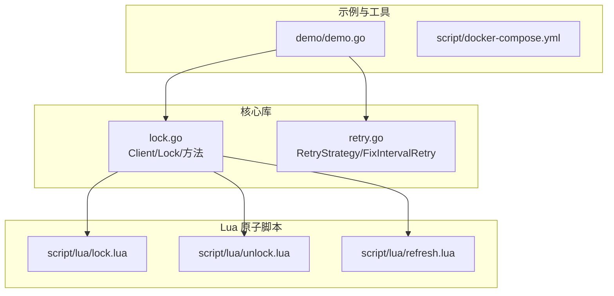
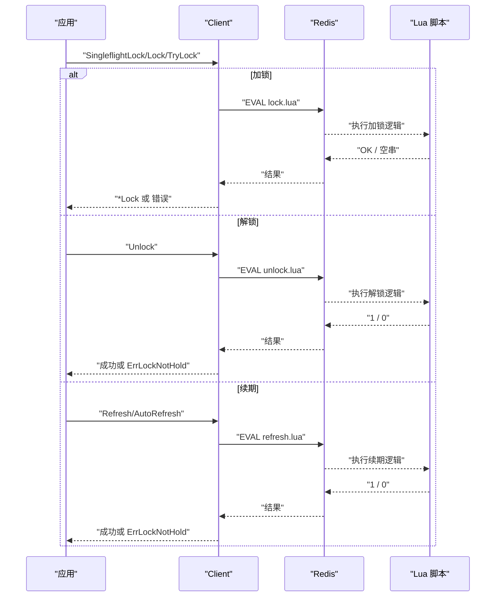
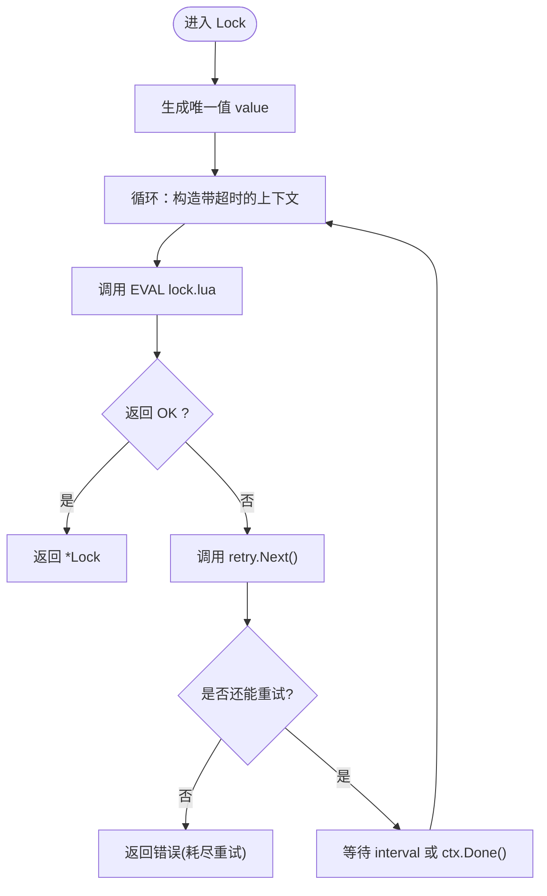
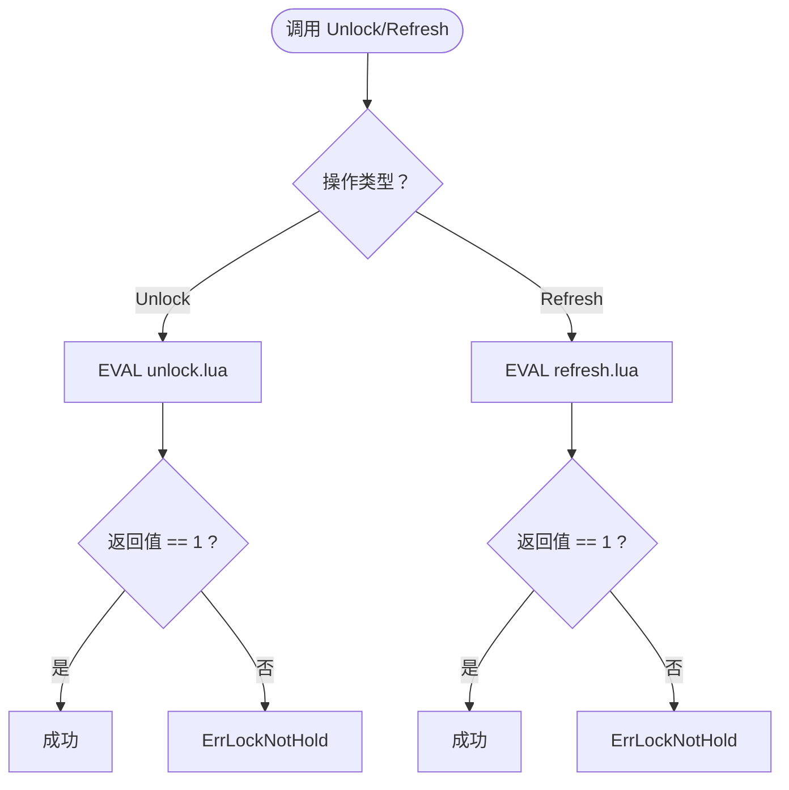

# 项目概述

<cite>
**本文引用的文件**   
- [README.md](file://README.md)
- [go.mod](file://go.mod)
- [lock.go](file://lock.go)
- [retry.go](file://retry.go)
- [script/lua/lock.lua](file://script/lua/lock.lua)
- [script/lua/unlock.lua](file://script/lua/unlock.lua)
- [script/lua/refresh.lua](file://script/lua/refresh.lua)
- [demo/demo.go](file://demo/demo.go)
- [script/docker-compose.yml](file://script/docker-compose.yml)
</cite>

## 目录
1. [简介](#简介)
2. [项目结构](#项目结构)
3. [核心组件](#核心组件)
4. [架构总览](#架构总览)
5. [详细组件分析](#详细组件分析)
6. [依赖与版本要求](#依赖与版本要求)
7. [快速开始](#快速开始)
8. [性能与可靠性](#性能与可靠性)
9. [故障排查](#故障排查)
10. [社区与贡献](#社区与贡献)
11. [结论](#结论)

## 简介
redis-lock 是一个基于 Redis 实现的分布式锁库，提供可重试的加锁、原子解锁、自动续期等能力。其核心价值在于：
- 通过 Lua 脚本保证加锁、解锁、续期的原子性，避免竞态条件
- 支持可插拔的重试策略，提升在竞争或网络抖动场景下的成功率
- 使用 singleflight 合并重复请求，降低热点 key 的并发压力
- 面向 Go 开发者提供简洁易用的 API，便于在生产环境中集成

该库适用于需要跨进程/跨实例互斥的场景，如任务调度、资源分配、幂等控制等。

**章节来源**
- [README.md:1-13](file://README.md#L1-L13)

## 项目结构
仓库采用“核心库 + 示例 + 脚本”的组织方式：
- 根目录：核心实现 lock.go、重试策略 retry.go、模块定义 go.mod/go.sum
- script/lua：Lua 原子脚本（加锁、解锁、续期）
- demo：教学示例代码（与极客时间课程配套）
- script/docker-compose.yml：本地运行 Redis 的编排文件
- mocks：测试用 mock 客户端



**图表来源**
- [lock.go:17-28](file://lock.go#L17-L28)
- [script/lua/lock.lua:1-13](file://script/lua/lock.lua#L1-L13)
- [script/lua/unlock.lua:1-6](file://script/lua/unlock.lua#L1-L6)
- [script/lua/refresh.lua:1-6](file://script/lua/refresh.lua#L1-L6)
- [demo/demo.go:19-29](file://demo/demo.go#L19-L29)
- [script/docker-compose.yml:14-20](file://script/docker-compose.yml#L14-L20)

**章节来源**
- [lock.go:17-28](file://lock.go#L17-L28)
- [demo/demo.go:19-29](file://demo/demo.go#L19-L29)
- [script/docker-compose.yml:14-20](file://script/docker-compose.yml#L14-L20)

## 核心组件
- Client：对外暴露加锁、尝试加锁、单飞加锁等方法，内部封装 Redis 调用与重试逻辑
- Lock：表示一次成功获取的锁对象，提供续期、解锁、自动续期等功能
- RetryStrategy：重试策略接口，FixIntervalRetry 为固定间隔重试的实现
- Lua 脚本：lock.lua、unlock.lua、refresh.lua 分别负责加锁、解锁、续期的原子操作

关键职责划分：
- Client.Lock：带超时与重试的加锁流程，返回 *Lock
- Client.TryLock：非阻塞的一次性尝试加锁
- Client.SingleflightLock：对相同 key 的请求进行合并，减少重复竞争
- Lock.Refresh/AutoRefresh：安全地延长锁过期时间
- Lock.Unlock：仅允许锁持有者释放锁

**章节来源**
- [lock.go:46-60](file://lock.go#L46-L60)
- [lock.go:94-149](file://lock.go#L94-L149)
- [lock.go:151-168](file://lock.go#L151-L168)
- [lock.go:170-251](file://lock.go#L170-L251)
- [retry.go:19-35](file://retry.go#L19-L35)

## 架构总览
下图展示了从应用调用到 Redis 的完整交互路径，以及 Lua 脚本在其中的作用。



**图表来源**
- [lock.go:62-149](file://lock.go#L62-L149)
- [lock.go:170-251](file://lock.go#L170-L251)
- [script/lua/lock.lua:1-13](file://script/lua/lock.lua#L1-L13)
- [script/lua/unlock.lua:1-6](file://script/lua/unlock.lua#L1-L6)
- [script/lua/refresh.lua:1-6](file://script/lua/refresh.lua#L1-L6)

## 详细组件分析

### Client 与 Lock 类图
```mermaid
classDiagram
class Client {
-client redis.Cmdable
-g singleflight.Group
-valuer func() string
+NewClient(client)
+SingleflightLock(ctx, key, expiration, retry, timeout) (*Lock, error)
+Lock(ctx, key, expiration, retry, timeout) (*Lock, error)
+TryLock(ctx, key, expiration) (*Lock, error)
}
class Lock {
-client redis.Cmdable
-key string
-value string
-expiration time.Duration
-unlock chan struct{}
-signalUnlockOnce sync.Once
+AutoRefresh(interval, timeout) error
+Refresh(ctx) error
+Unlock(ctx) error
}
Client --> Lock : "创建并返回"
```

**图表来源**
- [lock.go:46-60](file://lock.go#L46-L60)
- [lock.go:62-149](file://lock.go#L62-L149)
- [lock.go:151-168](file://lock.go#L151-L168)
- [lock.go:170-251](file://lock.go#L170-L251)

**章节来源**
- [lock.go:46-60](file://lock.go#L46-L60)
- [lock.go:62-149](file://lock.go#L62-L149)
- [lock.go:151-168](file://lock.go#L151-L168)
- [lock.go:170-251](file://lock.go#L170-L251)

### 加锁主流程（含重试）


**图表来源**
- [lock.go:94-134](file://lock.go#L94-L134)
- [retry.go:19-35](file://retry.go#L19-L35)

**章节来源**
- [lock.go:94-134](file://lock.go#L94-L134)
- [retry.go:19-35](file://retry.go#L19-L35)

### 解锁与续期流程


**图表来源**
- [lock.go:219-251](file://lock.go#L219-L251)
- [script/lua/unlock.lua:1-6](file://script/lua/unlock.lua#L1-L6)
- [script/lua/refresh.lua:1-6](file://script/lua/refresh.lua#L1-L6)

**章节来源**
- [lock.go:219-251](file://lock.go#L219-L251)
- [script/lua/unlock.lua:1-6](file://script/lua/unlock.lua#L1-L6)
- [script/lua/refresh.lua:1-6](file://script/lua/refresh.lua#L1-L6)

## 依赖与版本要求
- Redis 版本：建议 Redis >= v7；低于 v7 理论上可用但未充分验证
- Go 版本：Go >= 1.18；低版本只要能编译通过也可使用
- 主要依赖：
  - github.com/redis/go-redis/v9：Redis 客户端
  - github.com/google/uuid：生成锁的唯一标识
  - golang.org/x/sync/singleflight：合并重复请求
  - github.com/stretchr/testify、go.uber.org/mock：测试与 Mock

安装与初始化：
- 使用 go mod 管理依赖，直接引入本模块即可
- 本地调试可使用 script/docker-compose.yml 启动 Redis 7.0

**章节来源**
- [README.md:1-5](file://README.md#L1-L5)
- [go.mod:1-21](file://go.mod#L1-L21)
- [script/docker-compose.yml:14-20](file://script/docker-compose.yml#L14-L20)

## 快速开始
以下步骤帮助你在项目中快速集成并使用 redis-lock：

- 步骤一：准备 Redis
  - 使用提供的 docker-compose 启动 Redis 7.0
  - 默认端口 6379，无需密码

- 步骤二：引入依赖
  - 在你的 Go 项目中引入本模块与 redis/go-redis/v9

- 步骤三：创建客户端
  - 使用 NewClient 传入一个实现了 redis.Cmdable 的客户端实例

- 步骤四：加锁与解锁
  - 使用 SingleflightLock/Lock 进行带重试的加锁
  - 使用 TryLock 进行一次性尝试加锁
  - 使用 Lock.Unlock 释放锁
  - 使用 Lock.Refresh/AutoRefresh 延长锁过期时间

- 步骤五：参考示例
  - 查看 demo/demo.go 了解基本用法与常见模式

注意：
- 加锁失败时请根据错误类型判断是超时还是未获得锁
- 解锁失败可能意味着当前并未持有锁（例如被其他客户端删除）

**章节来源**
- [script/docker-compose.yml:14-20](file://script/docker-compose.yml#L14-L20)
- [demo/demo.go:47-124](file://demo/demo.go#L47-L124)
- [lock.go:62-149](file://lock.go#L62-L149)
- [lock.go:170-251](file://lock.go#L170-L251)

## 性能与可靠性
- 原子性保障：所有关键操作（加锁、解锁、续期）均通过 Lua 脚本在 Redis 侧原子执行，避免竞态
- 重试机制：通过 RetryStrategy 抽象，支持固定间隔等策略，提高在高竞争环境下的成功率
- 请求合并：Singleflight 对相同 key 的请求进行合并，显著降低热点 key 的 Redis 压力
- 自动续期：AutoRefresh 定时刷新锁过期时间，防止业务长时间运行导致锁提前过期
- 错误语义清晰：区分上下文超时、抢锁失败、未持有锁等错误，便于上层处理

优化建议：
- 合理设置锁过期时间与续期间隔，平衡安全性与性能
- 针对热点 key 优先使用 SingleflightLock
- 监控 Redis 延迟与错误率，结合重试策略调优

[本节为通用指导，不直接分析具体文件]

## 故障排查
常见问题与定位思路：
- 加锁一直失败
  - 检查 Redis 连通性与权限
  - 确认 Lua 脚本未被篡改（脚本由库内嵌）
  - 观察重试次数与间隔配置是否合理
- 解锁报“未持有锁”
  - 可能是锁已过期或被其他客户端删除
  - 确保只由持有锁的客户端调用解锁
- 续期失败
  - 检查 AutoRefresh 的超时与间隔配置
  - 关注 Redis 延迟导致的超时

相关错误与行为：
- 上下文超时：Lock 整体调用超时，无法确定最终是否加锁成功
- 抢锁失败：超过重试次数且无通信错误
- 未持有锁：解锁或续期时发现当前并非锁持有者

**章节来源**
- [lock.go:84-93](file://lock.go#L84-L93)
- [lock.go:219-251](file://lock.go#L219-L251)

## 社区与贡献
- 本项目开源，欢迎参与讨论与贡献
- 贡献指南链接见 README
- demo 文件夹中的代码用于极客时间课程的辅助学习，实际可用代码位于仓库根目录

**章节来源**
- [README.md:6-13](file://README.md#L6-L13)

## 结论
redis-lock 以 Redis 为基础，通过 Lua 脚本保证原子性，配合可插拔重试与 singleflight 合并，提供了稳定、高性能的分布式锁能力。它适合在 Go 生态中快速落地跨进程互斥需求。借助清晰的错误语义与完善的示例，开发者可以迅速上手并在生产环境中可靠使用。

[本节为总结性内容，不直接分析具体文件]